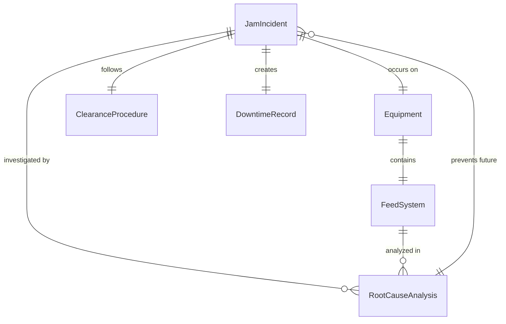
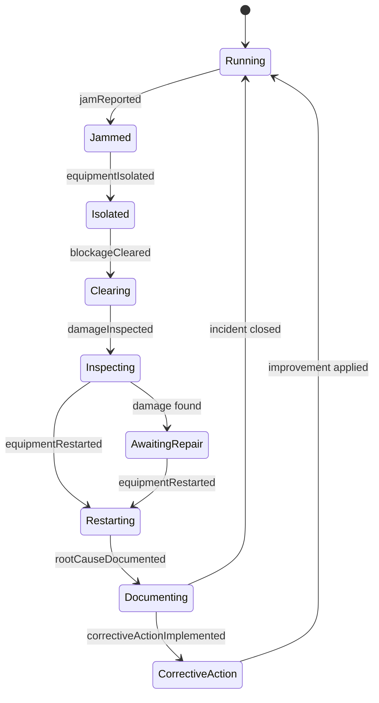
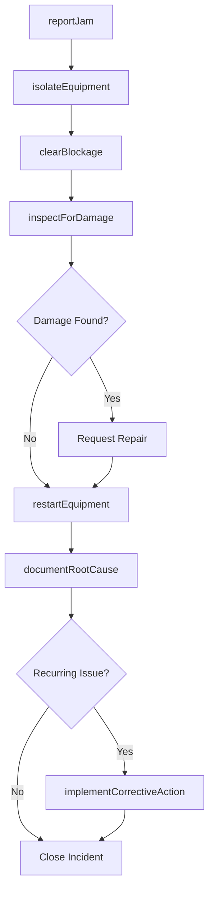
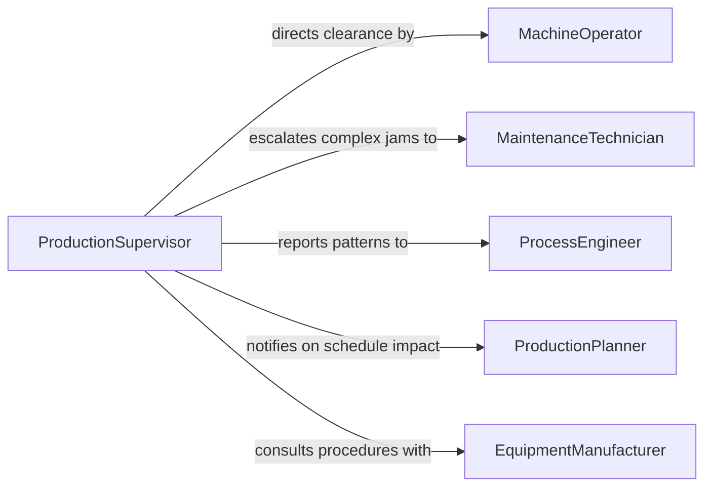

# Clear Equipment Jams

> Business-as-Code definition for clearing equipment jams. Models the detection, isolation, clearance, and restart procedures for material blockages in production machinery, conveyors, printers, and processing equipment.

## Overview

Clearing equipment jams involves identifying material blockages or feed failures in mechanical systems, safely stopping and isolating the equipment, removing the obstructing material, inspecting for damage, and restarting production. This definition exposes actions for reporting jam events, executing lockout procedures, documenting root causes, and tracking jam frequency to drive preventive improvements.

## Actors

| Actor | Description |
|-------|-------------|
| EquipmentManufacturer | Provides jam clearance procedures and feed system specifications |
| MaterialSupplier | Supplies raw materials whose properties may contribute to jam frequency |
| SafetyConsultant | Reviews jam clearance procedures for compliance with guarding standards |
| ProductionPlanner | Adjusts schedules when jam-related downtime impacts output targets |

## Roles

| Role | Description |
|------|-------------|
| MachineOperator | Detects jams, performs initial clearance, and restarts equipment |
| MaintenanceTechnician | Handles complex jam clearance requiring disassembly or part removal |
| ProductionSupervisor | Authorizes downtime and coordinates operator response to jam events |
| ProcessEngineer | Analyzes jam patterns and implements feed system improvements |

## Entities

| Entity | Description |
|--------|-------------|
| JamIncident | A recorded event where material has obstructed equipment operation |
| Equipment | The machine, conveyor, or processing line experiencing the blockage |
| ClearanceProcedure | Step-by-step instructions for safely removing a specific jam type |
| DowntimeRecord | Duration and production impact of a jam event |
| RootCauseAnalysis | Investigation into the underlying reason for jam occurrence |
| FeedSystem | The mechanical assembly that delivers material into the process zone |

## Actions

| Action | Description |
|--------|-------------|
| reportJam | Log a jam incident with equipment ID, location, and material type |
| isolateEquipment | Safely stop and de-energize equipment before clearance |
| clearBlockage | Remove obstructing material from feed paths, rollers, or guides |
| inspectForDamage | Check equipment components for wear or damage caused by the jam |
| restartEquipment | Re-energize and bring equipment back to operational speed |
| documentRootCause | Record the identified cause and contributing factors of the jam |
| implementCorrectiveAction | Apply feed system adjustments to prevent recurrence |

## Events

| Event | Description |
|-------|-------------|
| jamReported | A material blockage has been logged in the system |
| equipmentIsolated | Equipment has been safely stopped and de-energized |
| blockageCleared | Obstructing material has been removed from the equipment |
| damageInspected | Equipment has been checked for jam-related wear or damage |
| equipmentRestarted | Equipment has been brought back to operational status |
| rootCauseDocumented | The cause of the jam has been recorded |
| correctiveActionImplemented | Feed system improvements have been applied |

## Searches

| Search | Description |
|--------|-------------|
| findJamsByEquipment | List jam incidents for a specific machine or production line |
| getJamFrequency | Query jam count and frequency trends over a time period |
| getDowntimeByJams | Calculate total downtime attributed to jam incidents |
| findRecurringJamCauses | Identify root causes that appear across multiple jam events |

## Entity Relationships



## State Diagram



## Workflow



## Actor Relationships



## Usage

### Calling Actions

```typescript
import { clearEquipmentJams } from '@headlessly/clear-equipment-jams'

const jams = clearEquipmentJams()

// Report a jam on a packaging line
const incident = await jams.reportJam({
  equipmentId: 'packaging-line-03',
  location: 'infeed-conveyor',
  materialType: 'cardboard-blanks',
  reportedBy: 'operator-nguyen'
})

// Isolate and clear the blockage
await jams.isolateEquipment({
  equipmentId: 'packaging-line-03',
  isolationMethod: 'e-stop-and-lockout'
})

await jams.clearBlockage({
  incidentId: incident.id,
  blockedComponents: ['infeed-roller', 'guide-rail'],
  clearedBy: 'operator-nguyen'
})

// Restart after clearance
await jams.restartEquipment({
  equipmentId: 'packaging-line-03',
  verifiedBy: 'supervisor-kim'
})
```

### Event-Driven Automation

```typescript
// Alert process engineering on frequent jams
jams.jamReported(async ({ equipmentId }) => {
  const frequency = await jams.getJamFrequency({
    equipmentId,
    period: 'last-7-days'
  })
  if (frequency.count > 5) {
    await notify({
      to: 'process-engineer',
      message: `${equipmentId} has jammed ${frequency.count} times in 7 days. Root cause analysis needed.`
    })
  }
})

// Track downtime impact automatically
jams.equipmentRestarted(async ({ equipmentId, incidentId, restartTime }) => {
  const incident = await jams.findJamsByEquipment({ incidentId })
  const downtimeMinutes = diffMinutes(incident.reportedAt, restartTime)
  await jams.documentRootCause({
    incidentId,
    downtimeMinutes,
    category: downtimeMinutes > 30 ? 'major' : 'minor'
  })
})
```
