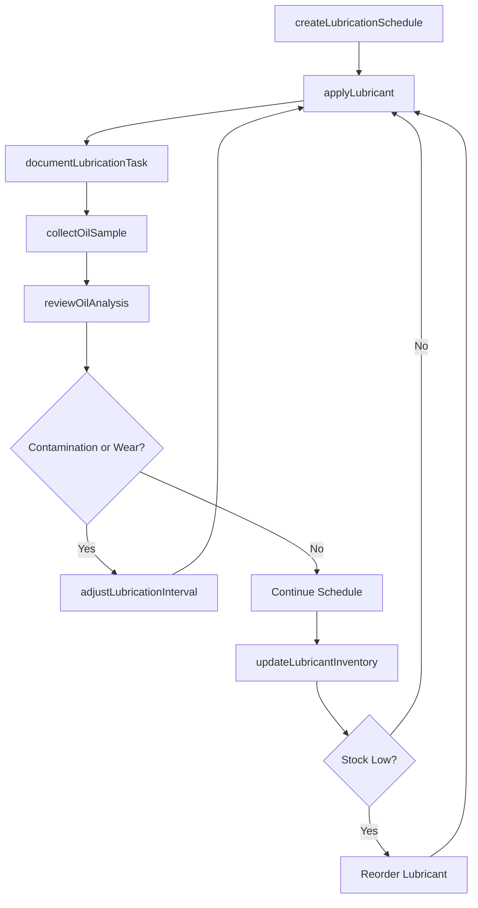
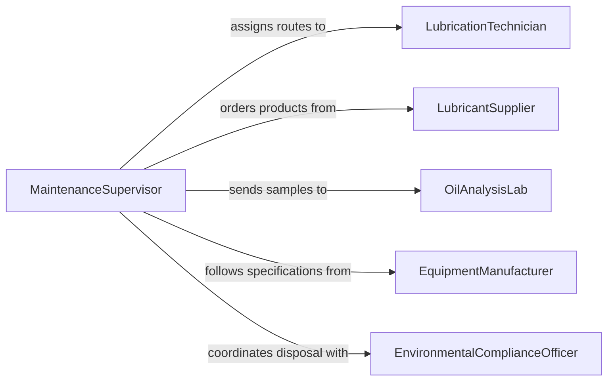

# Lubricate Equipment Allow Proper Functioning

> Business-as-Code definition for equipment lubrication to allow proper functioning. Models the selection, application, monitoring, and documentation of lubricants across bearings, gears, chains, slideways, and hydraulic systems to prevent wear and extend equipment life.

## Overview

Equipment lubrication is a foundational maintenance activity that prevents friction-related wear, overheating, and premature failure in mechanical systems. This definition exposes actions for creating lubrication schedules based on manufacturer specifications, selecting appropriate lubricant types and grades, performing oil analysis, tracking lubricant consumption, and documenting compliance with lubrication standards to maximize equipment reliability.

## Actors

| Actor | Description |
|-------|-------------|
| LubricantSupplier | Provides oils, greases, and specialty lubricants with technical data sheets |
| OilAnalysisLab | Performs spectrometric and physical analysis of used lubricant samples |
| EquipmentManufacturer | Specifies lubricant types, grades, quantities, and application intervals |
| EnvironmentalComplianceOfficer | Enforces proper lubricant storage, handling, and disposal regulations |

## Roles

| Role | Description |
|------|-------------|
| LubricationTechnician | Applies lubricants, takes oil samples, and inspects lubrication points |
| MaintenanceSupervisor | Oversees lubrication schedules and ensures task completion |
| ReliabilityEngineer | Analyzes oil sample results and adjusts lubrication intervals |
| StoreKeeper | Manages lubricant inventory, storage conditions, and dispensing |

## Entities

| Entity | Description |
|--------|-------------|
| LubricationPoint | A specific bearing, gearbox, chain, or fitting requiring lubricant |
| Lubricant | An oil, grease, or fluid product with defined viscosity and grade |
| LubricationSchedule | A timetable of lubrication tasks mapped to equipment and intervals |
| OilSample | A fluid specimen taken from equipment for laboratory analysis |
| LubricantInventory | Stock of oils and greases tracked by type, volume, and shelf life |
| LubricationRecord | Documentation of lubricant applied, quantity, date, and technician |

## Actions

| Action | Description |
|--------|-------------|
| createLubricationSchedule | Define lubrication points, products, quantities, and intervals for equipment |
| applyLubricant | Grease fittings, fill reservoirs, or apply oil to designated points |
| collectOilSample | Draw a lubricant specimen from equipment for laboratory analysis |
| reviewOilAnalysis | Evaluate lab results for wear metals, contamination, and degradation |
| updateLubricantInventory | Record lubricant usage and trigger reorders when stock is low |
| documentLubricationTask | Log completed lubrication with product, quantity, and technician details |
| adjustLubricationInterval | Modify service frequency based on analysis results or operating conditions |

## Events

| Event | Description |
|-------|-------------|
| lubricationScheduleCreated | A new lubrication plan has been established for equipment |
| lubricantApplied | Lubricant has been applied to one or more equipment points |
| oilSampleCollected | A lubricant specimen has been drawn for analysis |
| oilAnalysisReviewed | Laboratory results for a lubricant sample have been evaluated |
| lubricantInventoryUpdated | Lubricant stock levels have been recorded |
| lubricationTaskDocumented | A completed lubrication task has been logged |
| lubricationIntervalAdjusted | The service frequency for a lubrication point has been modified |

## Searches

| Search | Description |
|--------|-------------|
| findOverdueLubricationTasks | List equipment with lubrication tasks past their scheduled date |
| getOilAnalysisHistory | Retrieve lab results for a specific equipment point over time |
| getLubricantUsageReport | Query lubricant consumption by product type, equipment, or period |
| findLubricantsBySpecification | Locate lubricant products matching a required viscosity or grade |

## Workflow



## Actor Relationships



## Usage

### Calling Actions

```typescript
import { lubricateEquipmentAllowProperFunctioning } from '@headlessly/lubricate-equipment-allow-proper-functioning'

const lubrication = lubricateEquipmentAllowProperFunctioning()

// Create a lubrication schedule for a gearbox
const schedule = await lubrication.createLubricationSchedule({
  equipmentId: 'gearbox-conveyor-12',
  points: [
    { name: 'input-bearing', lubricant: 'Shell Gadus S3 V220C 2', intervalDays: 30, quantityGrams: 50 },
    { name: 'output-bearing', lubricant: 'Shell Gadus S3 V220C 2', intervalDays: 30, quantityGrams: 75 },
    { name: 'gear-oil-reservoir', lubricant: 'Mobil SHC 630', intervalDays: 180, quantityLiters: 12 }
  ]
})

// Apply lubricant to scheduled points
await lubrication.applyLubricant({
  equipmentId: 'gearbox-conveyor-12',
  points: ['input-bearing', 'output-bearing'],
  technicianId: 'lube-tech-rodriguez',
  lubricantUsed: 'Shell Gadus S3 V220C 2'
})

// Collect oil sample for analysis
await lubrication.collectOilSample({
  equipmentId: 'gearbox-conveyor-12',
  samplePoint: 'gear-oil-reservoir',
  sampleId: 'OS-2026-0305-012',
  labId: 'oil-analysis-central'
})
```

### Event-Driven Automation

```typescript
// Alert on abnormal oil analysis results
lubrication.oilAnalysisReviewed(async ({ equipmentId, sampleId, results }) => {
  if (results.ironPpm > 75 || results.waterContentPpm > 500) {
    await notify({
      to: 'reliability-engineer',
      message: `Oil analysis for ${equipmentId} (sample ${sampleId}) shows elevated contamination. Iron: ${results.ironPpm}ppm, Water: ${results.waterContentPpm}ppm.`
    })
  }
})

// Auto-reorder lubricant when inventory drops
lubrication.lubricantInventoryUpdated(async ({ lubricantType, currentStock, reorderPoint }) => {
  if (currentStock <= reorderPoint) {
    await notify({
      to: 'store-keeper',
      message: `${lubricantType} stock at ${currentStock} units. Reorder point is ${reorderPoint}. Please initiate purchase order.`
    })
  }
})
```
