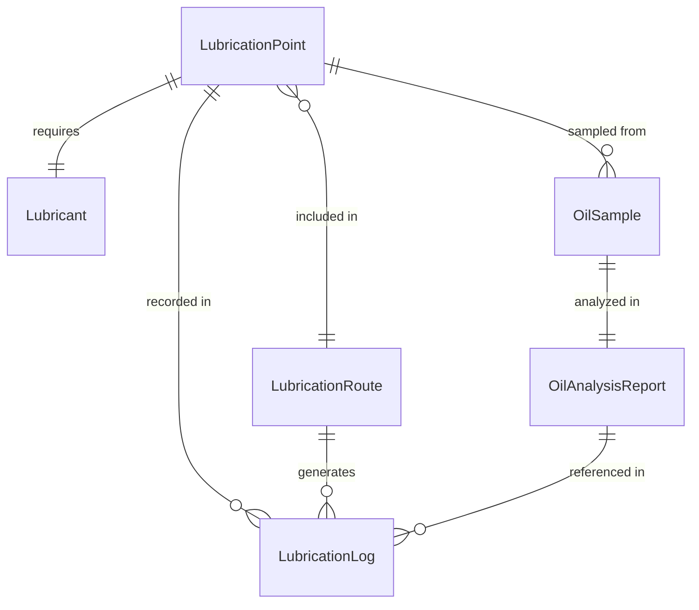
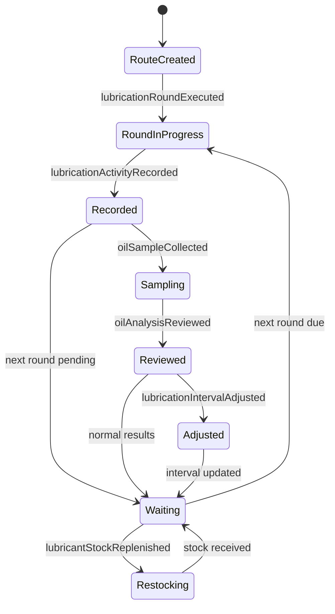
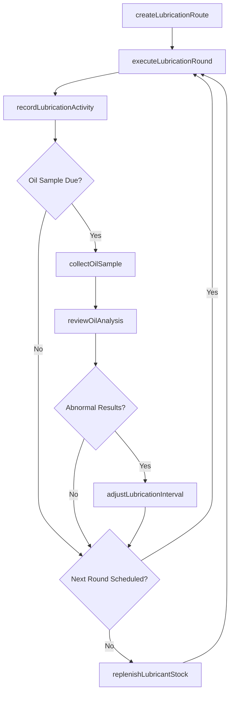
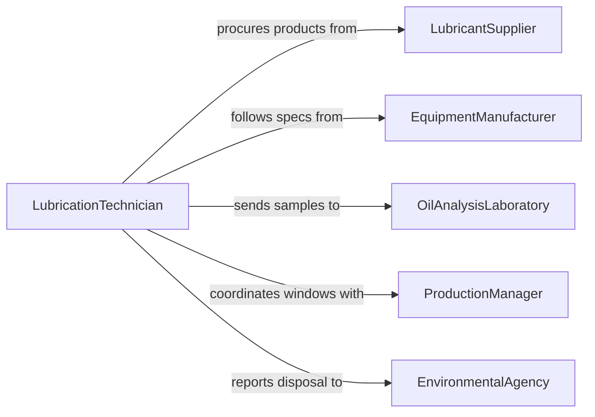

# Lubricate Production Equipment

> Business-as-Code definition for production equipment lubrication. Models the scheduling, execution, and monitoring of lubrication activities across manufacturing machinery to prevent wear, reduce friction, and extend equipment life.

## Overview

Production equipment lubrication involves identifying lubrication points, selecting the correct grease or oil, applying lubricant at prescribed intervals, monitoring oil condition, and maintaining lubrication records for reliability tracking. This definition exposes actions for systematic lubrication management, events for tracking service completion and condition changes, and searches for querying lubrication schedules and oil analysis results.

## Actors

| Actor | Description |
|-------|-------------|
| LubricantSupplier | Provides oils, greases, and specialty lubricants |
| EquipmentManufacturer | Specifies lubrication points, types, and intervals |
| OilAnalysisLaboratory | Tests oil samples for contamination, viscosity, and wear metals |
| ProductionManager | Coordinates lubrication windows with production schedules |
| EnvironmentalAgency | Regulates lubricant storage, handling, and disposal |

## Roles

| Role | Description |
|------|-------------|
| LubricationTechnician | Applies lubricant and collects oil samples across equipment |
| ReliabilityEngineer | Analyzes oil data and optimizes lubrication intervals |
| MaintenancePlanner | Schedules lubrication routes and tracks completion |
| StoresPerson | Manages lubricant inventory and dispensing |

## Entities

| Entity | Description |
|--------|-------------|
| LubricationPoint | A specific bearing, gearbox, or sliding surface requiring lubricant |
| Lubricant | An oil or grease product specified for a lubrication point |
| LubricationRoute | A planned sequence of lubrication points to service |
| OilSample | A fluid sample collected for laboratory analysis |
| OilAnalysisReport | Results from testing an oil sample for wear and contamination |
| LubricationLog | A record of when and how each point was serviced |

## Actions

| Action | Description |
|--------|-------------|
| createLubricationRoute | Define a sequence of lubrication points with products and volumes |
| executeLubricationRound | Apply lubricant to all points on a route |
| collectOilSample | Extract an oil sample from equipment for analysis |
| recordLubricationActivity | Log the completion of lubrication at each point |
| reviewOilAnalysis | Assess lab results to identify abnormal wear or contamination |
| adjustLubricationInterval | Modify the service frequency based on condition data |
| replenishLubricantStock | Order and receive lubricant inventory |

## Events

| Event | Description |
|-------|-------------|
| lubricationRouteCreated | A new lubrication route has been defined |
| lubricationRoundExecuted | All points on a route have been serviced |
| oilSampleCollected | An oil sample has been taken for analysis |
| lubricationActivityRecorded | A lubrication service has been logged |
| oilAnalysisReviewed | Lab results have been assessed for abnormalities |
| lubricationIntervalAdjusted | A service frequency has been changed |
| lubricantStockReplenished | Lubricant inventory has been restocked |

## Searches

| Search | Description |
|--------|-------------|
| findLubricationRoutes | List routes by equipment area, frequency, or status |
| getLubricationLogs | Retrieve service records by equipment, point, or date range |
| getOilAnalysisReports | Query oil analysis results by equipment or parameter |
| findOverduePoints | List lubrication points past their scheduled service date |

## Entity Relationships



## State Diagram



## Workflow



## Actor Relationships



## Usage

### Calling Actions

```typescript
import { lubricateProductionEquipment } from '@headlessly/lubricate-production-equipment'

const lubrication = lubricateProductionEquipment()

// Create a route for the press line
const route = await lubrication.createLubricationRoute({
  name: 'Press Line A - Weekly',
  frequency: 'weekly',
  points: [
    { equipmentId: 'press-01', point: 'main-bearing', lubricant: 'grease-ep2', volumeMl: 50 },
    { equipmentId: 'press-01', point: 'slide-gibs', lubricant: 'way-oil-68', volumeMl: 100 },
    { equipmentId: 'press-02', point: 'main-bearing', lubricant: 'grease-ep2', volumeMl: 50 },
    { equipmentId: 'press-02', point: 'hydraulic-reservoir', lubricant: 'hydraulic-46', volumeMl: 0 }
  ]
})

// Execute the lubrication round
await lubrication.executeLubricationRound({
  routeId: route.id,
  technicianId: 'tech-jsmith'
})

// Collect an oil sample from the hydraulic system
await lubrication.collectOilSample({
  equipmentId: 'press-02',
  samplePoint: 'hydraulic-reservoir',
  sampleId: 'sample-2026-02-08-press02-hyd',
  labId: 'oil-lab-midwest'
})
```

### Event-Driven Automation

```typescript
// Alert on abnormal oil analysis findings
lubrication.oilAnalysisReviewed(async ({ equipmentId, findings }) => {
  const critical = findings.filter(f => f.severity === 'critical')
  if (critical.length > 0) {
    await notify({
      to: 'reliability-engineering',
      message: `Critical oil analysis for ${equipmentId}: ${critical.map(f => f.parameter).join(', ')}`
    })
    await lubrication.adjustLubricationInterval({
      equipmentId,
      newFrequency: 'daily'
    })
  }
})

// Auto-reorder lubricant when stock runs low
lubrication.lubricationRoundExecuted(async ({ routeId, lubricantUsage }) => {
  for (const usage of lubricantUsage) {
    if (usage.remainingStock < usage.reorderLevel) {
      await lubrication.replenishLubricantStock({
        lubricantId: usage.lubricantId,
        orderQuantity: usage.standardOrderQty
      })
    }
  }
})
```
