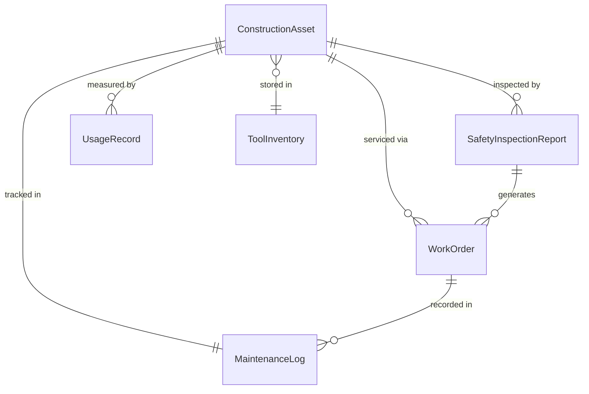
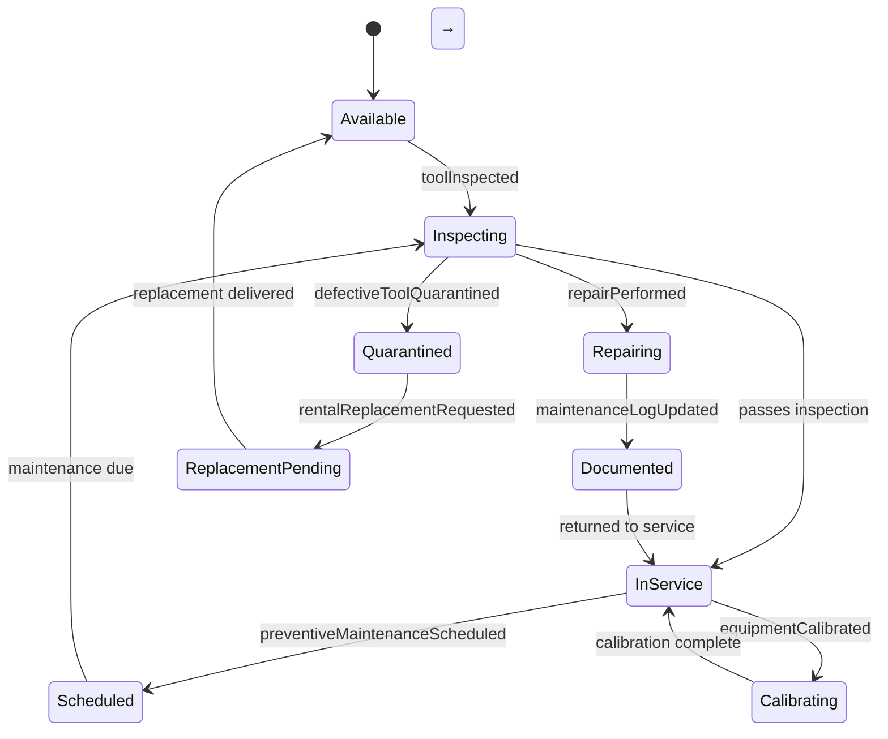
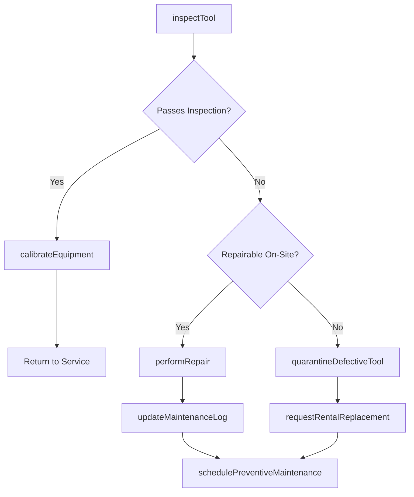
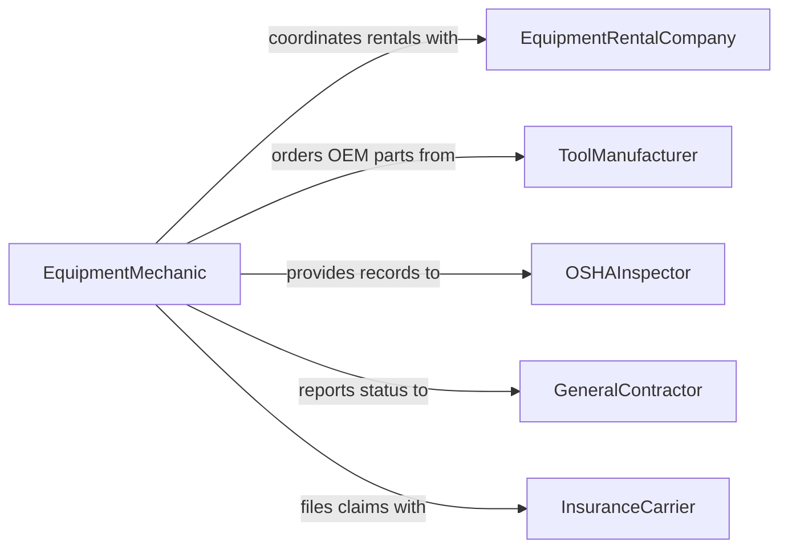

# Maintain Construction Tools Equipment

> Business-as-Code definition for maintaining construction tools and equipment to ensure job-site safety, productivity, and regulatory compliance.

## Overview

Maintaining construction tools and equipment involves servicing power tools, heavy machinery, scaffolding systems, and other job-site assets to prevent breakdowns and ensure worker safety. This definition exposes actions for tracking tool condition across multiple job sites, scheduling preventive maintenance based on usage hours, and managing compliance with OSHA and manufacturer safety standards.

## Actors

| Actor | Description |
|-------|-------------|
| EquipmentRentalCompany | Provides leased machinery and tools along with maintenance agreements |
| ToolManufacturer | Supplies OEM parts, service manuals, and warranty support |
| OSHAInspector | Enforces workplace safety standards for construction equipment |
| GeneralContractor | Manages the construction project and authorizes equipment expenditures |
| InsuranceCarrier | Provides coverage for equipment damage, theft, and liability |

## Roles

| Role | Description |
|------|-------------|
| EquipmentMechanic | Performs hands-on repair and preventive maintenance on construction assets |
| SiteSupervisor | Oversees daily equipment usage and reports maintenance needs |
| SafetyOfficer | Ensures tools and equipment meet safety standards before use |
| ToolCribAttendant | Manages tool checkout, return, and inventory tracking |
| FleetManager | Coordinates maintenance schedules across multiple job sites |

## Entities

| Entity | Description |
|--------|-------------|
| ConstructionAsset | A power tool, heavy machine, or piece of construction equipment |
| MaintenanceLog | A chronological record of all service performed on an asset |
| SafetyInspectionReport | Documentation of an equipment safety check and its findings |
| WorkOrder | A formal request to perform maintenance or repair |
| ToolInventory | Current stock and condition of tools available at a site or yard |
| UsageRecord | Hours of operation or cycles logged for an asset |

## Actions

| Action | Description |
|--------|-------------|
| inspectTool | Perform a pre-use or periodic safety inspection on a tool or machine |
| schedulePreventiveMaintenance | Plan maintenance based on usage hours, calendar, or manufacturer intervals |
| performRepair | Execute corrective maintenance to fix a broken or degraded asset |
| calibrateEquipment | Adjust measurement or precision tools to maintain accuracy |
| updateMaintenanceLog | Record service details, parts used, and technician notes |
| quarantineDefectiveTool | Remove unsafe equipment from service pending repair or disposal |
| requestRentalReplacement | Arrange a temporary replacement for equipment undergoing extended repair |

## Events

| Event | Description |
|-------|-------------|
| toolInspected | A safety inspection has been completed on a tool or machine |
| preventiveMaintenanceScheduled | An upcoming service has been planned for an asset |
| repairPerformed | Corrective maintenance has been completed |
| equipmentCalibrated | A precision tool has been adjusted to specification |
| maintenanceLogUpdated | Service documentation has been recorded |
| defectiveToolQuarantined | Unsafe equipment has been removed from active service |
| rentalReplacementRequested | A temporary substitute has been arranged for a downed asset |

## Searches

| Search | Description |
|--------|-------------|
| findAssetsByCondition | List construction assets filtered by operational status or condition rating |
| getMaintenanceHistory | Retrieve the complete service record for a specific asset |
| getOverdueInspections | Find tools and equipment that have exceeded their inspection interval |
| findQuarantinedTools | Locate assets currently removed from service awaiting repair |
| getUsageReport | Retrieve operation hours or cycle counts for assets at a job site |

## Entity Relationships



## State Diagram



## Workflow



## Actor Relationships



## Usage

### Calling Actions

```typescript
import { maintainConstructionToolsEquipment } from '@headlessly/maintain-construction-tools-equipment'

const tools = maintainConstructionToolsEquipment()

// Inspect a concrete saw before use
const inspection = await tools.inspectTool({
  assetId: 'SAW-042',
  inspectionType: 'pre-use',
  siteId: 'SITE-DOWNTOWN-12',
  inspector: 'safety-officer-chen'
})

// Schedule preventive maintenance based on usage
await tools.schedulePreventiveMaintenance({
  assetId: 'EXCAVATOR-008',
  triggerType: 'usage-hours',
  threshold: 500,
  currentHours: 487
})

// Quarantine a defective tool
await tools.quarantineDefectiveTool({
  assetId: 'DRILL-019',
  reason: 'Intermittent motor failure under load',
  reportedBy: 'site-supervisor-reyes'
})
```

### Event-Driven Automation

```typescript
// Auto-arrange replacement when tool is quarantined
tools.defectiveToolQuarantined(async ({ assetId, siteId }) => {
  const asset = await tools.getAsset(assetId)
  await tools.requestRentalReplacement({
    assetType: asset.type,
    siteId,
    urgency: 'next-business-day'
  })
})

// Notify safety officer when inspections are overdue
tools.preventiveMaintenanceScheduled(async ({ assetId, dueDate }) => {
  await scheduleReminder({
    date: dueDate,
    to: 'safety-officer',
    message: `Maintenance due for ${assetId}`
  })
})
```
