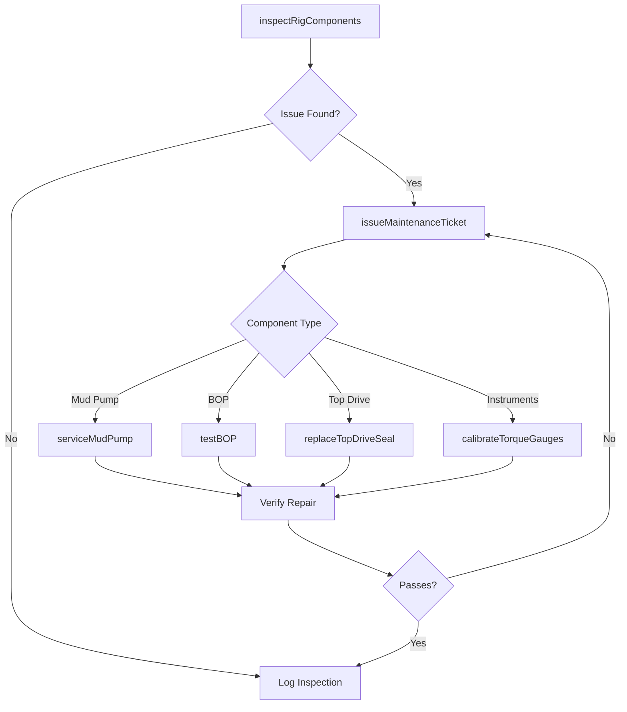
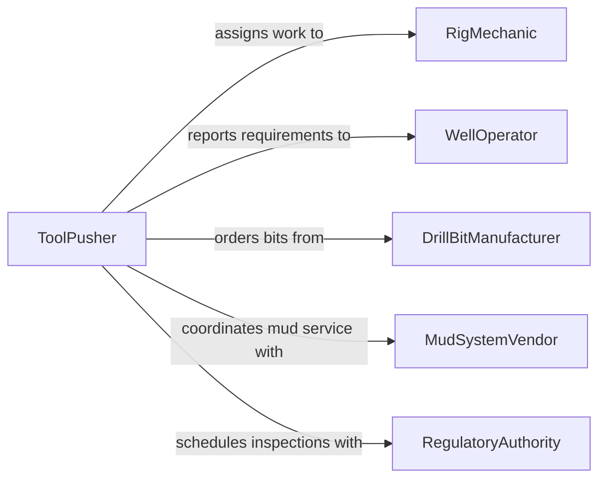

# Maintain Drilling Equipment

> Business-as-Code definition for drilling equipment maintenance. Models the inspection, servicing, and repair of drill rigs, downhole tools, mud systems, and rotary components used in oil and gas, mining, and geotechnical operations.

## Overview

Drilling equipment maintenance encompasses the care and upkeep of surface and subsurface drilling systems including rotary tables, top drives, drawworks, mud pumps, and drill string components. This definition exposes actions for tracking rig component hours, managing bit and tool inventories, performing pressure system inspections, and certifying equipment readiness for drilling operations under API and IADC standards.

## Actors

| Actor | Description |
|-------|-------------|
| DrillBitManufacturer | Supplies drill bits and provides performance recommendations |
| MudSystemVendor | Provides drilling fluid products, mixing equipment, and technical support |
| RigOEM | Supplies rig components, service bulletins, and factory-trained technicians |
| WellOperator | Contracts drilling services and specifies equipment requirements |
| RegulatoryAuthority | Enforces safety and environmental compliance for drilling operations |

## Roles

| Role | Description |
|------|-------------|
| RigMechanic | Performs hands-on maintenance on rig mechanical systems |
| Derrickhand | Maintains mud systems and assists with pipe handling equipment |
| ToolPusher | Supervises rig operations and authorizes equipment downtime |
| DrillingEngineer | Specifies maintenance requirements and analyzes equipment performance |
| HSECoordinator | Ensures maintenance activities meet health, safety, and environmental standards |

## Entities

| Entity | Description |
|--------|-------------|
| DrillRig | The complete drilling platform including mast, substructure, and power systems |
| DrillBit | A cutting tool attached to the drill string, tracked by footage and hours |
| MudPump | A high-pressure pump circulating drilling fluid through the wellbore |
| TopDrive | A motorized device that rotates the drill string from the top |
| BOP | Blowout preventer assembly requiring periodic pressure testing |
| MaintenanceTicket | A documented maintenance task with priority, status, and completion notes |

## Actions

| Action | Description |
|--------|-------------|
| inspectRigComponents | Conduct visual and measurement-based inspection of rig systems |
| serviceMudPump | Replace liners, pistons, valves, and packing on mud pumps |
| testBOP | Perform pressure testing on blowout preventer per API standards |
| trackBitUsage | Record footage drilled and wear condition of current bit |
| replaceTopDriveSeal | Swap seals and bearings on the top drive system |
| calibrateTorqueGauges | Verify accuracy of torque measurement instruments |
| issueMaintenanceTicket | Create a maintenance work request for a specific rig component |

## Events

| Event | Description |
|-------|-------------|
| rigComponentsInspected | Rig systems have been visually and physically assessed |
| mudPumpServiced | Mud pump components have been replaced or repaired |
| bopTested | Blowout preventer has undergone pressure verification |
| bitUsageTracked | Drill bit performance and wear data have been recorded |
| topDriveSealReplaced | Top drive seals and bearings have been swapped |
| torqueGaugesCalibrated | Torque instruments have been verified and adjusted |
| maintenanceTicketIssued | A new maintenance work request has been created |

## Searches

| Search | Description |
|--------|-------------|
| findRigsByMaintenanceStatus | List rigs filtered by maintenance state or availability |
| getBOPTestHistory | Retrieve blowout preventer test records for a specific rig |
| getBitInventory | Query available drill bits by type, size, and condition |
| findOpenTickets | List unresolved maintenance tickets by rig or priority |

## Workflow



## Actor Relationships



## Usage

### Calling Actions

```typescript
import { maintainDrillingEquipment } from '@headlessly/maintain-drilling-equipment'

const drilling = maintainDrillingEquipment()

// Inspect rig components before spud
const inspection = await drilling.inspectRigComponents({
  rigId: 'rig-45',
  systems: ['drawworks', 'top-drive', 'mud-pumps', 'bop-stack'],
  inspectorId: 'eng-martinez'
})

// Perform BOP pressure test
await drilling.testBOP({
  rigId: 'rig-45',
  testPressurePsi: 10000,
  holdTimeMinutes: 30,
  standard: 'API-RP-53'
})

// Track drill bit usage
await drilling.trackBitUsage({
  rigId: 'rig-45',
  bitId: 'pdc-12-25',
  footageDrilled: 3200,
  hoursOnBottom: 48,
  condition: 'moderate-wear'
})
```

### Event-Driven Automation

```typescript
// Alert on BOP test failure
drilling.bopTested(async ({ rigId, result, testPressurePsi }) => {
  if (result === 'fail') {
    await notify({
      to: ['tool-pusher', 'drilling-engineer', 'hse-coordinator'],
      message: `BOP test FAILED on ${rigId} at ${testPressurePsi} psi. Operations suspended until resolution.`
    })
  }
})

// Auto-create maintenance ticket when bit reaches footage limit
drilling.bitUsageTracked(async ({ rigId, bitId, footageDrilled, condition }) => {
  if (footageDrilled > 5000 || condition === 'severe-wear') {
    await drilling.issueMaintenanceTicket({
      rigId,
      component: bitId,
      priority: 'high',
      description: `Bit ${bitId} at ${footageDrilled}ft - replacement recommended`
    })
  }
})
```
