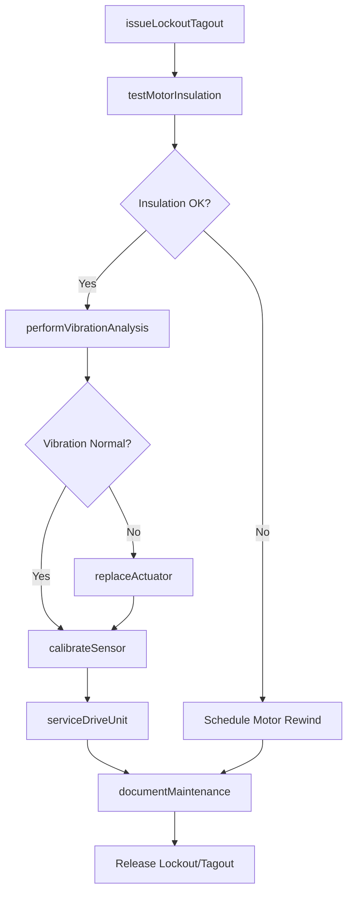
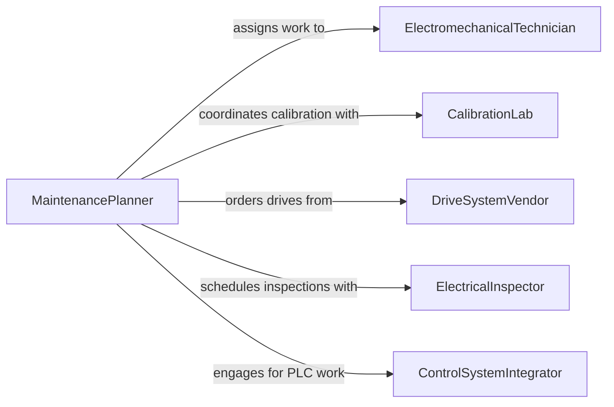

# Maintain Electromechanical Equipment

> Business-as-Code definition for electromechanical equipment maintenance. Models the inspection, testing, and servicing of systems that integrate electrical and mechanical components such as motors, actuators, servo drives, and automated assembly mechanisms.

## Overview

Electromechanical equipment maintenance covers hybrid systems where electrical controls, sensors, and power systems drive mechanical motion and operation. This definition exposes actions for testing motor insulation, calibrating sensors and actuators, servicing drive systems, and documenting maintenance in compliance with NEC and NFPA 70E standards. It bridges electrical diagnostics with mechanical repair workflows.

## Actors

| Actor | Description |
|-------|-------------|
| MotorManufacturer | Provides motor specifications, winding data, and replacement units |
| DriveSystemVendor | Supplies variable frequency drives, servo controllers, and firmware |
| ElectricalInspector | Verifies compliance with NEC and workplace electrical safety codes |
| CalibrationLab | Performs traceable calibration of sensors and measurement devices |
| ControlSystemIntegrator | Programs and maintains PLC and HMI systems tied to electromechanical assets |

## Roles

| Role | Description |
|------|-------------|
| ElectromechanicalTechnician | Diagnoses and repairs combined electrical and mechanical faults |
| ControlsEngineer | Maintains automation logic and tunes electromechanical system parameters |
| MaintenancePlanner | Schedules service intervals and coordinates multi-discipline tasks |
| ElectricalSafetyOfficer | Enforces lockout/tagout and arc flash safety procedures |

## Entities

| Entity | Description |
|--------|-------------|
| ElectricMotor | A motor converting electrical energy to mechanical rotation |
| Actuator | A device translating electrical signals into physical movement |
| DriveCon | A variable frequency or servo drive controlling motor speed and torque |
| Sensor | A transducer measuring position, speed, temperature, or vibration |
| MaintenanceRecord | Documentation of tasks performed, parts used, and test results |
| LockoutTagoutPermit | A safety authorization for de-energizing equipment during service |

## Actions

| Action | Description |
|--------|-------------|
| testMotorInsulation | Perform megohm resistance testing on motor windings |
| calibrateSensor | Verify and adjust sensor output against known reference values |
| serviceDriveUnit | Inspect, clean, and test variable frequency or servo drives |
| replaceActuator | Swap a failed or degraded actuator assembly |
| performVibrationAnalysis | Measure vibration signatures to detect bearing or alignment faults |
| issueLockoutTagout | Authorize and document equipment isolation for safe maintenance |
| documentMaintenance | Record completed tasks, measurements, and test results |

## Events

| Event | Description |
|-------|-------------|
| motorInsulationTested | Motor winding insulation resistance has been measured |
| sensorCalibrated | A sensor has been verified and adjusted to specification |
| driveUnitServiced | A VFD or servo drive has been inspected and tested |
| actuatorReplaced | An actuator assembly has been swapped out |
| vibrationAnalysisPerformed | Vibration data has been collected and analyzed |
| lockoutTagoutIssued | Equipment isolation authorization has been documented |
| maintenanceDocumented | Maintenance tasks and results have been recorded |

## Searches

| Search | Description |
|--------|-------------|
| findMotorsByInsulationStatus | List motors filtered by insulation test results or due dates |
| getCalibrationHistory | Retrieve calibration records for a specific sensor or device |
| findDrivesByFirmwareVersion | Locate drives needing firmware updates |
| getVibrationTrends | Query vibration measurement history for an asset over time |

## Workflow



## Actor Relationships



## Usage

### Calling Actions

```typescript
import { maintainElectromechanicalEquipment } from '@headlessly/maintain-electromechanical-equipment'

const electromech = maintainElectromechanicalEquipment()

// Issue lockout/tagout before service
const permit = await electromech.issueLockoutTagout({
  equipmentId: 'conveyor-drive-07',
  authorizedBy: 'safety-officer-chen',
  isolationPoints: ['breaker-panel-3-CB12', 'pneumatic-valve-07A']
})

// Test motor insulation resistance
const testResult = await electromech.testMotorInsulation({
  motorId: 'motor-conv-07',
  testVoltageDC: 1000,
  acceptableMinMegohms: 5
})

// Calibrate position sensor
await electromech.calibrateSensor({
  sensorId: 'pos-sensor-07-A',
  referenceValue: 0.000,
  measuredValue: 0.003,
  adjustedValue: 0.000,
  calibrationStandard: 'NIST-traceable'
})
```

### Event-Driven Automation

```typescript
// Alert on failing motor insulation
electromech.motorInsulationTested(async ({ motorId, megohms, threshold }) => {
  if (megohms < threshold) {
    await notify({
      to: 'controls-engineer',
      message: `Motor ${motorId} insulation at ${megohms} MOhm (min: ${threshold}). Rewind or replacement needed.`
    })
  }
})

// Auto-schedule recalibration after sensor replacement
electromech.sensorCalibrated(async ({ sensorId, calibrationDate }) => {
  await electromech.calibrateSensor({
    sensorId,
    scheduledDate: addMonths(calibrationDate, 6),
    type: 'periodic'
  })
})
```
