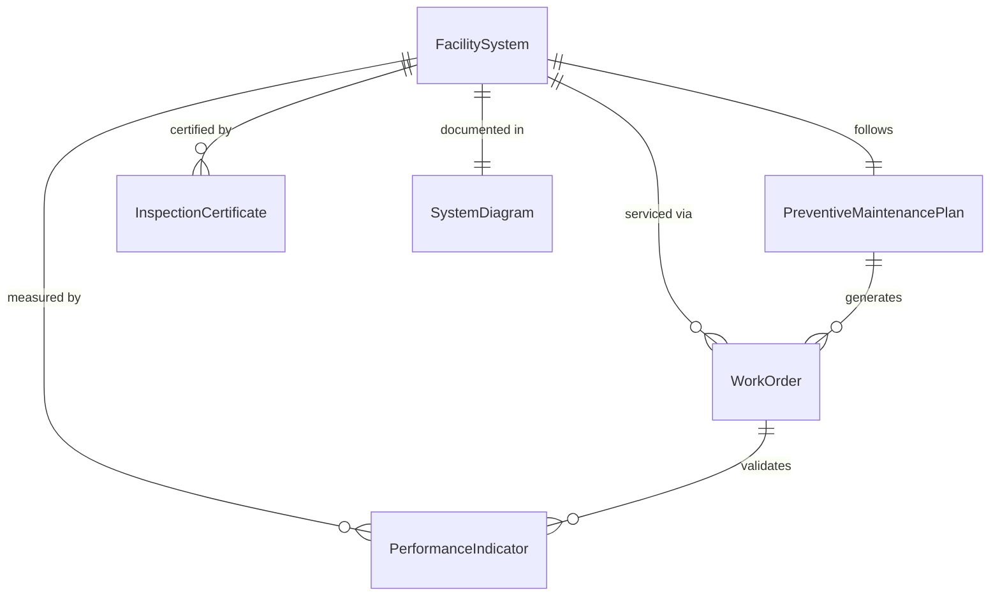
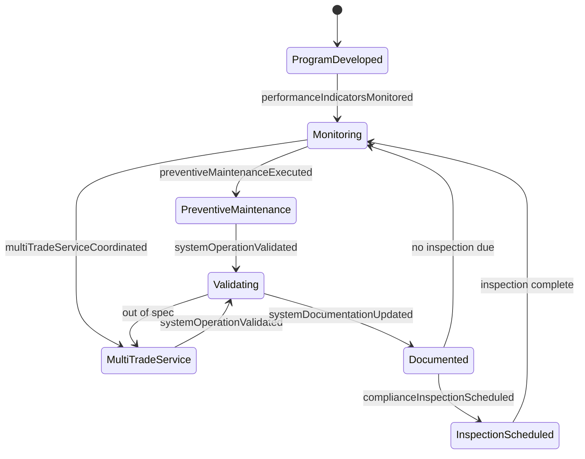
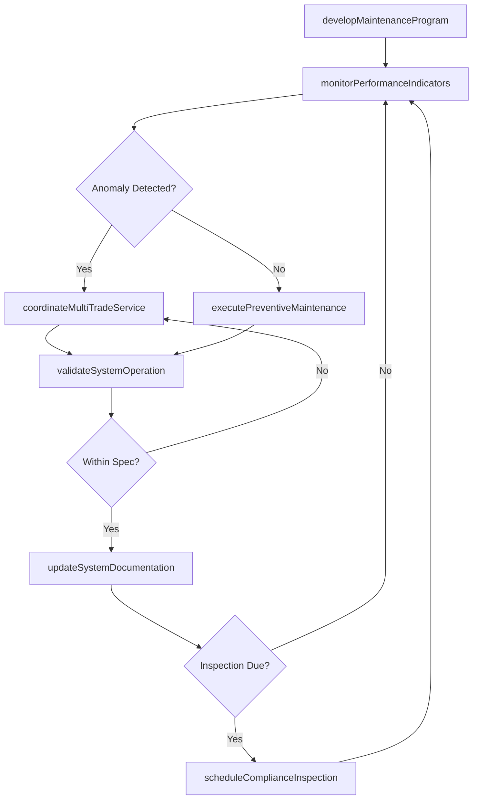
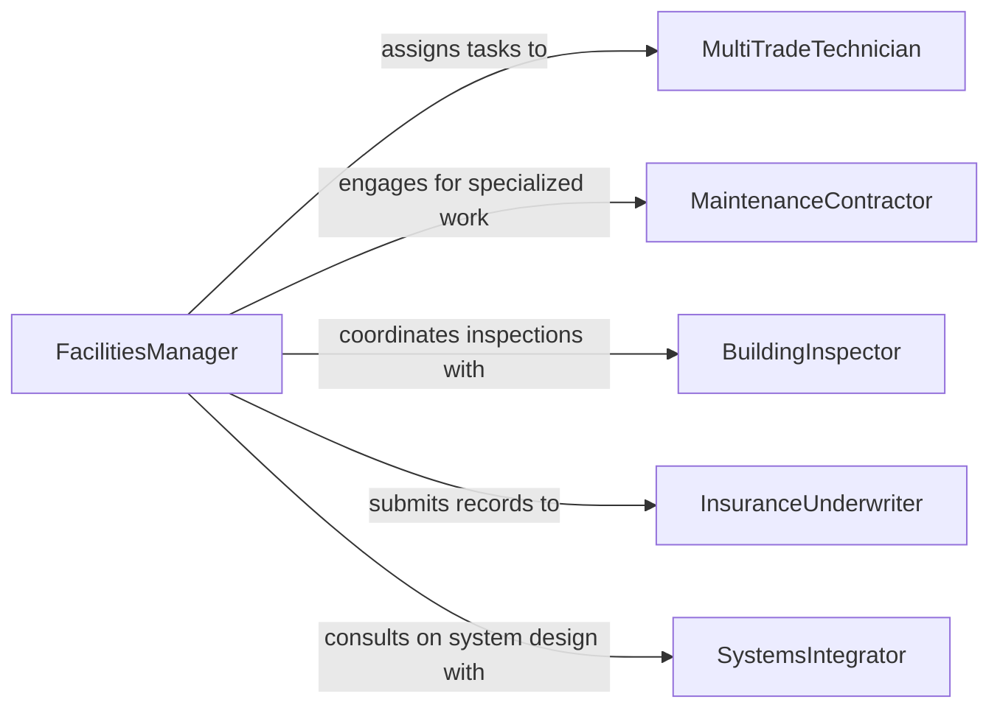

# Maintain Equipment Systems Ensure Proper

> Business-as-Code definition for maintaining equipment and systems to ensure proper functioning. Models the holistic maintenance of integrated mechanical, electrical, and control systems across facilities, ensuring continuous operational reliability and safety compliance.

## Overview

Maintaining equipment and systems to ensure proper functioning encompasses a broad discipline of preventive, predictive, and corrective maintenance applied to interconnected facility systems including HVAC, plumbing, electrical distribution, and building automation. This definition exposes actions for developing maintenance programs, monitoring system performance indicators, coordinating multi-trade service, and validating that integrated systems operate within design parameters.

## Actors

| Actor | Description |
|-------|-------------|
| SystemsIntegrator | Designs and commissions interconnected building and process systems |
| MaintenanceContractor | Provides outsourced maintenance labor for specialized trades |
| BuildingInspector | Conducts code compliance inspections on mechanical and electrical systems |
| UtilityProvider | Supplies power, water, or gas and enforces connection standards |
| InsuranceUnderwriter | Requires maintenance documentation for property and liability coverage |

## Roles

| Role | Description |
|------|-------------|
| FacilitiesManager | Oversees all building and equipment systems maintenance programs |
| MultiTradeTechnician | Performs cross-discipline maintenance on mechanical and electrical systems |
| BuildingEngineer | Monitors system performance data and optimizes operating parameters |
| ComplianceCoordinator | Tracks inspection schedules and maintains regulatory documentation |

## Entities

| Entity | Description |
|--------|-------------|
| FacilitySystem | An integrated system such as HVAC, fire protection, or power distribution |
| PreventiveMaintenancePlan | A structured schedule of recurring maintenance tasks for a system |
| PerformanceIndicator | A metric measuring system efficiency, uptime, or condition |
| InspectionCertificate | Documentation of regulatory or insurance compliance verification |
| WorkOrder | A task directive specifying maintenance scope, priority, and assignment |
| SystemDiagram | Schematic documentation showing system components and interconnections |

## Actions

| Action | Description |
|--------|-------------|
| developMaintenanceProgram | Create a comprehensive preventive maintenance plan for facility systems |
| monitorPerformanceIndicators | Track system metrics such as temperature, pressure, and energy usage |
| executePreventiveMaintenance | Perform scheduled tasks per the maintenance program |
| coordinateMultiTradeService | Organize maintenance requiring electrical, mechanical, and controls work |
| validateSystemOperation | Confirm that systems operate within design specifications after service |
| updateSystemDocumentation | Revise schematics, manuals, and maintenance records after changes |
| scheduleComplianceInspection | Arrange regulatory or insurance-required system inspections |

## Events

| Event | Description |
|-------|-------------|
| maintenanceProgramDeveloped | A new maintenance program has been established for a facility system |
| performanceIndicatorsMonitored | System metrics have been collected and evaluated |
| preventiveMaintenanceExecuted | Scheduled maintenance tasks have been completed |
| multiTradeServiceCoordinated | Cross-discipline maintenance work has been organized and performed |
| systemOperationValidated | Post-service system verification has confirmed proper function |
| systemDocumentationUpdated | Maintenance records and schematics have been revised |
| complianceInspectionScheduled | A regulatory or insurance inspection has been arranged |

## Searches

| Search | Description |
|--------|-------------|
| findSystemsByStatus | List facility systems filtered by operational status or maintenance state |
| getPerformanceTrends | Retrieve historical performance data for a system over time |
| findOverdueWorkOrders | Locate maintenance tasks past their scheduled completion date |
| getComplianceCertificates | Query active inspection certificates by system or expiration date |

## Entity Relationships



## State Diagram



## Workflow



## Actor Relationships



## Usage

### Calling Actions

```typescript
import { maintainEquipmentSystemsEnsureProper } from '@headlessly/maintain-equipment-systems-ensure-proper'

const systems = maintainEquipmentSystemsEnsureProper()

// Develop a maintenance program for HVAC system
const program = await systems.developMaintenanceProgram({
  systemId: 'hvac-building-a',
  tasks: [
    { name: 'filter-replacement', intervalDays: 90 },
    { name: 'coil-cleaning', intervalDays: 180 },
    { name: 'refrigerant-check', intervalDays: 365 },
    { name: 'belt-inspection', intervalDays: 60 }
  ]
})

// Monitor performance indicators
const metrics = await systems.monitorPerformanceIndicators({
  systemId: 'hvac-building-a',
  indicators: ['supply-air-temp', 'return-air-temp', 'refrigerant-pressure', 'energy-consumption'],
  period: '2026-Q1'
})

// Validate system operation after service
const validation = await systems.validateSystemOperation({
  systemId: 'hvac-building-a',
  designParameters: { supplyTempF: 55, staticPressureInWG: 1.5 },
  measuredValues: { supplyTempF: 56, staticPressureInWG: 1.4 }
})
```

### Event-Driven Automation

```typescript
// Alert on performance anomalies
systems.performanceIndicatorsMonitored(async ({ systemId, indicators }) => {
  const outOfRange = indicators.filter(i => i.value > i.upperLimit || i.value < i.lowerLimit)
  if (outOfRange.length > 0) {
    await notify({
      to: 'building-engineer',
      message: `System ${systemId} has ${outOfRange.length} indicators out of range: ${outOfRange.map(i => i.name).join(', ')}`
    })
  }
})

// Auto-schedule compliance inspection after program changes
systems.maintenanceProgramDeveloped(async ({ systemId, programId }) => {
  await systems.scheduleComplianceInspection({
    systemId,
    inspectionType: 'program-validation',
    requestedDate: addDays(new Date(), 30),
    notes: `Verify new maintenance program ${programId}`
  })
})
```
