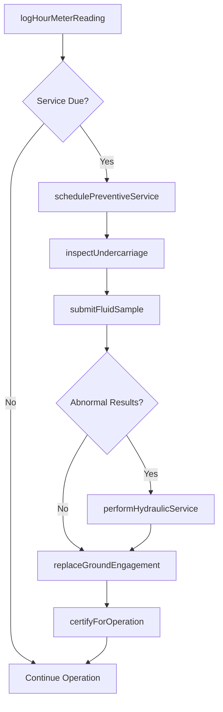
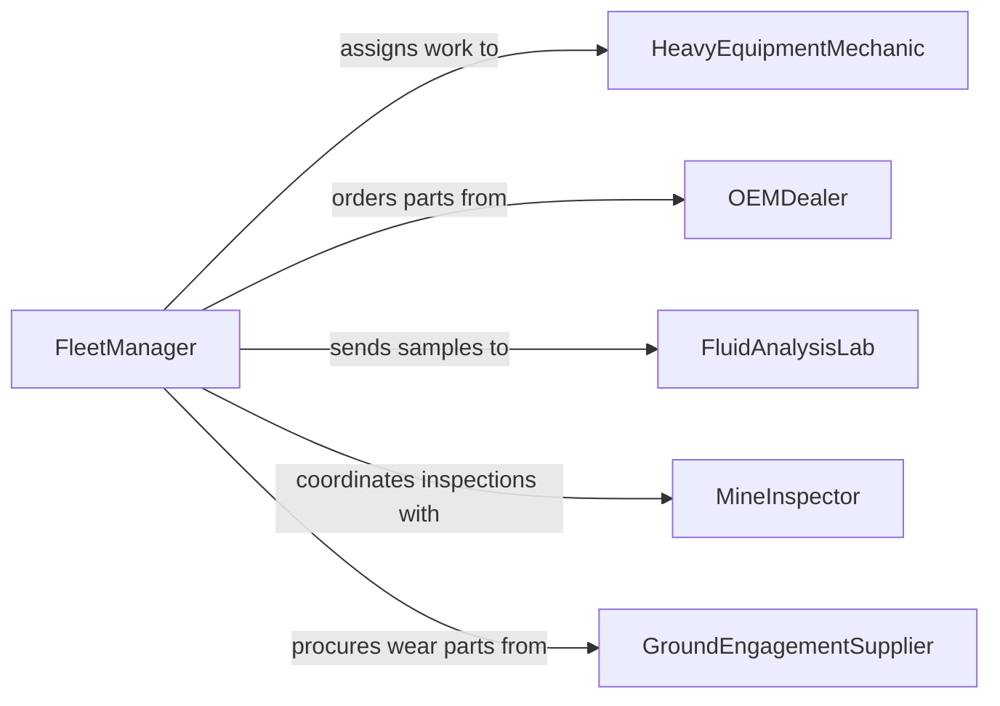

# Maintain Extraction Excavation Equipment

> Business-as-Code definition for extraction and excavation equipment maintenance. Models the servicing, inspection, and repair of heavy earthmoving machinery including excavators, loaders, draglines, and mining extraction systems.

## Overview

Extraction and excavation equipment maintenance covers the upkeep of heavy machinery used in mining, quarrying, construction, and earth-moving operations. This definition exposes actions for scheduling preventive service, tracking undercarriage and hydraulic system wear, managing fluid analysis programs, and certifying equipment for safe field operation under MSHA and OSHA standards.

## Actors

| Actor | Description |
|-------|-------------|
| OEMDealer | Provides factory parts, service bulletins, and warranty support |
| FluidAnalysisLab | Performs oil and coolant sampling to detect early component wear |
| MineInspector | Conducts regulatory safety inspections per MSHA standards |
| GroundEngagementSupplier | Supplies buckets, teeth, cutting edges, and wear plates |
| HydraulicSpecialist | Services high-pressure hydraulic systems and cylinders |

## Roles

| Role | Description |
|------|-------------|
| HeavyEquipmentMechanic | Performs hands-on repair and service on extraction machinery |
| MaintenancePlanner | Schedules service intervals and coordinates parts availability |
| SiteSupervisor | Reports equipment issues and authorizes downtime for service |
| FleetManager | Oversees all heavy equipment assets and lifecycle decisions |

## Entities

| Entity | Description |
|--------|-------------|
| HeavyEquipment | An excavator, loader, dragline, or extraction machine |
| ServiceInterval | A manufacturer-defined maintenance milestone by hours or cycles |
| FluidSample | An oil or coolant sample taken for laboratory analysis |
| UndercarriageComponent | Track links, rollers, idlers, and sprockets subject to wear |
| WorkOrder | A directive for specific maintenance tasks on an asset |
| HourMeterReading | Cumulative operating hours logged for scheduling purposes |

## Actions

| Action | Description |
|--------|-------------|
| logHourMeterReading | Record current operating hours for service interval tracking |
| schedulePreventiveService | Plan maintenance based on hour meter or calendar triggers |
| inspectUndercarriage | Measure wear on track components and ground engagement tools |
| submitFluidSample | Send oil or coolant for laboratory analysis |
| performHydraulicService | Service hydraulic pumps, cylinders, hoses, and filters |
| replaceGroundEngagement | Swap bucket teeth, cutting edges, or wear plates |
| certifyForOperation | Clear equipment for return to active field use |

## Events

| Event | Description |
|-------|-------------|
| hourMeterReadingLogged | Operating hours have been recorded for an asset |
| preventiveServiceScheduled | A service appointment has been planned |
| undercarriageInspected | Undercarriage wear measurements have been documented |
| fluidSampleSubmitted | An oil or coolant sample has been sent for analysis |
| hydraulicServicePerformed | Hydraulic system maintenance has been completed |
| groundEngagementReplaced | Wear components on the bucket or blade have been swapped |
| equipmentCertifiedForOperation | Equipment has been cleared for active use |

## Searches

| Search | Description |
|--------|-------------|
| findEquipmentByHours | List equipment approaching or past service hour thresholds |
| getFluidAnalysisResults | Retrieve lab results for fluid samples by asset |
| getUndercarriageWearReport | Find wear measurements for tracked equipment |
| findOpenWorkOrders | List incomplete maintenance work orders by site or priority |

## Workflow



## Actor Relationships



## Usage

### Calling Actions

```typescript
import { maintainExtractionExcavationEquipment } from '@headlessly/maintain-extraction-excavation-equipment'

const heavyEquip = maintainExtractionExcavationEquipment()

// Log operating hours
await heavyEquip.logHourMeterReading({
  equipmentId: 'exc-330-017',
  hours: 4250,
  recordedBy: 'operator-davis'
})

// Schedule preventive service at 5000-hour interval
const service = await heavyEquip.schedulePreventiveService({
  equipmentId: 'exc-330-017',
  intervalHours: 5000,
  tasks: ['engine-oil', 'hydraulic-filters', 'undercarriage-inspection'],
  scheduledDate: '2026-04-01'
})

// Submit fluid sample for analysis
await heavyEquip.submitFluidSample({
  equipmentId: 'exc-330-017',
  sampleType: 'hydraulic-oil',
  labId: 'fluid-lab-west',
  sampleDate: '2026-03-15'
})
```

### Event-Driven Automation

```typescript
// Alert when fluid analysis shows abnormal wear metals
heavyEquip.fluidSampleSubmitted(async ({ equipmentId, sampleId }) => {
  const results = await heavyEquip.getFluidAnalysisResults({ sampleId })
  if (results.ironPpm > 100 || results.copperPpm > 50) {
    await notify({
      to: 'fleet-manager',
      message: `Abnormal wear metals detected for ${equipmentId}. Immediate inspection recommended.`
    })
  }
})

// Auto-schedule undercarriage inspection after ground engagement replacement
heavyEquip.groundEngagementReplaced(async ({ equipmentId, replacedDate }) => {
  await heavyEquip.inspectUndercarriage({
    equipmentId,
    scheduledDate: addDays(replacedDate, 90),
    type: 'follow-up'
  })
})
```
