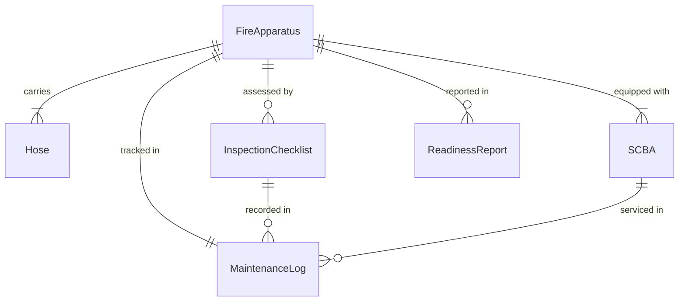
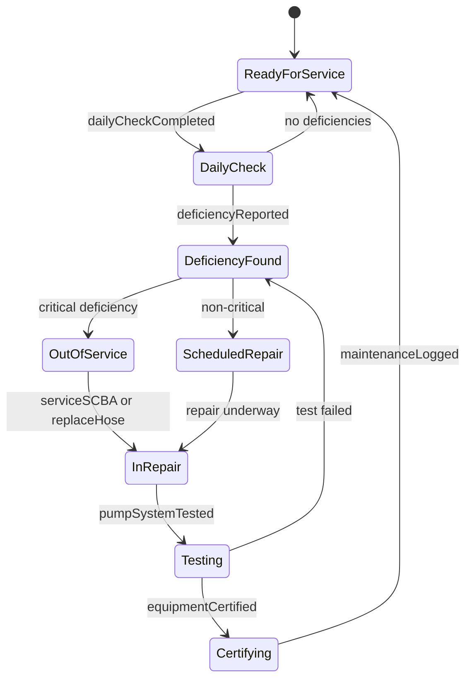
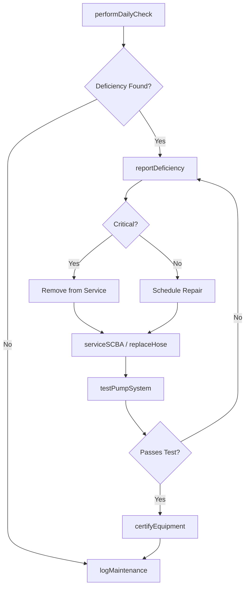
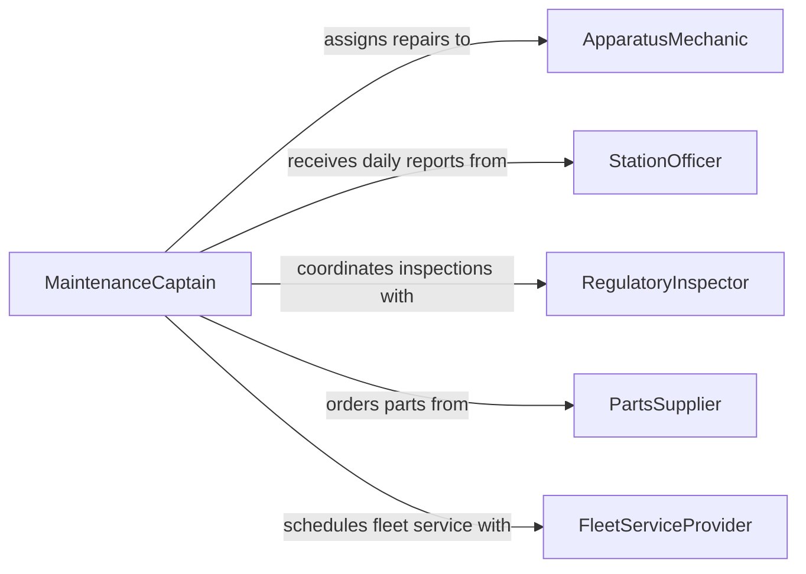

# Maintain Fire Fighting Tools Equipment

> Business-as-Code definition for fire fighting tools and equipment maintenance. Models the inspection, testing, repair, and readiness verification of fire suppression apparatus, hoses, breathing equipment, and rescue tools.

## Overview

Fire fighting equipment maintenance ensures that all suppression, rescue, and personal protective apparatus remain in reliable working condition for emergency response. This definition exposes actions for conducting NFPA-compliant inspections, testing pump and ladder systems, servicing self-contained breathing apparatus (SCBA), and documenting equipment readiness status across fire stations.

## Actors

| Actor | Description |
|-------|-------------|
| EquipmentManufacturer | Provides specifications, recall notices, and technical bulletins |
| CertificationAuthority | Issues compliance certificates for tested equipment |
| PartsSupplier | Supplies replacement hoses, nozzles, valves, and SCBA components |
| RegulatoryInspector | Conducts mandated inspections per NFPA and OSHA standards |
| FleetServiceProvider | Maintains and repairs fire apparatus chassis and drivetrain |

## Roles

| Role | Description |
|------|-------------|
| ApparatusMechanic | Performs hands-on repair and servicing of fire apparatus |
| StationOfficer | Oversees daily equipment checks and reports deficiencies |
| MaintenanceCaptain | Coordinates maintenance schedules and vendor relationships |
| SafetyOfficer | Validates that equipment meets operational safety standards |

## Entities

| Entity | Description |
|--------|-------------|
| FireApparatus | A fire engine, ladder truck, or rescue vehicle |
| SCBA | Self-contained breathing apparatus requiring periodic testing |
| Hose | Fire suppression hose assembly tracked by pressure rating and age |
| InspectionChecklist | Standardized form for documenting equipment condition |
| MaintenanceLog | Chronological record of all service performed on an asset |
| ReadinessReport | Summary of equipment availability status across a station |

## Actions

| Action | Description |
|--------|-------------|
| performDailyCheck | Execute routine pre-shift equipment inspection |
| testPumpSystem | Conduct pressure and flow tests on apparatus pump |
| serviceSCBA | Inspect, clean, and test breathing apparatus |
| replaceHose | Swap out hoses that fail pressure testing |
| logMaintenance | Record completed maintenance tasks and findings |
| certifyEquipment | Submit equipment for formal compliance certification |
| reportDeficiency | Flag equipment that fails inspection for immediate action |

## Events

| Event | Description |
|-------|-------------|
| dailyCheckCompleted | Routine pre-shift inspection has been documented |
| pumpSystemTested | Apparatus pump has undergone pressure and flow verification |
| scbaServiced | Breathing apparatus has been inspected and cleared |
| hoseReplaced | A fire hose has been swapped due to test failure |
| maintenanceLogged | Maintenance activity has been recorded in the log |
| equipmentCertified | Equipment has passed formal compliance certification |
| deficiencyReported | An equipment deficiency has been flagged for resolution |

## Searches

| Search | Description |
|--------|-------------|
| findApparatusByStation | List fire apparatus assigned to a specific station |
| getMaintenanceLog | Retrieve service history for a piece of equipment |
| getOverdueInspections | Find equipment past its scheduled inspection date |
| findDeficiencies | List open equipment deficiency reports |

## Entity Relationships



## State Diagram



## Workflow



## Actor Relationships



## Usage

### Calling Actions

```typescript
import { maintainFireFightingToolsEquipment } from '@headlessly/maintain-fire-fighting-tools-equipment'

const fireEquip = maintainFireFightingToolsEquipment()

// Perform daily pre-shift check
const check = await fireEquip.performDailyCheck({
  stationId: 'station-12',
  apparatusId: 'engine-1204',
  officerId: 'capt-williams',
  checklist: ['pump', 'hoses', 'scba', 'ladders', 'lights']
})

// Test pump system on apparatus
await fireEquip.testPumpSystem({
  apparatusId: 'engine-1204',
  testType: 'annual',
  pressureTargetPsi: 150,
  flowRateGpm: 1000
})

// Service breathing apparatus
await fireEquip.serviceSCBA({
  scbaId: 'scba-0087',
  tasks: ['flow-test', 'regulator-check', 'cylinder-hydro'],
  technicianId: 'mech-alvarez'
})
```

### Event-Driven Automation

```typescript
// Remove apparatus from service on critical deficiency
fireEquip.deficiencyReported(async ({ equipmentId, severity, description }) => {
  if (severity === 'critical') {
    await fireEquip.reportDeficiency({
      equipmentId,
      action: 'out-of-service',
      notifyChain: ['maintenance-captain', 'battalion-chief']
    })
  }
})

// Auto-schedule annual pump test
fireEquip.equipmentCertified(async ({ apparatusId, certifiedDate }) => {
  await fireEquip.testPumpSystem({
    apparatusId,
    testType: 'annual',
    scheduledDate: addYears(certifiedDate, 1)
  })
})
```
