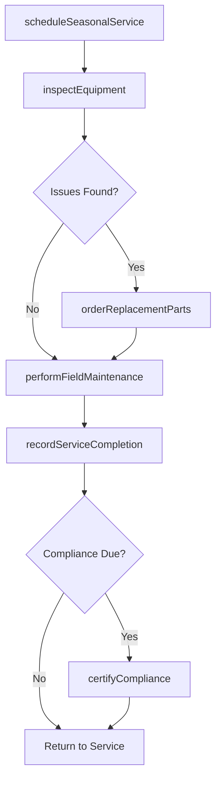
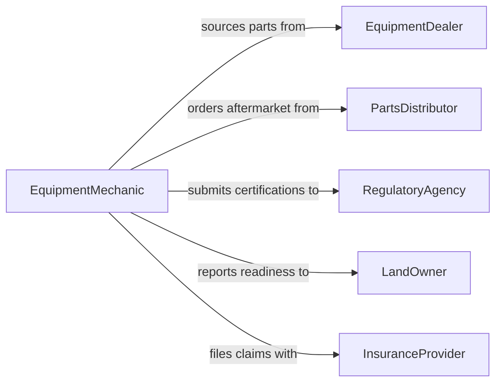

# Maintain Forestry Hunting Agricultural Equipment

> Business-as-Code definition for maintaining forestry, hunting, and agricultural equipment to ensure reliable performance across seasonal and field operations.

## Overview

Maintaining forestry, hunting, and agricultural equipment involves servicing tractors, harvesters, chainsaws, irrigation systems, and other specialized machinery used in outdoor and land-based operations. This definition exposes actions for scheduling seasonal maintenance, tracking equipment condition across dispersed locations, and managing compliance with environmental and safety standards unique to these industries.

## Actors

| Actor | Description |
|-------|-------------|
| EquipmentDealer | Supplies new equipment, OEM parts, and warranty service |
| PartsDistributor | Provides aftermarket replacement parts and consumables |
| RegulatoryAgency | Enforces emissions, safety, and environmental compliance standards |
| LandOwner | Owns or leases the property where equipment operates |
| InsuranceProvider | Covers equipment damage, liability, and loss claims |

## Roles

| Role | Description |
|------|-------------|
| EquipmentMechanic | Performs hands-on repair and maintenance on field equipment |
| OperationsManager | Plans seasonal equipment readiness and coordinates field crews |
| ComplianceOfficer | Ensures equipment meets environmental and safety regulations |
| FleetCoordinator | Tracks equipment inventory, location, and utilization across sites |

## Entities

| Entity | Description |
|--------|-------------|
| FieldEquipment | A tractor, harvester, chainsaw, or other specialized machine |
| MaintenanceSchedule | A seasonal or interval-based service plan for equipment |
| ServiceRecord | Documented history of maintenance and repairs on an asset |
| ComplianceCertificate | Proof that equipment meets regulatory standards |
| WorkOrder | Authorization to perform specific maintenance or repair work |
| PartInventory | Stock of replacement parts and consumables at a depot or site |

## Actions

| Action | Description |
|--------|-------------|
| scheduleSeasonalService | Plan pre-season and post-season maintenance for equipment fleets |
| performFieldMaintenance | Execute on-site servicing including oil changes, filter replacements, and blade sharpening |
| inspectEquipment | Conduct a condition assessment to identify wear and deficiencies |
| orderReplacementParts | Request parts needed for upcoming or active maintenance |
| recordServiceCompletion | Document maintenance performed and update the asset record |
| certifyCompliance | Verify and record that equipment meets current regulatory standards |
| decommissionEquipment | Remove end-of-life equipment from active service |

## Events

| Event | Description |
|-------|-------------|
| seasonalServiceScheduled | Pre-season or post-season maintenance has been planned |
| fieldMaintenancePerformed | On-site servicing has been completed |
| equipmentInspected | A condition assessment has been finalized |
| replacementPartsOrdered | Parts have been requested from a supplier |
| serviceCompletionRecorded | Maintenance documentation has been updated |
| complianceCertified | Equipment has passed regulatory compliance verification |
| equipmentDecommissioned | An asset has been removed from active service |

## Searches

| Search | Description |
|--------|-------------|
| findEquipmentByStatus | List equipment filtered by operational status or maintenance state |
| getServiceHistory | Retrieve the full maintenance history for a specific piece of equipment |
| getUpcomingMaintenance | Find equipment with scheduled service within a given timeframe |
| findExpiredCertifications | Locate equipment with lapsed compliance certificates |
| getPartInventory | Check available parts stock at a specific depot or site |

## Workflow



## Actor Relationships



## Usage

### Calling Actions

```typescript
import { maintainForestryHuntingAgriculturalEquipment } from '@headlessly/maintain-forestry-hunting-agricultural-equipment'

const equipment = maintainForestryHuntingAgriculturalEquipment()

// Schedule pre-season maintenance for planting
const schedule = await equipment.scheduleSeasonalService({
  season: 'spring-planting',
  equipmentIds: ['TRACTOR-204', 'HARVESTER-107', 'SPRAYER-015'],
  targetCompletion: '2026-03-15'
})

// Perform field maintenance on a tractor
await equipment.performFieldMaintenance({
  equipmentId: 'TRACTOR-204',
  tasks: ['oil-change', 'air-filter-replacement', 'hydraulic-fluid-check'],
  location: 'North Field Depot'
})

// Record completed service
await equipment.recordServiceCompletion({
  equipmentId: 'TRACTOR-204',
  completedAt: new Date().toISOString(),
  hoursAtService: 1250
})
```

### Event-Driven Automation

```typescript
// Auto-order parts when inspection reveals deficiencies
equipment.equipmentInspected(async ({ equipmentId, findings }) => {
  const partsNeeded = findings.filter(f => f.requiresReplacement)
  if (partsNeeded.length > 0) {
    await equipment.orderReplacementParts({
      equipmentId,
      parts: partsNeeded.map(p => p.partNumber)
    })
  }
})

// Alert when compliance certificates expire
equipment.complianceCertified(async ({ equipmentId, expiresAt }) => {
  await scheduleReminder({
    date: subtractDays(expiresAt, 30),
    message: `Compliance renewal due for ${equipmentId}`
  })
})
```
