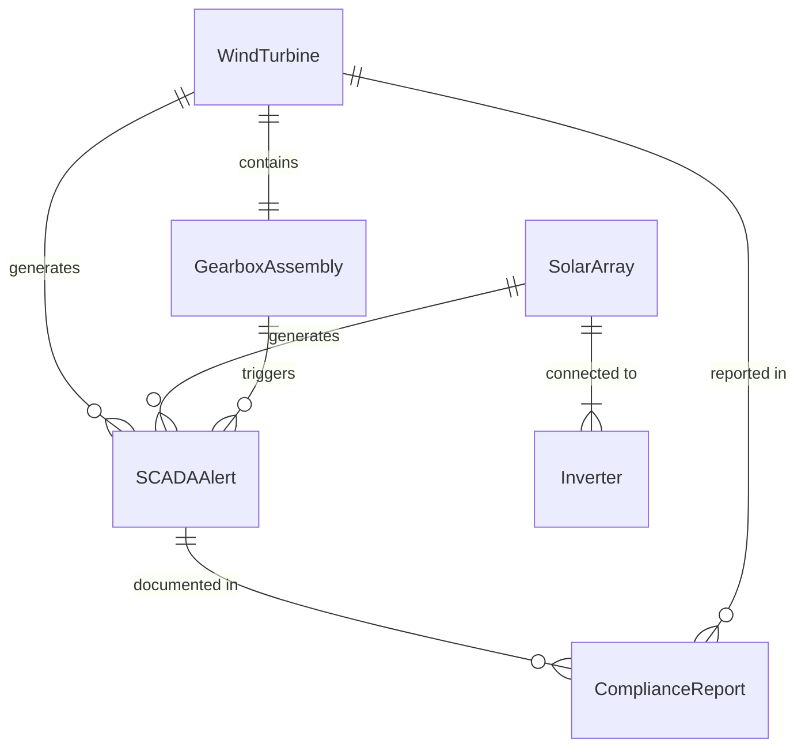
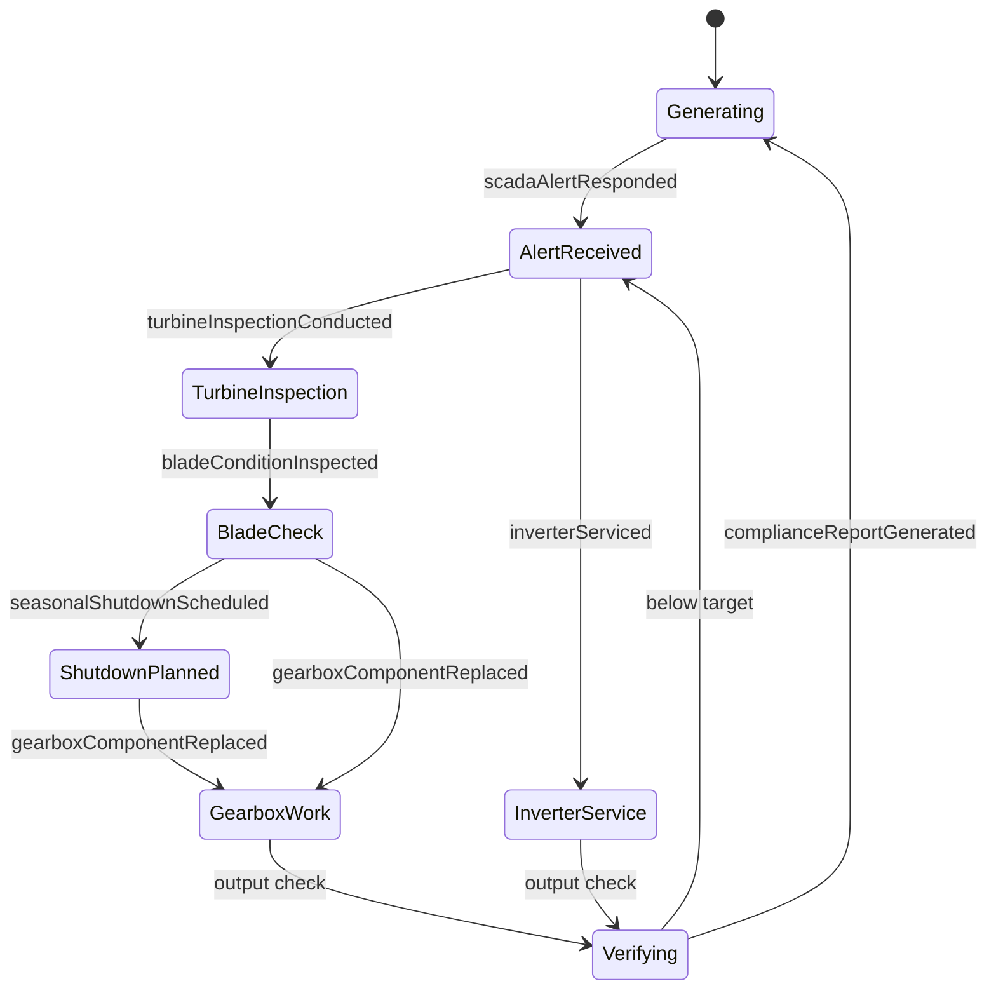
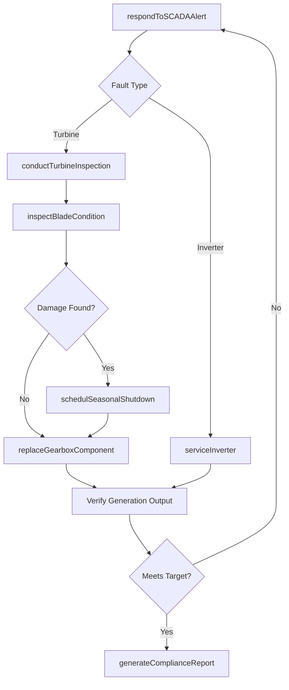
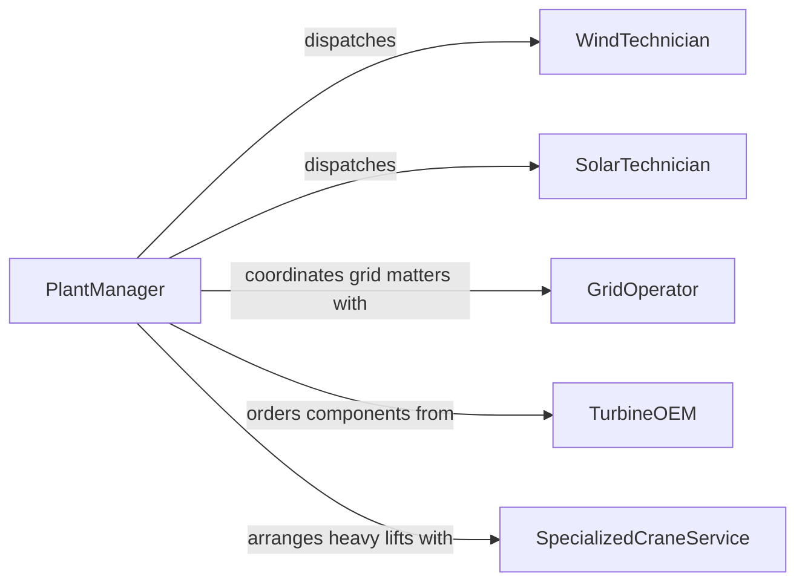

# Maintain Green Energy Production Plant

> Business-as-Code definition for green energy production plant equipment maintenance. Models the inspection, servicing, and repair of wind turbines, solar arrays, biomass generators, hydroelectric systems, and associated balance-of-plant equipment.

## Overview

Green energy production plant maintenance covers the upkeep of renewable energy generation assets including wind turbine gearboxes and blades, solar panel inverters and trackers, biomass boilers, and small hydro turbines. This definition exposes actions for conducting condition-based monitoring, scheduling seasonal inspections, managing SCADA-triggered alerts, and documenting compliance with FERC, NERC, and local interconnection requirements.

## Actors

| Actor | Description |
|-------|-------------|
| TurbineOEM | Provides wind or hydro turbine components, firmware, and factory service |
| InverterManufacturer | Supplies solar inverters, string combiners, and monitoring software |
| GridOperator | Manages interconnection standards and dispatches generation curtailments |
| EnvironmentalAgency | Enforces wildlife, noise, and emissions compliance for generation sites |
| SpecializedCraneService | Provides heavy-lift crane support for turbine nacelle and blade work |

## Roles

| Role | Description |
|------|-------------|
| WindTechnician | Performs up-tower maintenance on turbine nacelle, drivetrain, and blades |
| SolarTechnician | Services inverters, panels, trackers, and DC combiner systems |
| PlantManager | Oversees all generation assets and coordinates maintenance schedules |
| SCADAOperator | Monitors real-time performance data and dispatches fault responses |
| ComplianceEngineer | Ensures maintenance records meet regulatory and interconnection requirements |

## Entities

| Entity | Description |
|--------|-------------|
| WindTurbine | A generation unit including tower, nacelle, gearbox, generator, and blades |
| SolarArray | A group of photovoltaic panels with associated inverters and trackers |
| Inverter | A power electronics device converting DC to AC for grid delivery |
| GearboxAssembly | The mechanical drivetrain in a wind turbine nacelle |
| SCADAAlert | An automated alarm from supervisory control indicating a fault condition |
| ComplianceReport | Documentation submitted to regulators demonstrating maintenance adherence |

## Actions

| Action | Description |
|--------|-------------|
| conductTurbineInspection | Perform visual, acoustic, and sensor-based assessment of a wind turbine |
| serviceInverter | Clean, test, and repair solar inverters and power electronics |
| inspectBladeCondition | Evaluate wind turbine blades for erosion, cracks, or lightning damage |
| replaceGearboxComponent | Swap bearings, gears, or seals in turbine drivetrain assemblies |
| respondToSCADAAlert | Investigate and resolve faults flagged by the monitoring system |
| generateComplianceReport | Compile maintenance records into regulatory submission format |
| schedulSeasonalShutdown | Plan maintenance windows around low-generation periods |

## Events

| Event | Description |
|-------|-------------|
| turbineInspectionConducted | A wind turbine has been assessed for condition and performance |
| inverterServiced | A solar inverter has been cleaned, tested, and returned to service |
| bladeConditionInspected | Turbine blade surfaces have been evaluated for damage |
| gearboxComponentReplaced | Drivetrain components have been swapped in a turbine nacelle |
| scadaAlertResponded | A SCADA fault has been investigated and resolved |
| complianceReportGenerated | Regulatory maintenance documentation has been compiled |
| seasonalShutdownScheduled | A maintenance window has been planned for a generation asset |

## Searches

| Search | Description |
|--------|-------------|
| findTurbinesByPerformance | List turbines filtered by capacity factor or availability metrics |
| getSCADAAlertHistory | Retrieve fault alerts for a specific asset over a time range |
| getBladeInspectionRecords | Query blade condition assessments by turbine or severity |
| findAssetsNearingServiceInterval | Locate generation equipment approaching scheduled maintenance milestones |

## Entity Relationships



## State Diagram



## Workflow



## Actor Relationships



## Usage

### Calling Actions

```typescript
import { maintainGreenEnergyProductionPlant } from '@headlessly/maintain-green-energy-production-plant'

const greenEnergy = maintainGreenEnergyProductionPlant()

// Respond to a SCADA alert on a wind turbine
await greenEnergy.respondToSCADAAlert({
  alertId: 'scada-alert-20260301-042',
  assetId: 'wt-north-ridge-07',
  faultCode: 'gearbox-temperature-high',
  responderId: 'tech-larsen'
})

// Conduct turbine inspection
const inspection = await greenEnergy.conductTurbineInspection({
  turbineId: 'wt-north-ridge-07',
  inspectionType: 'annual',
  systems: ['gearbox', 'generator', 'pitch-system', 'yaw-drive']
})

// Service solar inverters across an array
await greenEnergy.serviceInverter({
  inverterId: 'inv-south-field-03A',
  tasks: ['thermal-scan', 'fan-cleaning', 'firmware-update'],
  technicianId: 'tech-patel'
})
```

### Event-Driven Automation

```typescript
// Escalate repeated SCADA alerts on the same asset
greenEnergy.scadaAlertResponded(async ({ assetId, faultCode, resolvedDate }) => {
  const history = await greenEnergy.getSCADAAlertHistory({
    assetId,
    faultCode,
    since: subtractDays(resolvedDate, 30)
  })
  if (history.length > 3) {
    await notify({
      to: 'plant-manager',
      message: `${assetId} has triggered ${faultCode} ${history.length} times in 30 days. Root cause analysis recommended.`
    })
  }
})

// Auto-generate compliance report after seasonal maintenance
greenEnergy.seasonalShutdownScheduled(async ({ assetId, maintenanceWindow }) => {
  await greenEnergy.generateComplianceReport({
    assetId,
    period: maintenanceWindow,
    submissionDeadline: addDays(maintenanceWindow.end, 30)
  })
})
```
