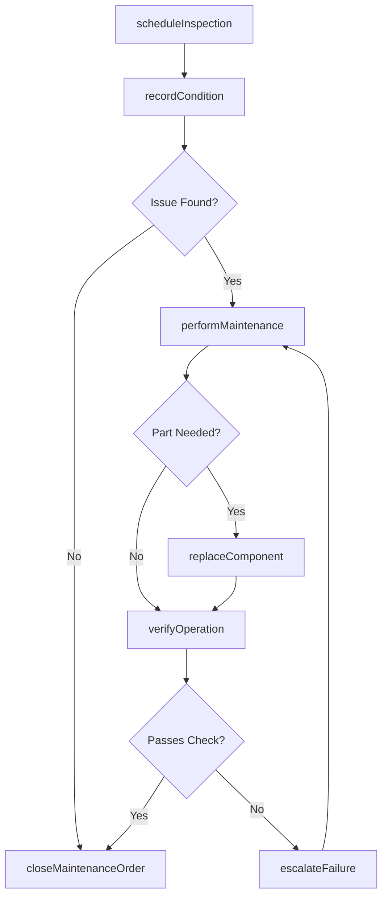
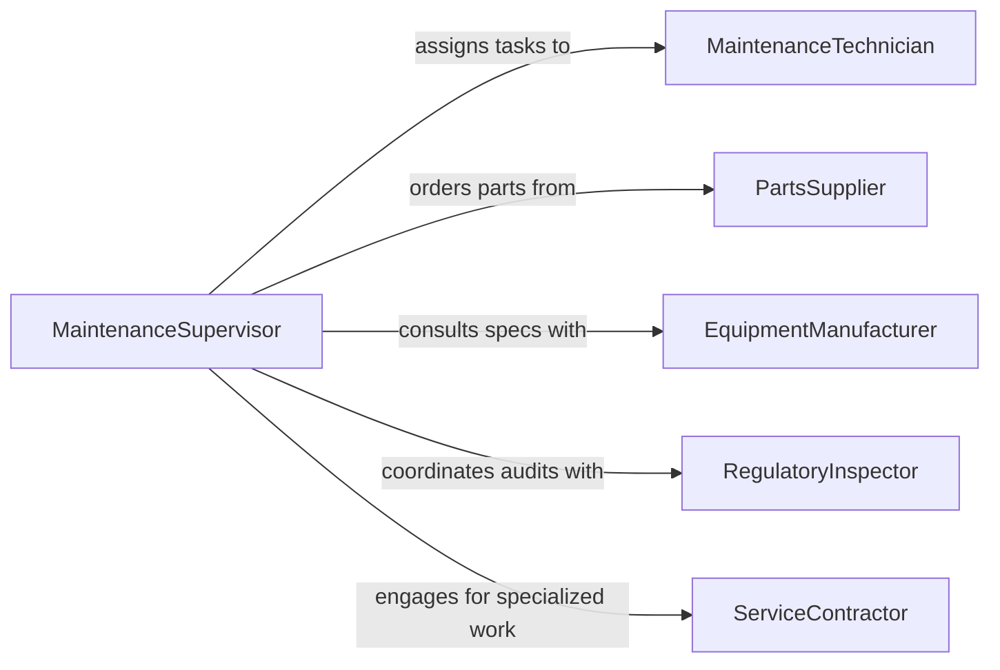

# Maintain Mechanical Equipment

> Business-as-Code definition for mechanical equipment maintenance. Models scheduled and corrective maintenance activities including inspections, part replacements, and performance verification across industrial and commercial mechanical systems.

## Overview

Mechanical equipment maintenance encompasses the planning, execution, and documentation of preventive and corrective maintenance on mechanical systems such as pumps, compressors, conveyors, and motors. This definition exposes actions for scheduling inspections, recording maintenance tasks, tracking component wear, and verifying operational readiness after service.

## Actors

| Actor | Description |
|-------|-------------|
| EquipmentManufacturer | Provides technical specifications, maintenance intervals, and warranty terms |
| PartsSupplier | Supplies replacement components, lubricants, and consumables |
| RegulatoryInspector | Verifies compliance with mechanical safety standards |
| ServiceContractor | Performs specialized maintenance beyond in-house capabilities |
| WarrantyProvider | Covers repair costs for equipment within warranty periods |

## Roles

| Role | Description |
|------|-------------|
| MaintenanceTechnician | Executes hands-on maintenance tasks and repairs |
| MaintenanceSupervisor | Schedules work, assigns technicians, and reviews completion |
| ReliabilityEngineer | Analyzes equipment performance data and optimizes maintenance intervals |
| InventoryCoordinator | Manages spare parts stock levels and procurement |

## Entities

| Entity | Description |
|--------|-------------|
| Equipment | A mechanical asset requiring periodic maintenance |
| MaintenanceOrder | A work directive specifying tasks, parts, and schedule |
| InspectionRecord | Documentation of equipment condition assessments |
| SparePart | A replacement component held in inventory |
| MaintenanceSchedule | A calendar of planned maintenance activities |
| FailureReport | A record of equipment breakdowns and root causes |

## Actions

| Action | Description |
|--------|-------------|
| scheduleInspection | Plan a routine or condition-based equipment inspection |
| performMaintenance | Execute preventive or corrective maintenance tasks |
| replaceComponent | Swap out a worn or failed mechanical part |
| recordCondition | Document equipment state during or after inspection |
| verifyOperation | Confirm equipment functions correctly after maintenance |
| escalateFailure | Flag a critical failure for immediate engineering review |
| closeMaintenanceOrder | Mark a maintenance order as completed with final notes |

## Events

| Event | Description |
|-------|-------------|
| inspectionScheduled | A new equipment inspection has been planned |
| maintenancePerformed | Maintenance tasks have been completed on equipment |
| componentReplaced | A mechanical part has been swapped out |
| conditionRecorded | Equipment condition data has been documented |
| operationVerified | Post-maintenance equipment functionality confirmed |
| failureEscalated | A critical equipment failure has been flagged |
| maintenanceOrderClosed | A maintenance work order has been finalized |

## Searches

| Search | Description |
|--------|-------------|
| findEquipmentByStatus | List equipment filtered by operational or maintenance status |
| getMaintenanceHistory | Retrieve past maintenance records for a specific asset |
| getUpcomingInspections | Find scheduled inspections within a date range |
| findOverdueOrders | Locate maintenance orders past their due date |

## Workflow



## Actor Relationships



## Usage

### Calling Actions

```typescript
import { maintainMechanicalEquipment } from '@headlessly/maintain-mechanical-equipment'

const equipment = maintainMechanicalEquipment()

// Schedule a routine inspection
const inspection = await equipment.scheduleInspection({
  equipmentId: 'pump-0042',
  type: 'preventive',
  scheduledDate: '2026-03-15',
  assignedTo: 'tech-jane'
})

// Perform maintenance after inspection findings
await equipment.performMaintenance({
  maintenanceOrderId: 'MO-2026-0312',
  tasks: ['replace-seal', 'align-coupling', 'check-bearings'],
  technicianId: 'tech-jane'
})

// Verify equipment operation post-maintenance
const result = await equipment.verifyOperation({
  equipmentId: 'pump-0042',
  checks: ['pressure-output', 'vibration-level', 'temperature']
})
```

### Event-Driven Automation

```typescript
// Alert supervisor on critical failure
equipment.failureEscalated(async ({ equipmentId, failureType, severity }) => {
  await notify({
    to: 'maintenance-supervisor',
    message: `Critical failure on ${equipmentId}: ${failureType} (severity: ${severity})`
  })
})

// Auto-schedule follow-up inspection after maintenance
equipment.maintenancePerformed(async ({ equipmentId, completedDate }) => {
  await equipment.scheduleInspection({
    equipmentId,
    type: 'follow-up',
    scheduledDate: addDays(completedDate, 30),
    notes: 'Post-maintenance verification'
  })
})
```
