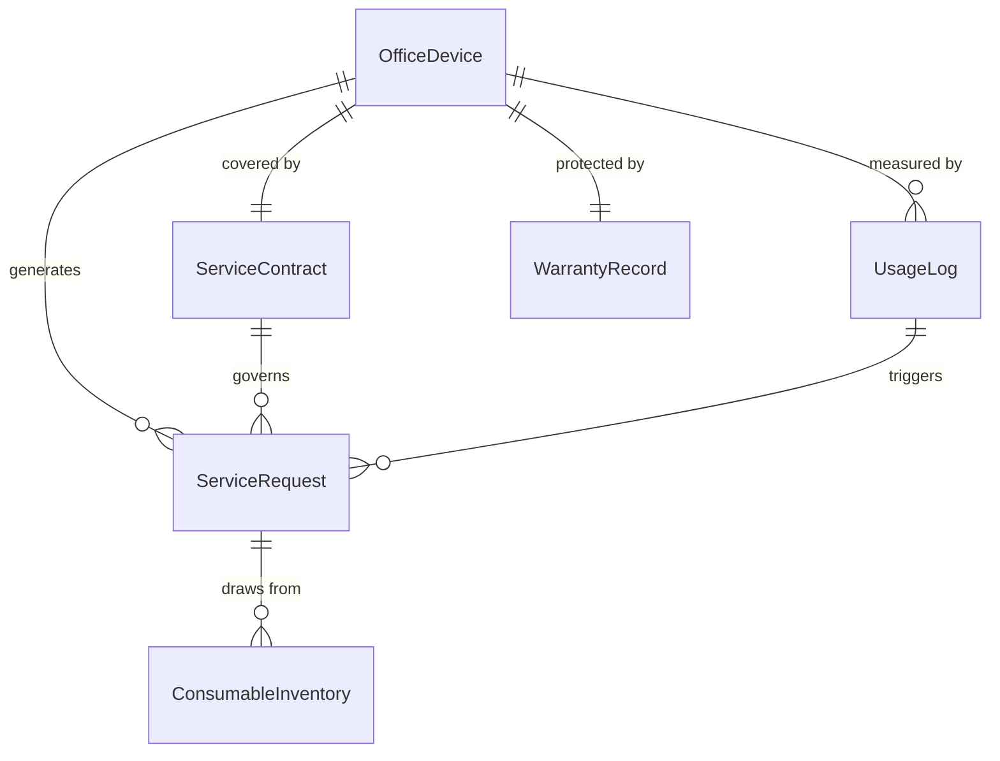
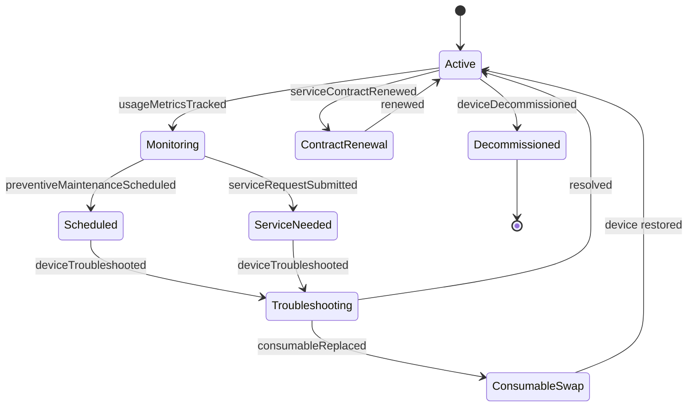
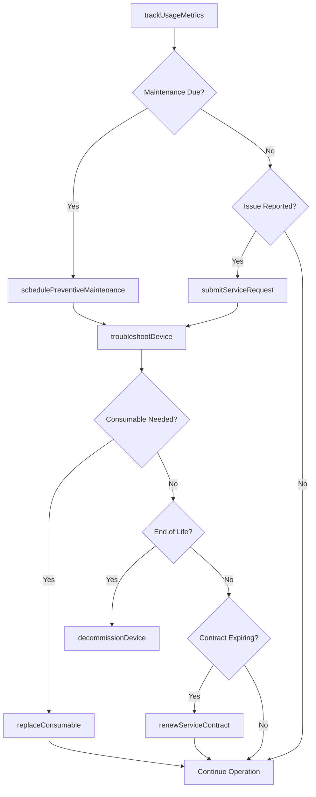
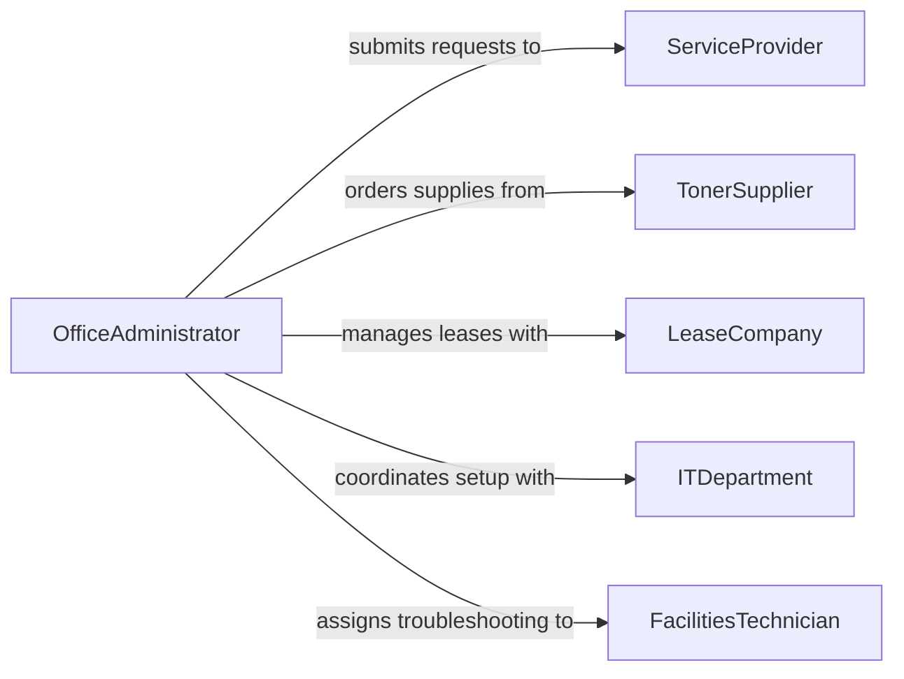

# Maintain Office Equipment Proper Operating

> Business-as-Code definition for maintaining office equipment in proper operating condition. Models the servicing, troubleshooting, and upkeep of printers, copiers, shredders, postage meters, and other mechanical office devices.

## Overview

Office equipment maintenance ensures that printers, copiers, fax machines, postage meters, laminators, shredders, and binding machines remain in reliable working order for daily business operations. This definition exposes actions for scheduling preventive maintenance, managing service contracts, tracking consumable usage, and handling equipment repairs to minimize downtime and control costs.

## Actors

| Actor | Description |
|-------|-------------|
| EquipmentVendor | Sells or leases office equipment and provides initial setup |
| ServiceProvider | Performs contracted maintenance and repairs on office devices |
| TonerSupplier | Supplies toner, ink cartridges, and other consumable materials |
| LeaseCompany | Manages equipment lease agreements, upgrades, and returns |
| ITDepartment | Configures network connectivity and driver software for devices |

## Roles

| Role | Description |
|------|-------------|
| OfficeAdministrator | Coordinates equipment needs and manages service contracts |
| FacilitiesTechnician | Performs basic in-house troubleshooting and consumable replacement |
| ProcurementOfficer | Handles purchase orders for equipment and supplies |
| DepartmentManager | Reports equipment issues and approves replacement requests |

## Entities

| Entity | Description |
|--------|-------------|
| OfficeDevice | A printer, copier, shredder, or other mechanical office machine |
| ServiceContract | An agreement with a vendor for ongoing maintenance coverage |
| ConsumableInventory | Stock levels for toner, paper, staples, and other supplies |
| ServiceRequest | A ticket for equipment troubleshooting or repair |
| UsageLog | Page counts, copy volumes, and utilization metrics per device |
| WarrantyRecord | Terms and expiration dates for equipment warranties |

## Actions

| Action | Description |
|--------|-------------|
| schedulePreventiveMaintenance | Plan routine cleaning and calibration of office devices |
| replaceConsumable | Swap toner cartridges, ink, paper trays, or fuser units |
| submitServiceRequest | Report a malfunctioning device for repair |
| troubleshootDevice | Diagnose common issues such as paper jams or print quality problems |
| trackUsageMetrics | Record page counts and utilization data for fleet management |
| renewServiceContract | Extend or update maintenance coverage agreements |
| decommissionDevice | Remove end-of-life equipment and arrange disposal or return |

## Events

| Event | Description |
|-------|-------------|
| preventiveMaintenanceScheduled | A routine service appointment has been planned |
| consumableReplaced | Toner, ink, or another consumable has been swapped |
| serviceRequestSubmitted | A repair ticket has been created for a device |
| deviceTroubleshooted | A device issue has been diagnosed and addressed |
| usageMetricsTracked | Utilization data has been recorded for an office device |
| serviceContractRenewed | A maintenance agreement has been extended |
| deviceDecommissioned | An office device has been removed from active service |

## Searches

| Search | Description |
|--------|-------------|
| findDevicesByLocation | List office equipment assigned to a specific floor or department |
| getServiceHistory | Retrieve maintenance and repair records for a device |
| getConsumableLevels | Query current stock levels for toner, ink, and supplies |
| findExpiringContracts | Locate service contracts approaching renewal dates |

## Entity Relationships



## State Diagram



## Workflow



## Actor Relationships



## Usage

### Calling Actions

```typescript
import { maintainOfficeEquipmentProperOperating } from '@headlessly/maintain-office-equipment-proper-operating'

const office = maintainOfficeEquipmentProperOperating()

// Schedule preventive maintenance for copier fleet
const service = await office.schedulePreventiveMaintenance({
  deviceId: 'copier-3rd-floor-01',
  serviceType: 'quarterly-cleaning',
  scheduledDate: '2026-04-01',
  provider: 'acme-office-services'
})

// Replace toner on a printer
await office.replaceConsumable({
  deviceId: 'printer-hr-02',
  consumableType: 'toner-cartridge',
  partNumber: 'TN-436BK',
  replacedBy: 'facilities-garcia'
})

// Track usage metrics across the fleet
const metrics = await office.trackUsageMetrics({
  deviceId: 'copier-3rd-floor-01',
  period: '2026-Q1',
  pageCount: 24500,
  colorPages: 3200
})
```

### Event-Driven Automation

```typescript
// Auto-order toner when stock runs low
office.consumableReplaced(async ({ deviceId, consumableType }) => {
  const levels = await office.getConsumableLevels({ consumableType })
  if (levels.onHand < levels.reorderPoint) {
    await notify({
      to: 'procurement-officer',
      message: `${consumableType} stock below reorder point. Current: ${levels.onHand}, Reorder at: ${levels.reorderPoint}`
    })
  }
})

// Notify administrator when service contract nears expiration
office.serviceContractRenewed(async ({ contractId, expirationDate }) => {
  await scheduleReminder({
    date: subtractDays(expirationDate, 60),
    to: 'office-administrator',
    message: `Service contract ${contractId} expires on ${expirationDate}. Begin renewal process.`
  })
})
```
