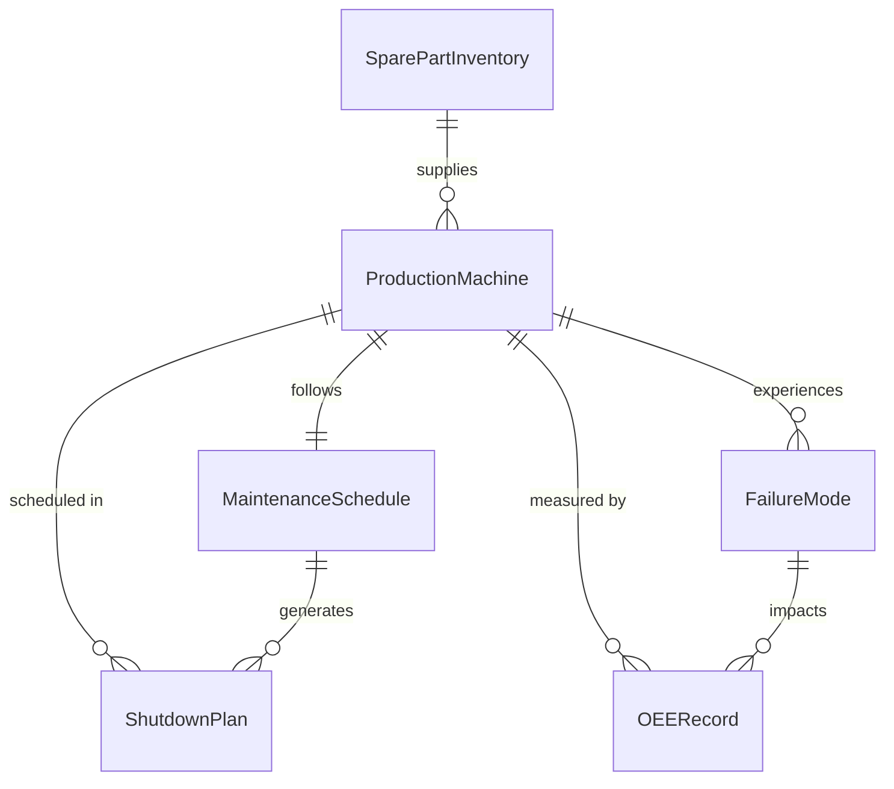
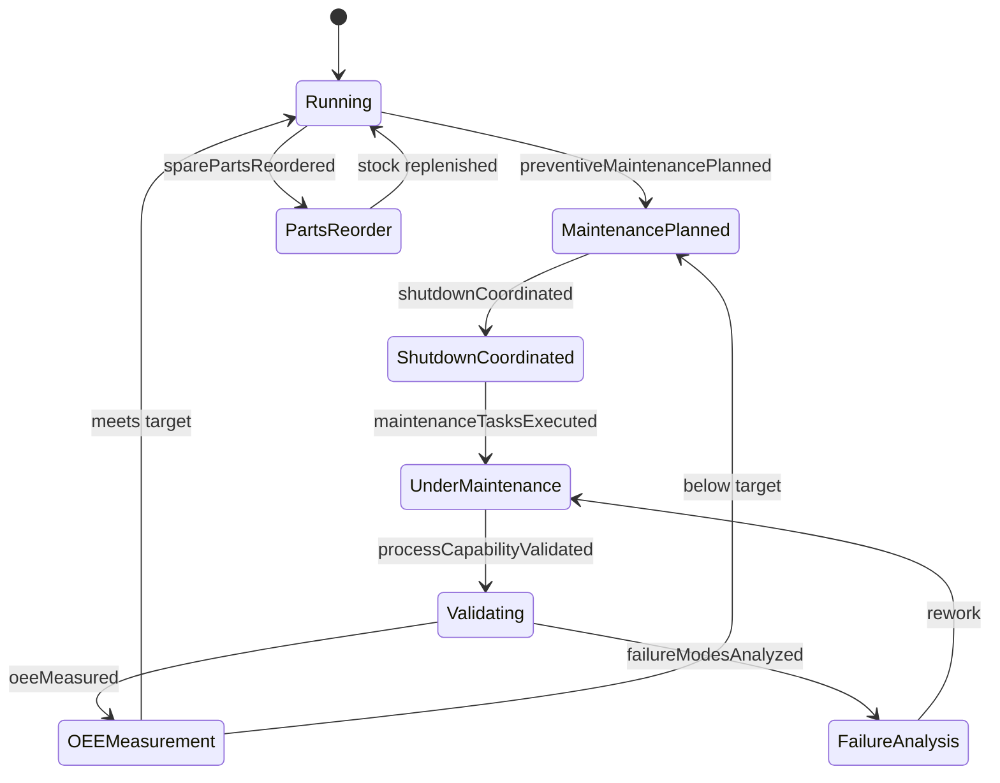
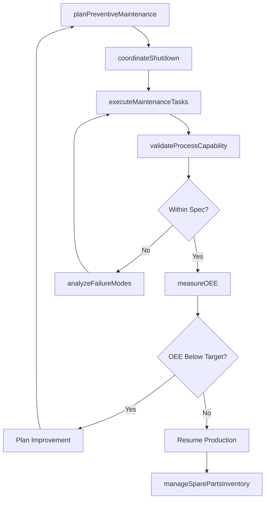
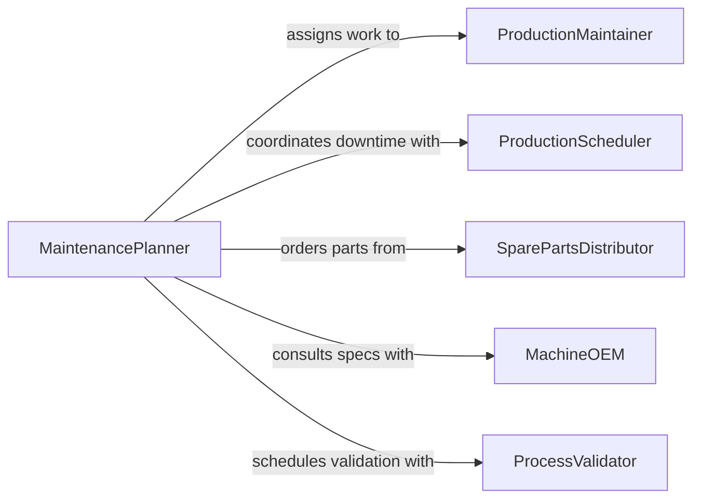

# Maintain Production Processing Equipment

> Business-as-Code definition for production and processing equipment maintenance. Models the preventive, predictive, and corrective maintenance of manufacturing line machinery, process vessels, packaging equipment, and material handling systems.

## Overview

Production and processing equipment maintenance encompasses the care of machinery that transforms raw materials into finished goods, including CNC machines, injection molders, batch reactors, packaging lines, and conveyor systems. This definition exposes actions for planning total productive maintenance (TPM) programs, tracking overall equipment effectiveness (OEE), managing spare parts inventories, and coordinating planned shutdowns to minimize production impact.

## Actors

| Actor | Description |
|-------|-------------|
| MachineOEM | Provides factory specifications, service manuals, and authorized repair support |
| SparePartsDistributor | Supplies replacement components, filters, seals, and wear items |
| ProcessValidator | Certifies that equipment operates within quality and regulatory parameters |
| ProductionScheduler | Plans production runs and coordinates maintenance downtime windows |
| LubricantVendor | Supplies cutting fluids, hydraulic oils, and specialty lubricants |

## Roles

| Role | Description |
|------|-------------|
| ProductionMaintainer | Performs hands-on service and repair on manufacturing equipment |
| MaintenancePlanner | Schedules maintenance activities and manages work order backlogs |
| QualityEngineer | Verifies that maintained equipment produces output within specifications |
| ReliabilityAnalyst | Uses OEE and failure data to optimize maintenance strategies |

## Entities

| Entity | Description |
|--------|-------------|
| ProductionMachine | A CNC mill, press, molder, reactor, or other manufacturing asset |
| MaintenanceSchedule | Calendar of planned preventive and predictive maintenance tasks |
| OEERecord | Overall equipment effectiveness measurement for a machine or line |
| SparePartInventory | Stock levels and reorder points for replacement components |
| ShutdownPlan | A coordinated plan for taking equipment offline for service |
| FailureMode | A documented type of equipment breakdown with associated root cause |

## Actions

| Action | Description |
|--------|-------------|
| planPreventiveMaintenance | Schedule routine tasks based on runtime hours or calendar intervals |
| executeMaintenanceTasks | Perform service activities per the maintenance schedule |
| measureOEE | Calculate availability, performance, and quality metrics for equipment |
| manageSparePartsInventory | Track stock levels and trigger reorders for critical components |
| coordinateShutdown | Plan and communicate scheduled downtime with production teams |
| analyzeFailureModes | Investigate root causes and frequency of equipment breakdowns |
| validateProcessCapability | Confirm equipment produces output within specification after maintenance |

## Events

| Event | Description |
|-------|-------------|
| preventiveMaintenancePlanned | Scheduled maintenance tasks have been defined for equipment |
| maintenanceTasksExecuted | Service activities have been completed on production equipment |
| oeeMeasured | Equipment effectiveness metrics have been calculated |
| sparePartsReordered | Replacement components have been ordered due to low stock |
| shutdownCoordinated | A planned maintenance outage has been communicated |
| failureModesAnalyzed | Root cause analysis of equipment breakdowns has been completed |
| processCapabilityValidated | Equipment has been confirmed to produce within specifications |

## Searches

| Search | Description |
|--------|-------------|
| findEquipmentByOEE | List production machines filtered by OEE score or availability |
| getMaintenanceSchedule | Retrieve upcoming and overdue maintenance tasks for a line |
| getFailureModeHistory | Query failure records by machine, type, or time period |
| findLowStockParts | Locate spare parts at or below reorder points |

## Entity Relationships



## State Diagram



## Workflow



## Actor Relationships



## Usage

### Calling Actions

```typescript
import { maintainProductionProcessingEquipment } from '@headlessly/maintain-production-processing-equipment'

const production = maintainProductionProcessingEquipment()

// Plan preventive maintenance for an injection molder
const schedule = await production.planPreventiveMaintenance({
  machineId: 'molder-line-2-A',
  tasks: [
    { name: 'hydraulic-filter-change', intervalHours: 2000 },
    { name: 'barrel-heater-inspection', intervalHours: 4000 },
    { name: 'tie-bar-lubrication', intervalHours: 500 }
  ]
})

// Measure OEE for a production line
const oee = await production.measureOEE({
  machineId: 'molder-line-2-A',
  period: '2026-02',
  availability: 0.92,
  performance: 0.88,
  quality: 0.97
})

// Validate process capability after maintenance
const validation = await production.validateProcessCapability({
  machineId: 'molder-line-2-A',
  specifications: { weightGrams: { target: 45.0, tolerancePlus: 0.5, toleranceMinus: 0.5 } },
  sampleSize: 30
})
```

### Event-Driven Automation

```typescript
// Alert reliability team on low OEE
production.oeeMeasured(async ({ machineId, oeeScore }) => {
  if (oeeScore < 0.75) {
    await notify({
      to: 'reliability-analyst',
      message: `OEE for ${machineId} is ${(oeeScore * 100).toFixed(1)}%. Investigation recommended.`
    })
  }
})

// Auto-reorder spare parts when stock is low
production.maintenanceTasksExecuted(async ({ machineId, partsUsed }) => {
  for (const part of partsUsed) {
    const stock = await production.findLowStockParts({ partNumber: part.partNumber })
    if (stock.length > 0) {
      await production.manageSparePartsInventory({
        action: 'reorder',
        partNumber: part.partNumber,
        quantity: part.reorderQuantity
      })
    }
  }
})
```
