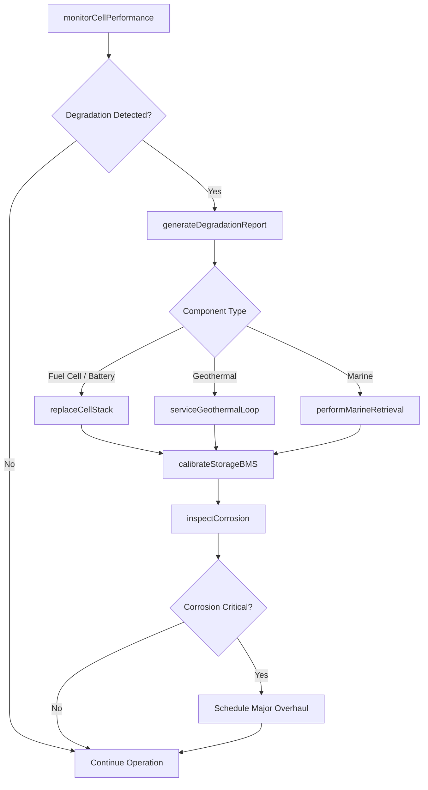
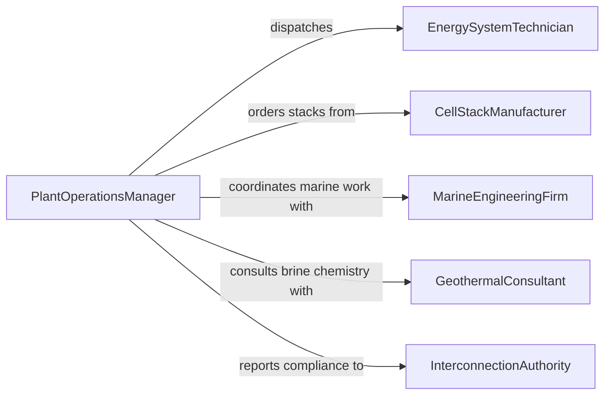

# Maintain Sustainable Energy Production Equipment

> Business-as-Code definition for sustainable energy production equipment maintenance. Models the servicing, performance monitoring, and repair of geothermal heat exchangers, tidal generators, hydrogen fuel cells, and energy storage systems used in sustainable power generation.

## Overview

Sustainable energy production equipment maintenance covers the upkeep of next-generation and emerging renewable systems including geothermal loops, tidal and wave energy converters, hydrogen electrolyzers and fuel cells, and battery energy storage systems (BESS). This definition exposes actions for monitoring thermal and electrochemical performance, scheduling corrosion inspections, managing cell stack replacements, and ensuring compliance with interconnection and environmental standards.

## Actors

| Actor | Description |
|-------|-------------|
| CellStackManufacturer | Supplies fuel cell stacks, membranes, and electrolyzer modules |
| BatterySystemVendor | Provides energy storage modules, BMS firmware, and thermal management units |
| GeothermalConsultant | Advises on ground loop performance, brine chemistry, and well maintenance |
| MarineEngineeringFirm | Services tidal and wave energy converters in offshore environments |
| InterconnectionAuthority | Regulates grid-tie standards, metering, and power quality requirements |

## Roles

| Role | Description |
|------|-------------|
| EnergySystemTechnician | Performs hands-on maintenance on sustainable energy generation equipment |
| PerformanceAnalyst | Monitors degradation curves, capacity fade, and efficiency trends |
| PlantOperationsManager | Coordinates maintenance windows and production optimization |
| EnvironmentalSpecialist | Manages fluid handling, emissions monitoring, and habitat compliance |

## Entities

| Entity | Description |
|--------|-------------|
| FuelCellStack | A hydrogen fuel cell assembly with membranes and catalyst layers |
| BatteryModule | A lithium-ion, flow, or solid-state energy storage unit |
| GeothermalLoop | A ground-source heat exchange system circulating brine or refrigerant |
| TidalConverter | A marine energy device harnessing tidal or wave motion |
| DegradationReport | Analysis of capacity fade, efficiency loss, or corrosion progression |
| MaintenanceWindow | A scheduled period of reduced or halted generation for service |

## Actions

| Action | Description |
|--------|-------------|
| monitorCellPerformance | Track voltage, current, and temperature across fuel cell or battery stacks |
| inspectCorrosion | Assess pipework, heat exchangers, and marine structures for corrosion |
| replaceCellStack | Swap degraded fuel cell membranes or battery modules |
| serviceGeothermalLoop | Flush, test, and recharge ground-source heat exchange circuits |
| performMarineRetrieval | Recover tidal or wave devices from water for onshore maintenance |
| calibrateStorageBMS | Verify and adjust battery management system parameters |
| generateDegradationReport | Compile performance decline data into an actionable analysis |

## Events

| Event | Description |
|-------|-------------|
| cellPerformanceMonitored | Fuel cell or battery stack metrics have been collected |
| corrosionInspected | Corrosion assessment has been completed on system components |
| cellStackReplaced | A fuel cell or battery module has been swapped out |
| geothermalLoopServiced | Ground-source loop has been flushed and recharged |
| marineRetrievalPerformed | A tidal or wave device has been recovered for service |
| storageBMSCalibrated | Battery management system parameters have been verified |
| degradationReportGenerated | A performance decline analysis has been compiled |

## Searches

| Search | Description |
|--------|-------------|
| findSystemsByEfficiency | List energy systems filtered by current efficiency versus rated capacity |
| getCorrosionHistory | Retrieve corrosion inspection records for a specific asset |
| getCellStackLifecycle | Query replacement history and remaining useful life for cell stacks |
| findAssetsRequiringRetrieval | Locate marine devices due for onshore maintenance cycles |

## Workflow



## Actor Relationships



## Usage

### Calling Actions

```typescript
import { maintainSustainableEnergyProductionEquipment } from '@headlessly/maintain-sustainable-energy-production-equipment'

const sustainable = maintainSustainableEnergyProductionEquipment()

// Monitor fuel cell stack performance
const metrics = await sustainable.monitorCellPerformance({
  assetId: 'fc-stack-012',
  measurements: {
    voltage: 0.72,
    currentDensity: 1.2,
    temperatureC: 65,
    hydrogenFlowRate: 4.5
  }
})

// Replace degraded battery module
await sustainable.replaceCellStack({
  assetId: 'bess-module-07B',
  reason: 'capacity-fade-below-80-percent',
  replacementPartId: 'lto-mod-2026-batch3',
  technicianId: 'tech-kowalski'
})

// Service geothermal loop
await sustainable.serviceGeothermalLoop({
  loopId: 'geo-loop-north-campus',
  tasks: ['brine-flush', 'pressure-test', 'glycol-recharge'],
  brineTemperatureC: 12.5
})
```

### Event-Driven Automation

```typescript
// Alert on rapid degradation
sustainable.cellPerformanceMonitored(async ({ assetId, voltage, ratedVoltage }) => {
  const efficiency = voltage / ratedVoltage
  if (efficiency < 0.75) {
    await notify({
      to: 'performance-analyst',
      message: `${assetId} operating at ${(efficiency * 100).toFixed(1)}% efficiency. Stack replacement evaluation needed.`
    })
  }
})

// Auto-schedule corrosion inspection after marine retrieval
sustainable.marineRetrievalPerformed(async ({ assetId, retrievalDate }) => {
  await sustainable.inspectCorrosion({
    assetId,
    inspectionType: 'post-retrieval',
    scheduledDate: addDays(retrievalDate, 3),
    focus: ['hull-coating', 'bearing-seals', 'electrical-connectors']
  })
})
```
