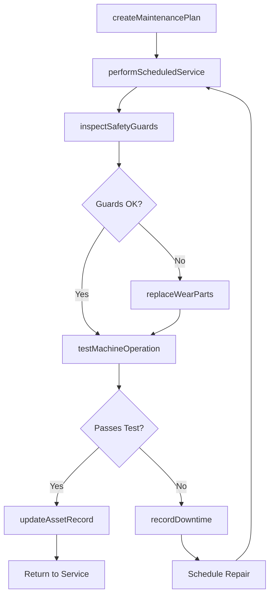
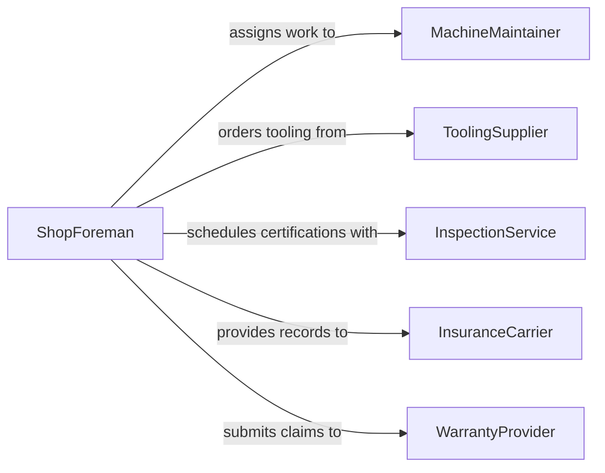

# Maintain Work Equipment Machinery

> Business-as-Code definition for work equipment and machinery maintenance. Models the scheduling, execution, and documentation of preventive and corrective maintenance across general-purpose industrial machines, power tools, and workshop equipment.

## Overview

Work equipment and machinery maintenance covers the broad category of keeping operational tools, machines, and mechanical systems in safe and functional condition. This definition exposes actions for creating maintenance plans, performing scheduled servicing, recording equipment condition, managing downtime, and verifying post-service operability for equipment ranging from lathes and milling machines to forklifts and compressors.

## Actors

| Actor | Description |
|-------|-------------|
| MachineryDealer | Sells equipment and provides factory-authorized service |
| ToolingSupplier | Provides cutting tools, abrasives, and wear consumables |
| InspectionService | Performs third-party safety certifications and load testing |
| InsuranceCarrier | Requires equipment maintenance records for coverage eligibility |
| WarrantyProvider | Manages warranty claims on equipment within coverage period |

## Roles

| Role | Description |
|------|-------------|
| MachineMaintainer | Performs scheduled and unscheduled repairs on work equipment |
| ShopForeman | Prioritizes maintenance work and coordinates production schedules |
| SafetyInspector | Conducts internal safety audits on machinery and guards |
| AssetManager | Tracks equipment lifecycle, depreciation, and replacement planning |

## Entities

| Entity | Description |
|--------|-------------|
| Machine | A lathe, mill, press, compressor, or other industrial work machine |
| MaintenancePlan | A documented schedule of recurring service tasks for an asset |
| DowntimeRecord | A log of equipment unavailability including cause and duration |
| ToolInventory | Stock of cutting tools, bits, blades, and consumable wear items |
| SafetyGuard | Protective cover, interlock, or barrier on a machine |
| ServiceReport | Documentation of maintenance performed, parts used, and test results |

## Actions

| Action | Description |
|--------|-------------|
| createMaintenancePlan | Define recurring service tasks and intervals for a machine |
| performScheduledService | Execute planned maintenance per the maintenance plan |
| recordDowntime | Log equipment unavailability with cause and estimated repair time |
| inspectSafetyGuards | Verify that all protective devices are intact and functional |
| replaceWearParts | Swap belts, bearings, blades, or other consumable components |
| testMachineOperation | Run operational checks after service to confirm functionality |
| updateAssetRecord | Record service history, condition changes, or valuation adjustments |

## Events

| Event | Description |
|-------|-------------|
| maintenancePlanCreated | A new maintenance schedule has been defined for equipment |
| scheduledServicePerformed | Planned maintenance tasks have been completed |
| downtimeRecorded | Equipment unavailability has been logged |
| safetyGuardsInspected | Protective devices have been checked and documented |
| wearPartsReplaced | Consumable components have been swapped out |
| machineOperationTested | Post-service operational checks have been completed |
| assetRecordUpdated | Equipment records have been updated with new service data |

## Searches

| Search | Description |
|--------|-------------|
| findMachinesByMaintenanceStatus | List equipment due for or overdue on scheduled service |
| getDowntimeHistory | Retrieve unavailability records for a machine over a period |
| getServiceReports | Query completed maintenance reports by machine or technician |
| findMachinesRequiringParts | Locate equipment with pending part replacement needs |

## Workflow



## Actor Relationships



## Usage

### Calling Actions

```typescript
import { maintainWorkEquipmentMachinery } from '@headlessly/maintain-work-equipment-machinery'

const machinery = maintainWorkEquipmentMachinery()

// Create a maintenance plan for a CNC lathe
const plan = await machinery.createMaintenancePlan({
  machineId: 'cnc-lathe-04',
  tasks: [
    { name: 'spindle-bearing-check', intervalDays: 90 },
    { name: 'way-lubrication', intervalDays: 30 },
    { name: 'coolant-change', intervalDays: 180 }
  ]
})

// Perform scheduled service
await machinery.performScheduledService({
  machineId: 'cnc-lathe-04',
  planId: plan.id,
  tasksCompleted: ['spindle-bearing-check', 'way-lubrication'],
  technicianId: 'maint-thompson'
})

// Test machine after service
const test = await machinery.testMachineOperation({
  machineId: 'cnc-lathe-04',
  checks: ['spindle-runout', 'axis-positioning', 'coolant-flow']
})
```

### Event-Driven Automation

```typescript
// Alert when unplanned downtime exceeds threshold
machinery.downtimeRecorded(async ({ machineId, cause, estimatedHours }) => {
  if (estimatedHours > 8) {
    await notify({
      to: 'shop-foreman',
      message: `${machineId} down for ${estimatedHours}h due to ${cause}. Production impact assessment needed.`
    })
  }
})

// Auto-update asset records after service completion
machinery.scheduledServicePerformed(async ({ machineId, tasksCompleted, serviceDate }) => {
  await machinery.updateAssetRecord({
    machineId,
    lastServiceDate: serviceDate,
    tasksCompleted,
    nextServiceDate: addDays(serviceDate, 90)
  })
})
```
