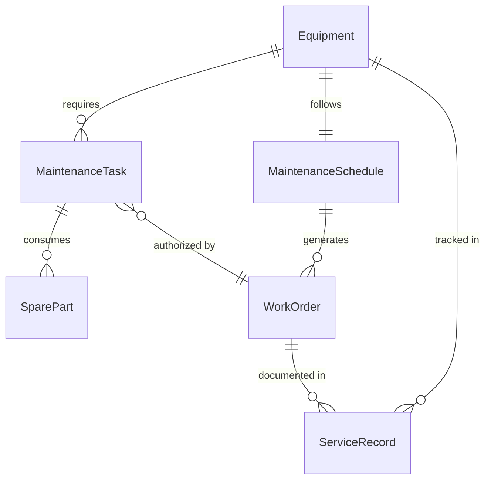
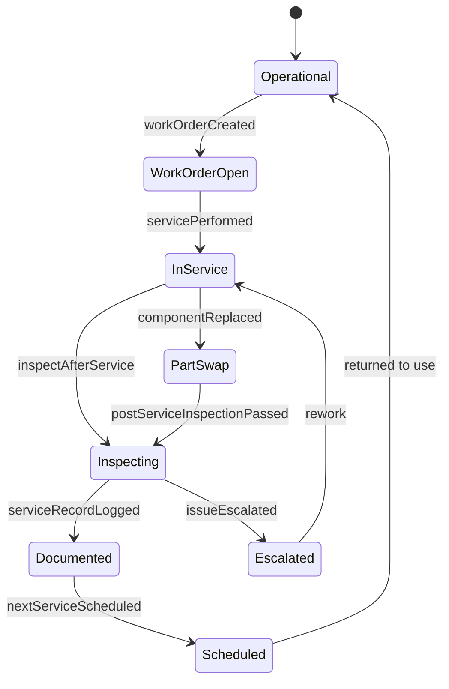
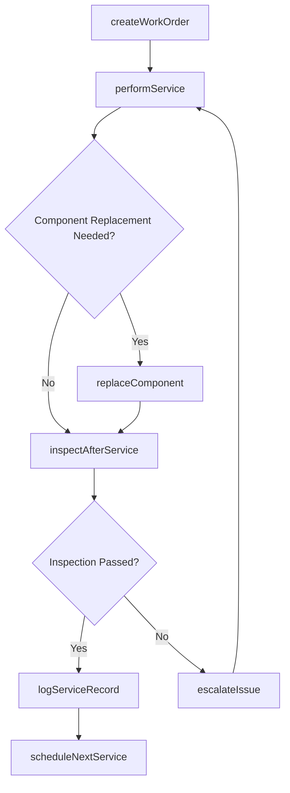
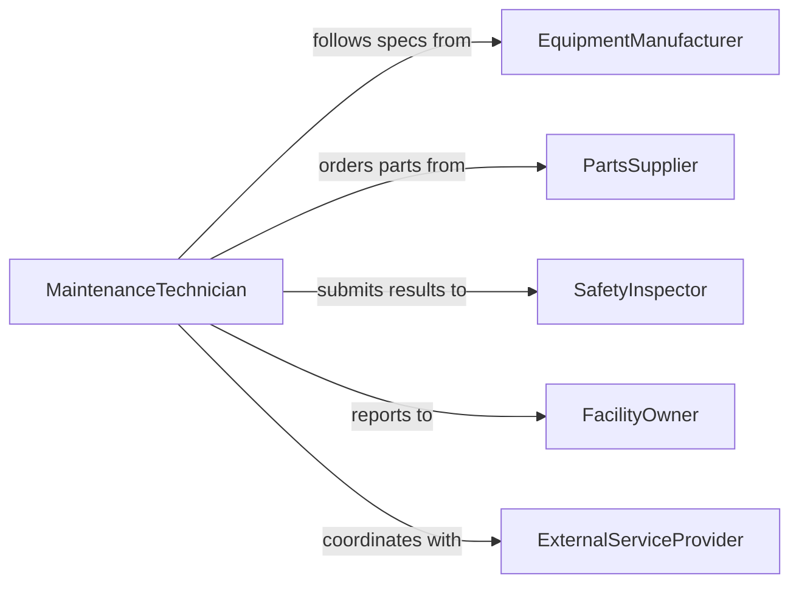

# Perform Manual Service Maintenance Tasks

> Business-as-Code definition for performing manual service and maintenance tasks on tools, equipment, and machinery to ensure continued operational readiness.

## Overview

Manual service and maintenance tasks encompass hands-on activities such as cleaning, lubricating, adjusting, and replacing worn components on equipment and tools. This definition exposes actions for scheduling and executing routine maintenance procedures, events for tracking task completion and issue discovery, and searches for retrieving maintenance history and upcoming service needs.

## Actors

| Actor | Description |
|-------|-------------|
| EquipmentManufacturer | Provides maintenance specifications, manuals, and recommended service intervals |
| PartsSupplier | Supplies replacement components, lubricants, and consumables |
| SafetyInspector | Verifies that maintained equipment meets safety and regulatory standards |
| FacilityOwner | Owns the equipment and authorizes maintenance expenditures |
| ExternalServiceProvider | Performs specialized maintenance tasks beyond in-house capabilities |

## Roles

| Role | Description |
|------|-------------|
| MaintenanceTechnician | Executes hands-on service and maintenance procedures |
| MaintenanceSupervisor | Schedules, assigns, and oversees maintenance activities |
| QualityInspector | Verifies completed maintenance meets required standards |
| InventoryCoordinator | Manages spare parts and consumable stock levels |

## Entities

| Entity | Description |
|--------|-------------|
| MaintenanceTask | A specific service or maintenance activity to be performed |
| Equipment | The tool, machine, or asset requiring maintenance |
| ServiceRecord | A documented history of maintenance performed on an asset |
| WorkOrder | A formal authorization to perform maintenance work |
| SparePart | A replacement component used during maintenance |
| MaintenanceSchedule | A calendar of planned service intervals for equipment |

## Actions

| Action | Description |
|--------|-------------|
| createWorkOrder | Initiate a new maintenance work order for a piece of equipment |
| performService | Execute a manual service task such as cleaning, lubricating, or adjusting |
| replaceComponent | Swap out a worn or damaged part with a replacement |
| logServiceRecord | Document the completed maintenance activity and findings |
| scheduleNextService | Set the next scheduled maintenance date based on service intervals |
| inspectAfterService | Verify equipment functionality following maintenance completion |
| escalateIssue | Flag an unexpected problem discovered during routine maintenance |

## Events

| Event | Description |
|-------|-------------|
| workOrderCreated | A new maintenance work order has been initiated |
| servicePerformed | A manual service task has been completed on equipment |
| componentReplaced | A worn part has been swapped with a new replacement |
| serviceRecordLogged | Maintenance documentation has been recorded |
| nextServiceScheduled | The upcoming maintenance date has been set |
| postServiceInspectionPassed | Equipment passed quality checks after maintenance |
| issueEscalated | An unexpected problem was discovered and flagged for follow-up |

## Searches

| Search | Description |
|--------|-------------|
| findWorkOrders | List work orders by equipment, status, technician, or date range |
| getServiceHistory | Retrieve the full maintenance history for a specific asset |
| getUpcomingServices | Find equipment with maintenance due within a given timeframe |
| findOverdueServices | Locate assets that have exceeded their scheduled service interval |

## Entity Relationships



## State Diagram



## Workflow



## Actor Relationships



## Usage

### Calling Actions

```typescript
import { performManualServiceMaintenanceTasks } from '@headlessly/perform-manual-service-maintenance-tasks'

const maintenance = performManualServiceMaintenanceTasks()

// Create a work order for routine maintenance
const workOrder = await maintenance.createWorkOrder({
  equipmentId: 'PRESS-001',
  taskType: 'routine-lubrication',
  priority: 'standard',
  assignedTo: 'tech-martinez'
})

// Perform the service task
await maintenance.performService({
  workOrderId: workOrder.id,
  actions: ['clean-intake-filter', 'lubricate-bearings', 'adjust-belt-tension'],
  notes: 'Belt showing early signs of wear'
})

// Log the completed service
await maintenance.logServiceRecord({
  workOrderId: workOrder.id,
  completedAt: new Date().toISOString(),
  findings: 'Drive belt approaching replacement threshold'
})
```

### Event-Driven Automation

```typescript
// Alert when issues are escalated during routine maintenance
maintenance.issueEscalated(async ({ workOrderId, equipmentId, issue }) => {
  await notify({
    to: 'maintenance-supervisor',
    message: `Issue found on ${equipmentId}: ${issue.description}`
  })
})

// Auto-schedule next service after completion
maintenance.serviceRecordLogged(async ({ equipmentId, completedAt }) => {
  const interval = await getServiceInterval(equipmentId)
  await maintenance.scheduleNextService({
    equipmentId,
    dueDate: addDays(completedAt, interval.days)
  })
})
```
