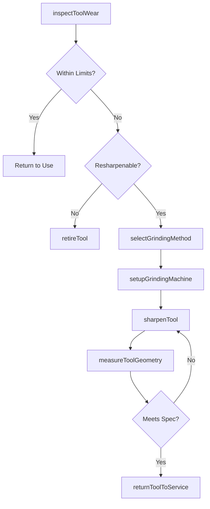
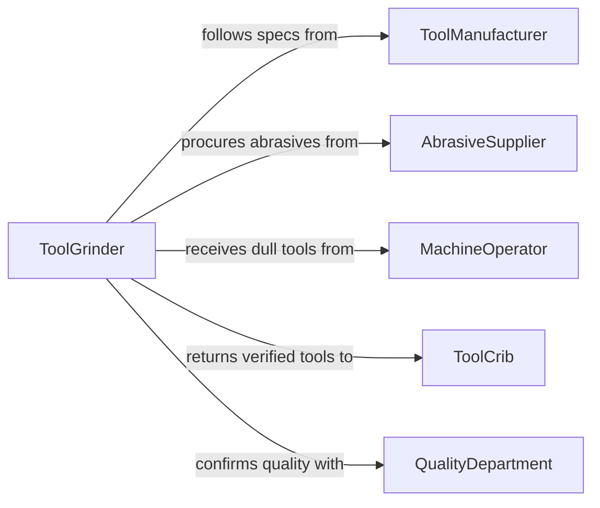

# Sharpen Cutting Grinding Tools

> Business-as-Code definition for sharpening cutting and grinding tools. Models the inspection, grinding, honing, and verification process for restoring tool edges and profiles to production-ready condition.

## Overview

Sharpening cutting and grinding tools involves inspecting tool condition, selecting the appropriate grinding or honing method, restoring edge geometry to specification, and verifying sharpness and dimensional accuracy. This definition exposes actions for the tool reconditioning workflow, events for tracking tool service cycles, and searches for querying tool inventories and sharpening schedules.

## Actors

| Actor | Description |
|-------|-------------|
| ToolManufacturer | Provides original specifications and resharpening guidelines |
| AbrasiveSupplier | Supplies grinding wheels, honing stones, and diamond dressers |
| MachineOperator | Uses cutting tools in production and reports dull conditions |
| QualityDepartment | Verifies that sharpened tools produce parts within tolerance |
| ToolCrib | Stores, issues, and tracks cutting tool inventory |

## Roles

| Role | Description |
|------|-------------|
| ToolGrinder | Operates grinding and honing equipment to sharpen tools |
| ToolRoomSupervisor | Manages the tool room schedule and workload |
| ProcessEngineer | Specifies tool geometry and sharpening parameters |
| InspectionTechnician | Measures sharpened tools against dimensional specifications |

## Entities

| Entity | Description |
|--------|-------------|
| CuttingTool | A drill bit, end mill, lathe insert, or saw blade |
| GrindingWheel | An abrasive wheel used to restore tool edges |
| ToolGeometry | The specified angles, radii, and clearances of a cutting edge |
| SharpeningRecord | A log of sharpening operations performed on a tool |
| WearMeasurement | A quantified assessment of tool edge degradation |
| GrindingSetup | Machine settings and fixture configuration for a sharpening job |

## Actions

| Action | Description |
|--------|-------------|
| inspectToolWear | Measure and classify the condition of a cutting tool edge |
| selectGrindingMethod | Choose the appropriate wheel, speed, and feed for the tool |
| setupGrindingMachine | Configure fixtures, angles, and offsets for the tool type |
| sharpenTool | Execute the grinding or honing operation to restore the edge |
| measureToolGeometry | Verify sharpened dimensions against original specifications |
| returnToolToService | Release the sharpened tool back to inventory or production |
| retireTool | Remove a tool that can no longer be effectively sharpened |

## Events

| Event | Description |
|-------|-------------|
| toolWearInspected | Tool edge condition has been measured and classified |
| grindingMethodSelected | The sharpening approach has been determined |
| grindingMachineSetup | The grinding machine has been configured for the job |
| toolSharpened | The cutting edge has been restored by grinding or honing |
| toolGeometryMeasured | Post-sharpening dimensions have been verified |
| toolReturnedToService | A sharpened tool has been released for production use |
| toolRetired | A tool has been permanently removed from service |

## Searches

| Search | Description |
|--------|-------------|
| findTools | List cutting tools by type, wear status, or location |
| getSharpeningRecords | Retrieve sharpening history for a tool or time period |
| getWearMeasurements | Query tool wear data by tool type or machine |
| findDueForSharpening | List tools approaching or exceeding wear limits |

## Workflow



## Actor Relationships



## Usage

### Calling Actions

```typescript
import { sharpenCuttingGrindingTools } from '@headlessly/sharpen-cutting-grinding-tools'

const tools = sharpenCuttingGrindingTools()

// Inspect a batch of end mills from production
const inspection = await tools.inspectToolWear({
  toolIds: ['em-12mm-001', 'em-12mm-002', 'em-12mm-003'],
  measurements: ['flankWear', 'craterDepth', 'edgeRadius']
})

// Sharpen a worn end mill
await tools.selectGrindingMethod({
  toolId: 'em-12mm-001',
  toolType: '4-flute-end-mill',
  material: 'solid-carbide',
  method: 'diamond-wheel-5-axis'
})

await tools.setupGrindingMachine({
  machineId: 'grinder-5axis-01',
  toolId: 'em-12mm-001',
  reliefAngle: 12,
  helixAngle: 30,
  wheelGrit: 400
})

await tools.sharpenTool({
  machineId: 'grinder-5axis-01',
  toolId: 'em-12mm-001',
  passes: 3
})

// Verify and return to service
const geometry = await tools.measureToolGeometry({
  toolId: 'em-12mm-001',
  dimensions: ['diameter', 'reliefAngle', 'helixAngle', 'runout']
})
```

### Event-Driven Automation

```typescript
// Auto-retire tools that fail geometry check after sharpening
tools.toolGeometryMeasured(async ({ toolId, withinSpec }) => {
  if (!withinSpec) {
    await tools.retireTool({ toolId, reason: 'out-of-spec-after-sharpening' })
  }
})

// Track sharpening cycles for cost analysis
tools.toolSharpened(async ({ toolId, toolType }) => {
  const records = await tools.getSharpeningRecords({ toolId })
  if (records.length >= 10) {
    await notify({
      to: 'tooling-engineering',
      message: `Tool ${toolId} (${toolType}) has been sharpened ${records.length} times. Review for replacement.`
    })
  }
})
```
