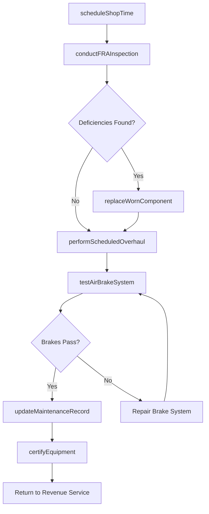
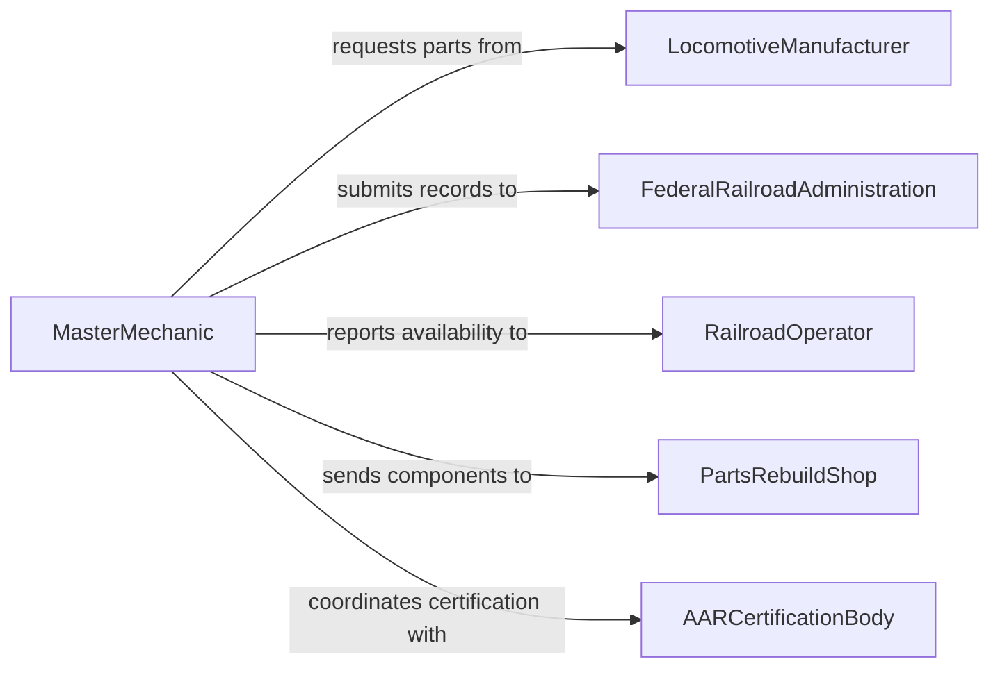

# Maintain Locomotives Rail Equipment Good

> Business-as-Code definition for maintaining locomotives and rail equipment in good working condition to ensure safe, reliable rail operations and compliance with federal railroad safety standards.

## Overview

Maintaining locomotives and rail equipment involves servicing diesel-electric and electric locomotives, freight cars, passenger coaches, and specialized rail vehicles such as maintenance-of-way equipment. This includes engine overhauls, traction motor maintenance, air brake system testing, coupler inspections, and compliance with FRA (Federal Railroad Administration) safety regulations. This definition exposes actions for managing maintenance programs across rail yards and shops, tracking equipment condition by mileage and operating hours, and coordinating with regulatory agencies on inspection and certification requirements.

## Actors

| Actor | Description |
|-------|-------------|
| LocomotiveManufacturer | Provides technical bulletins, OEM parts, and warranty support for locomotives |
| FederalRailroadAdministration | Enforces safety regulations, inspection requirements, and maintenance standards for rail equipment |
| RailroadOperator | Operates the rail network and depends on equipment availability and reliability |
| PartsRebuildShop | Reconditions and rebuilds major components such as traction motors and turbochargers |
| AARCertificationBody | Certifies freight cars and components meet Association of American Railroads standards |

## Roles

| Role | Description |
|------|-------------|
| LocomotiveMechanic | Performs hands-on maintenance, repair, and overhaul of locomotive systems |
| MasterMechanic | Oversees the locomotive maintenance program and shop operations |
| AirBrakeTechnician | Specializes in testing, repairing, and certifying air brake systems |
| InspectionForeman | Manages FRA-mandated inspections and ensures documentation compliance |
| MaterialsCoordinator | Sources and manages inventory of locomotive parts and consumables |

## Entities

| Entity | Description |
|--------|-------------|
| Locomotive | A diesel-electric, electric, or hybrid rail traction unit |
| RailCar | A freight car, passenger coach, or specialized rail vehicle |
| MaintenancePlan | A schedule of periodic inspections and service intervals per FRA requirements |
| InspectionRecord | Documentation of FRA-mandated inspections including findings and corrective actions |
| TractionMotor | An electric motor that drives locomotive wheel sets |
| AirBrakeSystem | The pneumatic braking system including compressors, reservoirs, and valves |

## Actions

| Action | Description |
|--------|-------------|
| conductFRAInspection | Perform a federally mandated inspection on a locomotive or rail car |
| performScheduledOverhaul | Execute a major service event including engine, traction motor, or brake system work |
| testAirBrakeSystem | Verify air brake performance meets FRA operating requirements |
| replaceWornComponent | Swap out degraded parts such as brake shoes, bearings, or traction motor brushes |
| updateMaintenanceRecord | Document inspection results, work performed, and parts consumed |
| certifyEquipment | Complete documentation required to return equipment to revenue service |
| scheduleShopTime | Reserve a maintenance bay and plan the scope of work for a locomotive or car |

## Events

| Event | Description |
|-------|-------------|
| fraInspectionConducted | A federally mandated inspection has been completed |
| scheduledOverhaulPerformed | A major maintenance event has been executed |
| airBrakeSystemTested | Brake performance testing has been completed and documented |
| wornComponentReplaced | A degraded part has been swapped out |
| maintenanceRecordUpdated | Inspection and service documentation has been recorded |
| equipmentCertified | A locomotive or rail car has been cleared for revenue service |
| shopTimeScheduled | A maintenance bay and work scope have been reserved |

## Searches

| Search | Description |
|--------|-------------|
| findEquipmentByStatus | List locomotives and rail cars filtered by maintenance status, location, or service due date |
| getInspectionHistory | Retrieve the FRA inspection record for a specific locomotive or car |
| findOverdueInspections | Locate equipment that has exceeded its mandated inspection interval |
| getOverhaulSchedule | Retrieve upcoming major maintenance events for the fleet |
| findComponentsByCondition | Locate traction motors, brakes, or other components due for replacement |

## Workflow



## Actor Relationships



## Usage

### Calling Actions

```typescript
import { maintainLocomotivesRailEquipmentGood } from '@headlessly/maintain-locomotives-rail-equipment-good'

const rail = maintainLocomotivesRailEquipmentGood()

// Schedule shop time for a locomotive
const shopSlot = await rail.scheduleShopTime({
  equipmentId: 'LOCO-SD70ACE-4127',
  shopId: 'SHOP-EAST-YARD',
  scope: ['annual-inspection', 'traction-motor-service', 'air-brake-certification'],
  scheduledDate: '2026-03-01'
})

// Conduct FRA-mandated inspection
const inspection = await rail.conductFRAInspection({
  equipmentId: 'LOCO-SD70ACE-4127',
  inspectionType: 'annual',
  inspector: 'foreman-kowalski'
})

// Test the air brake system
const brakeTest = await rail.testAirBrakeSystem({
  equipmentId: 'LOCO-SD70ACE-4127',
  testType: 'class-1A-brake-test',
  pressure: { mainReservoir: 140, brakePipe: 90 }
})
```

### Event-Driven Automation

```typescript
// Flag equipment when FRA inspections are overdue
rail.fraInspectionConducted(async ({ equipmentId, nextDueDate }) => {
  await scheduleReminder({
    date: subtractDays(nextDueDate, 30),
    to: 'inspection-foreman',
    message: `FRA inspection due in 30 days for ${equipmentId}`
  })
})

// Auto-notify railroad operator when equipment is certified for service
rail.equipmentCertified(async ({ equipmentId, certificationDate }) => {
  await notify({
    to: 'railroad-dispatch',
    message: `${equipmentId} certified and available for revenue service as of ${certificationDate}`
  })
})
```
