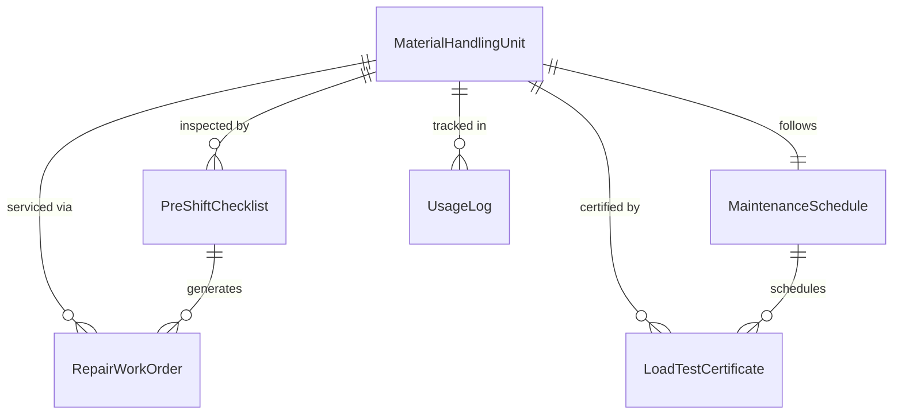
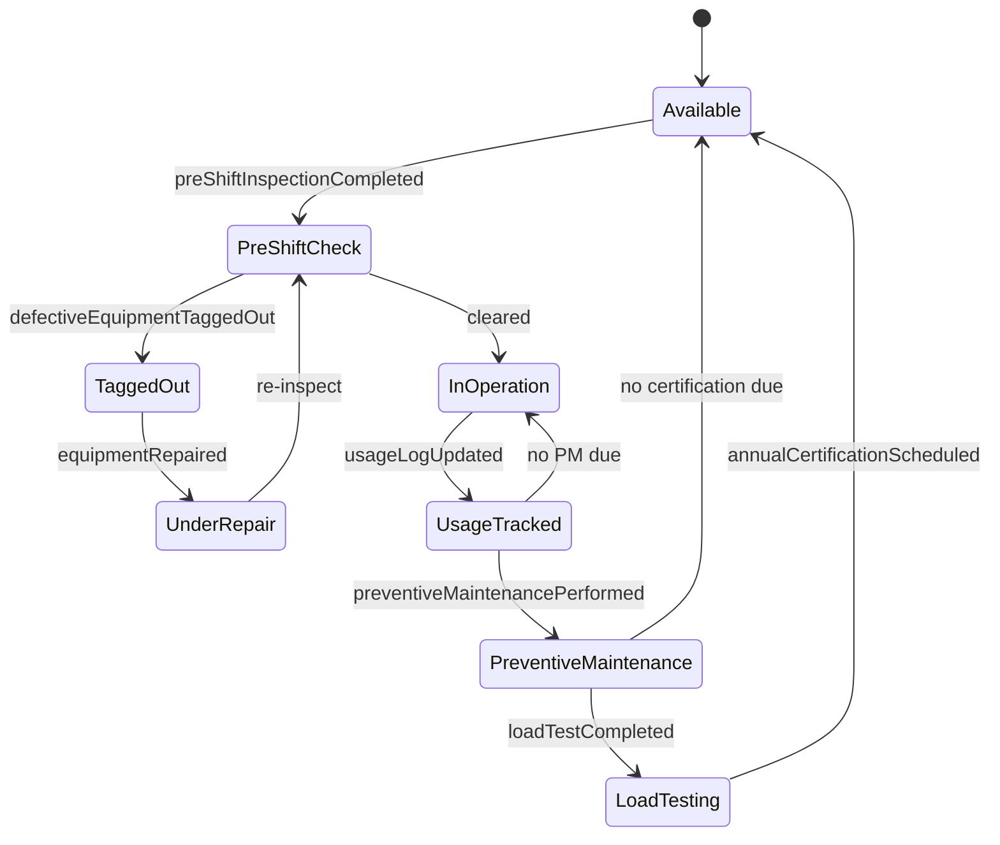
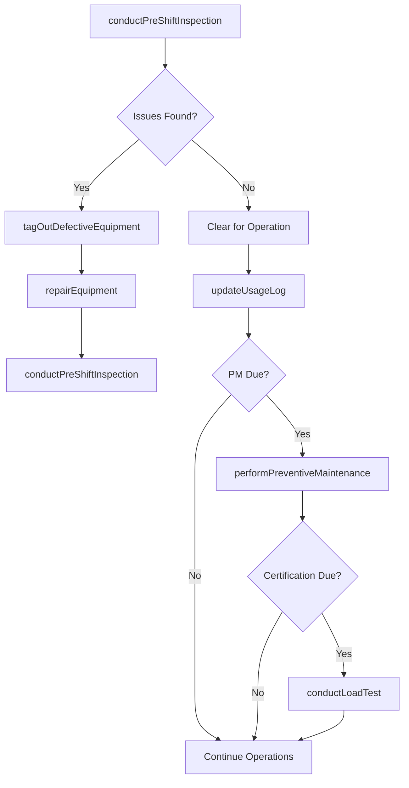
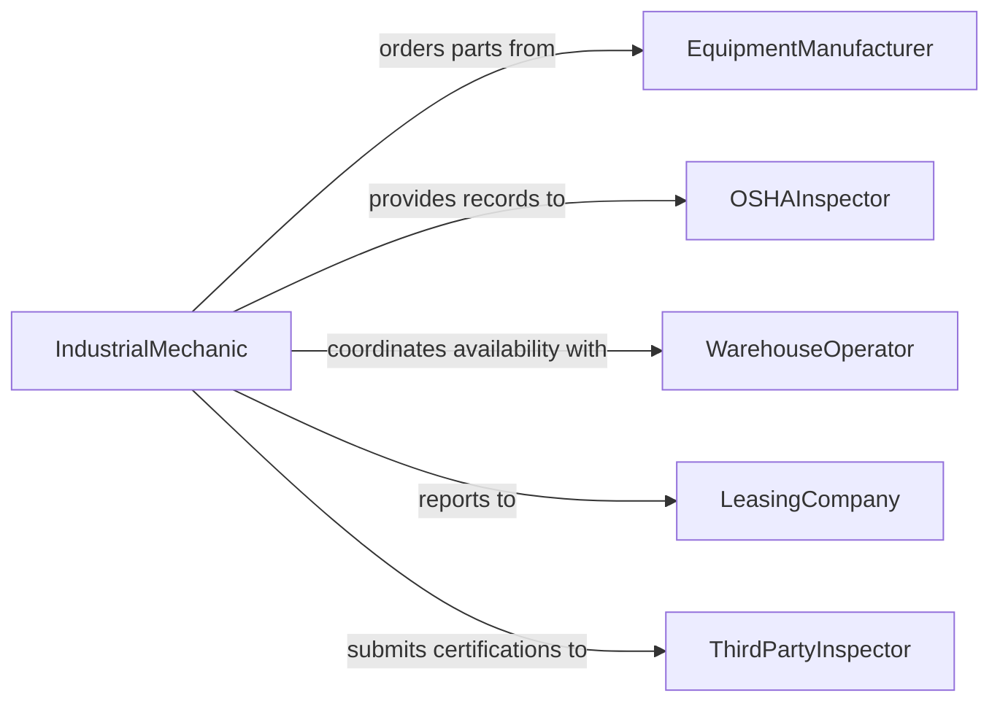

# Maintain Material Moving Equipment Good

> Business-as-Code definition for maintaining material moving equipment such as forklifts, conveyors, cranes, and hoists in good working condition to ensure warehouse and industrial safety.

## Overview

Maintaining material moving equipment involves servicing forklifts, pallet jacks, conveyor systems, overhead cranes, hoists, and other powered industrial equipment used in warehouses, distribution centers, and manufacturing facilities. This definition exposes actions for managing preventive maintenance programs governed by OSHA and ANSI standards, tracking equipment condition and usage cycles, coordinating pre-shift inspections required by OSHA regulations, and managing repair workflows to minimize operational downtime.

## Actors

| Actor | Description |
|-------|-------------|
| EquipmentManufacturer | Provides OEM parts, technical manuals, and warranty support for material handling equipment |
| OSHAInspector | Enforces workplace safety standards for powered industrial equipment |
| WarehouseOperator | Uses material moving equipment daily and depends on availability and safety |
| LeasingCompany | Provides leased forklifts and equipment under maintenance agreements |
| InsuranceUnderwriter | Requires maintenance compliance documentation as a condition of coverage |
| ThirdPartyInspector | Conducts annual load testing and structural certification on cranes and hoists |

## Roles

| Role | Description |
|------|-------------|
| IndustrialMechanic | Performs hands-on maintenance, repair, and overhaul of material handling equipment |
| MaintenancePlanner | Schedules preventive maintenance and coordinates parts availability |
| WarehouseSupervisor | Conducts daily pre-shift inspections and reports equipment issues |
| SafetyManager | Oversees OSHA compliance, operator training records, and equipment certification |

## Entities

| Entity | Description |
|--------|-------------|
| MaterialHandlingUnit | A forklift, conveyor, crane, hoist, or pallet jack |
| PreShiftChecklist | The daily inspection form operators must complete before using equipment |
| MaintenanceSchedule | Interval-based service plan covering all material handling assets |
| LoadTestCertificate | Documentation proving a crane or hoist meets rated capacity requirements |
| RepairWorkOrder | A formal authorization to perform corrective maintenance on equipment |
| UsageLog | Hours of operation and load cycles recorded for an asset |

## Actions

| Action | Description |
|--------|-------------|
| conductPreShiftInspection | Perform the OSHA-required daily equipment check before use |
| performPreventiveMaintenance | Execute scheduled service including lubrication, hydraulic checks, and brake adjustments |
| repairEquipment | Diagnose and fix equipment malfunctions or component failures |
| conductLoadTest | Verify crane or hoist rated capacity meets certification requirements |
| updateUsageLog | Record operating hours, load cycles, and condition observations |
| tagOutDefectiveEquipment | Lock out and tag equipment unfit for use pending repair |
| scheduleAnnualCertification | Plan the annual structural and load-bearing certification for cranes and hoists |

## Events

| Event | Description |
|-------|-------------|
| preShiftInspectionCompleted | The daily pre-use equipment check has been finished |
| preventiveMaintenancePerformed | Scheduled service tasks have been completed |
| equipmentRepaired | A corrective repair has been finished and the asset restored |
| loadTestCompleted | A crane or hoist has been tested and results documented |
| usageLogUpdated | Operating hours and condition data have been recorded |
| defectiveEquipmentTaggedOut | Unsafe equipment has been locked out and tagged for repair |
| annualCertificationScheduled | A crane or hoist certification event has been planned |

## Searches

| Search | Description |
|--------|-------------|
| findEquipmentByStatus | List material handling assets filtered by operational status, location, or maintenance state |
| getMaintenanceHistory | Retrieve the complete service record for a specific piece of equipment |
| findOverdueInspections | Locate equipment that has exceeded its daily, monthly, or annual inspection interval |
| getTaggedOutEquipment | Find all assets currently locked out and unavailable for use |
| getCertificationStatus | Check load test certification status and expiration dates for cranes and hoists |

## Entity Relationships



## State Diagram



## Workflow



## Actor Relationships



## Usage

### Calling Actions

```typescript
import { maintainMaterialMovingEquipmentGood } from '@headlessly/maintain-material-moving-equipment-good'

const materialEquip = maintainMaterialMovingEquipmentGood()

// Conduct pre-shift inspection on a forklift
const inspection = await materialEquip.conductPreShiftInspection({
  equipmentId: 'FORKLIFT-CROWN-RC5535',
  operator: 'operator-diaz',
  checklist: ['hydraulic-leaks', 'tire-condition', 'brake-function', 'horn', 'lights', 'seatbelt']
})

// Tag out defective equipment
if (!inspection.passed) {
  await materialEquip.tagOutDefectiveEquipment({
    equipmentId: 'FORKLIFT-CROWN-RC5535',
    deficiencies: inspection.failedItems,
    taggedBy: 'supervisor-kim'
  })
}

// Conduct annual load test on an overhead crane
await materialEquip.conductLoadTest({
  equipmentId: 'CRANE-OVERHEAD-BAY4',
  ratedCapacity: 10000,
  testLoad: 12500,
  inspector: 'third-party-inspector-reed'
})
```

### Event-Driven Automation

```typescript
// Auto-create repair order when equipment is tagged out
materialEquip.defectiveEquipmentTaggedOut(async ({ equipmentId, deficiencies }) => {
  await materialEquip.repairEquipment({
    equipmentId,
    issues: deficiencies,
    priority: 'high'
  })
})

// Notify safety manager when certifications approach expiration
materialEquip.loadTestCompleted(async ({ equipmentId, expiresAt }) => {
  await scheduleReminder({
    date: subtractDays(expiresAt, 60),
    to: 'safety-manager',
    message: `Annual certification renewal due in 60 days for ${equipmentId}`
  })
})
```
