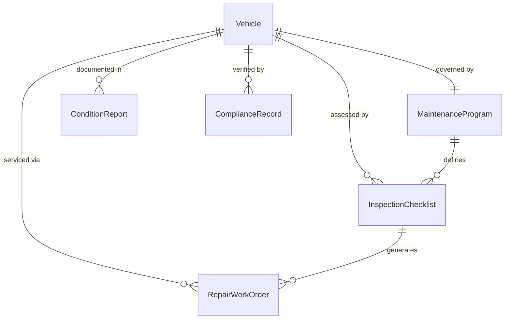
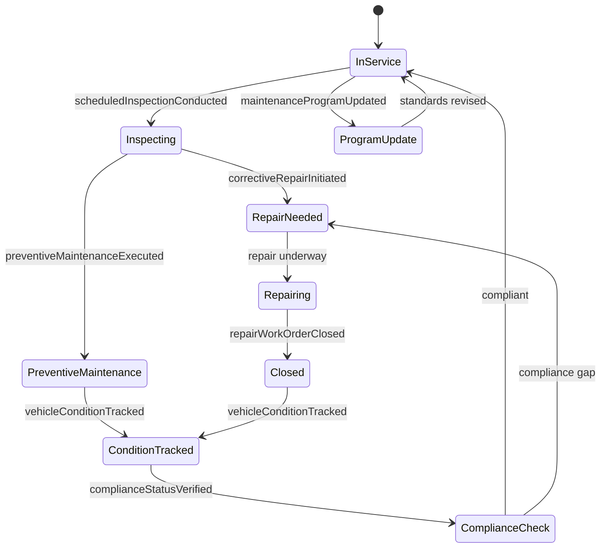
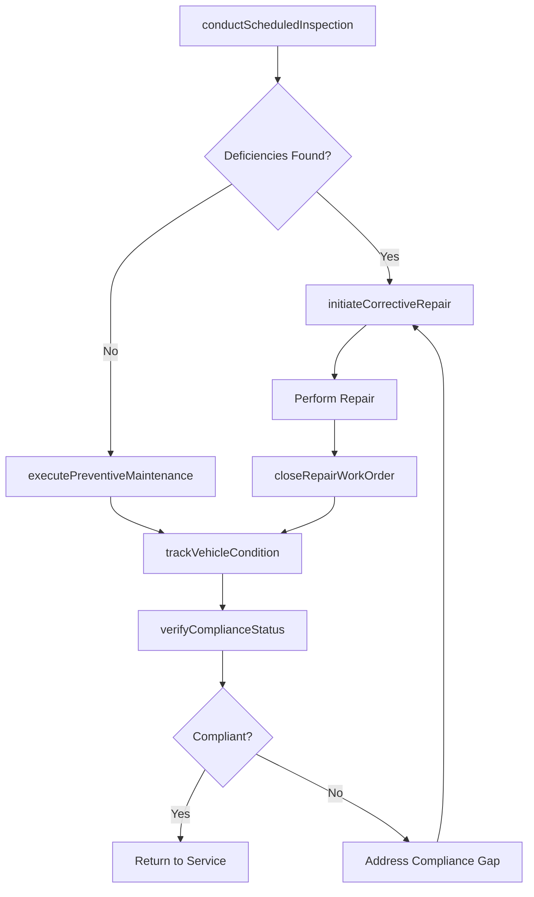
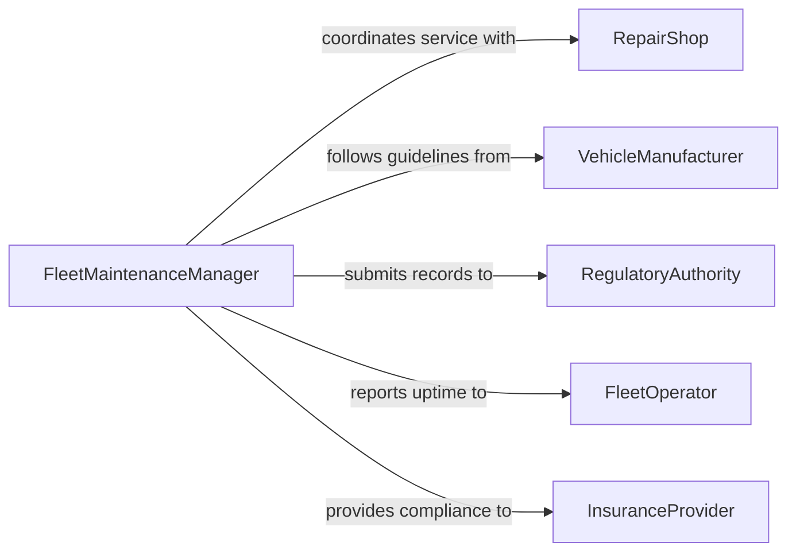

# Maintain Vehicles Good Working Condition

> Business-as-Code definition for maintaining vehicles in good working condition through systematic inspection, preventive maintenance, and corrective repair programs.

## Overview

Maintaining vehicles in good working condition involves implementing and managing comprehensive maintenance programs that combine scheduled preventive maintenance, condition-based monitoring, and timely corrective repairs across individual vehicles or entire fleets. This definition exposes actions for establishing maintenance standards, tracking vehicle condition metrics, managing repair workflows, and ensuring compliance with safety and emissions regulations.

## Actors

| Actor | Description |
|-------|-------------|
| FleetOperator | Operates a fleet of vehicles and depends on uptime and reliability |
| VehicleManufacturer | Defines maintenance schedules, recalls, and technical service bulletins |
| RegulatoryAuthority | Enforces vehicle safety inspections, emissions testing, and registration requirements |
| RepairShop | Provides mechanical repair and maintenance services |
| InsuranceProvider | Requires maintenance compliance as a condition of coverage |
| FuelAndLubricantSupplier | Provides fuels, oils, and lubricants meeting manufacturer specifications |

## Roles

| Role | Description |
|------|-------------|
| FleetMaintenanceManager | Designs and oversees the maintenance program for all vehicles |
| VehicleTechnician | Performs inspections, maintenance, and repairs on individual vehicles |
| DispatchCoordinator | Schedules vehicle availability around maintenance windows |
| ComplianceAnalyst | Tracks inspection due dates, emissions compliance, and recall status |

## Entities

| Entity | Description |
|--------|-------------|
| Vehicle | An automobile, truck, van, or other motorized asset in the fleet |
| MaintenanceProgram | The overall policy defining service intervals, standards, and responsibilities |
| InspectionChecklist | A standardized list of items to evaluate during scheduled inspections |
| RepairWorkOrder | A documented authorization to perform corrective maintenance |
| ConditionReport | A snapshot of a vehicle's current mechanical and cosmetic status |
| ComplianceRecord | Documentation of safety inspections, emissions tests, and recall completion |

## Actions

| Action | Description |
|--------|-------------|
| conductScheduledInspection | Perform a systematic evaluation of vehicle condition per the maintenance program |
| executePreventiveMaintenance | Carry out time-based or mileage-based maintenance tasks |
| initiateCorrectiveRepair | Create a work order to address a deficiency found during inspection or operation |
| trackVehicleCondition | Record and monitor key metrics such as mileage, fluid levels, and wear indicators |
| verifyComplianceStatus | Confirm vehicles meet current safety, emissions, and registration requirements |
| updateMaintenanceProgram | Adjust service intervals or standards based on performance data and manufacturer updates |
| closeRepairWorkOrder | Document completion of corrective work and return the vehicle to service |

## Events

| Event | Description |
|-------|-------------|
| scheduledInspectionConducted | A vehicle has completed its periodic inspection |
| preventiveMaintenanceExecuted | Scheduled maintenance tasks have been performed |
| correctiveRepairInitiated | A work order has been created for a discovered deficiency |
| vehicleConditionTracked | Updated condition metrics have been recorded for a vehicle |
| complianceStatusVerified | A vehicle has been confirmed compliant with regulatory requirements |
| maintenanceProgramUpdated | Service intervals or standards have been revised |
| repairWorkOrderClosed | Corrective maintenance has been completed and documented |

## Searches

| Search | Description |
|--------|-------------|
| findVehiclesByCondition | List vehicles filtered by condition rating, mileage, or maintenance status |
| getMaintenanceSchedule | Retrieve upcoming scheduled maintenance for a vehicle or fleet segment |
| findOpenRepairOrders | Locate active corrective repair work orders by priority or vehicle |
| getComplianceReport | Generate a compliance status report for inspections, emissions, and recalls |
| getFleetHealthSummary | Retrieve aggregate condition metrics across the entire fleet |

## Entity Relationships



## State Diagram



## Workflow



## Actor Relationships



## Usage

### Calling Actions

```typescript
import { maintainVehiclesGoodWorkingCondition } from '@headlessly/maintain-vehicles-good-working-condition'

const fleet = maintainVehiclesGoodWorkingCondition()

// Conduct scheduled inspection on a delivery van
const inspection = await fleet.conductScheduledInspection({
  vehicleId: 'VAN-FLEET-093',
  checklist: 'standard-commercial-vehicle',
  inspector: 'tech-rodriguez',
  currentMileage: 67432
})

// Initiate repair for a discovered brake issue
const repairOrder = await fleet.initiateCorrectiveRepair({
  vehicleId: 'VAN-FLEET-093',
  deficiency: 'Rear brake pads below minimum thickness',
  priority: 'high',
  source: inspection.id
})

// Verify compliance after repairs
await fleet.verifyComplianceStatus({
  vehicleId: 'VAN-FLEET-093',
  checks: ['safety-inspection', 'emissions-test', 'recall-status']
})
```

### Event-Driven Automation

```typescript
// Auto-create repair orders for critical deficiencies
fleet.scheduledInspectionConducted(async ({ vehicleId, findings }) => {
  const critical = findings.filter(f => f.severity === 'critical')
  for (const deficiency of critical) {
    await fleet.initiateCorrectiveRepair({
      vehicleId,
      deficiency: deficiency.description,
      priority: 'urgent'
    })
  }
})

// Notify dispatch when vehicles return to service
fleet.repairWorkOrderClosed(async ({ vehicleId, workOrderId }) => {
  await notify({
    to: 'dispatch-coordinator',
    message: `${vehicleId} repair complete (WO: ${workOrderId}), vehicle available for assignment`
  })
})
```
