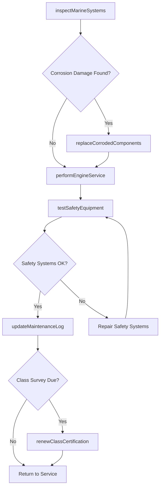
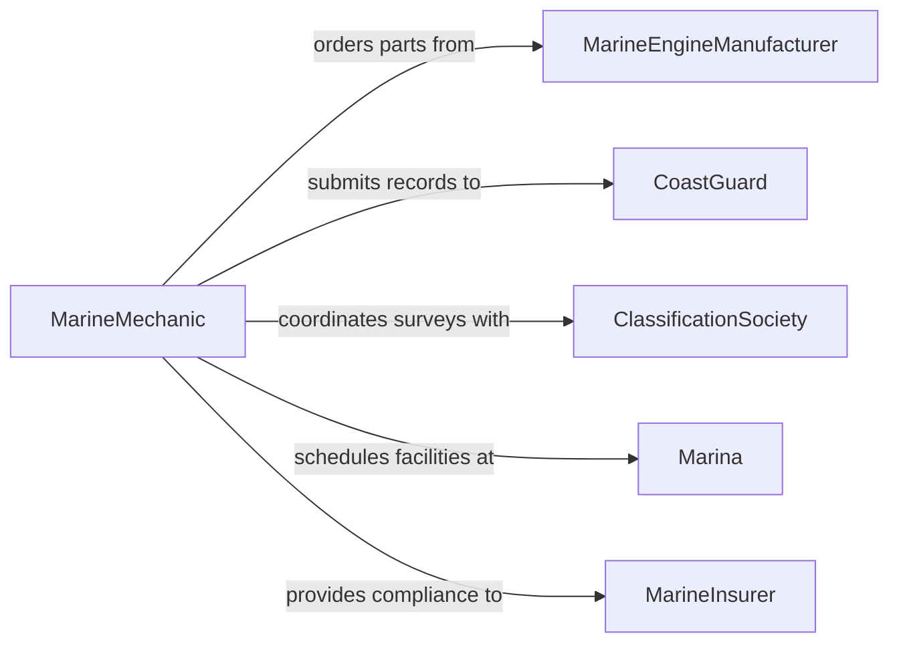

# Maintain Watercraft Engines Machinery

> Business-as-Code definition for maintaining watercraft engines and marine machinery to ensure seaworthiness, regulatory compliance, and reliable operation on the water.

## Overview

Maintaining watercraft engines and machinery involves servicing marine diesel and gasoline engines, outboard motors, inboard-outboard drives, hydraulic steering systems, bilge pumps, and onboard electrical systems. This definition exposes actions for managing maintenance programs that account for the corrosive marine environment, tracking compliance with Coast Guard and classification society requirements, and coordinating haul-out and dry-dock schedules for hull and below-waterline service.

## Actors

| Actor | Description |
|-------|-------------|
| MarineEngineManufacturer | Provides technical manuals, OEM parts, and warranty service for marine powerplants |
| CoastGuard | Enforces maritime safety standards, vessel inspections, and pollution prevention regulations |
| ClassificationSociety | Certifies vessel structural integrity and machinery condition for insurance and registration |
| Marina | Provides berth, haul-out, and dry-dock facilities for maintenance access |
| MarineInsurer | Covers hull damage, machinery breakdown, and liability contingent on maintenance compliance |

## Roles

| Role | Description |
|------|-------------|
| MarineMechanic | Performs hands-on engine maintenance, overhauls, and system repairs |
| PortEngineer | Plans and oversees the maintenance program for vessel machinery |
| CaptainOperator | Reports operational issues and coordinates vessel availability for maintenance |
| ComplianceOfficer | Ensures vessel maintenance meets Coast Guard, classification, and insurance requirements |

## Entities

| Entity | Description |
|--------|-------------|
| MarineEngine | A diesel, gasoline, or electric propulsion engine installed on a watercraft |
| Watercraft | The vessel including hull, superstructure, and all onboard systems |
| MaintenanceLog | A chronological record of all engine and machinery service performed |
| HaulOutSchedule | A plan for dry-docking the vessel to access below-waterline components |
| ClassCertificate | Documentation from a classification society certifying machinery condition |
| CorrosionReport | An assessment of salt-water corrosion damage to engine and machinery components |

## Actions

| Action | Description |
|--------|-------------|
| performEngineService | Execute scheduled maintenance on marine engines including oil, filters, and impellers |
| inspectMarineSystems | Conduct a comprehensive check of propulsion, steering, electrical, and safety systems |
| replaceCorrodedComponents | Swap out parts degraded by salt-water exposure including anodes, hoses, and fittings |
| scheduleHaulOut | Plan a dry-dock period for hull and below-waterline machinery service |
| testSafetyEquipment | Verify bilge pumps, fire suppression, and emergency shutdown systems function correctly |
| updateMaintenanceLog | Record completed service details, parts used, and engine hours |
| renewClassCertification | Complete the survey and documentation required to maintain classification status |

## Events

| Event | Description |
|-------|-------------|
| engineServicePerformed | Scheduled marine engine maintenance has been completed |
| marineSystemsInspected | A comprehensive vessel systems check has been finished |
| corrodedComponentsReplaced | Salt-water-damaged parts have been swapped out |
| haulOutScheduled | A dry-dock period has been planned for the vessel |
| safetyEquipmentTested | Emergency and safety systems have been verified functional |
| maintenanceLogUpdated | Service documentation has been recorded |
| classCertificationRenewed | Classification society survey has been completed and certification renewed |

## Searches

| Search | Description |
|--------|-------------|
| findVesselsByMaintenanceStatus | List watercraft filtered by engine hours, last service date, or maintenance state |
| getEngineServiceHistory | Retrieve the full maintenance record for a specific marine engine |
| getUpcomingHaulOuts | Find vessels with scheduled dry-dock periods within a given timeframe |
| findExpiredCertifications | Locate vessels with lapsed classification or safety certificates |
| getCorrosionAssessments | Retrieve corrosion reports for engines and machinery on a specific vessel |

## Workflow



## Actor Relationships



## Usage

### Calling Actions

```typescript
import { maintainWatercraftEnginesMachinery } from '@headlessly/maintain-watercraft-engines-machinery'

const marine = maintainWatercraftEnginesMachinery()

// Inspect marine systems on a commercial fishing vessel
const inspection = await marine.inspectMarineSystems({
  vesselId: 'VESSEL-ATLANTIC-STAR',
  systems: ['main-engine', 'steering-hydraulics', 'bilge-pumps', 'electrical', 'fire-suppression'],
  engineHours: 4250
})

// Service the main engine
await marine.performEngineService({
  vesselId: 'VESSEL-ATLANTIC-STAR',
  engineId: 'MAIN-CAT-C12',
  tasks: ['oil-change', 'fuel-filter-replacement', 'raw-water-impeller', 'belt-inspection'],
  technician: 'marine-mech-olsen'
})

// Schedule a haul-out for bottom work
await marine.scheduleHaulOut({
  vesselId: 'VESSEL-ATLANTIC-STAR',
  facility: 'marina-bayport',
  scheduledDate: '2026-04-10',
  scope: ['hull-paint', 'anode-replacement', 'prop-shaft-inspection']
})
```

### Event-Driven Automation

```typescript
// Auto-schedule haul-out when corrosion thresholds are exceeded
marine.marineSystemsInspected(async ({ vesselId, findings }) => {
  const corrosion = findings.filter(f => f.category === 'corrosion' && f.severity === 'high')
  if (corrosion.length > 0) {
    await marine.scheduleHaulOut({
      vesselId,
      scope: corrosion.map(c => c.component),
      urgency: 'priority'
    })
  }
})

// Notify when classification certification is approaching renewal
marine.classCertificationRenewed(async ({ vesselId, expiresAt }) => {
  await scheduleReminder({
    date: subtractDays(expiresAt, 90),
    to: 'port-engineer',
    message: `Class survey renewal due in 90 days for ${vesselId}`
  })
})
```
