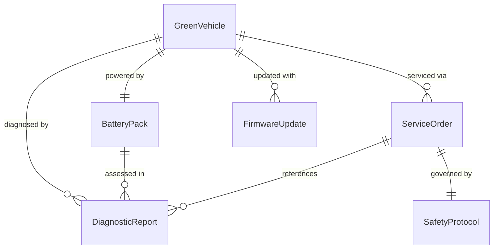
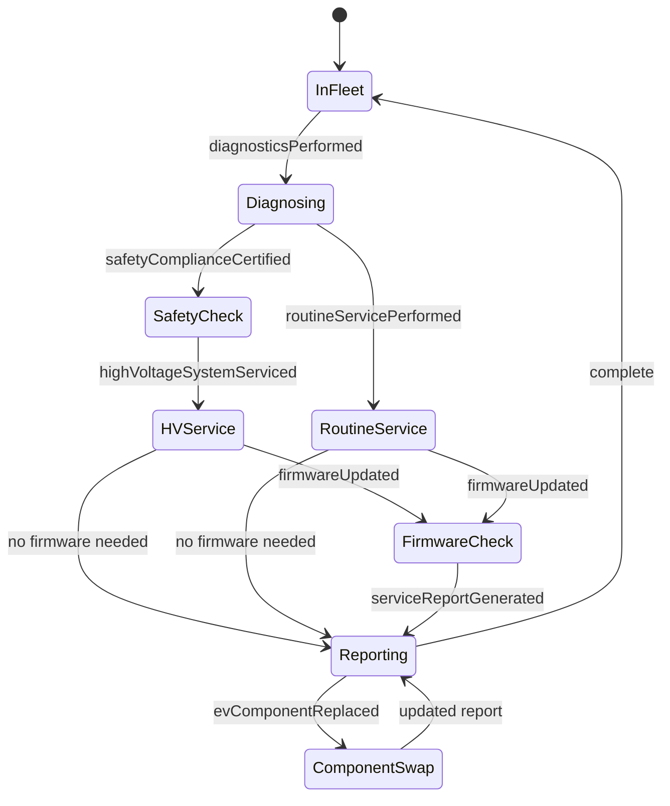
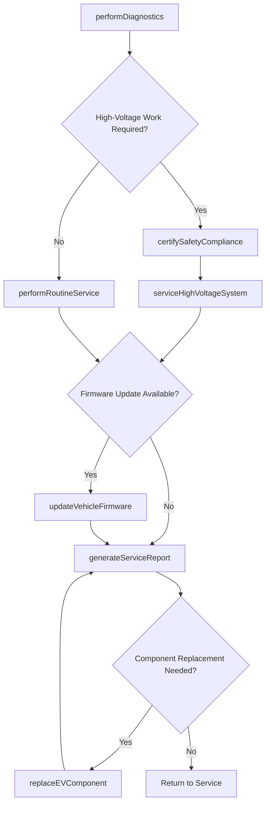
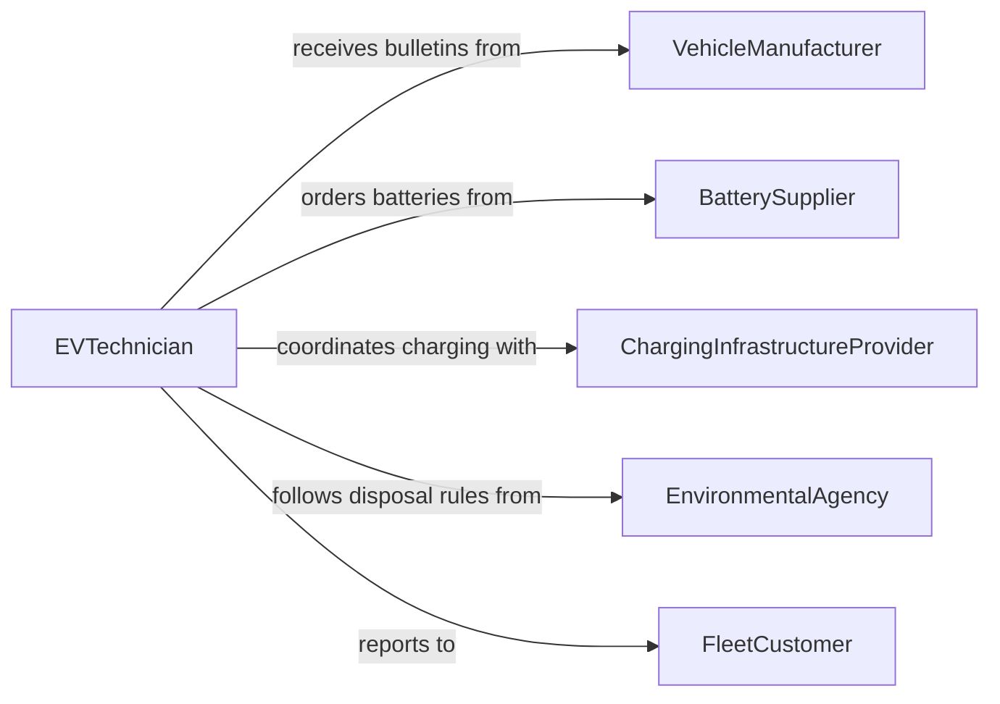

# Service Green Vehicles Make Repairs

> Business-as-Code definition for servicing green vehicles including electric, hybrid, and alternative-fuel vehicles to perform repairs and maintain operational readiness.

## Overview

Servicing green vehicles involves diagnosing, repairing, and maintaining electric vehicles, plug-in hybrids, hydrogen fuel cell vehicles, and other alternative-fuel platforms. This includes specialized work on high-voltage battery systems, electric drivetrains, regenerative braking, charging infrastructure, and emissions control systems unique to these powertrains. This definition exposes actions for managing the distinct safety protocols, certification requirements, and diagnostic procedures that differentiate green vehicle maintenance from conventional automotive service.

## Actors

| Actor | Description |
|-------|-------------|
| VehicleManufacturer | Provides technical service bulletins, firmware updates, and OEM components for green vehicles |
| BatterySupplier | Supplies replacement battery modules, cells, and thermal management components |
| ChargingInfrastructureProvider | Maintains and supports EVSE stations used by the fleet |
| EnvironmentalAgency | Enforces emissions, battery disposal, and hazardous materials regulations |
| FleetCustomer | Owns or operates the green vehicle fleet and authorizes service work |

## Roles

| Role | Description |
|------|-------------|
| EVTechnician | Performs diagnosis and repair on high-voltage systems and electric drivetrains |
| ServiceAdvisor | Manages customer interactions, estimates, and service scheduling |
| HighVoltageSafetyOfficer | Ensures technicians follow lockout-tagout and high-voltage safety protocols |
| DiagnosticSpecialist | Interprets EV-specific fault codes and battery management system data |
| PartsCoordinator | Sources specialized green vehicle components and manages inventory |

## Entities

| Entity | Description |
|--------|-------------|
| GreenVehicle | An electric, hybrid, or alternative-fuel vehicle in the service queue |
| BatteryPack | The high-voltage energy storage system including modules and thermal management |
| ServiceOrder | A formal work authorization for diagnosis, repair, or maintenance |
| DiagnosticReport | Fault codes, battery health data, and system status readings |
| SafetyProtocol | The lockout-tagout and high-voltage handling procedures required for service |
| FirmwareUpdate | A software release from the manufacturer for vehicle control modules |

## Actions

| Action | Description |
|--------|-------------|
| performDiagnostics | Read fault codes, battery state-of-health, and drivetrain data from vehicle systems |
| serviceHighVoltageSystem | Perform maintenance on battery packs, inverters, and electric motors following safety protocols |
| updateVehicleFirmware | Apply manufacturer software updates to vehicle control modules |
| replaceEVComponent | Swap out failed electric drivetrain or charging system components |
| performRoutineService | Execute scheduled maintenance such as coolant flushes, brake service, and tire rotation |
| certifySafetyCompliance | Verify that high-voltage systems are properly de-energized and re-energized per protocol |
| generateServiceReport | Document all work performed, parts used, and battery health metrics |

## Events

| Event | Description |
|-------|-------------|
| diagnosticsPerformed | Vehicle fault codes and system data have been captured |
| highVoltageSystemServiced | Battery pack or electric drivetrain maintenance has been completed |
| firmwareUpdated | Vehicle software has been updated to the latest manufacturer release |
| evComponentReplaced | A failed electric drivetrain or charging component has been swapped |
| routineServicePerformed | Scheduled maintenance tasks have been completed |
| safetyComplianceCertified | High-voltage safety protocols have been verified and documented |
| serviceReportGenerated | Complete service documentation has been created |

## Searches

| Search | Description |
|--------|-------------|
| findVehiclesByServiceStatus | List green vehicles filtered by repair status, battery health, or due date |
| getDiagnosticHistory | Retrieve fault code and battery health history for a specific vehicle |
| getServiceSchedule | Find vehicles with upcoming scheduled maintenance |
| findOpenServiceOrders | Locate active service orders by technician, priority, or vehicle type |
| getBatteryHealthReport | Retrieve state-of-health trends for a vehicle battery pack |

## Entity Relationships



## State Diagram



## Workflow



## Actor Relationships



## Usage

### Calling Actions

```typescript
import { serviceGreenVehiclesMakeRepairs } from '@headlessly/service-green-vehicles-make-repairs'

const greenService = serviceGreenVehiclesMakeRepairs()

// Run diagnostics on an electric vehicle
const diagnostics = await greenService.performDiagnostics({
  vehicleId: 'EV-TESLA-M3-047',
  systems: ['battery-management', 'drivetrain', 'charging-port', 'regenerative-braking']
})

// Service the high-voltage battery system
await greenService.serviceHighVoltageSystem({
  vehicleId: 'EV-TESLA-M3-047',
  tasks: ['coolant-flush', 'module-voltage-balance-check', 'contactor-inspection'],
  safetyProtocol: 'hv-lockout-tagout-v3'
})

// Generate the service report
await greenService.generateServiceReport({
  vehicleId: 'EV-TESLA-M3-047',
  batteryHealth: diagnostics.batteryStateOfHealth,
  workPerformed: ['hv-system-service', 'coolant-flush'],
  technician: 'ev-tech-santos'
})
```

### Event-Driven Automation

```typescript
// Alert when battery health drops below threshold
greenService.diagnosticsPerformed(async ({ vehicleId, batteryStateOfHealth }) => {
  if (batteryStateOfHealth < 80) {
    await notify({
      to: 'fleet-manager',
      message: `Battery degradation alert: ${vehicleId} at ${batteryStateOfHealth}% SOH`
    })
  }
})

// Auto-apply firmware updates when available
greenService.routineServicePerformed(async ({ vehicleId }) => {
  const updates = await checkFirmwareUpdates(vehicleId)
  if (updates.available) {
    await greenService.updateVehicleFirmware({
      vehicleId,
      firmwareVersion: updates.latestVersion
    })
  }
})
```
