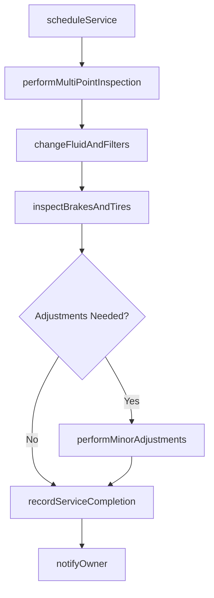
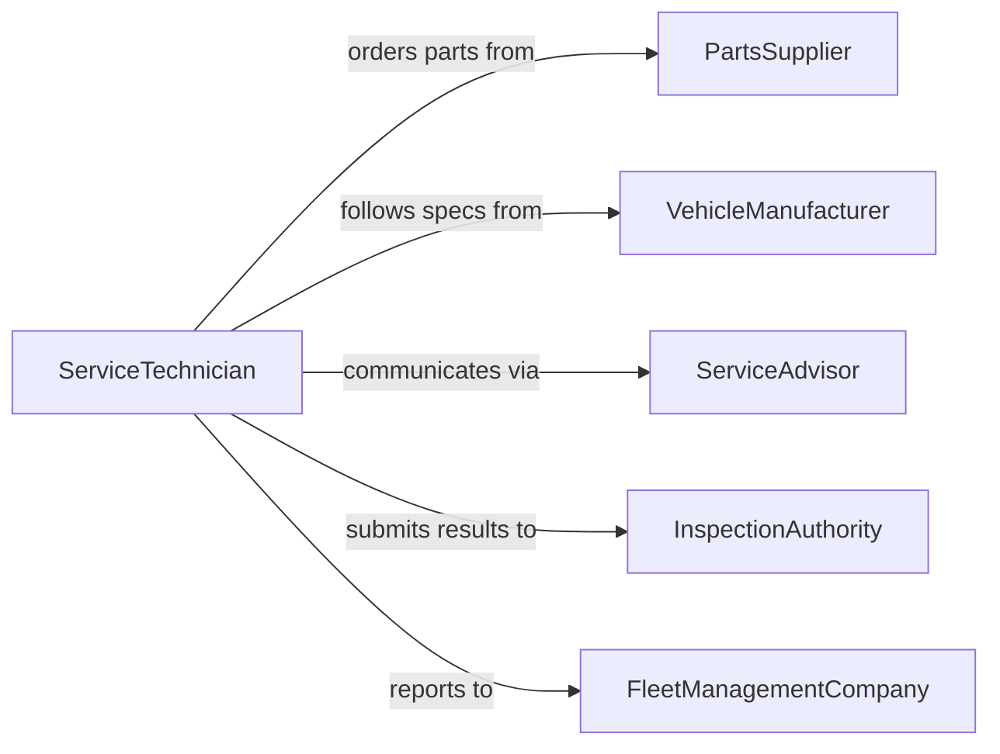

# Service Vehicles Maintain Functionality

> Business-as-Code definition for servicing vehicles through routine maintenance procedures to preserve functionality, extend useful life, and prevent unplanned breakdowns.

## Overview

Servicing vehicles to maintain functionality encompasses routine preventive maintenance activities such as oil changes, fluid top-offs, brake inspections, tire rotations, filter replacements, and multi-point safety checks. This definition exposes actions for scheduling and tracking recurring service intervals based on mileage or time, events for monitoring vehicle condition and service compliance, and searches for fleet-wide maintenance status reporting.

## Actors

| Actor | Description |
|-------|-------------|
| VehicleOwner | Owns the vehicle and authorizes service expenditures |
| PartsSupplier | Provides fluids, filters, brake pads, and other maintenance consumables |
| VehicleManufacturer | Publishes recommended service intervals and technical specifications |
| InspectionAuthority | Enforces state or municipal vehicle safety and emissions inspection requirements |
| FleetManagementCompany | Manages maintenance scheduling and vendor relationships for vehicle fleets |

## Roles

| Role | Description |
|------|-------------|
| ServiceTechnician | Performs hands-on vehicle maintenance and inspections |
| ServiceAdvisor | Schedules appointments, communicates with vehicle owners, and authorizes work |
| ShopForeman | Oversees daily shop operations, quality, and technician assignments |
| FleetCoordinator | Tracks maintenance compliance and scheduling across a vehicle fleet |

## Entities

| Entity | Description |
|--------|-------------|
| Vehicle | An automobile, truck, or other motorized vehicle requiring service |
| ServiceAppointment | A scheduled maintenance visit with date, time, and assigned bay |
| MaintenanceChecklist | The list of inspection and service items for a specific service interval |
| ServiceRecord | Documentation of all maintenance performed on a vehicle |
| FluidLevel | Current status of engine oil, coolant, brake fluid, and other vehicle fluids |
| ServiceInterval | A manufacturer-recommended mileage or time threshold triggering maintenance |

## Actions

| Action | Description |
|--------|-------------|
| scheduleService | Book a maintenance appointment based on mileage or calendar interval |
| performMultiPointInspection | Conduct a comprehensive check of vehicle systems and components |
| changeFluidAndFilters | Replace engine oil, transmission fluid, coolant, and associated filters |
| inspectBrakesAndTires | Evaluate brake pad thickness, rotor condition, tire tread depth, and pressure |
| performMinorAdjustments | Make small corrections such as belt tension, alignment, and light replacement |
| recordServiceCompletion | Document all work performed, parts used, and next service due date |
| notifyOwner | Inform the vehicle owner of service status, findings, and recommendations |

## Events

| Event | Description |
|-------|-------------|
| serviceScheduled | A maintenance appointment has been booked |
| multiPointInspectionCompleted | A comprehensive vehicle systems check has been finished |
| fluidsAndFiltersChanged | Oil, coolant, and filter replacements have been completed |
| brakesAndTiresInspected | Brake and tire condition assessment has been recorded |
| minorAdjustmentsPerformed | Small corrections and replacements have been made |
| serviceCompletionRecorded | All maintenance documentation has been finalized |
| ownerNotified | The vehicle owner has been informed of service results |

## Searches

| Search | Description |
|--------|-------------|
| findVehiclesDueForService | List vehicles that have reached or exceeded their next service interval |
| getServiceHistory | Retrieve the full maintenance record for a specific vehicle |
| findOpenAppointments | Locate available service bay slots for scheduling |
| getFleetComplianceStatus | Check maintenance compliance rates across a vehicle fleet |

## Workflow



## Actor Relationships



## Usage

### Calling Actions

```typescript
import { serviceVehiclesMaintainFunctionality } from '@headlessly/service-vehicles-maintain-functionality'

const vehicleService = serviceVehiclesMaintainFunctionality()

// Schedule a routine service appointment
const appointment = await vehicleService.scheduleService({
  vehicleId: 'VIN-5YJSA1E26MF123456',
  serviceType: '30000-mile-service',
  preferredDate: '2026-02-15',
  customerContact: 'owner-garcia'
})

// Perform multi-point inspection
const inspection = await vehicleService.performMultiPointInspection({
  vehicleId: 'VIN-5YJSA1E26MF123456',
  checklist: ['engine-oil', 'coolant', 'brakes', 'tires', 'lights', 'wipers', 'belts'],
  technician: 'tech-martinez'
})

// Change fluids and filters
await vehicleService.changeFluidAndFilters({
  vehicleId: 'VIN-5YJSA1E26MF123456',
  items: ['engine-oil-5w30', 'oil-filter', 'cabin-air-filter', 'engine-air-filter'],
  mileageAtService: 30125
})
```

### Event-Driven Automation

```typescript
// Auto-schedule next service after completion
vehicleService.serviceCompletionRecorded(async ({ vehicleId, mileageAtService }) => {
  const interval = await getServiceInterval(vehicleId)
  await vehicleService.scheduleService({
    vehicleId,
    serviceType: interval.nextServiceType,
    triggerMileage: mileageAtService + interval.mileageInterval
  })
})

// Alert fleet manager when inspection reveals concerns
vehicleService.multiPointInspectionCompleted(async ({ vehicleId, findings }) => {
  const critical = findings.filter(f => f.severity === 'needs-attention')
  if (critical.length > 0) {
    await notify({
      to: 'fleet-coordinator',
      message: `${vehicleId} inspection: ${critical.length} items need attention`
    })
  }
})
```
