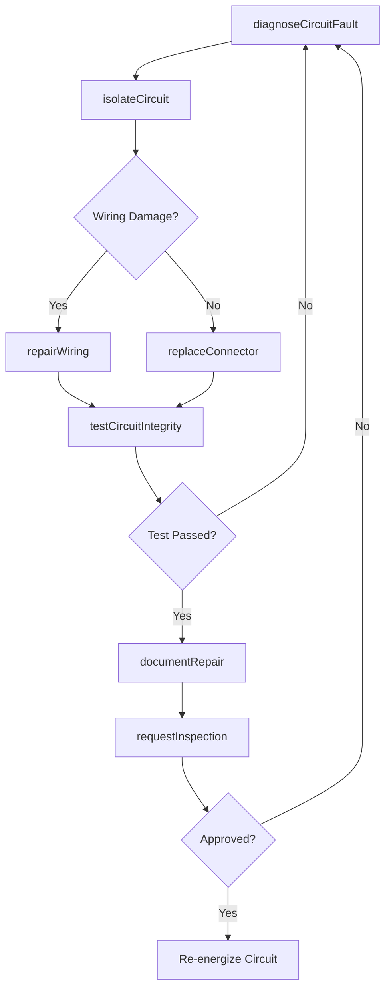
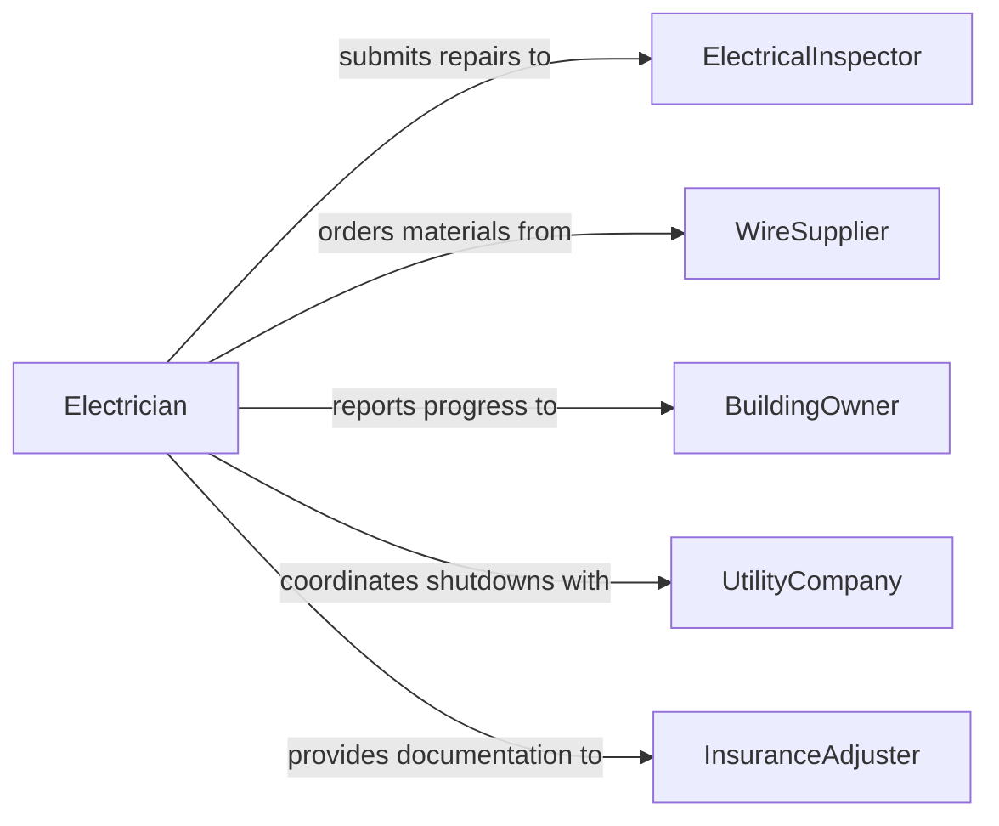

# Repair Electrical Circuits Wiring

> Business-as-Code definition for electrical circuit and wiring repair. Models the diagnostic, repair, and verification process for restoring faulty circuits and wiring to safe, functional condition.

## Overview

Electrical circuit and wiring repair involves tracing circuits, identifying faults such as shorts, opens, and ground faults, splicing or replacing conductors, and verifying safe operation through testing. This definition exposes actions for fault diagnosis and corrective repair, events for tracking repair outcomes and safety verification, and searches for querying circuit records and repair history.

## Actors

| Actor | Description |
|-------|-------------|
| ElectricalInspector | Verifies repairs meet code and safety requirements |
| WireSupplier | Provides conductors, connectors, and insulation materials |
| BuildingOwner | Authorizes and funds electrical repair work |
| UtilityCompany | Manages power supply to the facility |
| InsuranceAdjuster | Assesses damage and processes electrical loss claims |

## Roles

| Role | Description |
|------|-------------|
| Electrician | Performs hands-on circuit tracing, repair, and wiring |
| ElectricalEngineer | Designs circuit corrections and reviews repair plans |
| SafetyCoordinator | Ensures lockout/tagout procedures are followed |
| MaintenancePlanner | Schedules repair work and coordinates resource availability |

## Entities

| Entity | Description |
|--------|-------------|
| Circuit | An electrical path including conductors, switches, and loads |
| WiringRun | A physical segment of cable or conduit between points |
| FaultReport | A documented description of the circuit problem |
| RepairOrder | A work authorization for circuit or wiring repair |
| TestMeasurement | A voltage, current, or resistance reading taken during diagnosis |
| InspectionCertificate | Documentation confirming repaired circuits meet code |

## Actions

| Action | Description |
|--------|-------------|
| diagnoseCircuitFault | Trace and identify the root cause of a circuit failure |
| isolateCircuit | De-energize and lock out the circuit for safe work |
| repairWiring | Splice, replace, or re-route damaged conductors |
| replaceConnector | Swap corroded or damaged terminals and connectors |
| testCircuitIntegrity | Verify continuity, insulation resistance, and load capacity |
| documentRepair | Record all repair actions, materials used, and test results |
| requestInspection | Submit completed repair for code compliance inspection |

## Events

| Event | Description |
|-------|-------------|
| circuitFaultDiagnosed | The root cause of a circuit failure has been identified |
| circuitIsolated | A circuit has been safely de-energized and locked out |
| wiringRepaired | Damaged conductors have been spliced or replaced |
| connectorReplaced | Terminals or connectors have been swapped out |
| circuitIntegrityTested | Electrical testing has confirmed circuit function |
| repairDocumented | Repair details have been recorded |
| inspectionRequested | A completed repair has been submitted for inspection |

## Searches

| Search | Description |
|--------|-------------|
| findCircuits | List circuits by panel, zone, or fault status |
| getFaultReports | Retrieve fault reports by location, type, or date |
| getRepairHistory | Query past repairs for a specific circuit or wiring run |
| getTestMeasurements | Retrieve test results by circuit or measurement type |

## Workflow



## Actor Relationships



## Usage

### Calling Actions

```typescript
import { repairElectricalCircuitsWiring } from '@headlessly/repair-electrical-circuits-wiring'

const circuits = repairElectricalCircuitsWiring()

// Diagnose a tripping breaker
const fault = await circuits.diagnoseCircuitFault({
  circuitId: 'panel-b-circuit-14',
  symptoms: ['breaker-tripping', 'intermittent-power'],
  measurements: ['insulation-resistance', 'continuity']
})

// Isolate and repair the faulty wiring
await circuits.isolateCircuit({
  circuitId: 'panel-b-circuit-14',
  lockoutTagoutId: 'loto-2026-0208-001'
})

await circuits.repairWiring({
  circuitId: 'panel-b-circuit-14',
  faultLocation: 'junction-box-3b',
  action: 'splice-replacement',
  wireGauge: '12-AWG',
  lengthMeters: 4.5
})

// Test and verify the repair
const test = await circuits.testCircuitIntegrity({
  circuitId: 'panel-b-circuit-14',
  tests: ['continuity', 'insulationResistance', 'loadTest']
})
```

### Event-Driven Automation

```typescript
// Auto-request inspection after successful repair
circuits.circuitIntegrityTested(async ({ circuitId, passed }) => {
  if (passed) {
    await circuits.documentRepair({ circuitId })
    await circuits.requestInspection({ circuitId })
  }
})

// Alert safety team on repeated faults
circuits.circuitFaultDiagnosed(async ({ circuitId, faultType }) => {
  const history = await circuits.getRepairHistory({ circuitId, months: 12 })
  if (history.length >= 3) {
    await notify({
      to: 'safety-team',
      message: `Circuit ${circuitId} has had ${history.length} faults in 12 months. Review for replacement.`
    })
  }
})
```
