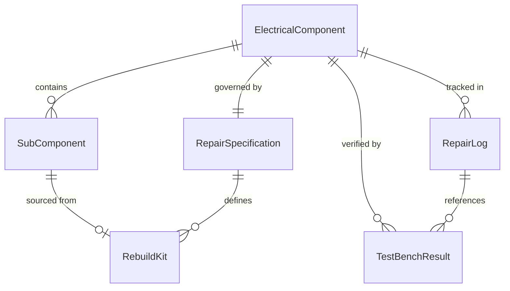
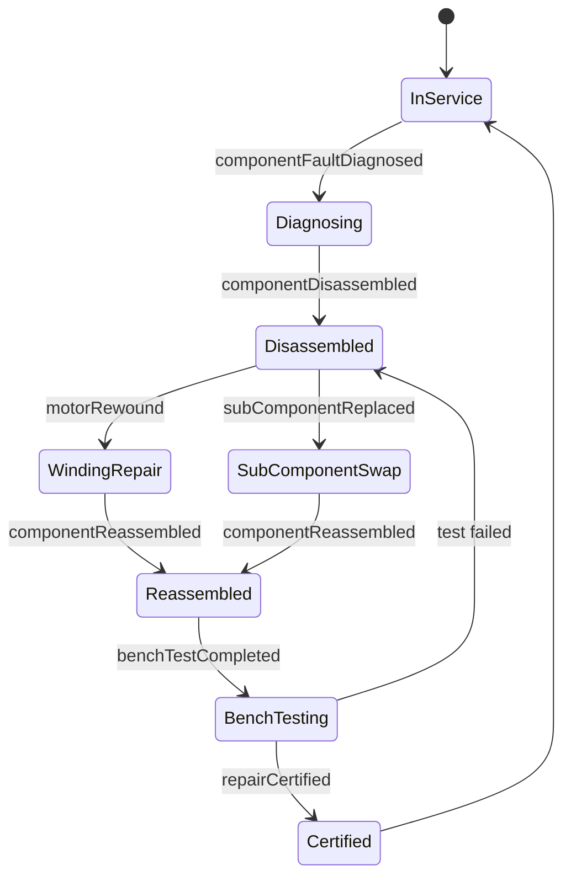
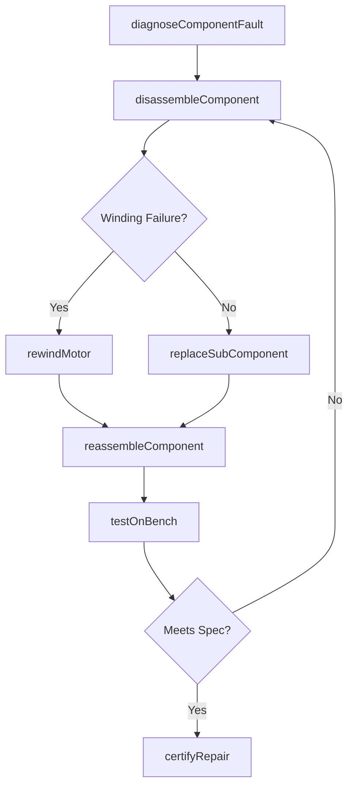
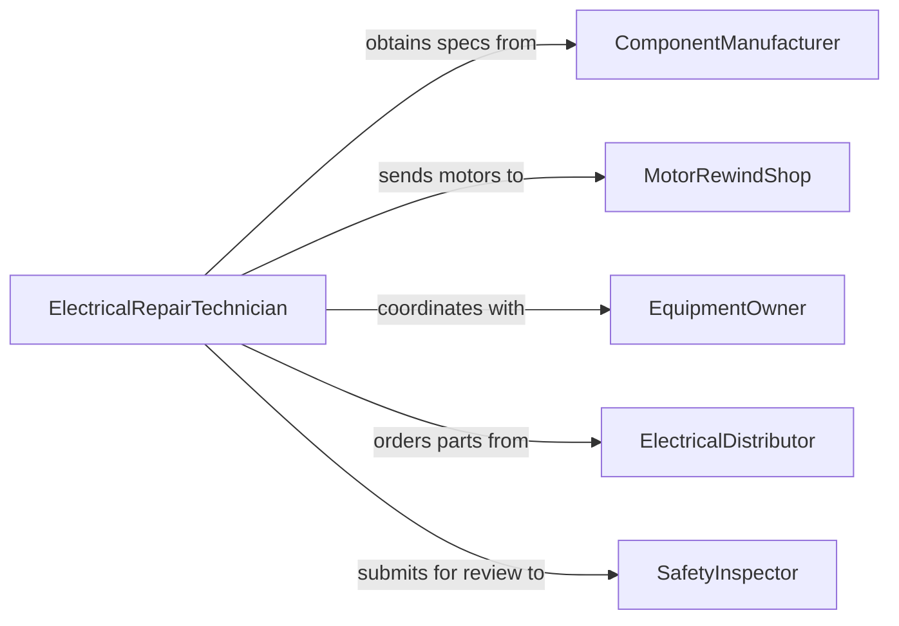

# Repair Electrical Components

> Business-as-Code definition for electrical component repair. Models the process of diagnosing, repairing, and restoring individual electrical components such as motors, transformers, switches, and relays to working condition.

## Overview

Electrical component repair focuses on restoring discrete electrical parts to functional specifications through disassembly, testing, rewinding, resoldering, or replacement of internal elements. This definition exposes actions for component-level diagnostics and repair, events for tracking component restoration outcomes, and searches for querying component inventories and repair records.

## Actors

| Actor | Description |
|-------|-------------|
| ComponentManufacturer | Provides specifications, rebuild kits, and technical data |
| MotorRewindShop | Performs specialized rewinding services for motors and transformers |
| EquipmentOwner | Authorizes repair and provides access to installed components |
| ElectricalDistributor | Supplies replacement parts and subcomponents |
| SafetyInspector | Verifies repaired components meet electrical safety standards |

## Roles

| Role | Description |
|------|-------------|
| ElectricalRepairTechnician | Disassembles, tests, and repairs electrical components |
| ElectricalEngineer | Specifies repair procedures and validates component ratings |
| PartsCoordinator | Sources internal subcomponents needed for repairs |
| QualityInspector | Verifies repaired components meet performance specifications |

## Entities

| Entity | Description |
|--------|-------------|
| ElectricalComponent | A motor, transformer, relay, contactor, or switch |
| RepairSpecification | Documented procedures and tolerances for a repair job |
| SubComponent | An internal element such as a winding, contact, or bearing |
| TestBenchResult | Performance data from post-repair testing on a test bench |
| RebuildKit | A pre-packaged set of parts for a standard component rebuild |
| RepairLog | A chronological record of repair actions on a component |

## Actions

| Action | Description |
|--------|-------------|
| diagnoseComponentFault | Test and identify the failure mode of an electrical component |
| disassembleComponent | Take apart a component for internal inspection and repair |
| replaceSubComponent | Swap an internal element such as a contact, bearing, or winding |
| rewindMotor | Replace windings in a motor or transformer to restore function |
| reassembleComponent | Put the component back together after internal repairs |
| testOnBench | Run the repaired component on a test bench to verify performance |
| certifyRepair | Document that the component meets original specifications |

## Events

| Event | Description |
|-------|-------------|
| componentFaultDiagnosed | The failure mode of a component has been identified |
| componentDisassembled | A component has been taken apart for repair |
| subComponentReplaced | An internal element has been swapped out |
| motorRewound | Windings have been replaced in a motor or transformer |
| componentReassembled | A repaired component has been put back together |
| benchTestCompleted | Post-repair testing has been performed |
| repairCertified | The repaired component has been certified to specification |

## Searches

| Search | Description |
|--------|-------------|
| findComponents | List components by type, status, or installation location |
| getRepairLogs | Retrieve repair history for a component or time period |
| getBenchTestResults | Query test bench data for a component or test type |
| findRebuildKits | Check availability of rebuild kits by component model |

## Entity Relationships



## State Diagram



## Workflow



## Actor Relationships



## Usage

### Calling Actions

```typescript
import { repairElectricalComponents } from '@headlessly/repair-electrical-components'

const components = repairElectricalComponents()

// Diagnose a faulty contactor
const fault = await components.diagnoseComponentFault({
  componentId: 'contactor-pump-station-03',
  componentType: 'contactor',
  symptoms: ['chattering', 'intermittent-engagement'],
  tests: ['coilResistance', 'contactResistance', 'insulation']
})

// Disassemble and replace worn contacts
await components.disassembleComponent({
  componentId: 'contactor-pump-station-03'
})

await components.replaceSubComponent({
  componentId: 'contactor-pump-station-03',
  subComponent: 'main-contacts',
  rebuildKitId: 'kit-contactor-600v-size3'
})

// Reassemble and test
await components.reassembleComponent({ componentId: 'contactor-pump-station-03' })
const testResult = await components.testOnBench({
  componentId: 'contactor-pump-station-03',
  tests: ['pullInVoltage', 'dropOutVoltage', 'contactResistance', 'dielectricStrength']
})
```

### Event-Driven Automation

```typescript
// Auto-certify components that pass bench testing
components.benchTestCompleted(async ({ componentId, passed, results }) => {
  if (passed) {
    await components.certifyRepair({
      componentId,
      testResults: results,
      certifiedDate: new Date().toISOString()
    })
  }
})

// Track repeat failures for reliability analysis
components.componentFaultDiagnosed(async ({ componentId, componentType, failureMode }) => {
  const history = await components.getRepairLogs({ componentId })
  if (history.length >= 2) {
    await notify({
      to: 'reliability-engineering',
      message: `${componentType} ${componentId} has failed ${history.length + 1} times. Latest mode: ${failureMode}`
    })
  }
})
```
