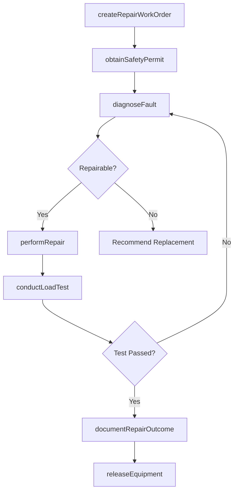
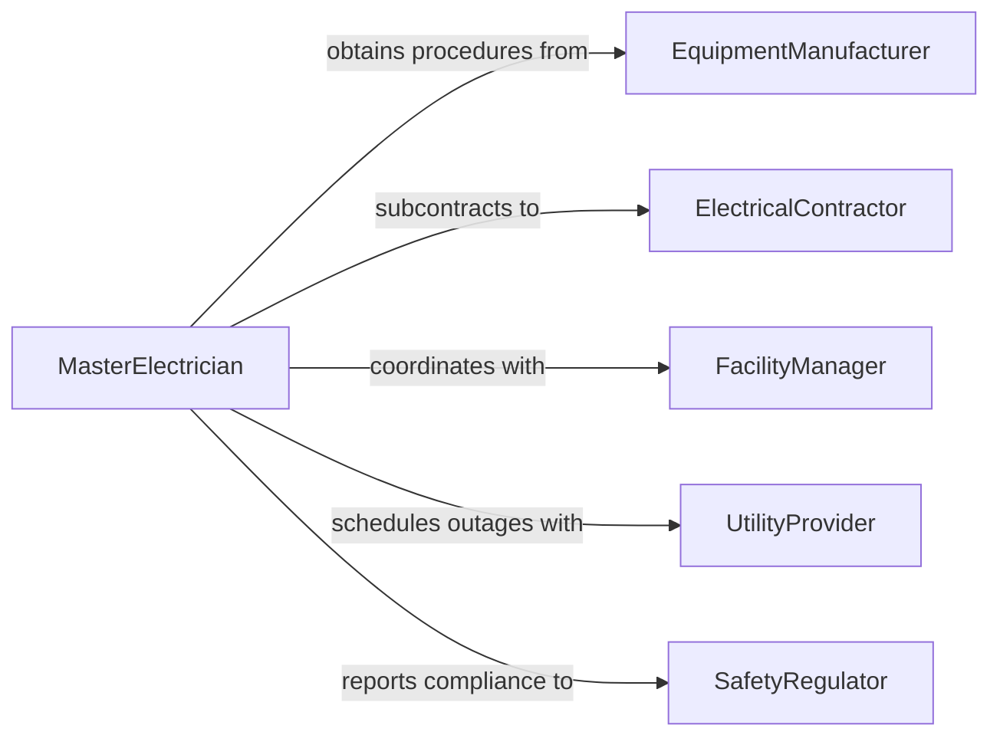

# Repair Electrical Equipment

> Business-as-Code definition for electrical equipment repair. Models the end-to-end process of diagnosing, repairing, and returning electrical equipment such as motors, generators, switchgear, and distribution panels to safe, functional operation.

## Overview

Electrical equipment repair encompasses fault diagnosis, disassembly, component replacement or reconditioning, reassembly, and load testing of power distribution and conversion equipment. This definition exposes actions for systematic troubleshooting and restoration, events for tracking repair progress and safety verification, and searches for querying equipment status and repair backlogs.

## Actors

| Actor | Description |
|-------|-------------|
| EquipmentManufacturer | Provides service bulletins, parts lists, and repair procedures |
| ElectricalContractor | Performs field repairs requiring specialized licensing |
| FacilityManager | Authorizes repair work and coordinates facility access |
| UtilityProvider | Manages power supply connections and outage coordination |
| SafetyRegulator | Enforces electrical safety codes and standards |

## Roles

| Role | Description |
|------|-------------|
| MasterElectrician | Leads complex repairs and oversees journeyman work |
| JourneymanElectrician | Performs hands-on troubleshooting and repair tasks |
| MaintenanceSupervisor | Prioritizes repair work orders and allocates resources |
| SafetyOfficer | Enforces lockout/tagout and arc flash safety procedures |

## Entities

| Entity | Description |
|--------|-------------|
| ElectricalEquipment | A motor, generator, panel, breaker, or switchgear unit |
| WorkOrder | A formal repair task with scope, priority, and assignment |
| FaultDiagnosis | A documented analysis of the equipment failure cause |
| ReplacementPart | A component sourced for the repair |
| SafetyPermit | Authorization for work on energized or de-energized equipment |
| LoadTestResult | Performance data from post-repair operational testing |

## Actions

| Action | Description |
|--------|-------------|
| createRepairWorkOrder | Generate a work order for a reported equipment failure |
| diagnoseFault | Systematically identify the root cause of equipment failure |
| obtainSafetyPermit | Secure authorization for safe work on electrical equipment |
| performRepair | Execute the physical repair including part replacement |
| conductLoadTest | Test repaired equipment under normal operating conditions |
| documentRepairOutcome | Record all repair actions, parts used, and test results |
| releaseEquipment | Return repaired equipment to operational service |

## Events

| Event | Description |
|-------|-------------|
| repairWorkOrderCreated | A new repair work order has been generated |
| faultDiagnosed | The root cause of equipment failure has been determined |
| safetyPermitObtained | Work authorization has been secured |
| repairPerformed | Physical repair work has been completed |
| loadTestConducted | Post-repair testing has been executed |
| repairOutcomeDocumented | Repair details and results have been recorded |
| equipmentReleased | Repaired equipment has been returned to service |

## Searches

| Search | Description |
|--------|-------------|
| findWorkOrders | List repair work orders by priority, status, or equipment type |
| getEquipmentHistory | Retrieve repair history for a specific piece of equipment |
| getLoadTestResults | Query test data by equipment or test parameters |
| findPendingPermits | List safety permits awaiting approval or closure |

## Workflow



## Actor Relationships



## Usage

### Calling Actions

```typescript
import { repairElectricalEquipment } from '@headlessly/repair-electrical-equipment'

const electrical = repairElectricalEquipment()

// Create a work order for a failed motor
const workOrder = await electrical.createRepairWorkOrder({
  equipmentId: 'motor-chiller-plant-02',
  equipmentType: 'induction-motor',
  priority: 'high',
  reportedSymptom: 'overheating-and-tripping'
})

// Obtain safety permit and diagnose
await electrical.obtainSafetyPermit({
  workOrderId: workOrder.id,
  permitType: 'lockout-tagout',
  equipmentVoltage: '480V'
})

const diagnosis = await electrical.diagnoseFault({
  workOrderId: workOrder.id,
  tests: ['windingResistance', 'insulationResistance', 'bearingVibration']
})

// Perform repair and verify
await electrical.performRepair({
  workOrderId: workOrder.id,
  actions: ['replaceBearings', 'cleanWindings'],
  partsUsed: ['bearing-6310-2rs', 'bearing-6310-2rs']
})

const loadTest = await electrical.conductLoadTest({
  workOrderId: workOrder.id,
  loadProfile: 'full-load-30min',
  measurements: ['temperature', 'vibration', 'current']
})
```

### Event-Driven Automation

```typescript
// Auto-document and release after successful load test
electrical.loadTestConducted(async ({ workOrderId, passed, results }) => {
  if (passed) {
    await electrical.documentRepairOutcome({ workOrderId, results })
    await electrical.releaseEquipment({ workOrderId })
  }
})

// Escalate unrepairable equipment for capital planning
electrical.faultDiagnosed(async ({ workOrderId, equipmentId, repairable }) => {
  if (!repairable) {
    await notify({
      to: 'capital-planning',
      message: `Equipment ${equipmentId} is beyond repair. Replacement procurement needed.`
    })
  }
})
```
