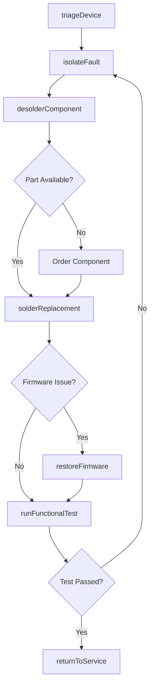
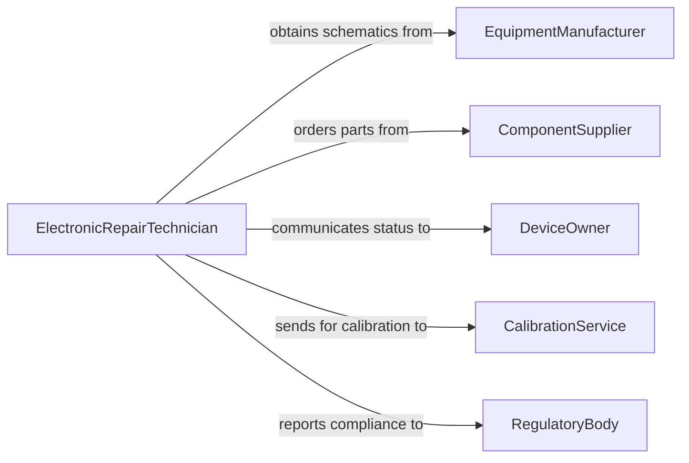

# Repair Electronic Equipment

> Business-as-Code definition for electronic equipment repair. Models the diagnostic and corrective repair process for restoring malfunctioning electronic devices, circuit boards, and integrated systems to operational condition.

## Overview

Electronic equipment repair involves board-level and component-level troubleshooting, soldering, firmware restoration, and functional verification of devices such as controllers, amplifiers, sensors, and communication equipment. This definition exposes actions for systematic fault isolation and repair, events for tracking repair outcomes and turnaround times, and searches for querying repair queues and component availability.

## Actors

| Actor | Description |
|-------|-------------|
| EquipmentManufacturer | Provides schematics, service manuals, and proprietary repair tools |
| ComponentSupplier | Stocks integrated circuits, capacitors, and other board-level parts |
| DeviceOwner | Submits equipment for repair and approves repair costs |
| CalibrationService | Performs post-repair calibration and certification |
| RegulatoryBody | Enforces standards for repaired electronic equipment |

## Roles

| Role | Description |
|------|-------------|
| ElectronicRepairTechnician | Performs board-level diagnosis, soldering, and component replacement |
| RepairEngineer | Develops repair procedures and investigates complex failures |
| RepairCoordinator | Manages intake, tracking, and return of equipment |
| TestEngineer | Executes functional and environmental testing on repaired equipment |

## Entities

| Entity | Description |
|--------|-------------|
| ElectronicDevice | A complete electronic unit submitted for repair |
| CircuitBoard | A PCB containing discrete and integrated components |
| RepairTicket | A tracked record of the repair from intake through return |
| Schematic | A circuit diagram used for fault tracing |
| SolderJoint | A connection point that may require rework or replacement |
| FunctionalTestReport | Results from post-repair operational verification |

## Actions

| Action | Description |
|--------|-------------|
| triageDevice | Assess incoming equipment and classify the fault type |
| isolateFault | Use schematics and test equipment to locate the failing component |
| desolder Component | Remove a faulty component from the circuit board |
| solderReplacement | Install a new component onto the board |
| restoreFirmware | Reload or update device firmware after hardware repair |
| runFunctionalTest | Verify the device operates correctly under normal conditions |
| returnToService | Release the repaired device back to the owner or inventory |

## Events

| Event | Description |
|-------|-------------|
| deviceTriaged | Incoming equipment has been assessed and classified |
| faultIsolated | The failing component or section has been identified |
| componentDesoldered | A faulty component has been removed from the board |
| replacementSoldered | A new component has been installed on the board |
| firmwareRestored | Device firmware has been reloaded or updated |
| functionalTestPassed | The device has passed post-repair verification |
| deviceReturnedToService | The repaired device has been released |

## Searches

| Search | Description |
|--------|-------------|
| findRepairTickets | List repair tickets by status, device type, or date |
| getDeviceHistory | Retrieve past repair records for a specific device |
| findAvailableComponents | Check stock of replacement ICs and board-level parts |
| getTestReports | Query functional test results by device or test suite |

## Workflow



## Actor Relationships



## Usage

### Calling Actions

```typescript
import { repairElectronicEquipment } from '@headlessly/repair-electronic-equipment'

const repairs = repairElectronicEquipment()

// Triage an incoming device
const ticket = await repairs.triageDevice({
  deviceId: 'radio-transceiver-uhf-07',
  reportedSymptoms: ['no-transmit', 'power-on-normal'],
  ownerRef: 'client-broadcast-corp'
})

// Isolate and fix the fault
const fault = await repairs.isolateFault({
  ticketId: ticket.id,
  schematicRef: 'sch-uhf-transceiver-v3',
  testPoints: ['PA-output', 'mixer-output', 'oscillator']
})

await repairs.desolderComponent({
  ticketId: ticket.id,
  boardRef: 'pcb-pa-stage',
  componentRef: 'Q3-power-transistor'
})

await repairs.solderReplacement({
  ticketId: ticket.id,
  boardRef: 'pcb-pa-stage',
  componentRef: 'Q3-power-transistor',
  replacementPartId: 'mosfet-rf-50w-001'
})

// Test and return
const test = await repairs.runFunctionalTest({
  ticketId: ticket.id,
  testSuite: 'transmitter-full-power'
})
```

### Event-Driven Automation

```typescript
// Auto-return devices that pass functional testing
repairs.functionalTestPassed(async ({ ticketId, deviceId }) => {
  await repairs.returnToService({ ticketId })
  await notify({
    to: 'repair-coordinator',
    message: `Device ${deviceId} has passed testing and is ready for return`
  })
})

// Escalate devices that fail multiple repair attempts
repairs.faultIsolated(async ({ ticketId, deviceId, attemptNumber }) => {
  if (attemptNumber >= 3) {
    await notify({
      to: 'repair-engineering',
      message: `Device ${deviceId} (ticket ${ticketId}) has failed isolation ${attemptNumber} times. Engineering review needed.`
    })
  }
})
```
