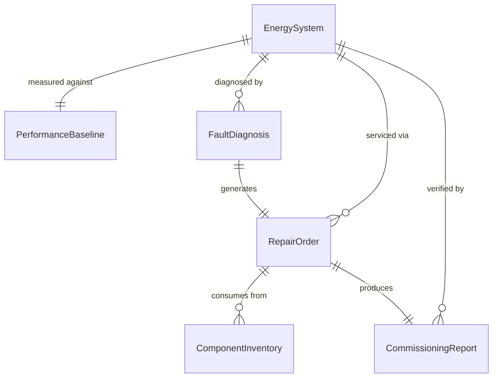
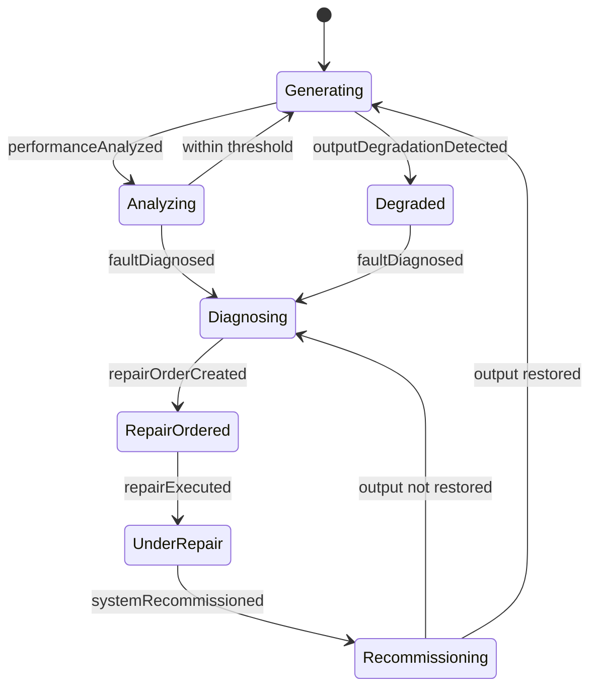
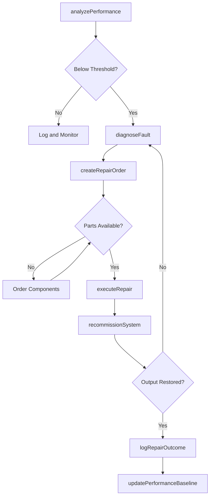
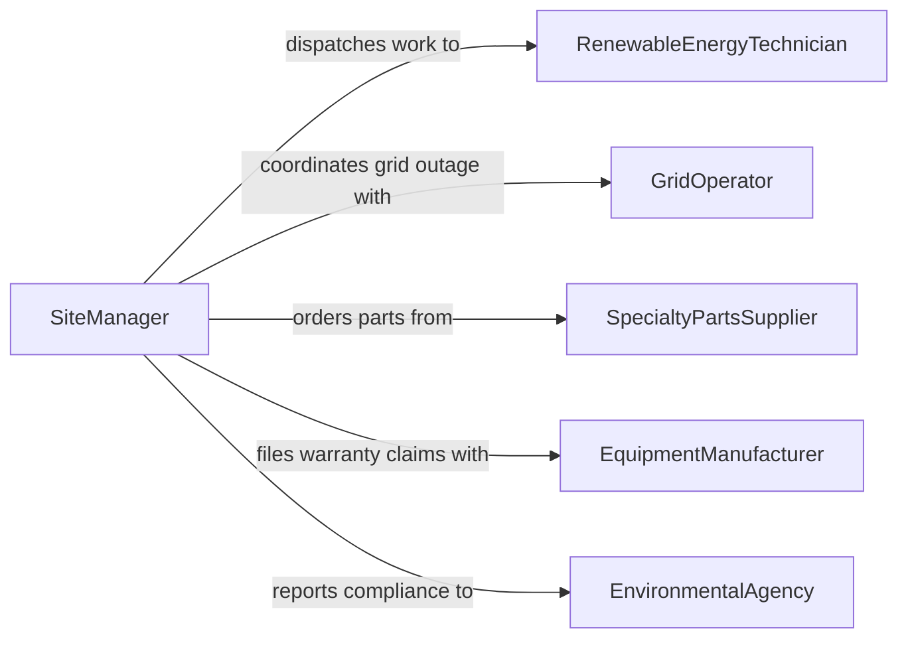

# Repair Green Energy Equipment Systems

> Business-as-Code definition for repairing green energy equipment and systems. Models the diagnostic, repair, and recommissioning workflow for solar panels, wind turbines, battery storage, and other renewable energy installations.

## Overview

Green energy equipment and systems repair involves diagnosing faults in solar arrays, wind turbines, geothermal systems, battery storage units, and associated power electronics, then restoring them to rated performance. This definition exposes actions for performance analysis, fault isolation, component repair or replacement, and system recommissioning. Events enable automated monitoring of energy output degradation and maintenance scheduling.

## Actors

| Actor | Description |
|-------|-------------|
| SiteOwner | Owns the renewable energy installation and authorizes repair work |
| EquipmentManufacturer | Provides warranty support, technical bulletins, and proprietary parts |
| GridOperator | Manages interconnection requirements and outage coordination |
| EnvironmentalAgency | Enforces compliance with environmental protection during repairs |
| SpecialtyPartsSupplier | Provides inverters, blades, controllers, and other renewable components |

## Roles

| Role | Description |
|------|-------------|
| RenewableEnergyTechnician | Performs hands-on diagnosis and repair of green energy systems |
| SystemsEngineer | Analyzes performance data and designs repair strategies |
| SiteManager | Coordinates repair scheduling and site access logistics |
| SafetyCoordinator | Manages high-voltage isolation, fall protection, and confined space procedures |

## Entities

| Entity | Description |
|--------|-------------|
| EnergySystem | A solar array, wind turbine, or battery storage installation |
| FaultDiagnosis | Analysis of system underperformance or component failure |
| RepairOrder | Work order specifying the fault, repair procedure, and required parts |
| PerformanceBaseline | Expected output metrics for the system under normal conditions |
| ComponentInventory | Stock of replacement inverters, panels, blades, and controllers |
| CommissioningReport | Post-repair verification that the system meets rated output |

## Actions

| Action | Description |
|--------|-------------|
| analyzePerformance | Compare current energy output to baseline to identify degradation |
| diagnoseFault | Isolate the specific component or subsystem causing the failure |
| createRepairOrder | Generate a work order with repair procedures and parts list |
| executeRepair | Perform component replacement, rewiring, or mechanical restoration |
| recommissionSystem | Restart the system and verify it meets interconnection standards |
| updatePerformanceBaseline | Adjust expected output metrics after system modification |
| logRepairOutcome | Document the repair, root cause, and restored performance level |

## Events

| Event | Description |
|-------|-------------|
| performanceAnalyzed | System output analysis has been completed |
| faultDiagnosed | The specific cause of system failure has been identified |
| repairOrderCreated | A repair work order has been generated |
| repairExecuted | The hands-on repair work has been completed |
| systemRecommissioned | The system has been restarted and verified operational |
| outputDegradationDetected | Energy output has fallen below acceptable threshold |
| warrantyClaimFiled | A warranty claim has been submitted for a failed component |

## Searches

| Search | Description |
|--------|-------------|
| findEnergySystems | List installations by type, location, or performance status |
| getRepairOrders | Retrieve work orders by status, system type, or technician |
| getPerformanceHistory | Look up energy output trends for a specific installation |
| findUnderperformingSystems | Identify systems producing below their expected output baseline |

## Entity Relationships



## State Diagram



## Workflow



## Actor Relationships



## Usage

### Calling Actions

```typescript
import { repairGreenEnergyEquipmentSystems } from '@headlessly/repair-green-energy-equipment-systems'

const energy = repairGreenEnergyEquipmentSystems()

// Analyze performance of a solar array
const analysis = await energy.analyzePerformance({
  systemId: 'solar-farm-12',
  type: 'photovoltaic-array',
  currentOutput: 850,
  baselineOutput: 1000,
  period: 'last-30-days'
})

// Diagnose the specific fault
const diagnosis = await energy.diagnoseFault({
  systemId: analysis.systemId,
  degradationPattern: analysis.degradationPattern,
  subsystems: ['inverter-bank-a', 'string-3', 'combiner-box-2']
})

// Recommission after repair
const commissioning = await energy.recommissionSystem({
  systemId: 'solar-farm-12',
  tests: ['insulation-resistance', 'ground-fault', 'power-output'],
  gridSyncRequired: true
})
```

### Event-Driven Automation

```typescript
// Alert site manager when output drops below threshold
energy.outputDegradationDetected(async ({ systemId, currentOutput, baseline }) => {
  const degradationPct = ((baseline - currentOutput) / baseline) * 100
  await notify({
    to: 'site-manager',
    message: `System ${systemId} output degraded by ${degradationPct.toFixed(1)}%. Investigation recommended.`
  })
})

// Auto-file warranty claim for components that fail prematurely
energy.faultDiagnosed(async ({ systemId, faultyComponent, installDate }) => {
  const ageMonths = monthsBetween(installDate, new Date())
  if (ageMonths < 60 && faultyComponent.warrantyMonths >= ageMonths) {
    await energy.logRepairOutcome({
      systemId,
      warrantyClaimFiled: true,
      componentId: faultyComponent.id
    })
  }
})
```
