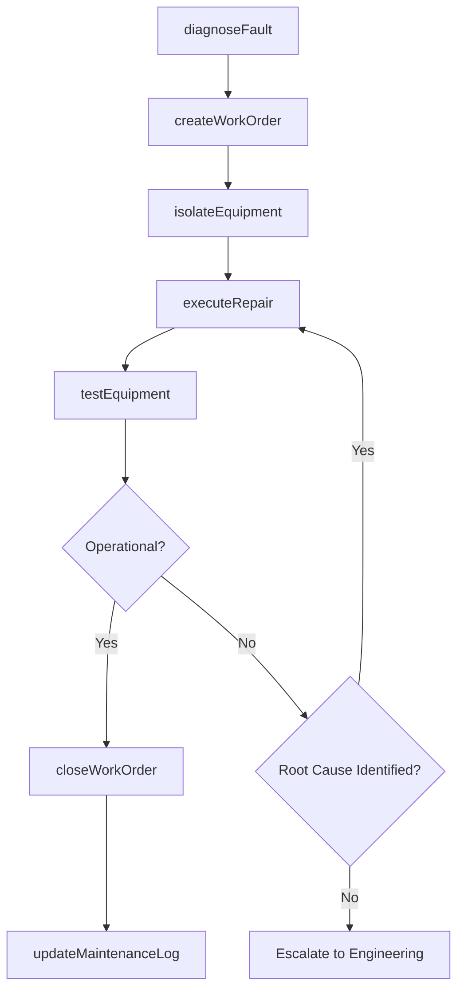
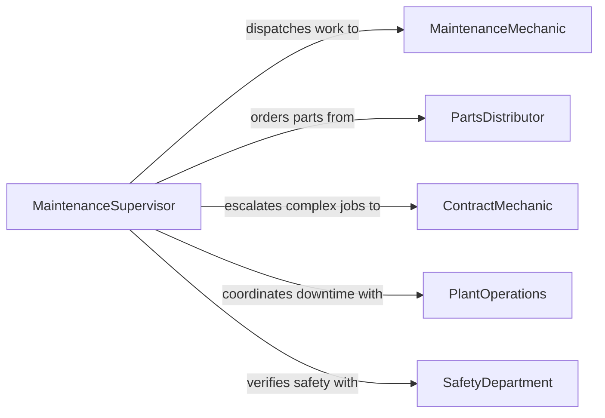

# Repair Mechanical Equipment

> Business-as-Code definition for repairing mechanical equipment. Models the complete repair lifecycle from fault diagnosis through disassembly, component repair or replacement, reassembly, and operational verification.

## Overview

Mechanical equipment repair encompasses diagnosing failures in pumps, compressors, conveyors, engines, gearboxes, and other mechanical systems, then restoring them to operational condition. This definition exposes actions for troubleshooting, work order management, hands-on repair execution, and post-repair testing. Events enable automated coordination between maintenance, operations, and procurement teams.

## Actors

| Actor | Description |
|-------|-------------|
| PlantOperations | Reports equipment failures and needs timely restoration |
| PartsDistributor | Supplies bearings, seals, gaskets, and replacement assemblies |
| OEMServiceCenter | Provides factory-authorized repair procedures and warranty support |
| ContractMechanic | External specialist for complex or specialized equipment repairs |
| SafetyDepartment | Ensures lockout/tagout and safe repair procedures are followed |

## Roles

| Role | Description |
|------|-------------|
| MaintenanceMechanic | Performs hands-on diagnosis, repair, and reassembly |
| MaintenanceSupervisor | Prioritizes work orders and allocates repair resources |
| ReliabilityEngineer | Analyzes failure patterns and recommends repair strategies |
| SafetyCoordinator | Oversees permit-to-work and lockout/tagout compliance |

## Entities

| Entity | Description |
|--------|-------------|
| Equipment | A mechanical machine or system requiring repair |
| WorkOrder | Documented scope of repair including diagnosis, parts, and labor |
| FaultDiagnosis | Root cause analysis identifying the reason for equipment failure |
| ReplacementPart | A component sourced to replace a failed or worn item |
| RepairLog | Chronological record of all actions taken during the repair |
| TestReport | Post-repair operational verification data |

## Actions

| Action | Description |
|--------|-------------|
| diagnoseFault | Identify the root cause of mechanical equipment failure |
| createWorkOrder | Generate a repair work order with scope, parts, and schedule |
| isolateEquipment | Lock out and tag out equipment for safe repair access |
| executeRepair | Perform disassembly, component repair or replacement, and reassembly |
| testEquipment | Run operational tests to verify restored performance |
| closeWorkOrder | Finalize the repair record and return equipment to operations |
| updateMaintenanceLog | Record repair details in the equipment maintenance history |

## Events

| Event | Description |
|-------|-------------|
| faultDiagnosed | Root cause of equipment failure has been identified |
| workOrderCreated | A repair work order has been generated and assigned |
| equipmentIsolated | Lockout/tagout has been completed for safe access |
| repairExecuted | Hands-on repair work has been completed |
| equipmentTested | Post-repair operational testing is complete |
| workOrderClosed | The repair has been finalized and equipment released |
| repeatFailureDetected | The same equipment has failed again within a defined period |

## Searches

| Search | Description |
|--------|-------------|
| findEquipment | List equipment by type, location, or operational status |
| getWorkOrders | Retrieve work orders by status, priority, or mechanic assignment |
| getRepairHistory | Look up past repairs and failure patterns for specific equipment |
| findOverdueWorkOrders | Identify repair work orders that have exceeded their target date |
| getPartAvailability | Check stock levels for parts required by pending work orders |

## Workflow



## Actor Relationships



## Usage

### Calling Actions

```typescript
import { repairMechanicalEquipment } from '@headlessly/repair-mechanical-equipment'

const equipment = repairMechanicalEquipment()

// Diagnose a failing centrifugal pump
const diagnosis = await equipment.diagnoseFault({
  equipmentId: 'pump-4410',
  type: 'centrifugal-pump',
  symptoms: ['excessive vibration', 'bearing noise', 'reduced flow rate']
})

// Create work order based on diagnosis
const workOrder = await equipment.createWorkOrder({
  equipmentId: diagnosis.equipmentId,
  faults: diagnosis.faults,
  requiredParts: ['bearing-6205', 'mechanical-seal-type-a'],
  estimatedHours: 6,
  priority: 'urgent'
})

// Test after repair
const testResult = await equipment.testEquipment({
  equipmentId: workOrder.equipmentId,
  tests: ['vibration-analysis', 'flow-rate', 'temperature'],
  acceptanceCriteria: { vibration: 2.5, flowRate: 150, temperature: 65 }
})
```

### Event-Driven Automation

```typescript
// Alert reliability engineering on repeat failures
equipment.repeatFailureDetected(async ({ equipmentId, failureCount, period }) => {
  await notify({
    to: 'reliability-engineer',
    message: `Equipment ${equipmentId} has failed ${failureCount} times in ${period}. Root cause review needed.`
  })
})

// Auto-close work order and notify operations on successful test
equipment.equipmentTested(async ({ equipmentId, workOrderId, result }) => {
  if (result === 'passed') {
    await equipment.closeWorkOrder({ workOrderId })
    await notify({
      to: 'plant-operations',
      message: `Equipment ${equipmentId} repaired and tested. Ready for service.`
    })
  }
})
```
