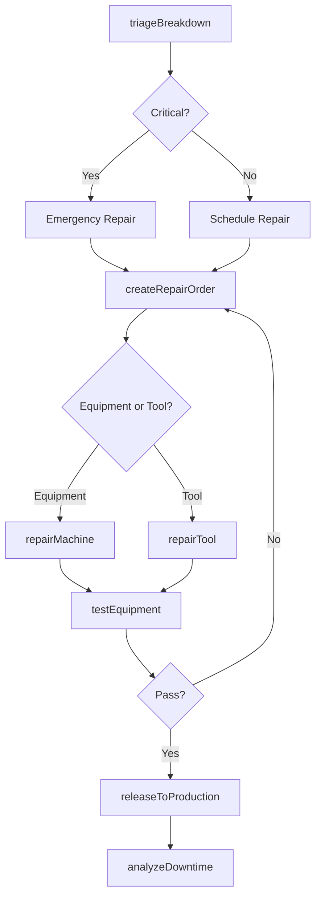
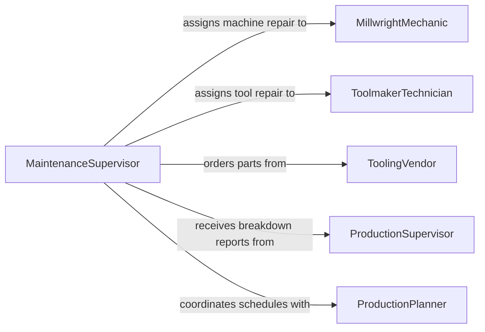

# Repair Production Equipment Tools

> Business-as-Code definition for repairing production equipment and tools. Models the breakdown response, repair execution, and return-to-service workflow for manufacturing machinery, fixtures, and hand tools.

## Overview

Production equipment and tool repair involves responding to breakdowns or scheduled maintenance on manufacturing machinery, cutting tools, dies, jigs, and fixtures, then restoring them to production-ready condition. This definition exposes actions for breakdown triage, repair prioritization, execution of mechanical and tooling repairs, and production readiness verification. Events enable automated coordination between maintenance and production scheduling.

## Actors

| Actor | Description |
|-------|-------------|
| ProductionSupervisor | Reports breakdowns and needs equipment restored to meet schedules |
| ToolingVendor | Supplies cutting inserts, die components, and tooling accessories |
| MachineManufacturer | Provides service manuals, firmware updates, and technical support |
| ProductionPlanner | Adjusts production schedules based on equipment availability |
| SafetyDepartment | Ensures repair work follows lockout/tagout and safety protocols |

## Roles

| Role | Description |
|------|-------------|
| MillwrightMechanic | Performs structural and mechanical repairs on production machinery |
| ToolmakerTechnician | Repairs and resharpens cutting tools, dies, and fixtures |
| MaintenanceSupervisor | Prioritizes and assigns repair work based on production impact |
| ProcessEngineer | Investigates root causes and recommends design improvements |

## Entities

| Entity | Description |
|--------|-------------|
| ProductionEquipment | A machine, press, or CNC unit used in manufacturing |
| ProductionTool | A cutting tool, die, jig, or fixture used in the production process |
| BreakdownReport | Documentation of equipment failure including symptoms and timing |
| RepairOrder | Work order specifying repair scope, parts, and estimated downtime |
| DowntimeRecord | Log of production time lost due to equipment unavailability |
| SparePartsKit | Pre-assembled set of common replacement components for a machine |

## Actions

| Action | Description |
|--------|-------------|
| triageBreakdown | Assess the severity and production impact of the equipment failure |
| createRepairOrder | Generate a work order with diagnosis, parts, and schedule |
| repairMachine | Perform mechanical, hydraulic, or pneumatic repairs on the equipment |
| repairTool | Resharpen, regrind, or restore a production tool to specifications |
| testEquipment | Run trial parts or cycles to verify equipment performance |
| releaseToProduction | Clear the equipment for return to active manufacturing |
| analyzeDowntime | Review downtime data to identify chronic failure patterns |

## Events

| Event | Description |
|-------|-------------|
| breakdownTriaged | Equipment failure has been assessed and prioritized |
| repairOrderCreated | A repair work order has been generated |
| machineRepaired | Mechanical repair on production equipment has been completed |
| toolRepaired | A production tool has been restored to specification |
| equipmentTested | Trial run verification has been completed |
| equipmentReleasedToProduction | The equipment has been cleared for manufacturing use |
| chronicFailureIdentified | Recurring breakdown pattern has been detected |

## Searches

| Search | Description |
|--------|-------------|
| findEquipment | List production equipment by type, line, or operational status |
| getRepairOrders | Retrieve work orders by status, machine, or mechanic assignment |
| getDowntimeHistory | Look up equipment downtime records by period or failure type |
| findToolsDueForService | Identify tools approaching their resharpening or replacement interval |

## Workflow



## Actor Relationships



## Usage

### Calling Actions

```typescript
import { repairProductionEquipmentTools } from '@headlessly/repair-production-equipment-tools'

const production = repairProductionEquipmentTools()

// Triage a CNC machine breakdown
const triage = await production.triageBreakdown({
  equipmentId: 'cnc-lathe-07',
  symptoms: ['spindle vibration', 'tool holder not clamping'],
  productionImpact: 'line-stopped',
  affectedOrders: ['PO-4421', 'PO-4422']
})

// Create repair order
const order = await production.createRepairOrder({
  equipmentId: triage.equipmentId,
  priority: triage.priority,
  diagnosis: 'spindle bearing failure and drawbar spring fatigue',
  requiredParts: ['spindle-bearing-set', 'drawbar-spring-kit']
})

// Test after repair
const test = await production.testEquipment({
  equipmentId: order.equipmentId,
  testType: 'trial-part',
  criteria: { surfaceFinish: 1.6, runout: 0.005, clampForce: 'nominal' }
})
```

### Event-Driven Automation

```typescript
// Alert production planning when equipment is restored
production.equipmentReleasedToProduction(async ({ equipmentId, repairDuration }) => {
  await notify({
    to: 'production-planner',
    message: `${equipmentId} back online after ${repairDuration}h downtime. Resume scheduling.`
  })
})

// Escalate chronic failures to engineering
production.chronicFailureIdentified(async ({ equipmentId, failureCount, period }) => {
  await notify({
    to: 'process-engineer',
    message: `${equipmentId} has failed ${failureCount} times in ${period}. Design review recommended.`
  })
})
```
