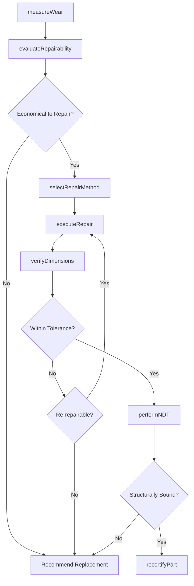
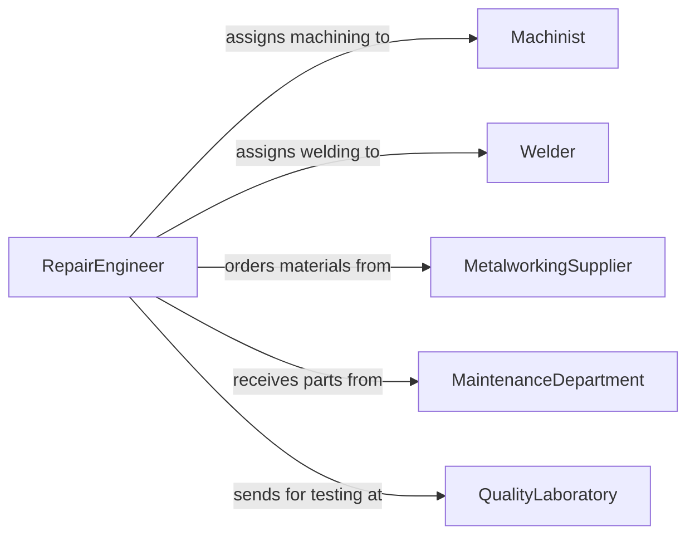

# Repair Worn Damaged Defective Mechanical

> Business-as-Code definition for repairing worn, damaged, or defective mechanical parts. Models the inspection, restoration, and recertification workflow for individual components that have degraded below acceptable service limits.

## Overview

Repairing worn, damaged, or defective mechanical parts involves evaluating the condition of gears, shafts, bearings, bushings, and other components, then restoring them through machining, welding, plating, or heat treatment. This definition exposes actions for wear measurement, repair method selection, restoration execution, and dimensional verification. Events enable automated tracking of component lifecycle and failure trend analysis.

## Actors

| Actor | Description |
|-------|-------------|
| MaintenanceDepartment | Submits worn or damaged parts for evaluation and repair |
| MetalworkingSupplier | Provides welding consumables, plating chemicals, and abrasives |
| OEMManufacturer | Supplies original specifications and material certifications |
| QualityLaboratory | Provides non-destructive testing and hardness verification |
| OperationsManager | Needs repaired parts returned promptly to minimize downtime |

## Roles

| Role | Description |
|------|-------------|
| Machinist | Performs turning, grinding, and milling to restore part dimensions |
| Welder | Builds up worn surfaces using welding or hardfacing techniques |
| RepairEngineer | Evaluates part condition and selects appropriate repair methods |
| QualityInspector | Verifies repaired parts meet dimensional and material specifications |

## Entities

| Entity | Description |
|--------|-------------|
| MechanicalPart | A gear, shaft, bearing, or other component requiring repair |
| WearMeasurement | Dimensional data documenting the extent of part degradation |
| RepairProcedure | Step-by-step instructions for restoring a specific part |
| MaterialCertification | Documentation of alloy composition and heat treatment of the part |
| InspectionRecord | Post-repair measurement and testing results |
| RepairCostEstimate | Projected labor and material costs versus replacement cost |

## Actions

| Action | Description |
|--------|-------------|
| measureWear | Record dimensional deviation from original specifications |
| evaluateRepairability | Determine if the part can be economically restored |
| selectRepairMethod | Choose machining, welding, plating, or other restoration technique |
| executeRepair | Perform the selected restoration process on the part |
| verifyDimensions | Measure the repaired part against original tolerances |
| performNDT | Conduct non-destructive testing to verify structural integrity |
| recertifyPart | Approve the repaired part for return to service |

## Events

| Event | Description |
|-------|-------------|
| wearMeasured | Dimensional inspection of the worn part has been completed |
| repairabilityEvaluated | Part has been assessed for repair versus replacement |
| repairMethodSelected | The restoration approach has been determined |
| repairExecuted | The restoration process has been completed on the part |
| dimensionsVerified | Post-repair dimensional inspection is complete |
| ndtCompleted | Non-destructive testing has been performed |
| partRecertified | The repaired part has been approved for service |

## Searches

| Search | Description |
|--------|-------------|
| findParts | List parts by type, wear condition, or repair status |
| getRepairHistory | Retrieve past repair records for a specific part or part type |
| getWearTrends | Analyze wear patterns across a fleet of similar components |
| findPartsAwaitingRepair | Identify parts in queue sorted by priority and downtime impact |

## Workflow



## Actor Relationships



## Usage

### Calling Actions

```typescript
import { repairWornDamagedDefectiveMechanical } from '@headlessly/repair-worn-damaged-defective-mechanical'

const parts = repairWornDamagedDefectiveMechanical()

// Measure wear on a drive shaft
const measurement = await parts.measureWear({
  partId: 'shaft-2291',
  type: 'drive-shaft',
  originalDiameter: 50.000,
  measuredDiameter: 49.872,
  toleranceBand: 0.025
})

// Evaluate whether repair is economical
const evaluation = await parts.evaluateRepairability({
  partId: measurement.partId,
  wearAmount: measurement.deviation,
  replacementCost: 2400,
  estimatedRepairCost: 800
})

// Verify dimensions after repair
const verification = await parts.verifyDimensions({
  partId: 'shaft-2291',
  checkpoints: ['journal-diameter', 'runout', 'surface-finish'],
  tolerances: { diameter: 0.025, runout: 0.010, roughness: 1.6 }
})
```

### Event-Driven Automation

```typescript
// Notify operations when part is recertified
parts.partRecertified(async ({ partId, equipmentId }) => {
  await notify({
    to: 'maintenance-department',
    message: `Part ${partId} repaired and recertified. Ready for reinstallation on ${equipmentId}.`
  })
})

// Track wear trends for predictive maintenance
parts.wearMeasured(async ({ partId, partType, deviation }) => {
  await analytics.recordWearData({
    partType,
    deviation,
    timestamp: new Date()
  })
})
```
