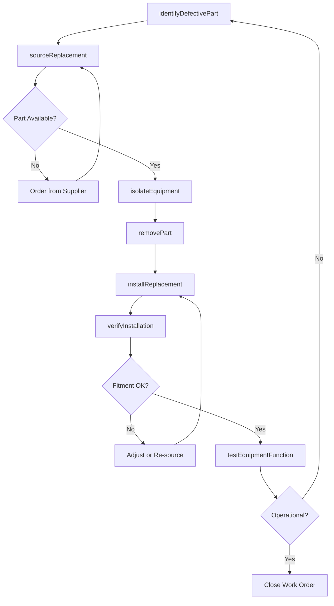

# Replace Worn Damaged Defective Mechanical

> Business-as-Code definition for replacing worn, damaged, or defective mechanical parts. Models the identification, sourcing, removal, installation, and verification workflow for components that cannot be economically repaired.

## Overview

Replacing worn, damaged, or defective mechanical parts involves identifying components that have degraded beyond repair limits, sourcing correct replacements, removing the failed parts, installing new components, and verifying proper fit and function. This definition exposes actions for condition assessment, part sourcing, swap execution, and post-installation testing. Events enable automated inventory replenishment and equipment availability tracking.

## Actors

| Actor | Description |
|-------|-------------|
| EquipmentOperator | Reports part failures and confirms equipment function after replacement |
| PartsSupplier | Provides OEM and aftermarket replacement components |
| WarehouseManager | Manages spare parts inventory and issues components for work orders |
| OEMRepresentative | Provides part numbers, specifications, and compatibility guidance |
| SafetyOfficer | Ensures replacement procedures comply with safety standards |

## Roles

| Role | Description |
|------|-------------|
| MaintenanceTechnician | Removes failed parts and installs replacements |
| MaintenancePlanner | Schedules replacement work and coordinates parts availability |
| QualityInspector | Verifies correct installation and post-replacement function |
| InventoryController | Tracks spare parts consumption and reorder levels |

## Entities

| Entity | Description |
|--------|-------------|
| DefectivePart | The worn, damaged, or failed component being removed |
| ReplacementPart | The new or refurbished component being installed |
| WorkOrder | Documentation of the replacement task and associated procedures |
| PartSpecification | Technical requirements for the replacement component |
| InstallationRecord | Documentation of replacement work including torque values and fitment |
| InventoryTransaction | Stock movement record for parts issued and returned |

## Actions

| Action | Description |
|--------|-------------|
| identifyDefectivePart | Determine which component has failed and confirm part number |
| sourceReplacement | Locate and requisition the correct replacement part |
| isolateEquipment | Shut down and lock out equipment for safe part removal |
| removePart | Extract the failed component from the equipment |
| installReplacement | Fit and secure the new component per specifications |
| verifyInstallation | Confirm correct fitment, alignment, and torque values |
| testEquipmentFunction | Run the equipment to verify restored operation |

## Events

| Event | Description |
|-------|-------------|
| defectivePartIdentified | A worn or failed component has been confirmed for replacement |
| replacementSourced | A replacement part has been located and issued |
| equipmentIsolated | Equipment has been locked out for safe access |
| partRemoved | The defective component has been extracted |
| replacementInstalled | The new component has been fitted and secured |
| installationVerified | Post-installation inspection confirms correct fitment |
| equipmentFunctionVerified | The equipment has been tested and returned to service |

## Searches

| Search | Description |
|--------|-------------|
| findDefectiveParts | List parts pending replacement by equipment, type, or priority |
| getReplacementAvailability | Check inventory for specific replacement part numbers |
| getReplacementHistory | Retrieve past replacement records for a specific equipment unit |
| findPendingReplacements | Identify work orders waiting on parts or scheduling |

## Entity Relationships


## State Diagram


## Workflow



## Actor Relationships


## Usage

### Calling Actions

```typescript
import { replaceWornDamagedDefectiveMechanical } from '@headlessly/replace-worn-damaged-defective-mechanical'

const replacement = replaceWornDamagedDefectiveMechanical()

// Identify a failed bearing on a conveyor
const defect = await replacement.identifyDefectivePart({
  equipmentId: 'conv-3301',
  partLocation: 'drive-end-bearing',
  symptoms: ['grinding noise', 'elevated temperature'],
  partNumber: 'SKF-6310-2RS'
})

// Source the replacement part
const sourced = await replacement.sourceReplacement({
  partNumber: defect.partNumber,
  preferredSource: 'warehouse',
  fallbackSource: 'supplier'
})

// Test equipment after installation
const testResult = await replacement.testEquipmentFunction({
  equipmentId: 'conv-3301',
  tests: ['vibration-level', 'temperature', 'belt-tracking'],
  acceptanceCriteria: { vibration: 3.0, temperature: 55, tracking: 'centered' }
})
```

### Event-Driven Automation

```typescript
// Auto-reorder when inventory drops below threshold
replacement.replacementSourced(async ({ partNumber, warehouseStock }) => {
  if (warehouseStock <= 2) {
    await procurement.createOrder({
      partNumber,
      quantity: 10,
      urgency: 'standard'
    })
  }
})

// Notify operations when equipment is restored
replacement.equipmentFunctionVerified(async ({ equipmentId, workOrderId }) => {
  await notify({
    to: 'equipment-operator',
    message: `Part replacement on ${equipmentId} complete. Equipment released to service.`
  })
})
```
