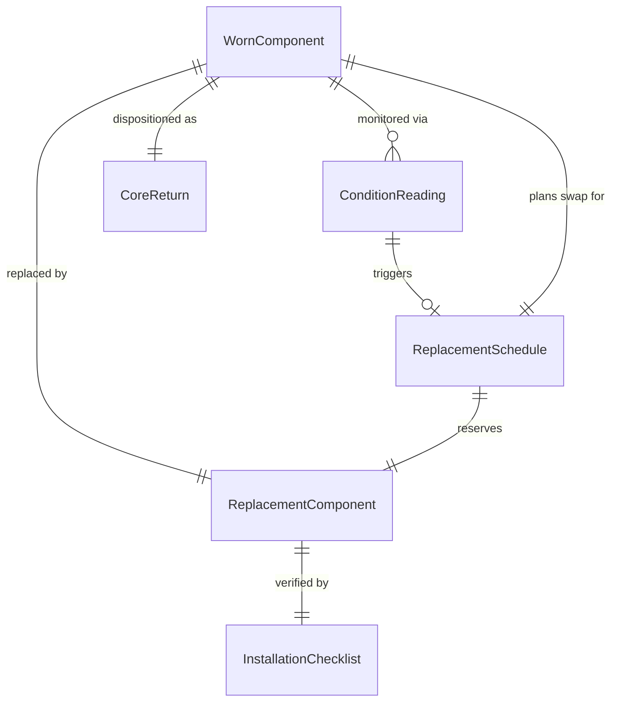
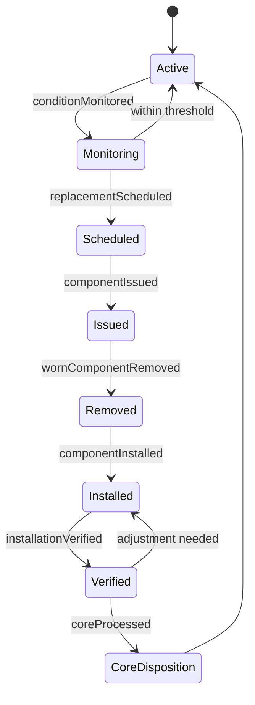
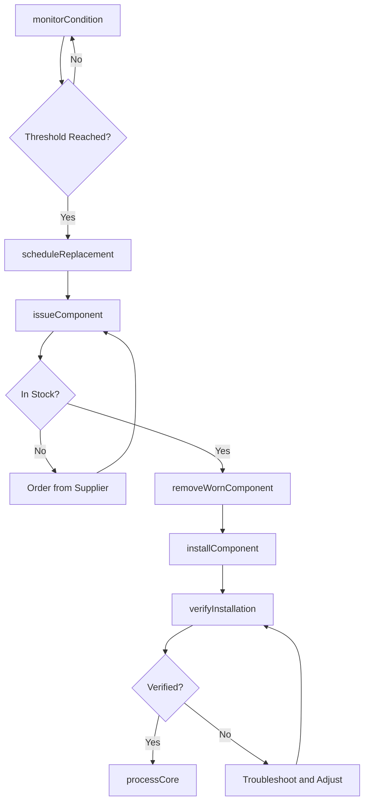
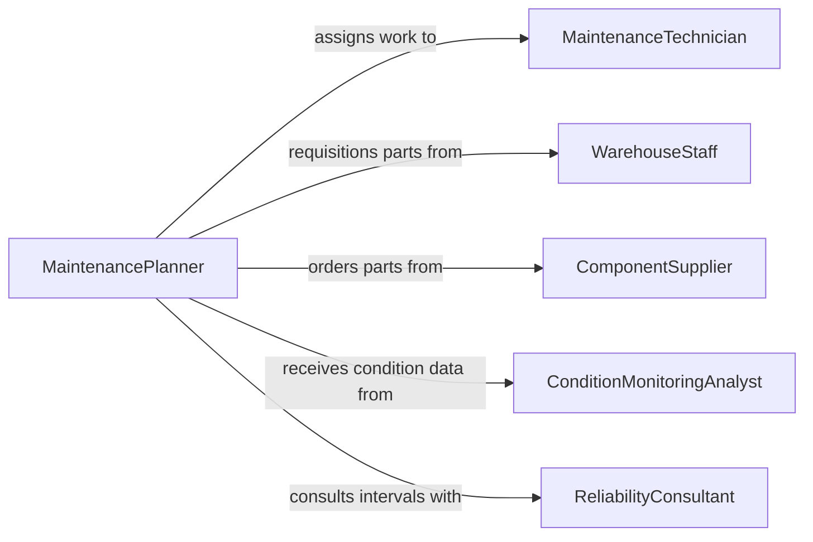

# Replace Worn Equipment Components

> Business-as-Code definition for replacing worn equipment components. Models the predictive and corrective replacement workflow from wear monitoring through component swap, installation verification, and inventory management.

## Overview

Replacing worn equipment components involves monitoring component condition, identifying parts approaching end of useful life, sourcing replacements, performing the swap, and verifying restored equipment performance. This definition exposes actions for wear tracking, replacement scheduling, component installation, and post-swap testing. Events enable automated inventory replenishment and predictive maintenance integration.

## Actors

| Actor | Description |
|-------|-------------|
| EquipmentOperator | Monitors equipment performance and reports abnormal wear indicators |
| ComponentSupplier | Provides bearings, belts, filters, seals, and other wear components |
| MaintenanceContractor | Performs replacement work when internal resources are unavailable |
| WarehouseStaff | Issues parts from inventory and receives returned cores |
| ReliabilityConsultant | Advises on optimal replacement intervals based on failure data |

## Roles

| Role | Description |
|------|-------------|
| MaintenanceTechnician | Performs hands-on component removal and installation |
| MaintenancePlanner | Schedules preventive replacements and coordinates resources |
| ConditionMonitoringAnalyst | Interprets vibration, temperature, and wear data to predict failures |
| InventoryManager | Maintains spare parts stock levels and reorder points |

## Entities

| Entity | Description |
|--------|-------------|
| WornComponent | A part that has degraded to or beyond its replacement threshold |
| ReplacementComponent | The new part being installed to restore equipment function |
| ReplacementSchedule | Planned timeline for preventive component swaps |
| ConditionReading | Vibration, temperature, or wear measurement used to assess component life |
| InstallationChecklist | Step-by-step verification tasks for proper component fitting |
| CoreReturn | The worn part returned for rebuild, recycling, or disposal |

## Actions

| Action | Description |
|--------|-------------|
| monitorCondition | Collect vibration, temperature, or wear data on active components |
| scheduleReplacement | Plan a component swap based on condition data or time intervals |
| issueComponent | Retrieve the replacement part from inventory for the work order |
| removeWornComponent | Extract the degraded part from the equipment |
| installComponent | Fit and secure the new component per manufacturer specifications |
| verifyInstallation | Confirm alignment, torque, clearance, and operational parameters |
| processCore | Handle the removed component for rebuild, recycle, or scrap |

## Events

| Event | Description |
|-------|-------------|
| conditionMonitored | A condition reading has been recorded for a component |
| replacementScheduled | A component swap has been planned and work order created |
| componentIssued | A replacement part has been drawn from inventory |
| wornComponentRemoved | The degraded part has been extracted from equipment |
| componentInstalled | The new part has been fitted and secured |
| installationVerified | Post-installation checks confirm proper fitment |
| coreProcessed | The removed component has been dispositioned |

## Searches

| Search | Description |
|--------|-------------|
| findWornComponents | List components approaching or exceeding replacement thresholds |
| getReplacementSchedule | Retrieve upcoming planned component swaps by equipment or date |
| getConditionTrends | Analyze condition monitoring data trends for a specific component |
| findAvailableSpares | Check stock levels for replacement components by part number |

## Entity Relationships



## State Diagram



## Workflow



## Actor Relationships



## Usage

### Calling Actions

```typescript
import { replaceWornEquipmentComponents } from '@headlessly/replace-worn-equipment-components'

const components = replaceWornEquipmentComponents()

// Monitor condition of a motor bearing
const reading = await components.monitorCondition({
  equipmentId: 'motor-2205',
  componentId: 'bearing-drive-end',
  measurements: { vibration: 4.2, temperature: 72 },
  thresholds: { vibration: 5.0, temperature: 85 }
})

// Schedule replacement when threshold is approaching
const schedule = await components.scheduleReplacement({
  equipmentId: 'motor-2205',
  componentId: 'bearing-drive-end',
  partNumber: 'SKF-6308-2Z',
  scheduledDate: '2026-02-15',
  estimatedDowntime: 2
})

// Verify installation after swap
const verification = await components.verifyInstallation({
  equipmentId: 'motor-2205',
  componentId: 'bearing-drive-end',
  checks: ['vibration-level', 'temperature', 'alignment'],
  acceptanceCriteria: { vibration: 2.0, temperature: 45, alignment: 0.05 }
})
```

### Event-Driven Automation

```typescript
// Auto-schedule replacement when condition threshold is reached
components.conditionMonitored(async ({ equipmentId, componentId, measurements, thresholds }) => {
  const vibrationRatio = measurements.vibration / thresholds.vibration
  if (vibrationRatio > 0.8) {
    await components.scheduleReplacement({
      equipmentId,
      componentId,
      urgency: vibrationRatio > 0.95 ? 'immediate' : 'planned'
    })
  }
})

// Auto-reorder when spare stock drops below minimum
components.componentIssued(async ({ partNumber, remainingStock, reorderPoint }) => {
  if (remainingStock <= reorderPoint) {
    await procurement.createOrder({
      partNumber,
      quantity: reorderPoint * 2,
      urgency: 'standard'
    })
  }
})
```
