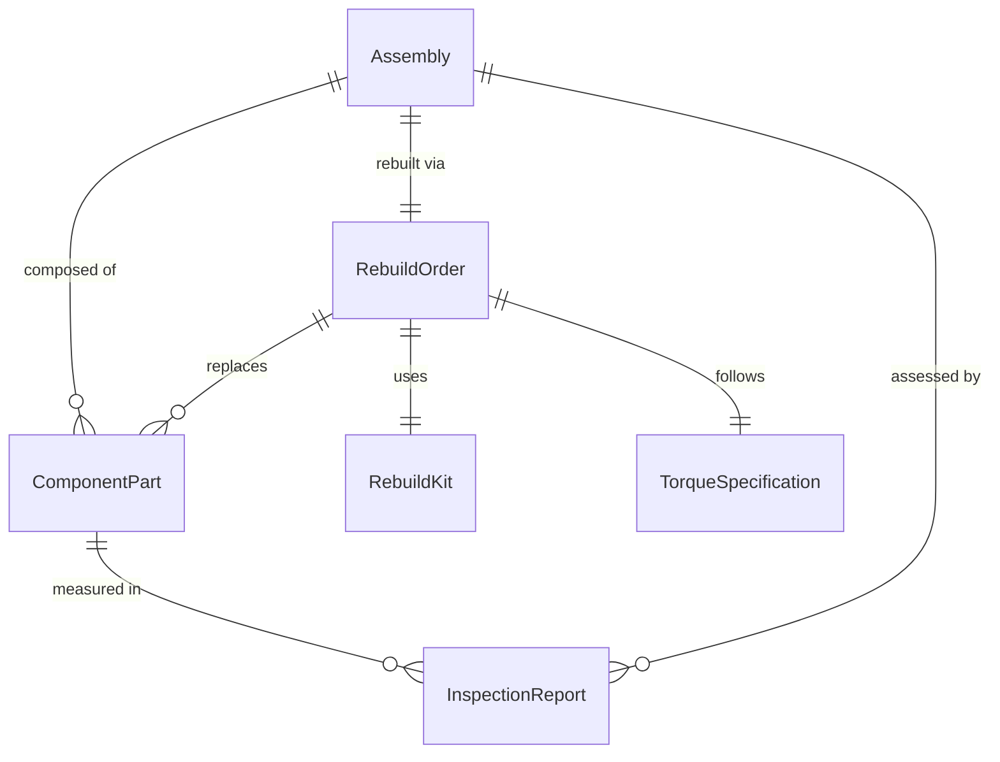
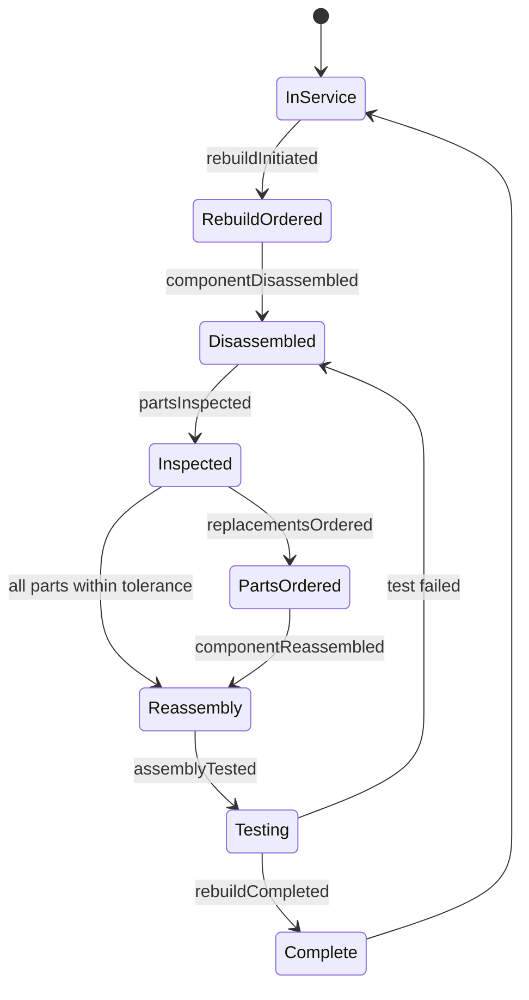
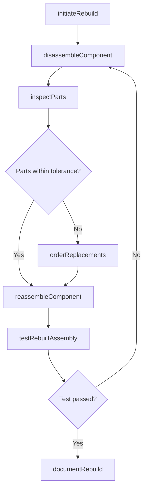
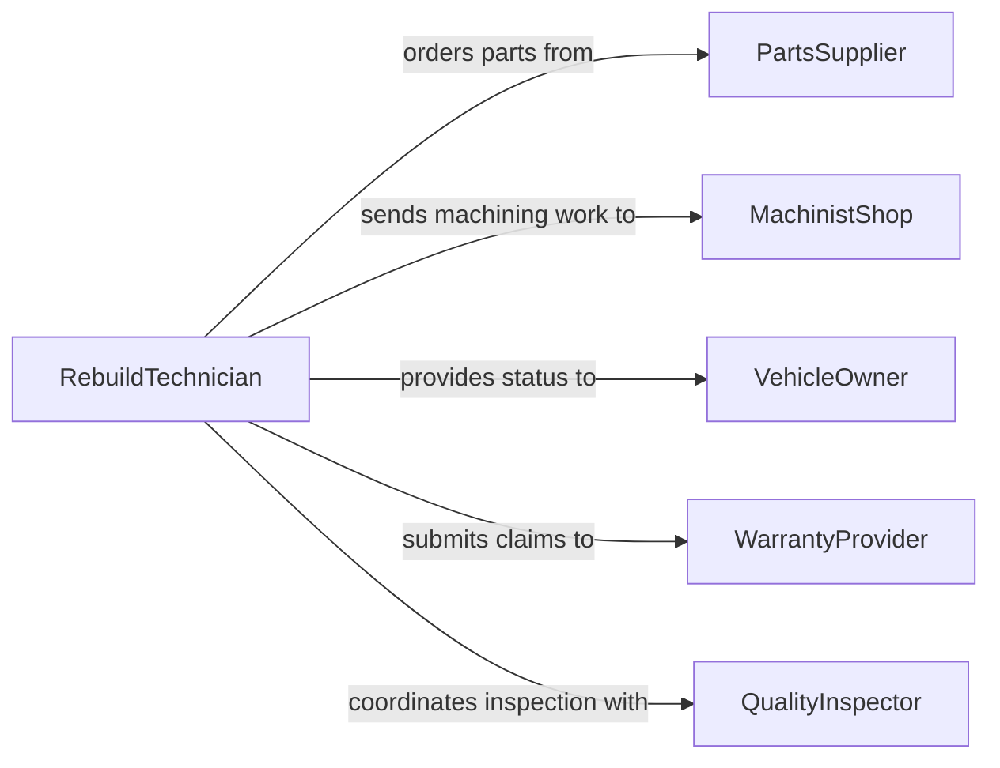

# Rebuild Parts Components

> Business-as-Code definition for rebuilding mechanical parts and components. Models the full rebuild lifecycle from teardown and inspection through reassembly and verification.

## Overview

Rebuilding parts or components involves disassembling worn or damaged mechanical assemblies, inspecting individual pieces for wear or failure, replacing defective elements, and reassembling the unit to original specifications. This definition exposes actions for each phase of the rebuild process, events for tracking progress, and searches for locating rebuild candidates and parts inventory.

## Actors

| Actor | Description |
|-------|-------------|
| PartsSupplier | Provides OEM and aftermarket replacement components |
| VehicleOwner | Authorizes rebuild work and receives completed assemblies |
| WarrantyProvider | Covers eligible rebuild costs under warranty terms |
| MachinistShop | Performs precision machining operations such as boring or honing |
| QualityInspector | Certifies rebuilt assemblies meet manufacturer tolerances |

## Roles

| Role | Description |
|------|-------------|
| RebuildTechnician | Performs disassembly, inspection, and reassembly of components |
| ShopForeman | Oversees rebuild operations and assigns work orders |
| PartsSpecialist | Sources and verifies replacement parts against specifications |
| QualityAssuranceLead | Validates rebuilt assemblies against OEM standards |

## Entities

| Entity | Description |
|--------|-------------|
| RebuildOrder | A work order authorizing the rebuild of a specific component |
| Assembly | The mechanical unit being rebuilt (e.g., transmission, alternator) |
| ComponentPart | An individual piece within the assembly |
| InspectionReport | Findings from measuring and evaluating component wear |
| TorqueSpecification | Required fastener torque values for reassembly |
| RebuildKit | A packaged set of gaskets, seals, and bearings for the rebuild |

## Actions

| Action | Description |
|--------|-------------|
| initiateRebuild | Create a rebuild order for a specific assembly |
| disassembleComponent | Tear down the assembly into individual parts |
| inspectParts | Measure and evaluate each part against wear tolerances |
| orderReplacements | Procure replacement parts for worn or damaged components |
| reassembleComponent | Put the assembly back together with new and reusable parts |
| testRebuiltAssembly | Run functional and performance tests on the rebuilt unit |
| documentRebuild | Record measurements, replaced parts, and final test results |

## Events

| Event | Description |
|-------|-------------|
| rebuildInitiated | A rebuild order has been created and assigned |
| componentDisassembled | The assembly has been fully torn down |
| partsInspected | All individual parts have been measured and evaluated |
| replacementsOrdered | Replacement parts have been procured |
| componentReassembled | The assembly has been rebuilt to specification |
| assemblyTested | Functional testing of the rebuilt unit is complete |
| rebuildCompleted | The rebuild is finished and documentation is finalized |

## Searches

| Search | Description |
|--------|-------------|
| findRebuildOrders | List rebuild orders by status, assembly type, or vehicle |
| getInspectionResults | Retrieve wear measurements and pass/fail data for parts |
| findAvailableParts | Search inventory for replacement components by part number |
| getRebuildHistory | Look up previous rebuilds for a specific assembly or vehicle |

## Entity Relationships



## State Diagram



## Workflow



## Actor Relationships



## Usage

### Calling Actions

```typescript
import { rebuildPartsComponents } from '@headlessly/rebuild-parts-components'

const rebuilds = rebuildPartsComponents()

// Initiate a transmission rebuild
const order = await rebuilds.initiateRebuild({
  assemblyType: 'Automatic Transmission',
  vehicleId: 'VH-2024-0891',
  reason: 'Slipping gears and torque converter shudder'
})

// Disassemble and inspect
await rebuilds.disassembleComponent({ rebuildOrderId: order.id })
const inspection = await rebuilds.inspectParts({ rebuildOrderId: order.id })

// Order replacement parts for worn components
await rebuilds.orderReplacements({
  rebuildOrderId: order.id,
  parts: inspection.failedParts.map(p => ({ partNumber: p.partNumber, quantity: 1 }))
})

// Reassemble and test
await rebuilds.reassembleComponent({ rebuildOrderId: order.id })
await rebuilds.testRebuiltAssembly({ rebuildOrderId: order.id })
```

### Event-Driven Automation

```typescript
// Automatically order common rebuild kits when teardown is complete
rebuilds.componentDisassembled(async ({ rebuildOrderId, assemblyType }) => {
  const kit = await findRebuildKit({ assemblyType })
  if (kit) {
    await rebuilds.orderReplacements({
      rebuildOrderId,
      parts: kit.includedParts
    })
  }
})

// Notify vehicle owner when rebuild passes testing
rebuilds.assemblyTested(async ({ rebuildOrderId, testResult }) => {
  if (testResult === 'passed') {
    const order = await rebuilds.findRebuildOrders({ id: rebuildOrderId })
    await notify({
      to: order.vehicleOwner,
      message: `Your ${order.assemblyType} rebuild is complete and ready for pickup.`
    })
  }
})
```
