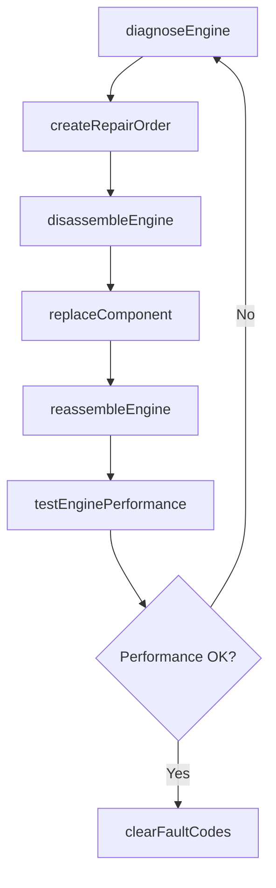
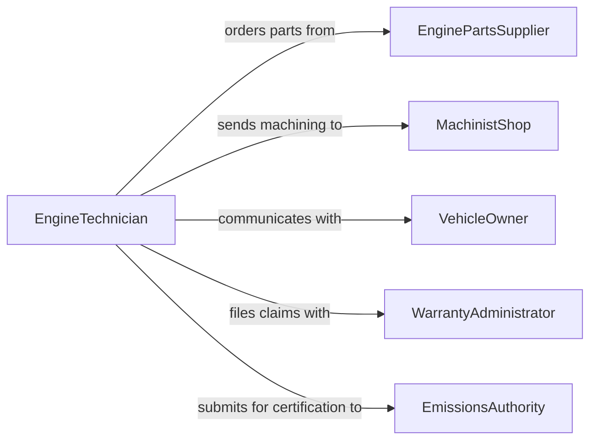

# Repair Defective Engines Engine Components

> Business-as-Code definition for repairing defective engines and engine components. Models the diagnostic, teardown, repair, and validation workflow for internal combustion and hybrid powertrains.

## Overview

Engine repair involves diagnosing mechanical and electrical failures in engine assemblies, disassembling affected subsystems, replacing or reconditioning faulty components, and verifying restored performance. This definition exposes actions for fault diagnosis through OBD and physical inspection, component-level repair procedures, and post-repair dynamometer or road testing to confirm the engine meets manufacturer specifications.

## Actors

| Actor | Description |
|-------|-------------|
| VehicleOwner | Reports symptoms and authorizes engine repair work |
| EnginePartsSupplier | Provides OEM and remanufactured engine components |
| WarrantyAdministrator | Processes warranty claims for covered engine repairs |
| MachinistShop | Performs precision machining such as cylinder boring and crankshaft grinding |
| EmissionsAuthority | Certifies that repaired engines meet emissions standards |
| FleetManager | Coordinates engine repair schedules for commercial vehicle fleets |

## Roles

| Role | Description |
|------|-------------|
| EngineTechnician | Diagnoses faults and performs engine repair procedures |
| MasterMechanic | Handles complex engine rebuilds and performance tuning |
| ServiceWriter | Documents symptoms, creates repair orders, and communicates estimates |
| DiagnosticSpecialist | Operates electronic diagnostic equipment and interprets fault codes |

## Entities

| Entity | Description |
|--------|-------------|
| Engine | The powertrain assembly being diagnosed and repaired |
| RepairOrder | A work order detailing the authorized engine repair scope |
| FaultCode | An OBD-II or manufacturer-specific diagnostic trouble code |
| EngineComponent | A specific part within the engine such as a head gasket, piston, or turbocharger |
| DiagnosticReport | Compiled results from electronic and physical engine inspection |
| PerformanceTestResult | Data from dynamometer or road test validating repair quality |

## Actions

| Action | Description |
|--------|-------------|
| diagnoseEngine | Run electronic diagnostics and physical inspections to identify faults |
| createRepairOrder | Generate a work order with scope, parts, and estimated cost |
| disassembleEngine | Remove and tear down engine components to access failed parts |
| replaceComponent | Install new or remanufactured parts to replace defective ones |
| reassembleEngine | Put the engine back together with proper torque and timing specs |
| testEnginePerformance | Run the engine on a dynamometer or road test to verify repair |
| clearFaultCodes | Reset diagnostic trouble codes after successful repair |

## Events

| Event | Description |
|-------|-------------|
| engineDiagnosed | Diagnostic evaluation of the engine is complete |
| repairOrderCreated | An engine repair work order has been generated |
| engineDisassembled | The engine has been torn down to access faulty components |
| componentReplaced | A defective engine part has been swapped for a new one |
| engineReassembled | The engine has been rebuilt and is ready for testing |
| performanceTested | Post-repair engine testing is complete |
| faultCodesCleared | Diagnostic trouble codes have been reset |

## Searches

| Search | Description |
|--------|-------------|
| findRepairOrders | List engine repair orders by vehicle, status, or technician |
| getFaultCodes | Retrieve active and historical fault codes for an engine |
| getComponentAvailability | Search parts inventory for engine components by part number |
| getRepairHistory | Look up previous engine repairs for a specific vehicle |
| findPerformanceTests | Retrieve dynamometer or road test results by repair order |

## Workflow



## Actor Relationships



## Usage

### Calling Actions

```typescript
import { repairDefectiveEnginesEngineComponents } from '@headlessly/repair-defective-engines-engine-components'

const engines = repairDefectiveEnginesEngineComponents()

// Diagnose an engine with misfiring symptoms
const diagnosis = await engines.diagnoseEngine({
  vehicleId: 'VH-2024-0773',
  symptoms: ['rough idle', 'check engine light', 'reduced power'],
  scanType: 'full-obd-and-compression'
})

// Create repair order based on diagnosis
const order = await engines.createRepairOrder({
  vehicleId: 'VH-2024-0773',
  faultCodes: diagnosis.activeCodes,
  scope: 'Head gasket replacement and cylinder head resurfacing',
  estimatedCost: 2800
})

// Execute the repair
await engines.disassembleEngine({ repairOrderId: order.id })
await engines.replaceComponent({ repairOrderId: order.id, component: 'head-gasket' })
await engines.reassembleEngine({ repairOrderId: order.id })
await engines.testEnginePerformance({ repairOrderId: order.id })
```

### Event-Driven Automation

```typescript
// Escalate to master mechanic for complex diagnoses
engines.engineDiagnosed(async ({ vehicleId, activeCodes, severity }) => {
  if (severity === 'critical' || activeCodes.length > 5) {
    await assignToMasterMechanic({ vehicleId, reason: 'Complex multi-fault diagnosis' })
  }
})

// File warranty claim when eligible components are replaced
engines.componentReplaced(async ({ repairOrderId, component, vehicleId }) => {
  const vehicle = await getVehicle(vehicleId)
  if (vehicle.warrantyActive && component.warrantyCovered) {
    await fileWarrantyClaim({
      repairOrderId,
      component: component.name,
      vin: vehicle.vin
    })
  }
})
```
