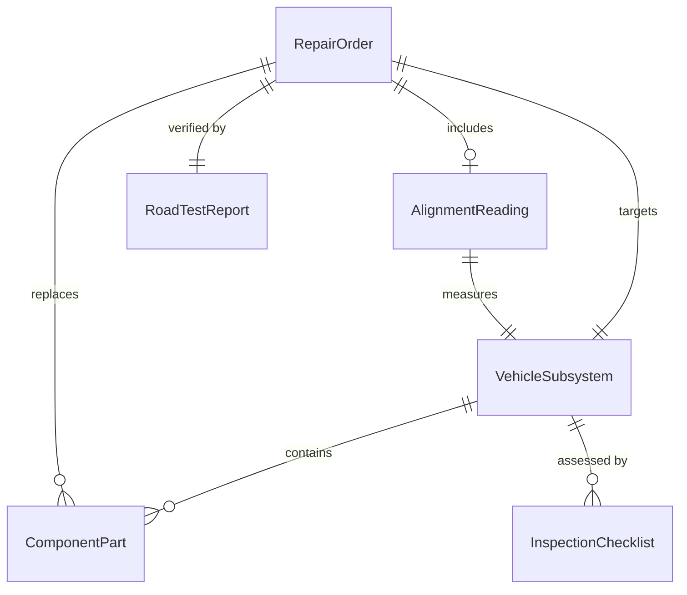
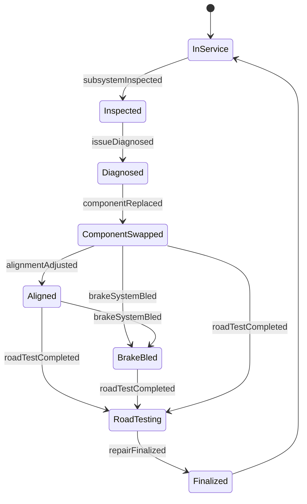
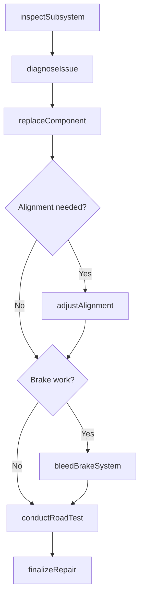
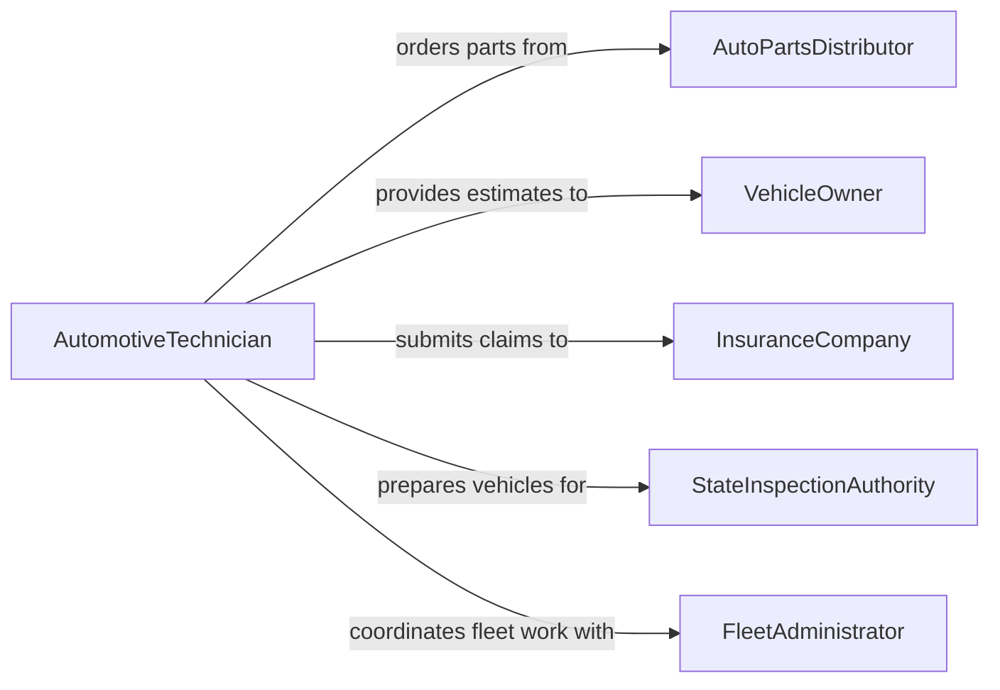

# Repair Non-engine Automotive Vehicle Components

> Business-as-Code definition for repairing non-engine automotive and vehicle components. Models the inspection, diagnosis, repair, and verification workflow for brakes, suspension, steering, drivetrain, and electrical subsystems.

## Overview

Non-engine automotive repair encompasses the diagnosis and repair of vehicle subsystems outside the engine, including braking systems, suspension, steering, transmissions, differentials, exhaust, HVAC, and electrical systems. This definition exposes actions for subsystem inspection, component repair or replacement, alignment and calibration, and post-repair road testing.

## Actors

| Actor | Description |
|-------|-------------|
| VehicleOwner | Reports vehicle issues and authorizes repair work |
| AutoPartsDistributor | Supplies brake pads, rotors, suspension parts, and other components |
| InsuranceCompany | Covers collision-related component repairs under policy terms |
| StateInspectionAuthority | Certifies vehicles meet safety and emissions standards |
| FleetAdministrator | Manages maintenance schedules for commercial vehicle fleets |

## Roles

| Role | Description |
|------|-------------|
| AutomotiveTechnician | Diagnoses and repairs non-engine vehicle subsystems |
| AlignmentSpecialist | Performs wheel alignment and suspension geometry adjustments |
| ServiceAdvisor | Communicates findings and estimates to vehicle owners |
| PartsCoordinator | Sources and verifies parts compatibility for repairs |
| ShopForeman | Assigns work and oversees repair quality |

## Entities

| Entity | Description |
|--------|-------------|
| RepairOrder | A work order specifying the vehicle, symptoms, and authorized repairs |
| VehicleSubsystem | A non-engine system such as brakes, suspension, or steering |
| ComponentPart | An individual part within a subsystem (e.g., brake caliper, CV joint) |
| InspectionChecklist | A structured list of points to evaluate for a given subsystem |
| AlignmentReading | Measurements of camber, caster, and toe angles |
| RoadTestReport | Results from driving the vehicle after repair to verify fix |

## Actions

| Action | Description |
|--------|-------------|
| inspectSubsystem | Perform a visual and functional inspection of a vehicle subsystem |
| diagnoseIssue | Identify the root cause of a reported symptom or failure |
| replaceComponent | Remove the defective part and install a new or remanufactured one |
| adjustAlignment | Set wheel alignment angles to manufacturer specifications |
| bleedBrakeSystem | Remove air from hydraulic brake lines after brake service |
| conductRoadTest | Drive the vehicle to verify the repair under real conditions |
| finalizeRepair | Complete documentation and close the repair order |

## Events

| Event | Description |
|-------|-------------|
| subsystemInspected | A non-engine subsystem has been evaluated |
| issueDiagnosed | The root cause of the vehicle issue has been identified |
| componentReplaced | A defective part has been replaced with a new one |
| alignmentAdjusted | Wheel alignment has been set to specification |
| brakeSystemBled | Hydraulic brake lines have been purged of air |
| roadTestCompleted | The vehicle has been driven and repair verified |
| repairFinalized | The repair order is closed and documentation complete |

## Searches

| Search | Description |
|--------|-------------|
| findRepairOrders | List repair orders by vehicle, subsystem, or status |
| getInspectionResults | Retrieve inspection checklist results for a specific subsystem |
| findComponentParts | Search inventory for parts by subsystem and vehicle compatibility |
| getAlignmentHistory | Look up past alignment readings and adjustments for a vehicle |

## Entity Relationships



## State Diagram



## Workflow



## Actor Relationships



## Usage

### Calling Actions

```typescript
import { repairNonEngineAutomotiveVehicleComponents } from '@headlessly/repair-non-engine-automotive-vehicle-components'

const repairs = repairNonEngineAutomotiveVehicleComponents()

// Inspect brake system for noise complaint
const inspection = await repairs.inspectSubsystem({
  vehicleId: 'VH-2024-0612',
  subsystem: 'front-brakes',
  reportedSymptom: 'Grinding noise when braking'
})

// Diagnose and replace worn components
const diagnosis = await repairs.diagnoseIssue({
  vehicleId: 'VH-2024-0612',
  findings: inspection.findings
})

await repairs.replaceComponent({
  vehicleId: 'VH-2024-0612',
  components: [
    { part: 'front-brake-pads', side: 'both' },
    { part: 'front-rotors', side: 'both' }
  ]
})

await repairs.bleedBrakeSystem({ vehicleId: 'VH-2024-0612' })
await repairs.conductRoadTest({ vehicleId: 'VH-2024-0612' })
await repairs.finalizeRepair({ vehicleId: 'VH-2024-0612' })
```

### Event-Driven Automation

```typescript
// Schedule alignment check whenever suspension work is done
repairs.componentReplaced(async ({ vehicleId, subsystem }) => {
  if (['front-suspension', 'rear-suspension', 'steering'].includes(subsystem)) {
    await repairs.adjustAlignment({ vehicleId })
  }
})

// Notify fleet administrator when fleet vehicle repairs are completed
repairs.repairFinalized(async ({ vehicleId, repairOrderId }) => {
  const vehicle = await getVehicle(vehicleId)
  if (vehicle.fleetId) {
    await notify({
      to: vehicle.fleetAdministrator,
      message: `Vehicle ${vehicle.unitNumber} repair #${repairOrderId} is complete and ready for service.`
    })
  }
})
```
