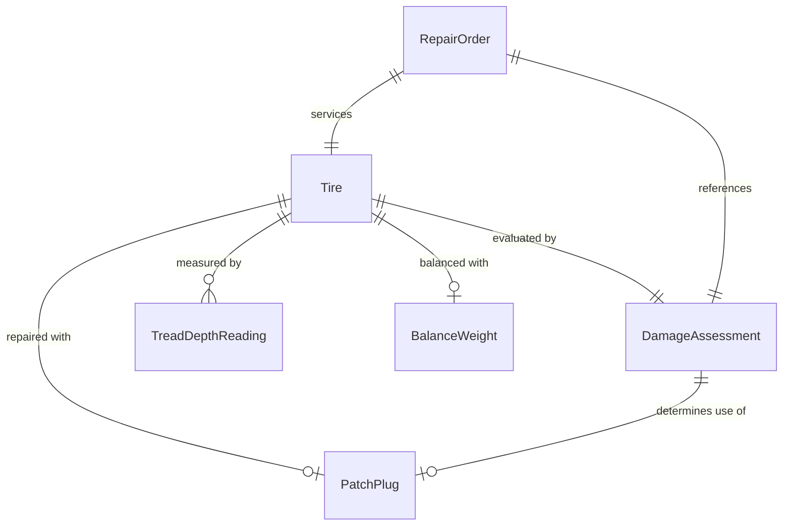
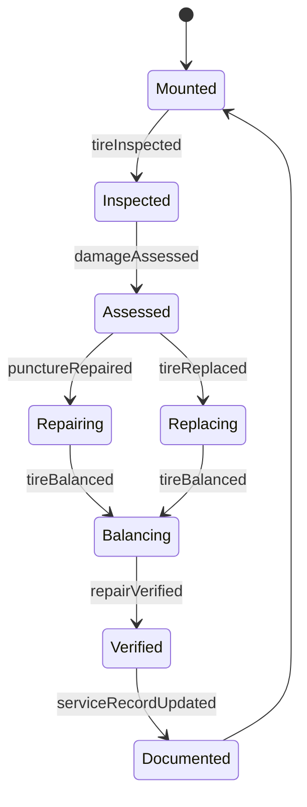
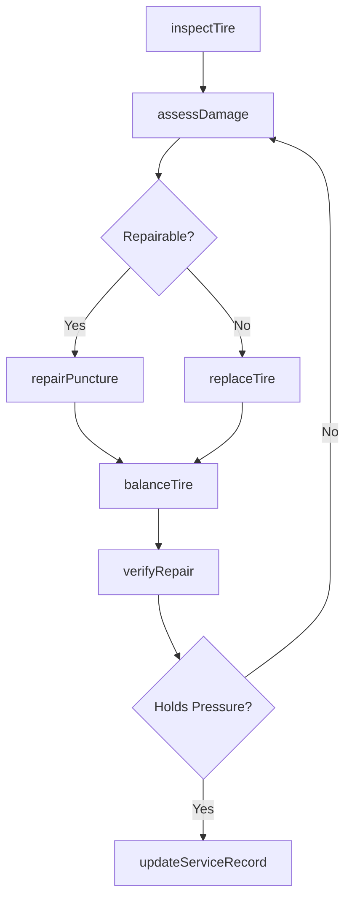
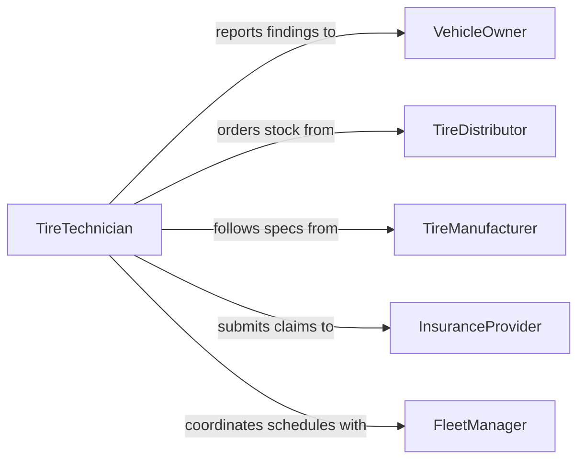

# Repair Tires

> Business-as-Code definition for tire repair operations. Models the diagnosis, patching, plugging, and replacement workflow for damaged tires.

## Overview

Tire repair covers the inspection, diagnosis, and remediation of tire damage including punctures, sidewall damage, and tread wear. This definition exposes actions for evaluating tire condition, performing repairs using patches or plugs, and verifying repaired tires meet safety standards. It also supports tire replacement when repair is not viable.

## Actors

| Actor | Description |
|-------|-------------|
| VehicleOwner | Brings in the vehicle and authorizes repair or replacement |
| TireManufacturer | Provides warranty coverage and repair specifications |
| TireDistributor | Supplies new tires and repair materials |
| FleetManager | Oversees tire maintenance schedules for commercial vehicles |
| InsuranceProvider | Covers tire damage claims from road hazards |

## Roles

| Role | Description |
|------|-------------|
| TireTechnician | Inspects, repairs, and replaces tires |
| ServiceAdvisor | Communicates with vehicle owners and recommends services |
| ShopManager | Oversees tire bay operations and scheduling |
| InventoryClerk | Manages tire and repair supply stock levels |

## Entities

| Entity | Description |
|--------|-------------|
| Tire | The rubber component being inspected or repaired |
| RepairOrder | A work order for tire service on a specific vehicle |
| DamageAssessment | Evaluation of the type, location, and severity of tire damage |
| PatchPlug | The repair material applied to seal a puncture |
| TreadDepthReading | Measurement of remaining tread on the tire |
| BalanceWeight | Weights applied to ensure even tire rotation after service |

## Actions

| Action | Description |
|--------|-------------|
| inspectTire | Examine the tire for punctures, sidewall damage, and tread wear |
| assessDamage | Determine whether the tire is repairable or must be replaced |
| repairPuncture | Apply a patch or plug to seal a puncture in the tread area |
| balanceTire | Rebalance the tire on the wheel after repair |
| replaceTire | Mount and balance a new tire when repair is not viable |
| verifyRepair | Confirm the repaired tire holds pressure and meets safety standards |
| updateServiceRecord | Log the repair details and tire condition in the vehicle record |

## Events

| Event | Description |
|-------|-------------|
| tireInspected | A tire has been visually and physically examined |
| damageAssessed | The repair-or-replace determination has been made |
| punctureRepaired | A patch or plug has been applied to seal the puncture |
| tireBalanced | The tire has been rebalanced on the wheel |
| tireReplaced | A new tire has been mounted in place of the damaged one |
| repairVerified | The repaired tire has passed pressure and safety checks |
| serviceRecordUpdated | Repair details have been logged in the vehicle history |

## Searches

| Search | Description |
|--------|-------------|
| findRepairOrders | List tire repair orders by vehicle, date, or status |
| getTreadDepthReadings | Retrieve tread measurements for a specific vehicle or tire set |
| findTireInventory | Search available tire stock by size, brand, or type |
| getRepairHistory | Look up past tire services for a vehicle |

## Entity Relationships



## State Diagram



## Workflow



## Actor Relationships



## Usage

### Calling Actions

```typescript
import { repairTires } from '@headlessly/repair-tires'

const tires = repairTires()

// Inspect a tire reported as losing pressure
const inspection = await tires.inspectTire({
  vehicleId: 'VH-2024-1122',
  position: 'front-left',
  reportedIssue: 'Slow air leak'
})

// Assess whether the damage is repairable
const assessment = await tires.assessDamage({
  tireId: inspection.tireId,
  damageType: 'puncture',
  location: 'tread-center',
  diameter: 4 // mm
})

// Repair the puncture if eligible
if (assessment.repairable) {
  await tires.repairPuncture({ tireId: inspection.tireId, method: 'patch-plug' })
  await tires.balanceTire({ tireId: inspection.tireId })
  await tires.verifyRepair({ tireId: inspection.tireId })
}
```

### Event-Driven Automation

```typescript
// Alert fleet manager when a tire cannot be repaired
tires.damageAssessed(async ({ tireId, repairable, vehicleId }) => {
  if (!repairable) {
    await notify({
      to: 'fleet-manager',
      message: `Tire ${tireId} on vehicle ${vehicleId} requires replacement.`
    })
  }
})

// Reorder stock when inventory drops below threshold
tires.tireReplaced(async ({ tireSize, tireBrand }) => {
  const stock = await tires.findTireInventory({ size: tireSize, brand: tireBrand })
  if (stock.count < 4) {
    await createPurchaseOrder({ item: `${tireBrand} ${tireSize}`, quantity: 10 })
  }
})
```
