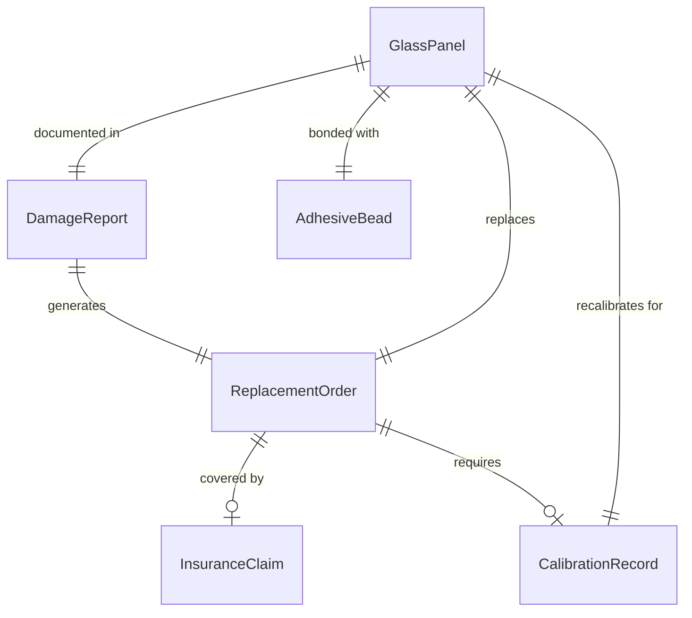
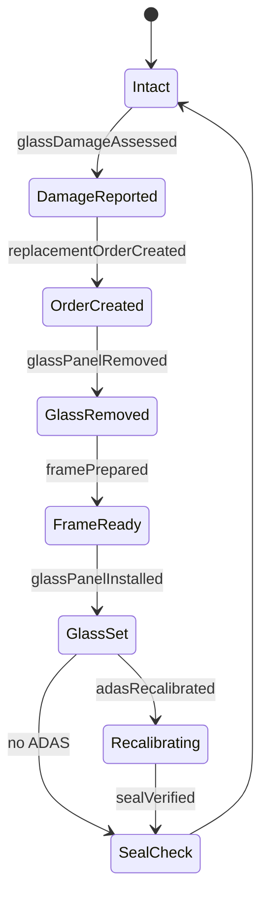
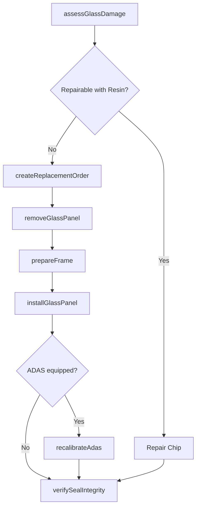
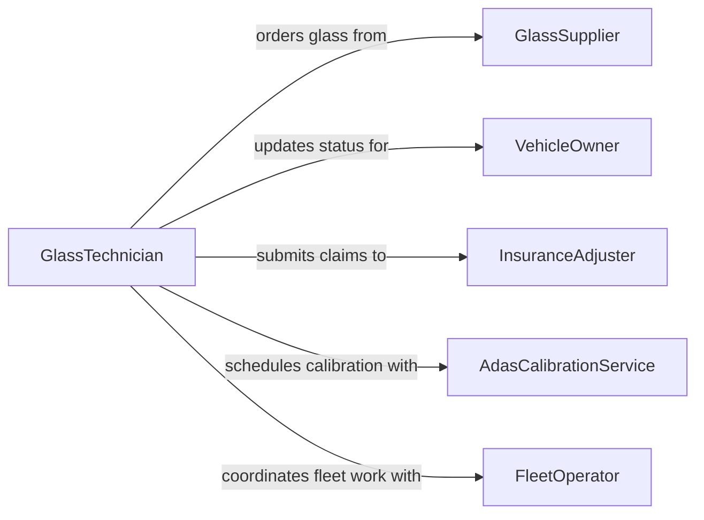

# Replace Vehicle Glass

> Business-as-Code definition for vehicle glass replacement. Models the assessment, removal, installation, and curing workflow for windshields, side windows, and rear glass.

## Overview

Vehicle glass replacement involves evaluating damaged automotive glass, removing the broken or cracked piece, preparing the frame, and installing a new windshield, side window, or rear glass panel. This definition exposes actions for damage assessment, adhesive application, glass installation, and post-install verification including ADAS recalibration when required.

## Actors

| Actor | Description |
|-------|-------------|
| VehicleOwner | Authorizes the glass replacement and schedules service |
| GlassSupplier | Provides OEM and aftermarket replacement glass panels |
| InsuranceAdjuster | Evaluates claims and approves coverage for glass replacement |
| FleetOperator | Manages glass replacement schedules for vehicle fleets |
| AdasCalibrationService | Performs camera and sensor recalibration after windshield replacement |

## Roles

| Role | Description |
|------|-------------|
| GlassTechnician | Removes damaged glass and installs replacements |
| ServiceAdvisor | Coordinates with customers and insurance for approvals |
| QualityInspector | Verifies seal integrity and proper installation |
| InventoryCoordinator | Tracks glass stock and orders replacements |

## Entities

| Entity | Description |
|--------|-------------|
| GlassPanel | The windshield, side window, or rear glass being replaced |
| ReplacementOrder | A work order specifying vehicle, glass type, and scheduling |
| DamageReport | Documentation of the crack, chip, or break location and severity |
| AdhesiveBead | The urethane sealant applied to bond glass to the vehicle frame |
| CalibrationRecord | Results from ADAS camera recalibration after windshield install |
| InsuranceClaim | The coverage claim filed for glass replacement costs |

## Actions

| Action | Description |
|--------|-------------|
| assessGlassDamage | Evaluate the type and extent of damage to the glass panel |
| createReplacementOrder | Generate a work order for glass replacement |
| removeGlassPanel | Safely cut and extract the damaged glass from the vehicle |
| prepareFrame | Clean and prime the frame opening for new adhesive |
| installGlassPanel | Set the new glass panel with urethane adhesive |
| recalibrateAdas | Perform camera and sensor recalibration for windshield replacements |
| verifySealIntegrity | Test the new installation for leaks and proper bonding |

## Events

| Event | Description |
|-------|-------------|
| glassDamageAssessed | The glass panel has been evaluated for replacement eligibility |
| replacementOrderCreated | A work order for glass replacement has been generated |
| glassPanelRemoved | The damaged glass has been cut out and removed |
| framePrepared | The opening has been cleaned and primed for new glass |
| glassPanelInstalled | The new glass panel has been set with adhesive |
| adasRecalibrated | Camera and sensor recalibration is complete |
| sealVerified | The installation has passed leak and bond testing |

## Searches

| Search | Description |
|--------|-------------|
| findReplacementOrders | List glass replacement orders by vehicle, status, or date |
| getGlassInventory | Search available glass panels by vehicle make, model, and year |
| findInsuranceClaims | Retrieve pending or approved insurance claims for glass work |
| getCalibrationRecords | Look up ADAS recalibration results for a specific vehicle |

## Entity Relationships



## State Diagram



## Workflow



## Actor Relationships



## Usage

### Calling Actions

```typescript
import { replaceVehicleGlass } from '@headlessly/replace-vehicle-glass'

const glass = replaceVehicleGlass()

// Assess windshield damage
const damage = await glass.assessGlassDamage({
  vehicleId: 'VH-2024-0455',
  panelType: 'windshield',
  damageType: 'crack',
  length: 18 // inches
})

// Create replacement order
const order = await glass.createReplacementOrder({
  vehicleId: 'VH-2024-0455',
  panelType: 'windshield',
  glassSpec: 'OEM-laminated',
  adasEquipped: true
})

// Perform the replacement
await glass.removeGlassPanel({ orderId: order.id })
await glass.prepareFrame({ orderId: order.id })
await glass.installGlassPanel({ orderId: order.id })
await glass.recalibrateAdas({ orderId: order.id })
await glass.verifySealIntegrity({ orderId: order.id })
```

### Event-Driven Automation

```typescript
// File insurance claim when replacement order is created
glass.replacementOrderCreated(async ({ orderId, vehicleId, panelType }) => {
  await fileInsuranceClaim({
    vehicleId,
    serviceType: `${panelType} replacement`,
    referenceId: orderId
  })
})

// Schedule ADAS recalibration when new windshield is installed
glass.glassPanelInstalled(async ({ orderId, adasEquipped }) => {
  if (adasEquipped) {
    await scheduleCalibration({
      orderId,
      service: 'forward-camera-recalibration'
    })
  }
})
```
