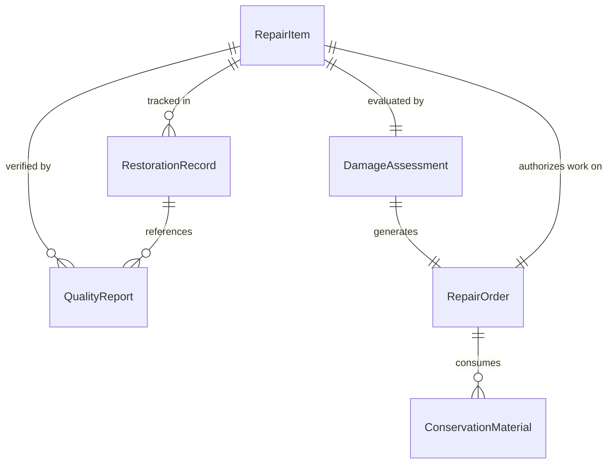
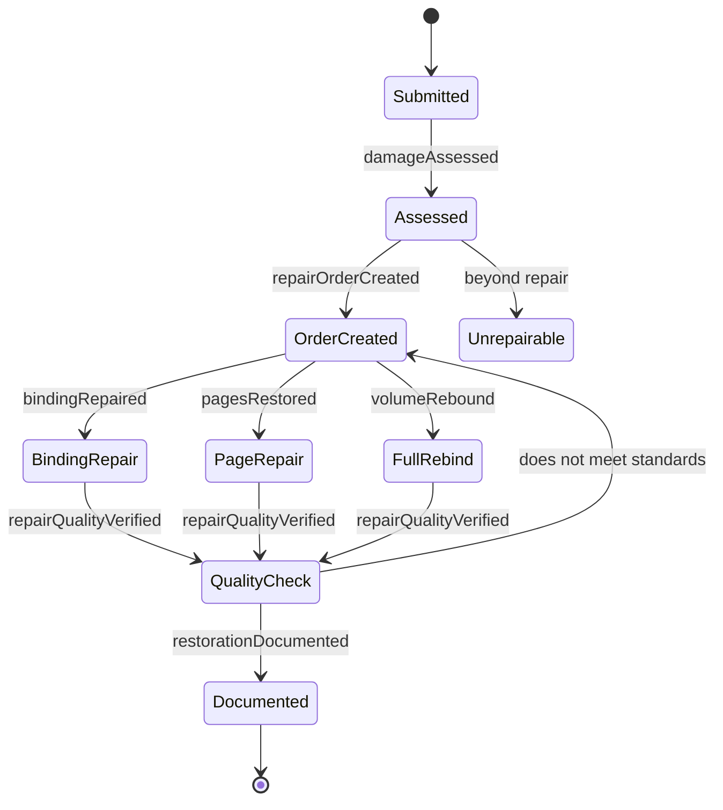
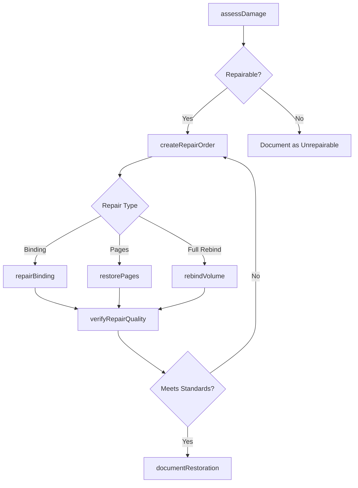
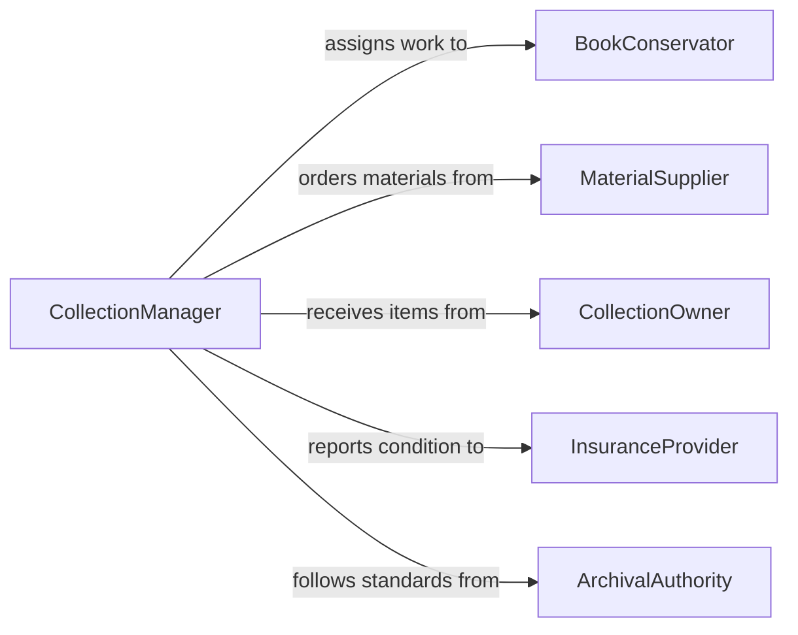

# Repair Books Printed Material

> Business-as-Code definition for repairing books and other printed material. Models the conservation and restoration workflow from damage assessment through binding repair, page restoration, and quality verification.

## Overview

Book and printed material repair involves assessing damage to bindings, pages, covers, and print surfaces, then performing appropriate conservation or restoration techniques. This definition exposes actions for cataloging damage, selecting repair methods, executing restoration work, and documenting outcomes. Events enable automated tracking of conservation projects and inventory management for archival materials.

## Actors

| Actor | Description |
|-------|-------------|
| LibraryAdministration | Owns collections and authorizes repair work |
| MaterialSupplier | Provides conservation-grade paper, adhesives, and binding materials |
| CollectionOwner | Private or institutional owner submitting items for repair |
| InsuranceProvider | Covers damage claims for valuable printed materials |
| ArchivalAuthority | Sets standards for conservation of historical materials |

## Roles

| Role | Description |
|------|-------------|
| BookConservator | Performs hands-on repair and restoration of printed materials |
| CollectionManager | Prioritizes items for repair and tracks project status |
| ConditionAssessor | Evaluates damage and recommends appropriate repair methods |
| BindingSpecialist | Focuses on rebinding and spine repair techniques |

## Entities

| Entity | Description |
|--------|-------------|
| RepairItem | A book or printed material submitted for repair |
| DamageAssessment | Documented evaluation of item condition and repair needs |
| RepairOrder | A work order specifying repair scope, method, and timeline |
| ConservationMaterial | Supplies used in the repair process such as adhesives, thread, and paper |
| RestorationRecord | Historical log of all repairs performed on an item |
| QualityReport | Post-repair verification of structural and aesthetic integrity |

## Actions

| Action | Description |
|--------|-------------|
| assessDamage | Evaluate the condition of a book or printed item and catalog defects |
| createRepairOrder | Generate a work order with repair method, materials, and schedule |
| repairBinding | Restore or replace the binding, spine, or cover of a book |
| restorePages | Mend torn pages, remove stains, or reinforce weakened paper |
| rebindVolume | Fully disassemble and reconstruct the binding of a volume |
| verifyRepairQuality | Inspect completed repair work against conservation standards |
| documentRestoration | Record materials used, techniques applied, and before/after condition |

## Events

| Event | Description |
|-------|-------------|
| damageAssessed | Item condition evaluation has been completed |
| repairOrderCreated | A repair work order has been generated |
| bindingRepaired | Binding or cover restoration has been completed |
| pagesRestored | Page repair or reinforcement has been completed |
| volumeRebound | A full rebinding has been completed |
| repairQualityVerified | Post-repair inspection has confirmed acceptable condition |
| restorationDocumented | Conservation record has been finalized and archived |

## Searches

| Search | Description |
|--------|-------------|
| findRepairItems | List items by damage type, collection, or repair priority |
| getRepairOrders | Retrieve work orders by status, conservator, or date range |
| getRestorationHistory | Look up past repair records for a specific item |
| findOverdueRepairs | Identify repair orders that have exceeded their estimated timeline |

## Entity Relationships



## State Diagram



## Workflow



## Actor Relationships



## Usage

### Calling Actions

```typescript
import { repairBooksPrintedMaterial } from '@headlessly/repair-books-printed-material'

const books = repairBooksPrintedMaterial()

// Assess damage on a submitted volume
const assessment = await books.assessDamage({
  itemId: 'item-2045',
  title: 'First Edition Field Guide',
  defects: ['detached cover', 'torn pages 12-15', 'foxing on endpapers']
})

// Create a repair order based on assessment
const order = await books.createRepairOrder({
  itemId: assessment.itemId,
  repairMethods: ['rebinding', 'page-mending'],
  priority: 'high',
  estimatedDays: 14
})

// Verify quality after repair
const quality = await books.verifyRepairQuality({
  orderId: order.id,
  checkpoints: ['binding-strength', 'page-alignment', 'cover-adhesion']
})
```

### Event-Driven Automation

```typescript
// Notify collection owner when repair is complete
books.repairQualityVerified(async ({ itemId, orderId, result }) => {
  if (result === 'passed') {
    await notify({
      to: 'collection-owner',
      message: `Repair complete for item ${itemId}. Ready for pickup.`
    })
  }
})

// Auto-reorder conservation materials when stock runs low
books.repairOrderCreated(async ({ materials }) => {
  for (const material of materials) {
    const stock = await inventory.check(material.id)
    if (stock.quantity < stock.reorderThreshold) {
      await inventory.reorder({ materialId: material.id, quantity: stock.reorderQuantity })
    }
  }
})
```
