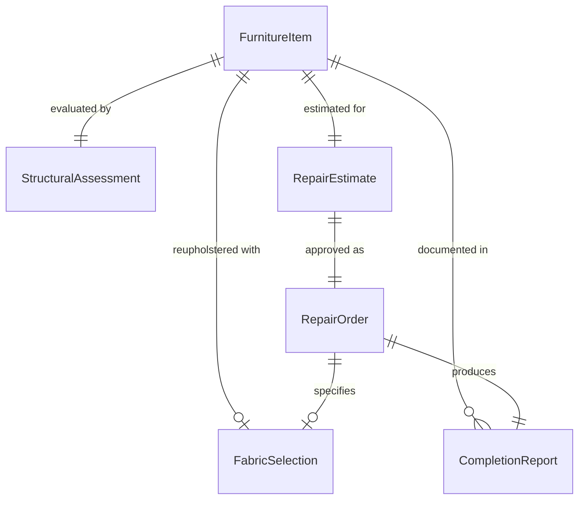
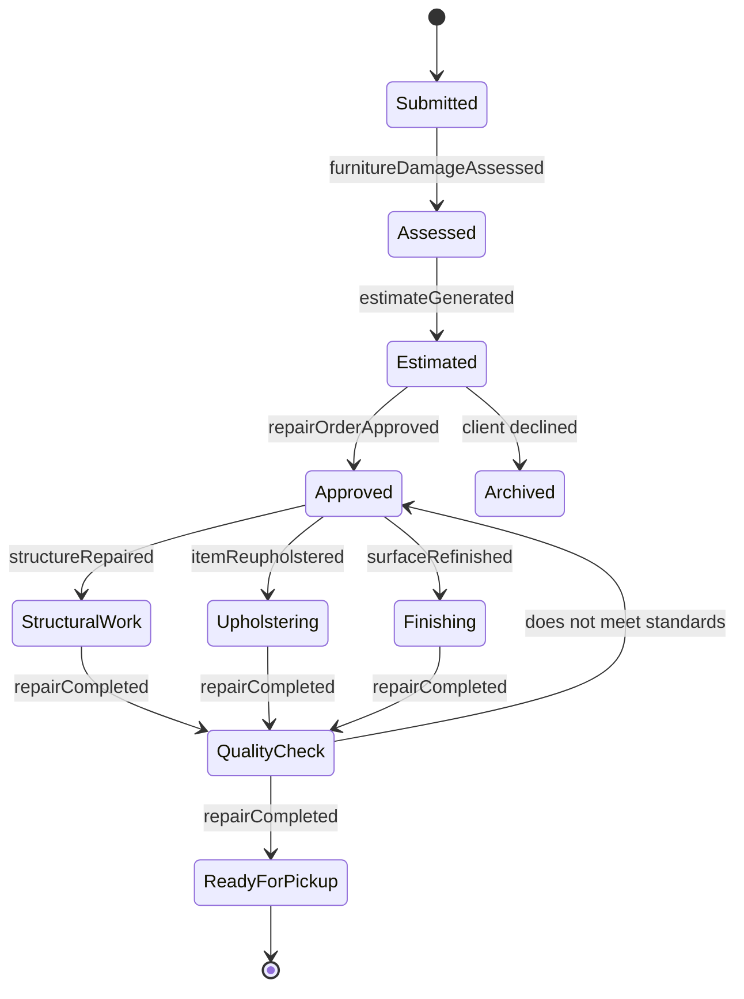
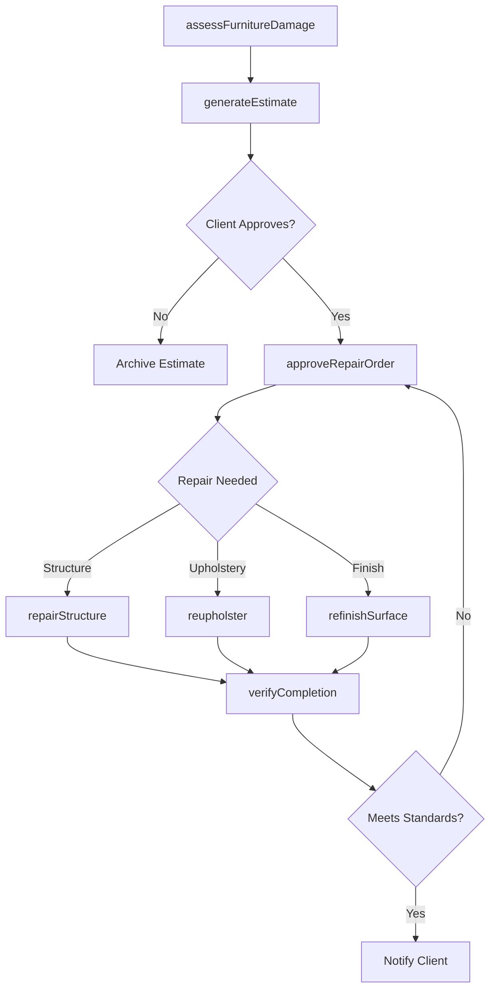
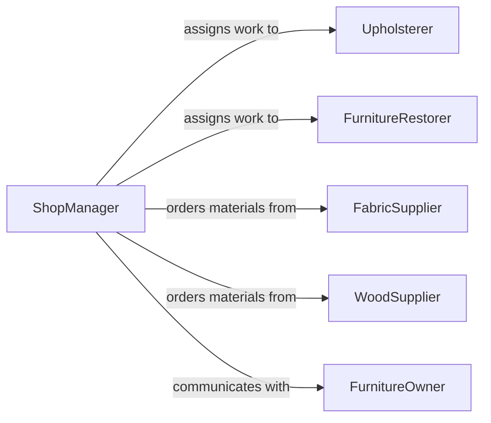

# Repair Furniture Upholstery

> Business-as-Code definition for repairing furniture and upholstery. Models the complete restoration workflow from damage assessment through structural repair, fabric replacement, and finish restoration.

## Overview

Furniture and upholstery repair encompasses the inspection, structural restoration, reupholstering, refinishing, and quality verification of chairs, sofas, tables, cabinets, and other furnishings. This definition exposes actions for evaluating damage, planning repairs, executing woodwork and fabric restoration, and verifying finished quality. Events enable automated tracking of repair projects and customer communication.

## Actors

| Actor | Description |
|-------|-------------|
| FurnitureOwner | Individual or business submitting furniture for repair |
| FabricSupplier | Provides upholstery fabric, foam, and padding materials |
| WoodSupplier | Provides lumber, veneer, and finishing materials |
| InsuranceAdjuster | Assesses damage claims on insured furniture |
| InteriorDesigner | Specifies restoration requirements for design projects |

## Roles

| Role | Description |
|------|-------------|
| Upholsterer | Performs fabric removal, padding replacement, and reupholstering |
| FurnitureRestorer | Handles structural wood repair, refinishing, and joinery |
| ShopManager | Schedules repair work, manages estimates, and coordinates delivery |
| Estimator | Evaluates damage and provides cost and time estimates to clients |

## Entities

| Entity | Description |
|--------|-------------|
| FurnitureItem | A specific piece of furniture submitted for repair |
| RepairEstimate | Cost and timeline projection for proposed repair work |
| RepairOrder | Approved work order specifying repair scope and materials |
| FabricSelection | Chosen upholstery material including type, color, and yardage |
| StructuralAssessment | Evaluation of frame, joints, and load-bearing components |
| CompletionReport | Documentation of finished repair with before and after photos |

## Actions

| Action | Description |
|--------|-------------|
| assessFurnitureDamage | Inspect furniture for structural and cosmetic defects |
| generateEstimate | Create a cost and time estimate for proposed repairs |
| approveRepairOrder | Confirm repair scope and authorize work to begin |
| repairStructure | Restore frame, joints, springs, or other structural components |
| reupholster | Remove old fabric, replace padding, and apply new upholstery |
| refinishSurface | Strip, sand, stain, or lacquer exposed wood surfaces |
| verifyCompletion | Inspect finished work for quality and customer satisfaction |

## Events

| Event | Description |
|-------|-------------|
| furnitureDamageAssessed | Item inspection and damage evaluation has been completed |
| estimateGenerated | A cost and timeline estimate has been provided to the client |
| repairOrderApproved | The client has authorized repair work to proceed |
| structureRepaired | Frame or structural components have been restored |
| itemReupholstered | New fabric and padding have been applied |
| surfaceRefinished | Wood finishing has been completed |
| repairCompleted | All repair work has been verified and the item is ready |

## Searches

| Search | Description |
|--------|-------------|
| findFurnitureItems | List items by owner, repair type, or current status |
| getRepairOrders | Retrieve work orders by status, priority, or scheduled date |
| getEstimates | Look up estimates by client, date range, or approval status |
| findCompletedRepairs | Identify finished items awaiting pickup or delivery |

## Entity Relationships



## State Diagram



## Workflow



## Actor Relationships



## Usage

### Calling Actions

```typescript
import { repairFurnitureUpholstery } from '@headlessly/repair-furniture-upholstery'

const furniture = repairFurnitureUpholstery()

// Assess damage on a submitted piece
const assessment = await furniture.assessFurnitureDamage({
  itemId: 'item-3290',
  description: 'Victorian armchair',
  defects: ['broken leg joint', 'worn seat fabric', 'loose spring']
})

// Generate estimate for the client
const estimate = await furniture.generateEstimate({
  itemId: assessment.itemId,
  repairTypes: ['structural', 'reupholstery'],
  fabricOption: { type: 'velvet', color: 'navy', yardage: 4.5 }
})

// Verify quality after all work is complete
const completion = await furniture.verifyCompletion({
  orderId: 'order-7712',
  checkpoints: ['joint-strength', 'fabric-tension', 'finish-quality']
})
```

### Event-Driven Automation

```typescript
// Notify client when repair is finished
furniture.repairCompleted(async ({ itemId, orderId }) => {
  await notify({
    to: 'furniture-owner',
    message: `Your furniture repair (order ${orderId}) is complete and ready for pickup.`
  })
})

// Trigger reupholstery after structural repair is done
furniture.structureRepaired(async ({ itemId, orderId, requiresUpholstery }) => {
  if (requiresUpholstery) {
    await furniture.reupholster({
      itemId,
      orderId,
      fabricSelectionId: 'fabric-sel-001'
    })
  }
})
```
