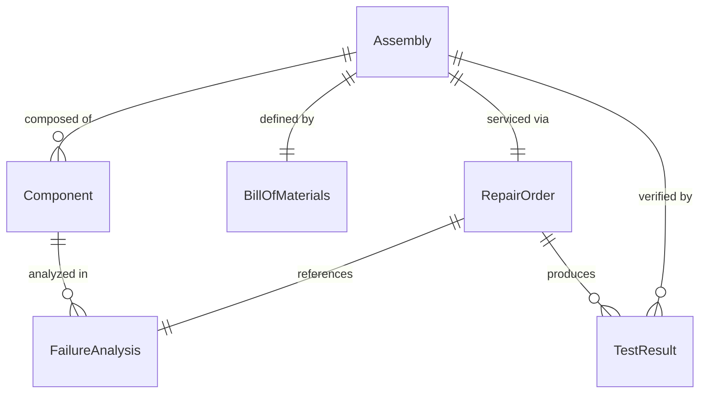
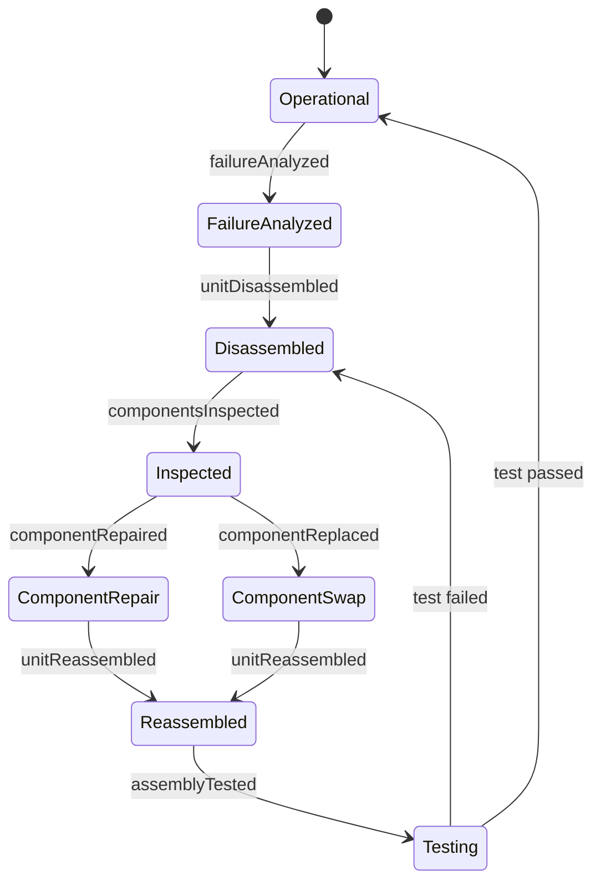
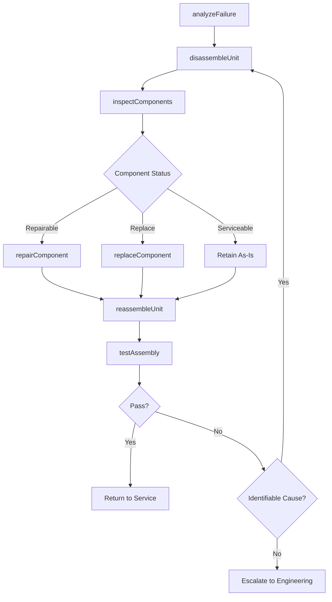
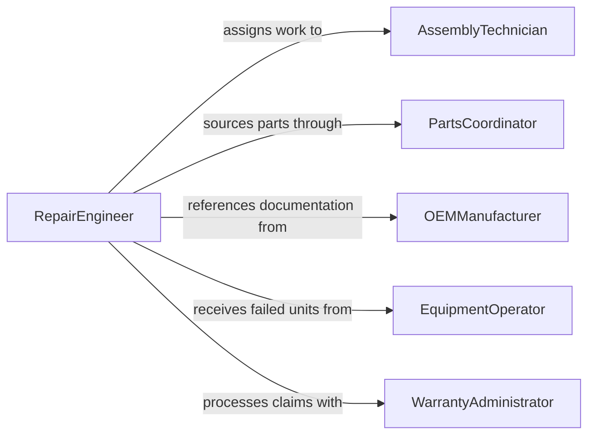

# Repair Parts Assemblies

> Business-as-Code definition for repairing parts and assemblies. Models the disassembly, inspection, component restoration, reassembly, and testing workflow for mechanical and electromechanical assemblies.

## Overview

Parts and assemblies repair involves disassembling failed or worn units, inspecting individual components, performing restoration through machining, welding, or replacement, then reassembling and testing the complete unit. This definition exposes actions for failure analysis, component-level repair, assembly verification, and functional testing. Events enable automated tracking of repair throughput and warranty claims.

## Actors

| Actor | Description |
|-------|-------------|
| EquipmentOperator | Reports assembly failures and submits units for repair |
| PartsSupplier | Provides replacement components, gaskets, and fasteners |
| OEMManufacturer | Supplies technical documentation and proprietary replacement parts |
| WarrantyAdministrator | Manages warranty claims on assemblies under coverage |
| EndCustomer | Receives the repaired assembly for installation or use |

## Roles

| Role | Description |
|------|-------------|
| AssemblyTechnician | Performs disassembly, component repair, and reassembly |
| RepairEngineer | Analyzes failures and develops repair procedures |
| TestTechnician | Executes functional and performance tests on repaired assemblies |
| PartsCoordinator | Sources replacement components and manages repair inventory |

## Entities

| Entity | Description |
|--------|-------------|
| Assembly | A multi-component unit submitted for repair |
| Component | An individual part within an assembly that may need replacement |
| RepairOrder | Work order documenting the scope, parts, and procedures for repair |
| FailureAnalysis | Root cause investigation of why the assembly failed |
| TestResult | Functional and performance test data for a repaired assembly |
| BillOfMaterials | List of components and quantities in the assembly |

## Actions

| Action | Description |
|--------|-------------|
| analyzeFailure | Determine root cause of assembly malfunction or degradation |
| disassembleUnit | Take apart the assembly to access individual components |
| inspectComponents | Examine each part for wear, damage, or out-of-spec conditions |
| repairComponent | Restore a damaged component through machining, welding, or rework |
| replaceComponent | Swap a failed component with a new or refurbished part |
| reassembleUnit | Rebuild the assembly following torque specs and sequence |
| testAssembly | Run functional and performance tests on the completed assembly |

## Events

| Event | Description |
|-------|-------------|
| failureAnalyzed | Root cause of assembly failure has been determined |
| unitDisassembled | The assembly has been taken apart for component inspection |
| componentsInspected | All parts have been evaluated and categorized |
| componentRepaired | An individual component has been restored to specification |
| componentReplaced | A failed part has been swapped with a replacement |
| unitReassembled | The assembly has been rebuilt and is ready for testing |
| assemblyTested | Functional testing of the repaired assembly is complete |

## Searches

| Search | Description |
|--------|-------------|
| findAssemblies | List assemblies by type, failure mode, or repair status |
| getRepairOrders | Retrieve work orders by technician, priority, or date range |
| getFailureHistory | Look up past failure analyses and repair records for an assembly type |
| findComponentsNeeded | Identify parts required for pending repair orders |

## Entity Relationships



## State Diagram



## Workflow



## Actor Relationships



## Usage

### Calling Actions

```typescript
import { repairPartsAssemblies } from '@headlessly/repair-parts-assemblies'

const assemblies = repairPartsAssemblies()

// Analyze failure of a hydraulic valve assembly
const analysis = await assemblies.analyzeFailure({
  assemblyId: 'assy-8834',
  type: 'hydraulic-valve',
  symptoms: ['intermittent pressure drop', 'external leak at port B']
})

// Inspect components after disassembly
const inspection = await assemblies.inspectComponents({
  assemblyId: analysis.assemblyId,
  components: analysis.componentList,
  criteria: { wear: 'max-0.005mm', corrosion: 'none', seal-condition: 'no-deformation' }
})

// Test the reassembled unit
const test = await assemblies.testAssembly({
  assemblyId: 'assy-8834',
  tests: ['pressure-hold', 'flow-rate', 'leak-check'],
  acceptanceCriteria: { pressureHold: 3000, flowRate: 12.5, leakRate: 0 }
})
```

### Event-Driven Automation

```typescript
// Auto-order replacement parts when components fail inspection
assemblies.componentsInspected(async ({ assemblyId, failedComponents }) => {
  for (const component of failedComponents) {
    if (component.disposition === 'replace') {
      await procurement.orderPart({
        partNumber: component.partNumber,
        quantity: 1,
        urgency: 'expedite'
      })
    }
  }
})

// Notify operations when assembly passes testing
assemblies.assemblyTested(async ({ assemblyId, result }) => {
  if (result === 'passed') {
    await notify({
      to: 'equipment-operator',
      message: `Assembly ${assemblyId} has been repaired and tested. Ready for reinstallation.`
    })
  }
})
```
