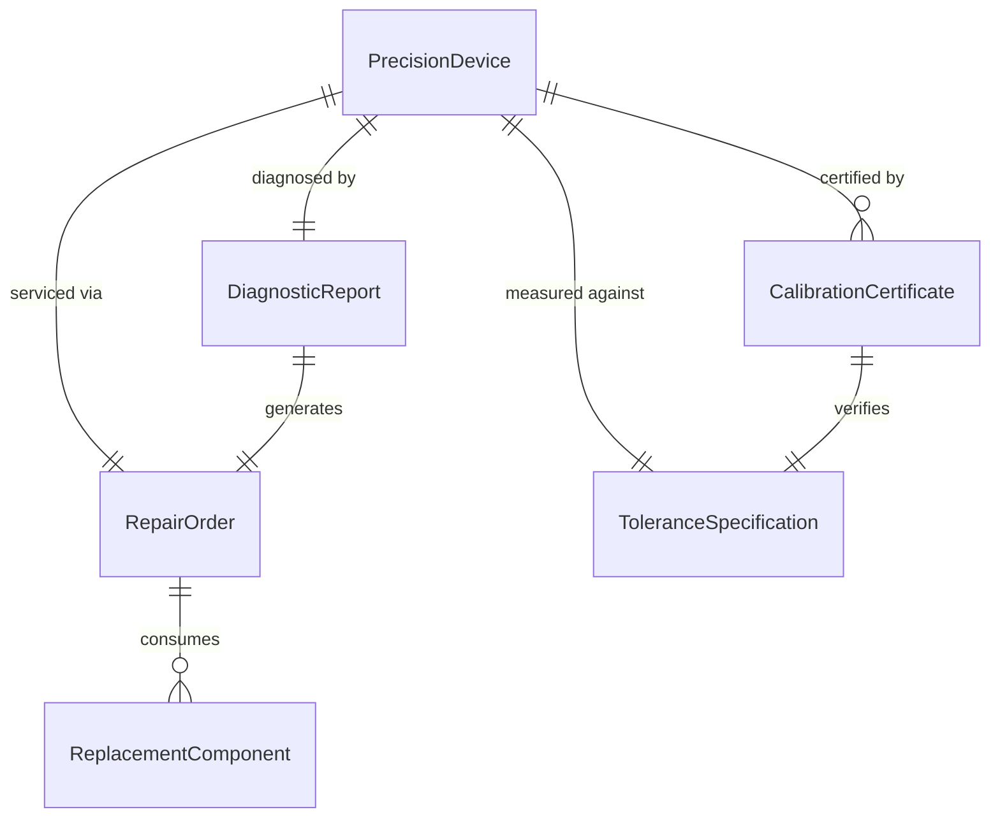
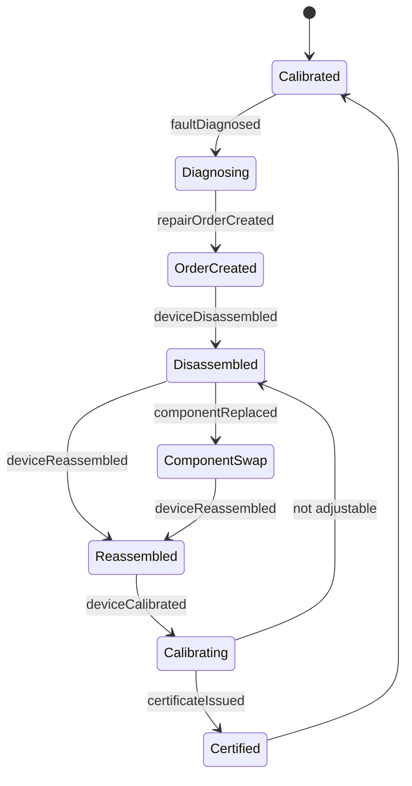
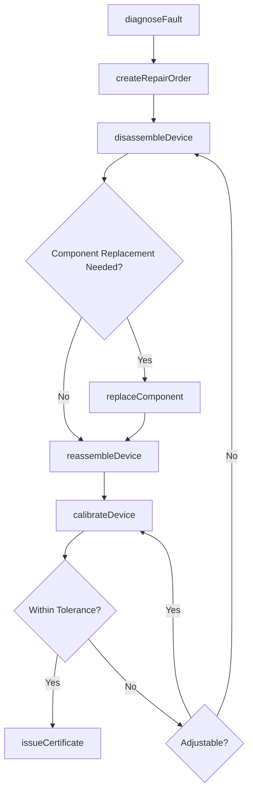
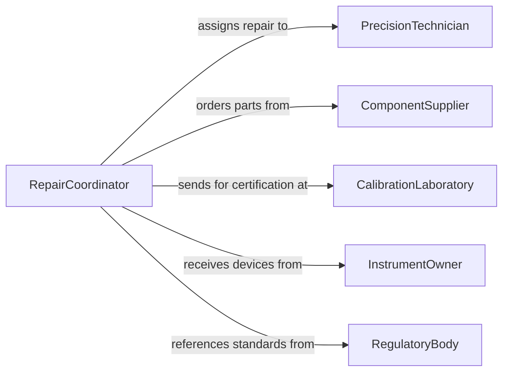

# Repair Precision Devices Workpieces

> Business-as-Code definition for repairing precision devices and workpieces. Models the diagnostic, calibration, and restoration workflow for instruments, gauges, and finely-machined components requiring tight tolerances.

## Overview

Precision device and workpiece repair involves diagnosing malfunctions or dimensional deviations in instruments, gauges, clockwork mechanisms, optical components, and finely-machined parts, then restoring them to specification through micro-machining, calibration, and adjustment. This definition exposes actions for fault diagnosis, tolerance verification, component restoration, and recalibration. Events enable automated tracking of instrument lifecycle and calibration schedules.

## Actors

| Actor | Description |
|-------|-------------|
| InstrumentOwner | Organization or individual that owns the precision device |
| ComponentSupplier | Provides micro-components, bearings, and replacement parts |
| CalibrationLaboratory | Provides traceable calibration and certification services |
| RegulatoryBody | Sets accuracy standards for measurement instruments |
| EquipmentManufacturer | Provides technical manuals and proprietary repair procedures |

## Roles

| Role | Description |
|------|-------------|
| PrecisionTechnician | Performs micro-repair, adjustment, and assembly of precision devices |
| MetrologyEngineer | Defines measurement tolerances and calibration procedures |
| RepairCoordinator | Manages repair intake, scheduling, and client communication |
| QualityInspector | Verifies repaired devices meet accuracy and tolerance standards |

## Entities

| Entity | Description |
|--------|-------------|
| PrecisionDevice | An instrument, gauge, or mechanism requiring fine-tolerance repair |
| DiagnosticReport | Findings from fault analysis and measurement deviation testing |
| RepairOrder | Work order specifying repair scope, tolerances, and procedures |
| CalibrationCertificate | Traceable document certifying device accuracy after repair |
| ReplacementComponent | A micro-part such as a bearing, gear, or lens used in restoration |
| ToleranceSpecification | Dimensional and performance limits the device must meet |

## Actions

| Action | Description |
|--------|-------------|
| diagnoseFault | Identify the root cause of malfunction or measurement deviation |
| createRepairOrder | Generate a work order with procedures and tolerance requirements |
| disassembleDevice | Carefully take apart the precision device for component inspection |
| replaceComponent | Swap a worn or damaged micro-component with a new part |
| reassembleDevice | Rebuild the device following assembly sequence and torque specifications |
| calibrateDevice | Adjust the device to meet traceable measurement standards |
| issueCertificate | Generate a calibration certificate documenting accuracy results |

## Events

| Event | Description |
|-------|-------------|
| faultDiagnosed | Root cause analysis for a precision device has been completed |
| repairOrderCreated | A repair work order has been generated with specifications |
| deviceDisassembled | The precision device has been taken apart for inspection |
| componentReplaced | A micro-component has been swapped during repair |
| deviceReassembled | The device has been rebuilt and is ready for calibration |
| deviceCalibrated | Calibration adjustments have been completed |
| certificateIssued | A calibration certificate has been generated and archived |

## Searches

| Search | Description |
|--------|-------------|
| findDevices | List precision devices by type, owner, or calibration status |
| getRepairOrders | Retrieve work orders by status, device type, or technician |
| getCalibrationHistory | Look up past calibration certificates and measurement data |
| findDevicesDueForCalibration | Identify devices approaching their calibration due date |

## Entity Relationships



## State Diagram



## Workflow



## Actor Relationships



## Usage

### Calling Actions

```typescript
import { repairPrecisionDevicesWorkpieces } from '@headlessly/repair-precision-devices-workpieces'

const precision = repairPrecisionDevicesWorkpieces()

// Diagnose a malfunctioning micrometer
const diagnosis = await precision.diagnoseFault({
  deviceId: 'mic-1042',
  type: 'digital-micrometer',
  symptoms: ['inconsistent readings', 'display flickering']
})

// Create repair order based on diagnosis
const order = await precision.createRepairOrder({
  deviceId: diagnosis.deviceId,
  faults: diagnosis.faults,
  tolerances: { accuracy: 0.001, repeatability: 0.0005 }
})

// Calibrate after reassembly
const calibration = await precision.calibrateDevice({
  deviceId: order.deviceId,
  referenceStandards: ['gauge-block-set-a'],
  points: [0, 25, 50, 75, 100]
})
```

### Event-Driven Automation

```typescript
// Issue certificate automatically after successful calibration
precision.deviceCalibrated(async ({ deviceId, results }) => {
  if (results.withinTolerance) {
    await precision.issueCertificate({
      deviceId,
      calibrationData: results,
      validUntil: addMonths(new Date(), 12)
    })
  }
})

// Alert when calibration is approaching due date
precision.certificateIssued(async ({ deviceId, validUntil }) => {
  await scheduleReminder({
    date: subtractDays(validUntil, 30),
    to: 'metrology-engineer',
    message: `Device ${deviceId} calibration expires in 30 days.`
  })
})
```
