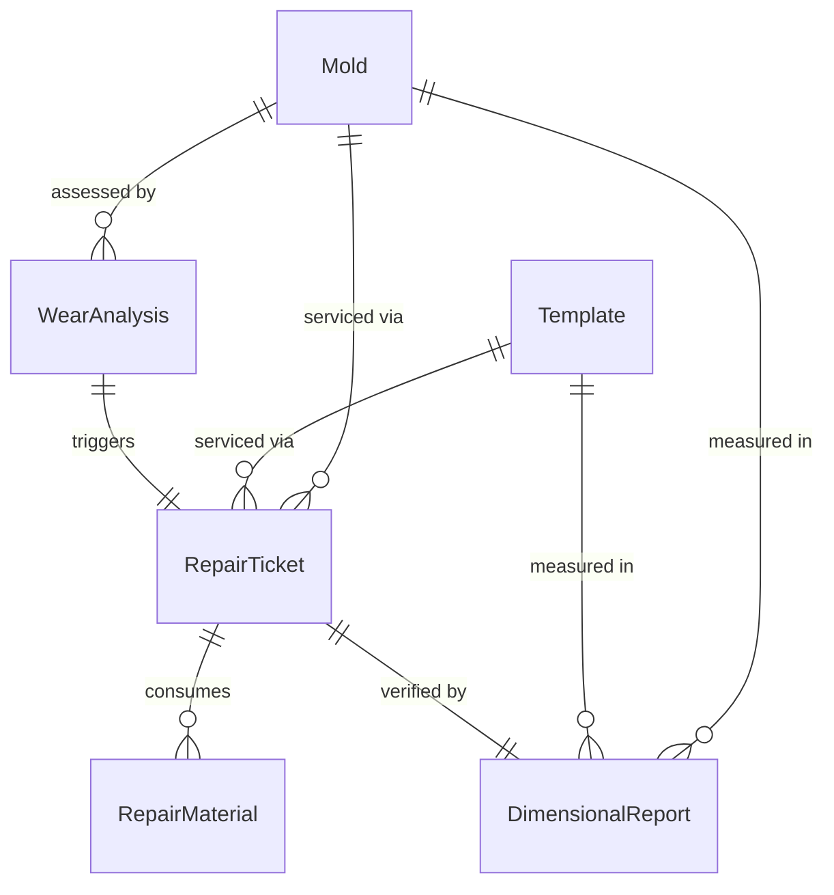
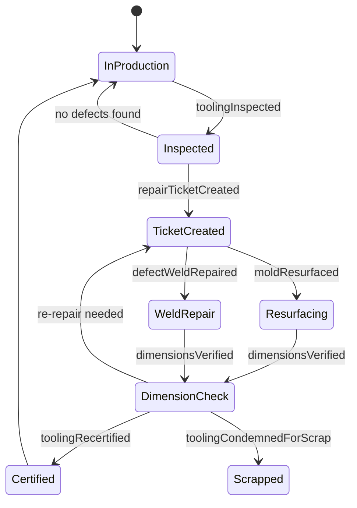
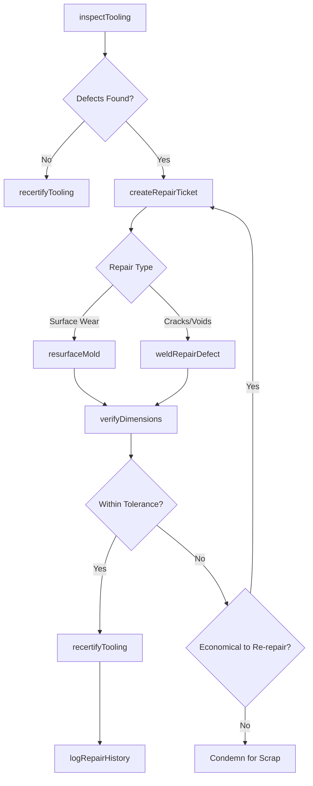
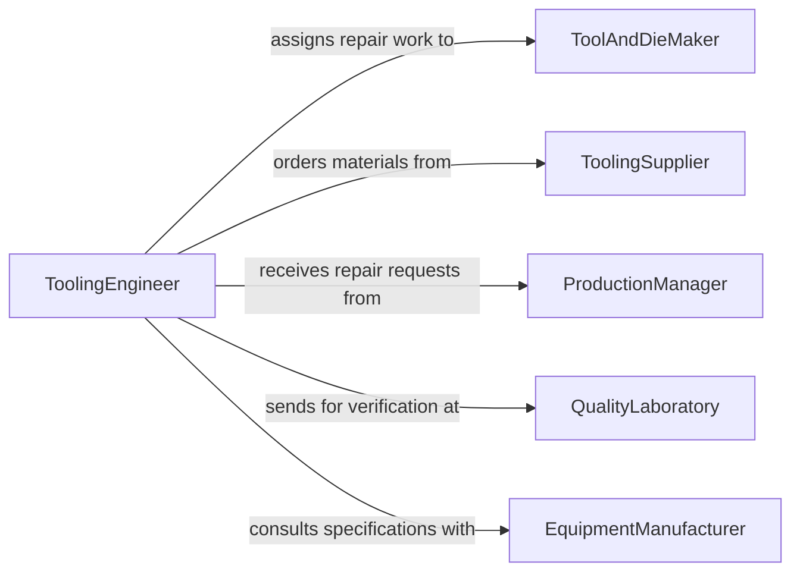

# Repair Templates Patterns Molds

> Business-as-Code definition for repairing templates, patterns, and molds. Models the inspection, restoration, and recertification workflow for tooling used in manufacturing and fabrication processes.

## Overview

Template, pattern, and mold repair involves inspecting production tooling for wear, damage, or dimensional deviation, then restoring them to specification through machining, welding, filling, or resurfacing techniques. This definition exposes actions for defect assessment, repair planning, execution of restoration work, and dimensional verification. Events enable automated tracking of tooling lifecycle and production impact.

## Actors

| Actor | Description |
|-------|-------------|
| ProductionManager | Requests tooling repairs to maintain manufacturing schedules |
| ToolingSupplier | Provides replacement inserts, materials, and mold components |
| QualityLaboratory | Validates dimensional accuracy of repaired tooling |
| EquipmentManufacturer | Provides specifications and repair guidance for proprietary molds |
| Customer | End user whose product quality depends on tooling condition |

## Roles

| Role | Description |
|------|-------------|
| ToolAndDieMaker | Performs hands-on repair and restoration of templates and molds |
| ToolingEngineer | Designs repair plans and specifies dimensional tolerances |
| ShopSupervisor | Schedules repair work and manages tool room operations |
| QualityInspector | Verifies repaired tooling meets dimensional and surface specifications |

## Entities

| Entity | Description |
|--------|-------------|
| Mold | A cavity or form used to shape material during manufacturing |
| Template | A guide or pattern used for cutting, shaping, or layout |
| RepairTicket | A work order documenting the required tooling repair |
| DimensionalReport | Measurement data comparing repaired tooling to original specifications |
| WearAnalysis | Assessment of tooling surface degradation and remaining useful life |
| RepairMaterial | Welding rod, filler compound, or surface coating used in restoration |

## Actions

| Action | Description |
|--------|-------------|
| inspectTooling | Examine a template, pattern, or mold for wear, cracks, or deformation |
| createRepairTicket | Generate a work order specifying defects and repair approach |
| resurfaceMold | Restore mold cavity surfaces through grinding, polishing, or coating |
| weldRepairDefect | Fill cracks, chips, or voids using welding or brazing techniques |
| verifyDimensions | Measure repaired tooling against original specifications |
| recertifyTooling | Approve repaired tooling for return to production use |
| logRepairHistory | Document repair activities and measurements for traceability |

## Events

| Event | Description |
|-------|-------------|
| toolingInspected | A template, pattern, or mold inspection has been completed |
| repairTicketCreated | A tooling repair work order has been generated |
| moldResurfaced | Mold cavity surfaces have been restored to specification |
| defectWeldRepaired | A crack or void has been filled and smoothed |
| dimensionsVerified | Post-repair dimensional inspection is complete |
| toolingRecertified | Repaired tooling has been approved for production |
| toolingCondemnedForScrap | Tooling has been deemed beyond economical repair |

## Searches

| Search | Description |
|--------|-------------|
| findTooling | List templates, patterns, or molds by type, condition, or production line |
| getRepairTickets | Retrieve repair work orders by status, priority, or assignee |
| getRepairHistory | Look up past repair records and dimensional data for a specific tool |
| findToolingDueForInspection | Identify tooling approaching scheduled inspection intervals |

## Entity Relationships



## State Diagram



## Workflow



## Actor Relationships



## Usage

### Calling Actions

```typescript
import { repairTemplatesPatternsMolds } from '@headlessly/repair-templates-patterns-molds'

const tooling = repairTemplatesPatternsMolds()

// Inspect a production mold
const inspection = await tooling.inspectTooling({
  toolId: 'mold-4821',
  type: 'injection-mold',
  checkpoints: ['cavity-surface', 'parting-line', 'ejector-pins', 'cooling-channels']
})

// Create repair ticket for identified defects
const ticket = await tooling.createRepairTicket({
  toolId: inspection.toolId,
  defects: inspection.defects,
  repairMethod: 'weld-and-resurface',
  priority: 'high'
})

// Verify dimensions after repair
const verification = await tooling.verifyDimensions({
  toolId: ticket.toolId,
  tolerances: { cavityDepth: 0.005, partingLine: 0.002 }
})
```

### Event-Driven Automation

```typescript
// Notify production when tooling is recertified
tooling.toolingRecertified(async ({ toolId, productionLine }) => {
  await notify({
    to: 'production-scheduler',
    message: `Mold ${toolId} repaired and recertified. Ready for ${productionLine}.`
  })
})

// Escalate when tooling is condemned
tooling.toolingCondemnedForScrap(async ({ toolId, reason }) => {
  await notify({
    to: 'tooling-engineer',
    message: `Tool ${toolId} condemned: ${reason}. Replacement procurement required.`
  })
  await procurement.createRequest({ itemType: 'mold', referenceToolId: toolId })
})
```
