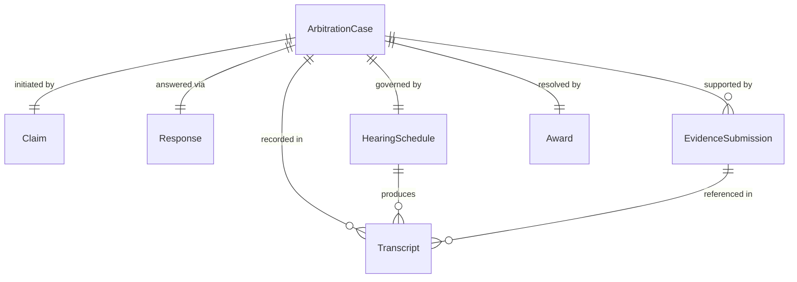
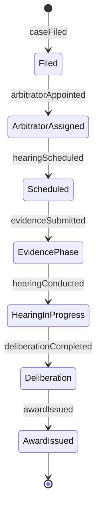
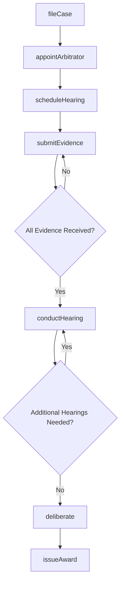
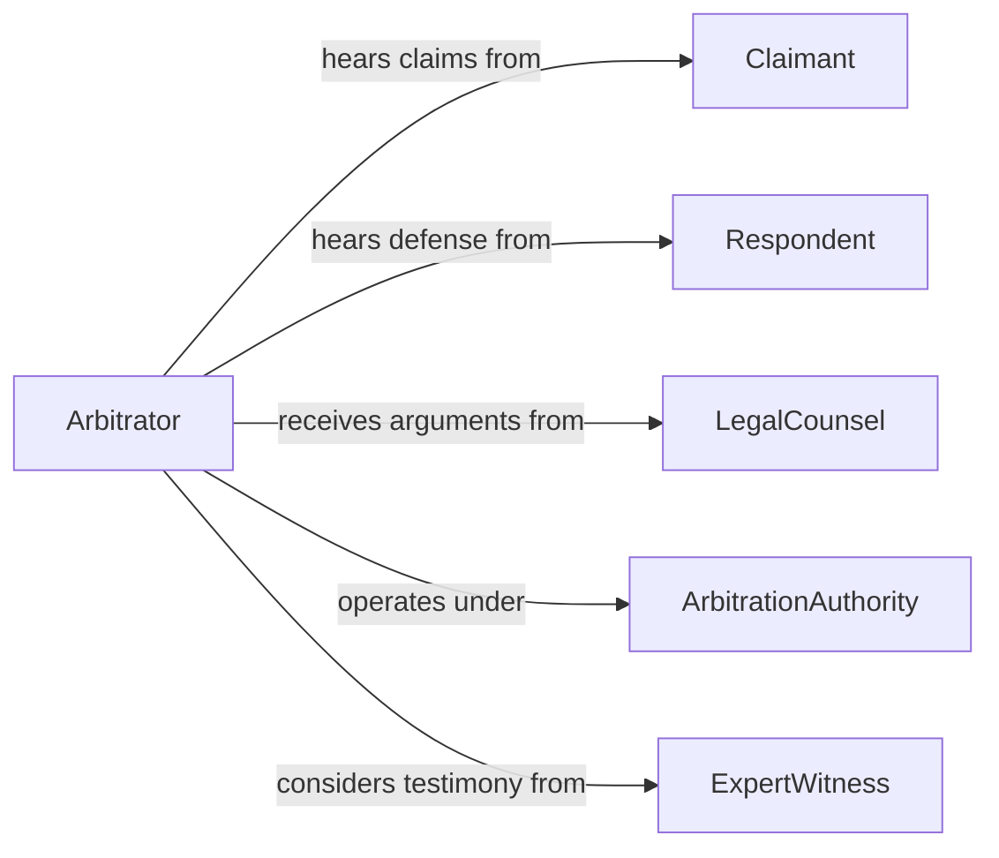

# Arbitrate Disputes Between Parties to Resolve Legal Conflicts

> Business-as-Code definition for legal dispute arbitration. Models the formal alternative dispute resolution process from case filing through hearing, deliberation, and binding award issuance.

## Overview

Legal dispute arbitration involves receiving formal claims, reviewing evidence and arguments from opposing parties, conducting hearings, and issuing binding or non-binding awards outside of traditional court proceedings. This definition exposes actions for case management, event triggers for procedural milestones, and searches for case dockets and award records.

## Actors

| Actor | Description |
|-------|-------------|
| Claimant | Party initiating the arbitration claim |
| Respondent | Party against whom the claim is brought |
| LegalCounsel | Attorneys representing each party |
| ArbitrationAuthority | Administering body that oversees arbitration rules and panels |
| ExpertWitness | Provides specialized testimony on technical or factual matters |

## Roles

| Role | Description |
|------|-------------|
| Arbitrator | Neutral decision-maker who hears evidence and issues awards |
| CaseAdministrator | Manages filings, scheduling, and procedural compliance |
| PanelChair | Leads a multi-arbitrator panel and coordinates deliberations |
| CourtReporter | Records hearing proceedings and produces transcripts |

## Entities

| Entity | Description |
|--------|-------------|
| ArbitrationCase | Formal dispute filed for resolution outside court |
| Claim | Legal assertion of rights or damages by the claimant |
| Response | Formal answer from the respondent to the claim |
| EvidenceSubmission | Documents, testimony, or exhibits presented by a party |
| HearingSchedule | Calendar of arbitration sessions and deadlines |
| Award | Final decision issued by the arbitrator or panel |
| Transcript | Verbatim record of hearing proceedings |

## Actions

| Action | Description |
|--------|-------------|
| fileCase | Register a new arbitration claim with supporting documents |
| appointArbitrator | Assign a neutral arbitrator or panel to the case |
| scheduleHearing | Set dates for oral arguments and evidence presentation |
| submitEvidence | File documents or exhibits for consideration |
| conductHearing | Preside over oral arguments and witness examination |
| deliberate | Review evidence and arguments to reach a decision |
| issueAward | Render the final binding or non-binding determination |

## Events

| Event | Description |
|-------|-------------|
| caseFiled | A new arbitration claim has been registered |
| arbitratorAppointed | A neutral decision-maker has been assigned |
| hearingScheduled | Arbitration session dates have been set |
| evidenceSubmitted | A party has filed documents or exhibits |
| hearingConducted | Oral arguments have been presented |
| deliberationCompleted | The arbitrator has completed review of the case |
| awardIssued | A final determination has been rendered |

## Searches

| Search | Description |
|--------|-------------|
| findCases | List arbitration cases by status, party, or date |
| getEvidence | Retrieve submitted documents for a specific case |
| getHearings | View scheduled or completed hearing sessions |
| findAwards | Search issued awards by case, amount, or outcome |

## Entity Relationships



## State Diagram



## Workflow



## Actor Relationships



## Usage

### Calling Actions

```typescript
import { arbitrateDisputesBetweenPartiesResolve } from '@headlessly/arbitrate-disputes-between-parties-resolve'

const arbitration = arbitrateDisputesBetweenPartiesResolve()

// File a new arbitration case
const arbCase = await arbitration.fileCase({
  claimant: 'corp-alpha',
  respondent: 'corp-beta',
  claimType: 'breach-of-contract',
  amount: 250000,
  description: 'Failure to deliver contracted services within agreed timeline'
})

// Appoint an arbitrator
await arbitration.appointArbitrator({
  caseId: arbCase.id,
  arbitratorId: 'arb-panel-12',
  type: 'single-arbitrator'
})

// Issue the final award
await arbitration.issueAward({
  caseId: arbCase.id,
  inFavorOf: 'claimant',
  amount: 175000,
  binding: true,
  reasoning: 'Respondent failed to meet contractual delivery milestones'
})
```

### Event-Driven Automation

```typescript
// Notify parties of hearing schedule
arbitration.hearingScheduled(async ({ caseId, date, location }) => {
  await notifyParties({
    caseId,
    message: `Arbitration hearing scheduled for ${date} at ${location}`
  })
})

// Record award for enforcement tracking
arbitration.awardIssued(async ({ caseId, amount, binding }) => {
  if (binding) {
    await registerForEnforcement({ caseId, amount })
  }
})
```
