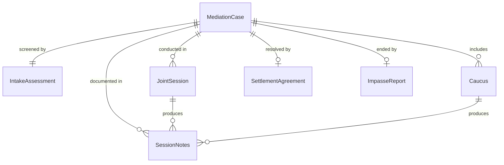
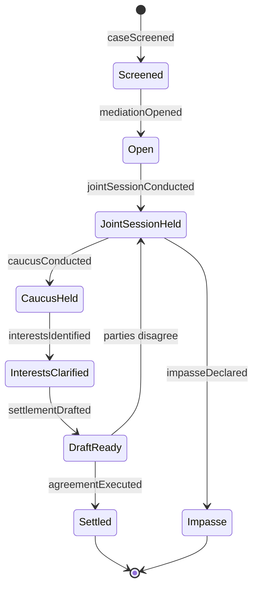
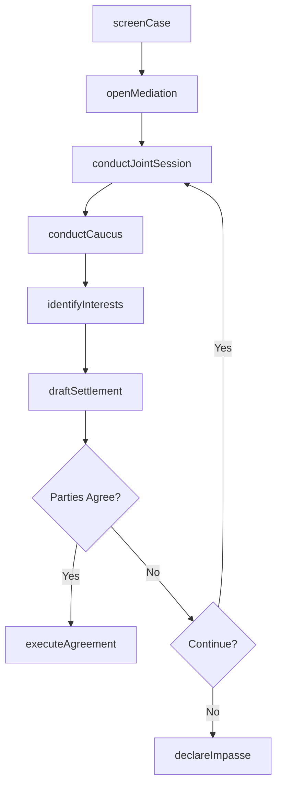
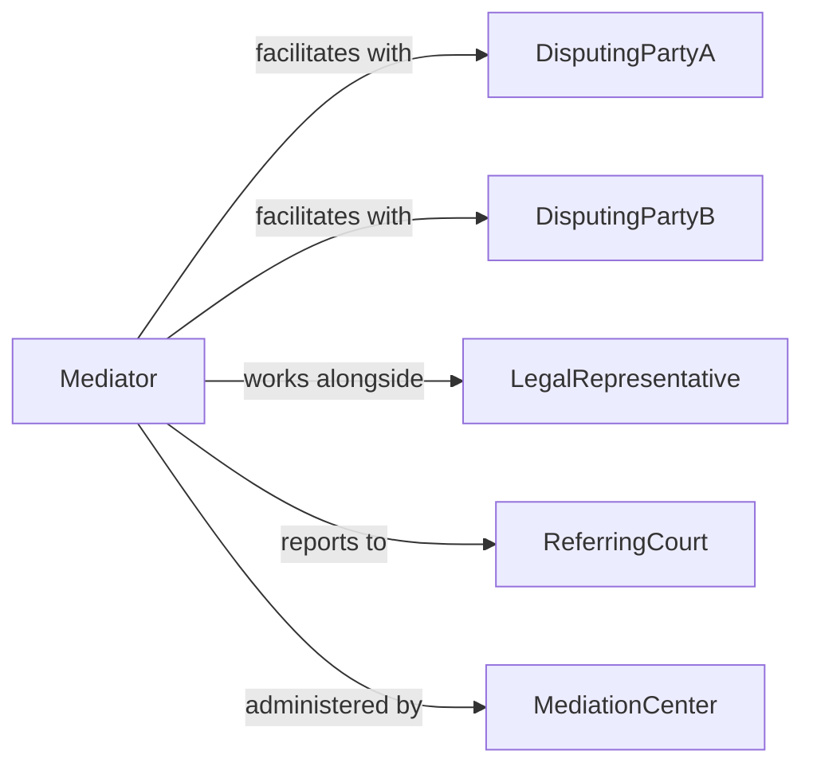

# Mediate Disputes

> Business-as-Code definition for dispute mediation services. Models the neutral facilitation process from intake through joint sessions, caucuses, and settlement agreement execution.

## Overview

Dispute mediation involves a neutral third party facilitating communication between conflicting parties to help them reach a voluntary agreement. This includes intake assessment, joint and private sessions, interest-based negotiation guidance, and settlement documentation. This definition exposes actions for mediation session management, event triggers for process milestones, and searches for case and settlement records.

## Actors

| Actor | Description |
|-------|-------------|
| DisputingPartyA | First party involved in the dispute |
| DisputingPartyB | Second party involved in the dispute |
| LegalRepresentative | Attorney or advocate accompanying a party |
| ReferringCourt | Court or authority that referred the case to mediation |
| MediationCenter | Organization administering the mediation process |

## Roles

| Role | Description |
|------|-------------|
| Mediator | Neutral facilitator guiding parties toward agreement |
| IntakeCoordinator | Screens cases and prepares parties for mediation |
| SessionRecorder | Documents proceedings and settlement terms |
| SeniorMediator | Handles complex or high-stakes disputes |

## Entities

| Entity | Description |
|--------|-------------|
| MediationCase | Record of a dispute referred for mediation |
| IntakeAssessment | Initial evaluation of case suitability for mediation |
| JointSession | Meeting with all parties present |
| Caucus | Private meeting between mediator and one party |
| SettlementAgreement | Documented terms voluntarily accepted by all parties |
| SessionNotes | Confidential record of discussion points and progress |
| ImpasseReport | Documentation when mediation fails to reach agreement |

## Actions

| Action | Description |
|--------|-------------|
| screenCase | Evaluate dispute suitability for mediation |
| openMediation | Formally begin the mediation process |
| conductJointSession | Facilitate a meeting with all parties present |
| conductCaucus | Hold a private session with one party |
| identifyInterests | Clarify underlying needs and priorities of each party |
| draftSettlement | Prepare proposed agreement terms |
| executeAgreement | Finalize and sign the settlement document |
| declareImpasse | Formally close mediation without agreement |

## Events

| Event | Description |
|-------|-------------|
| caseScreened | A dispute has been assessed for mediation suitability |
| mediationOpened | The mediation process has formally begun |
| jointSessionConducted | A meeting with all parties has been held |
| caucusConducted | A private session has been completed |
| interestsIdentified | Party needs and priorities have been clarified |
| settlementDrafted | Proposed agreement terms have been prepared |
| agreementExecuted | The settlement has been signed by all parties |
| impasseDeclared | Mediation has closed without agreement |

## Searches

| Search | Description |
|--------|-------------|
| findCases | List mediation cases by status, type, or date |
| getSessions | Retrieve joint session and caucus records for a case |
| getSettlements | Find executed settlement agreements by party or date |
| getImpasses | List cases that ended without resolution |

## Entity Relationships



## State Diagram



## Workflow



## Actor Relationships



## Usage

### Calling Actions

```typescript
import { mediateDisputes } from '@headlessly/mediate-disputes'

const mediation = mediateDisputes()

// Screen a new case
const screening = await mediation.screenCase({
  parties: ['tenant-corp', 'landlord-llc'],
  disputeType: 'lease-termination',
  referredBy: 'district-court-5'
})

// Open mediation and conduct a joint session
const mCase = await mediation.openMediation({ screeningId: screening.id })

await mediation.conductJointSession({
  caseId: mCase.id,
  agenda: ['opening-statements', 'issue-identification', 'interest-exploration']
})

// Execute the settlement
await mediation.executeAgreement({
  caseId: mCase.id,
  terms: [
    'Lease extended 6 months at reduced rate',
    'Maintenance obligations shared equally',
    'Right of first refusal on renewal'
  ]
})
```

### Event-Driven Automation

```typescript
// Notify referring court when mediation concludes
mediation.agreementExecuted(async ({ caseId, referringCourt }) => {
  await notify({
    to: referringCourt,
    message: `Mediation case ${caseId} has been resolved with a signed agreement`
  })
})

// Track impasse rates for quality improvement
mediation.impasseDeclared(async ({ caseId, disputeType }) => {
  await logMetric({
    event: 'mediation-impasse',
    caseId,
    disputeType
  })
})
```
