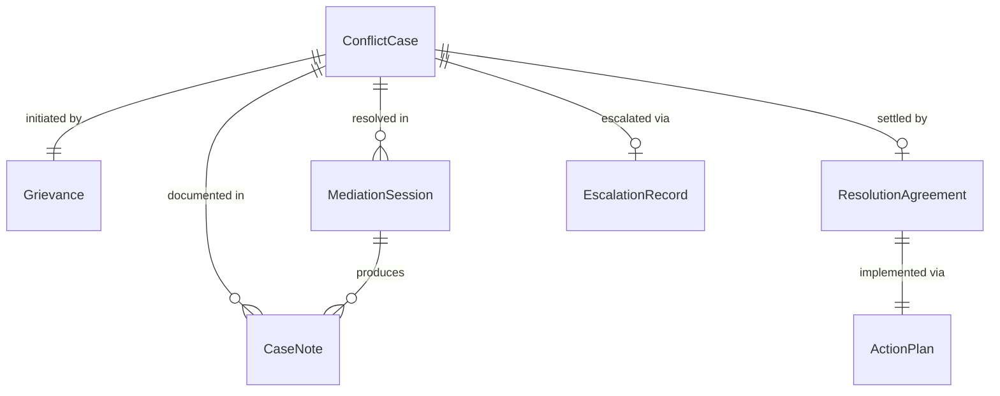
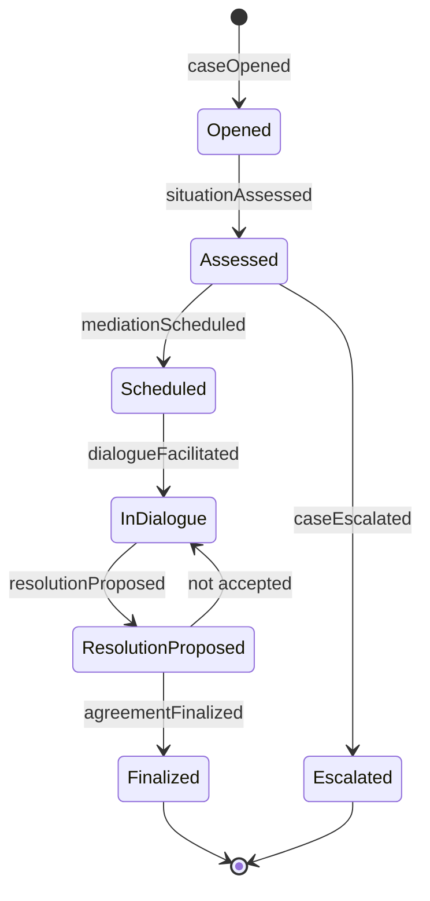
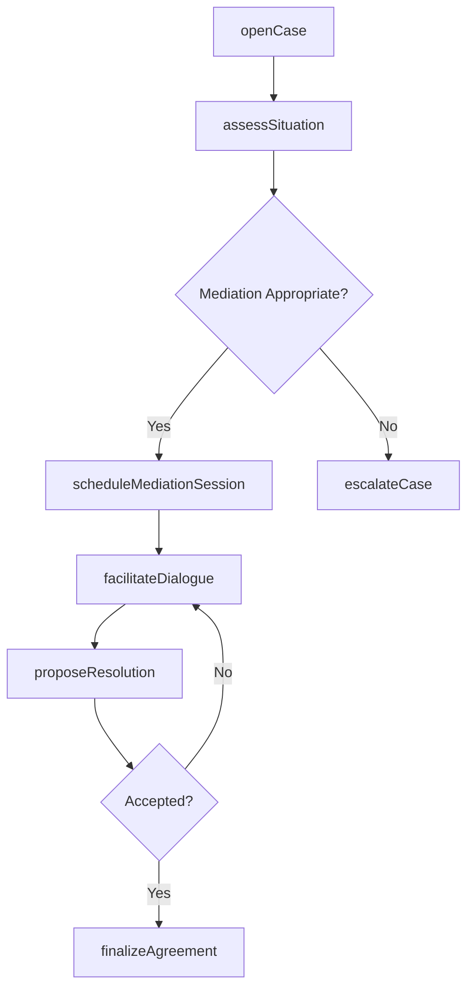
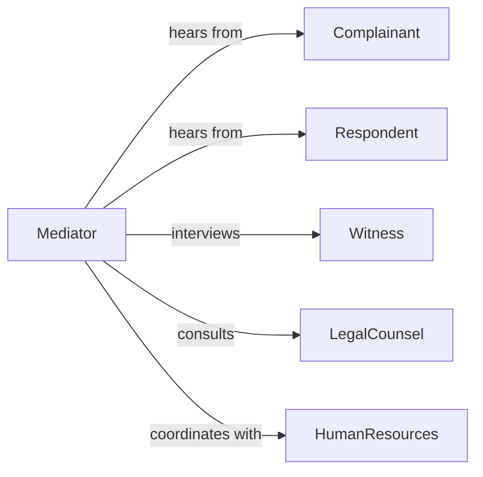

# Resolve Interpersonal Conflicts

> Business-as-Code definition for interpersonal conflict resolution. Models the structured process of identifying disagreements, facilitating dialogue, and reaching mutually acceptable outcomes between individuals.

## Overview

Interpersonal conflict resolution involves identifying the root causes of disagreements between individuals, facilitating constructive communication, exploring compromise options, and documenting agreed-upon resolutions. This definition exposes actions for each phase of the resolution process, event triggers for status changes, and searches for conflict history and outcome records.

## Actors

| Actor | Description |
|-------|-------------|
| Complainant | Individual who raised the conflict or grievance |
| Respondent | Individual against whom the complaint is directed |
| Witness | Third party with relevant observations about the conflict |
| LegalCounsel | Provides legal guidance when disputes have regulatory implications |
| UnionRepresentative | Advocates for employee rights in workplace conflicts |
| HumanResources | Provides organizational policy guidance and documentation |

## Roles

| Role | Description |
|------|-------------|
| Mediator | Facilitates dialogue between conflicting parties |
| ConflictResolutionSpecialist | Assesses situations and recommends resolution strategies |
| CaseManager | Tracks conflict cases from intake through resolution |
| Supervisor | Provides context and enforces agreed-upon outcomes |

## Entities

| Entity | Description |
|--------|-------------|
| ConflictCase | Documented record of a dispute between individuals |
| Grievance | Formal complaint filed by one party against another |
| MediationSession | Scheduled facilitated meeting between parties |
| ResolutionAgreement | Documented terms accepted by all parties |
| ActionPlan | Steps each party commits to following resolution |
| CaseNote | Chronological documentation of case progress |
| EscalationRecord | Documentation of a conflict referred to a higher authority |

## Actions

| Action | Description |
|--------|-------------|
| openCase | Register a new interpersonal conflict for resolution |
| assessSituation | Evaluate the nature, severity, and parties involved |
| scheduleMediationSession | Arrange a facilitated meeting between parties |
| facilitateDialogue | Guide parties through structured conversation |
| proposeResolution | Present potential compromise or solution options |
| finalizeAgreement | Document the accepted resolution terms |
| escalateCase | Refer the conflict to a higher authority or formal process |

## Events

| Event | Description |
|-------|-------------|
| caseOpened | A new conflict case has been registered |
| situationAssessed | The conflict has been evaluated for severity and context |
| mediationScheduled | A facilitated session has been arranged |
| dialogueFacilitated | A structured conversation between parties has occurred |
| resolutionProposed | Potential solutions have been presented to parties |
| agreementFinalized | Resolution terms have been accepted and documented |
| caseEscalated | The conflict has been referred to a higher authority |

## Searches

| Search | Description |
|--------|-------------|
| findCases | List conflict cases by status, department, or date |
| getMediationSessions | Retrieve scheduled or completed sessions |
| getAgreements | Find finalized resolution agreements by case or party |
| getCaseHistory | View chronological notes and actions for a case |

## Entity Relationships



## State Diagram



## Workflow



## Actor Relationships



## Usage

### Calling Actions

```typescript
import { resolveInterpersonalConflicts } from '@headlessly/resolve-interpersonal-conflicts'

const conflicts = resolveInterpersonalConflicts()

// Open a new conflict case
const conflictCase = await conflicts.openCase({
  complainant: 'emp-401',
  respondent: 'emp-502',
  department: 'engineering',
  description: 'Disagreement over project responsibilities and communication style'
})

// Schedule mediation
await conflicts.scheduleMediationSession({
  caseId: conflictCase.id,
  date: '2026-02-12',
  mediator: 'hr-specialist-03',
  location: 'conference-room-B'
})

// Finalize the agreement
await conflicts.finalizeAgreement({
  caseId: conflictCase.id,
  terms: [
    'Weekly check-in meetings established',
    'Project responsibilities documented in shared charter',
    'Follow-up review in 30 days'
  ]
})
```

### Event-Driven Automation

```typescript
// Alert HR when a case is escalated
conflicts.caseEscalated(async ({ caseId, severity }) => {
  await notify({
    to: 'hr-director',
    message: `Conflict case ${caseId} escalated with severity: ${severity}`
  })
})

// Schedule follow-up after agreement
conflicts.agreementFinalized(async ({ caseId, parties }) => {
  await scheduleFollowUp({
    caseId,
    parties,
    reviewDate: addDays(new Date(), 30)
  })
})
```
