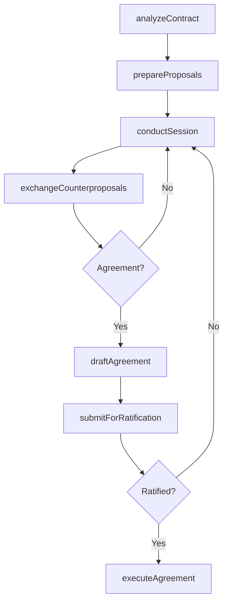
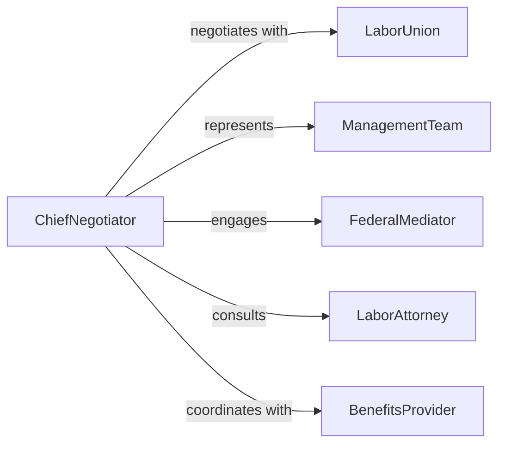

# Arrange Collective Bargaining Agreements

> Business-as-Code definition for collective bargaining agreement arrangement. Models the process of preparing for labor negotiations, conducting bargaining sessions, drafting contract terms, and ratifying agreements between management and labor unions.

## Overview

Arranging collective bargaining agreements involves analyzing current contract terms, preparing management and union positions, conducting multi-session negotiations on wages, benefits, and working conditions, drafting proposed language, and securing ratification from both parties. This definition exposes actions for bargaining process management, event triggers for negotiation milestones, and searches for contract terms and grievance records.

## Actors

| Actor | Description |
|-------|-------------|
| LaborUnion | Worker organization representing employee interests in negotiations |
| ManagementTeam | Employer representatives authorized to negotiate contract terms |
| FederalMediator | Government mediator facilitating impasse resolution |
| LaborAttorney | Legal counsel advising on employment law and contract language |
| BenefitsProvider | Insurance or retirement plan administrator affected by agreement terms |

## Roles

| Role | Description |
|------|-------------|
| ChiefNegotiator | Leads the bargaining team and manages negotiation strategy |
| LaborRelationsSpecialist | Prepares proposals and analyzes contract cost impacts |
| UnionSteward | Represents rank-and-file interests during bargaining |
| ContractDrafter | Composes formal agreement language from negotiated terms |

## Entities

| Entity | Description |
|--------|-------------|
| BargainingUnit | Defined group of employees covered by the agreement |
| NegotiationProposal | Formal written position on specific contract terms |
| BargainingSession | Scheduled face-to-face negotiation meeting between parties |
| ContractDraft | Proposed agreement language incorporating negotiated terms |
| EconomicPackage | Wages, benefits, and financial terms under negotiation |
| GrievanceProcedure | Defined process for resolving contract interpretation disputes |
| RatificationVote | Formal approval of the final agreement by union membership |
| MemorandumOfUnderstanding | Interim agreement on specific terms before full contract execution |

## Actions

| Action | Description |
|--------|-------------|
| analyzeContract | Review current agreement terms and identify areas for renegotiation |
| prepareProposals | Develop management or union positions on key contract issues |
| conductSession | Hold a formal bargaining meeting between parties |
| exchangeCounterproposals | Present and respond to modified positions on disputed terms |
| draftAgreement | Compose formal contract language from agreed-upon terms |
| submitForRatification | Present the tentative agreement to union membership for vote |
| executeAgreement | Finalize signatures and implement the ratified contract |

## Events

| Event | Description |
|-------|-------------|
| contractAnalyzed | Current agreement terms have been reviewed |
| proposalsPrepared | Bargaining positions have been developed |
| sessionConducted | A formal negotiation meeting has occurred |
| counterproposalsExchanged | Modified positions have been presented and responded to |
| agreementDrafted | Formal contract language has been composed |
| ratificationSubmitted | The tentative agreement has been presented for vote |
| agreementExecuted | The contract has been signed and implemented |

## Searches

| Search | Description |
|--------|-------------|
| findAgreements | List collective bargaining agreements by unit, status, or expiration |
| getProposals | Retrieve negotiation proposals by topic, party, or session |
| getSessions | Search bargaining session records by date, topic, or outcome |
| getGrievances | Query grievance filings by contract clause, status, or period |

## Workflow



## Actor Relationships



## Usage

### Calling Actions

```typescript
import { arrangeCollectiveBargainingAgreements } from '@headlessly/arrange-collective-bargaining-agreements'

const bargaining = arrangeCollectiveBargainingAgreements()

// Analyze the expiring contract
const analysis = await bargaining.analyzeContract({
  agreementId: 'cba-2023-local-42',
  expirationDate: '2026-06-30',
  focusAreas: ['wages', 'healthcare-benefits', 'scheduling-flexibility']
})

// Prepare management proposals
await bargaining.prepareProposals({
  analysisId: analysis.id,
  proposals: [
    { topic: 'wages', position: '3-percent-annual-increase' },
    { topic: 'healthcare', position: 'maintain-current-plan-with-cost-sharing' },
    { topic: 'scheduling', position: 'introduce-flexible-shift-bidding' }
  ]
})

// Submit for ratification after agreement
await bargaining.submitForRatification({
  draftId: 'draft-cba-2026-v3',
  votingPeriod: { start: '2026-05-15', end: '2026-05-22' },
  eligibleVoters: 1200
})
```

### Event-Driven Automation

```typescript
// Alert mediator on impasse
bargaining.sessionConducted(async ({ sessionId, outcome, sessionsCount }) => {
  if (outcome === 'impasse' && sessionsCount > 5) {
    await notify({
      to: 'federal-mediator',
      message: `Bargaining impasse after ${sessionsCount} sessions. Mediation requested.`
    })
  }
})

// Notify all parties on ratification outcome
bargaining.ratificationSubmitted(async ({ draftId, result, voteCount }) => {
  await notify({
    to: ['management-team', 'union-leadership'],
    message: `Ratification vote: ${result} (${voteCount.yes}-${voteCount.no})`
  })
})
```
