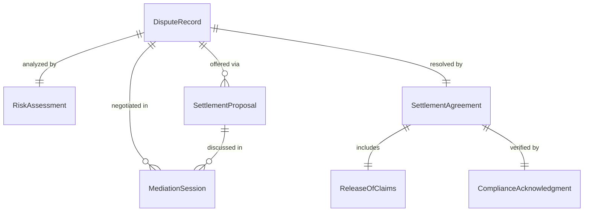
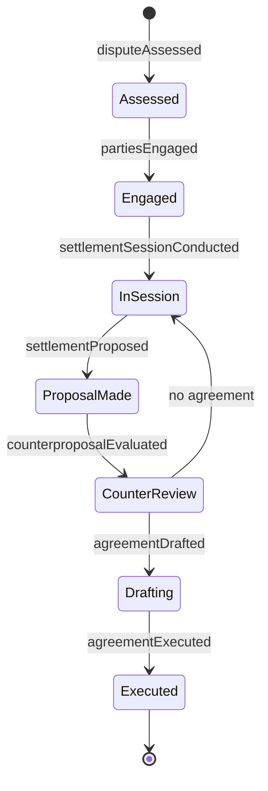
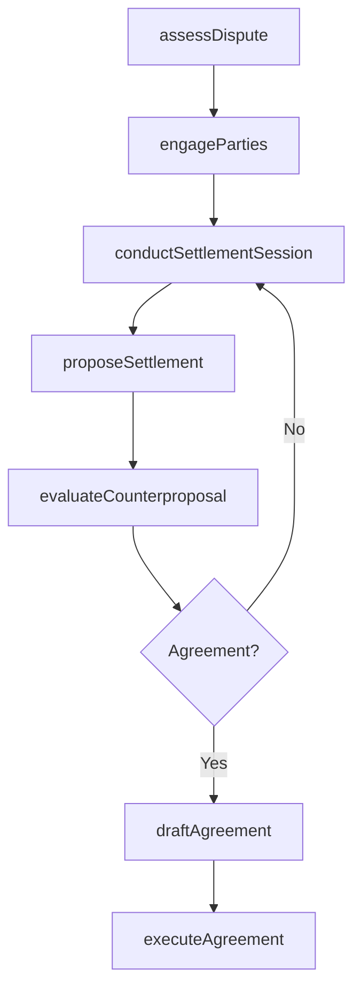
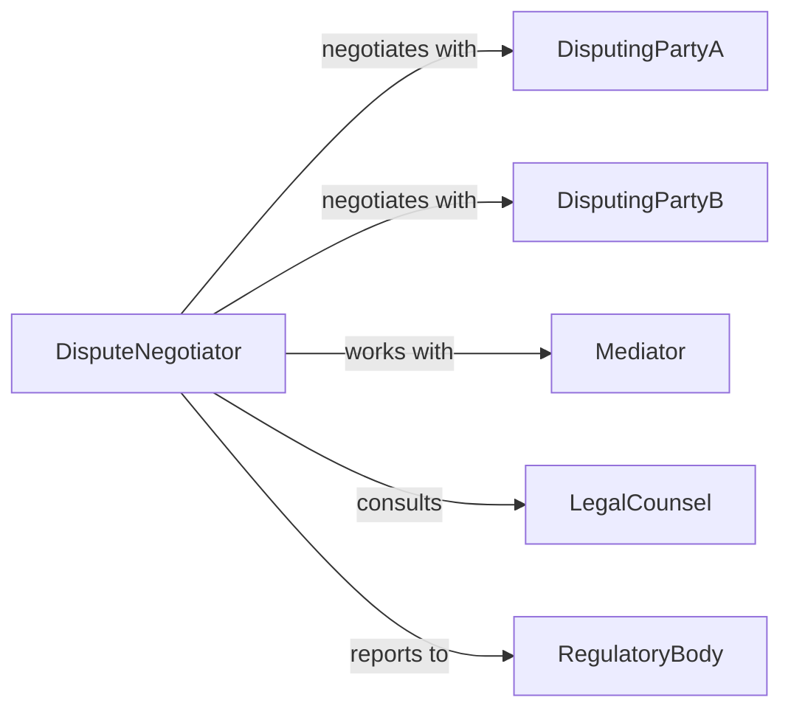

# Negotiate Agreements to Resolve Disputes

> Business-as-Code definition for dispute resolution agreement negotiation. Models the process of assessing disputed matters, facilitating settlement discussions, drafting resolution terms, and executing binding agreements that conclude commercial, contractual, or operational conflicts.

## Overview

Negotiating agreements to resolve disputes involves evaluating the nature and stakes of a conflict, bringing parties to the table, exploring settlement options, drafting compromise language, and executing enforceable resolution agreements that prevent litigation or further escalation. This definition exposes actions for dispute settlement management, event triggers for resolution milestones, and searches for dispute history and settlement records.

## Actors

| Actor | Description |
|-------|-------------|
| DisputingPartyA | First party involved in the conflict seeking resolution |
| DisputingPartyB | Second party involved in the conflict seeking resolution |
| Mediator | Neutral third party facilitating settlement discussions |
| LegalCounsel | Attorney advising on settlement risks and agreement enforceability |
| RegulatoryBody | Government agency with jurisdiction over the disputed matter |

## Roles

| Role | Description |
|------|-------------|
| DisputeNegotiator | Leads settlement discussions and manages resolution strategy |
| ComplianceOfficer | Ensures settlement terms meet regulatory and policy requirements |
| RiskAnalyst | Evaluates financial and operational exposure from the dispute |
| ContractDrafter | Composes formal settlement agreement language |

## Entities

| Entity | Description |
|--------|-------------|
| DisputeRecord | Documented conflict with parties, claims, and timeline |
| SettlementProposal | Written offer specifying terms to resolve the dispute |
| RiskAssessment | Analysis of financial, legal, and reputational exposure |
| MediationSession | Facilitated meeting between disputing parties |
| SettlementAgreement | Executed contract containing final resolution terms |
| ReleaseOfClaims | Legal instrument waiving future claims related to the dispute |
| ComplianceAcknowledgment | Confirmation that settlement terms satisfy regulatory requirements |

## Actions

| Action | Description |
|--------|-------------|
| assessDispute | Evaluate the nature, claims, and exposure of the conflict |
| engageParties | Bring disputing parties to the negotiation table |
| conductSettlementSession | Facilitate dialogue to explore resolution options |
| proposeSettlement | Present specific terms for resolving the dispute |
| evaluateCounterproposal | Analyze the opposing party's revised settlement terms |
| draftAgreement | Compose formal settlement language from agreed terms |
| executeAgreement | Finalize signatures and implement the resolution |

## Events

| Event | Description |
|-------|-------------|
| disputeAssessed | The conflict has been evaluated for scope and exposure |
| partiesEngaged | Disputing parties have agreed to negotiate |
| settlementSessionConducted | A facilitated dialogue has taken place |
| settlementProposed | Resolution terms have been presented |
| counterproposalEvaluated | Revised terms have been analyzed |
| agreementDrafted | Formal settlement language has been composed |
| agreementExecuted | The resolution agreement has been signed and implemented |

## Searches

| Search | Description |
|--------|-------------|
| findDisputes | List disputes by type, party, status, or date |
| getSettlements | Retrieve settlement agreements by dispute, terms, or amount |
| getRiskAssessments | Search exposure analyses by dispute, category, or severity |
| getSessions | Query mediation sessions by dispute, date, or outcome |

## Entity Relationships



## State Diagram



## Workflow



## Actor Relationships



## Usage

### Calling Actions

```typescript
import { negotiateAgreementsResolveDisputes } from '@headlessly/negotiate-agreements-resolve-disputes'

const disputes = negotiateAgreementsResolveDisputes()

// Assess a commercial dispute
const assessment = await disputes.assessDispute({
  partyA: 'acme-manufacturing',
  partyB: 'reliable-logistics',
  issue: 'late-delivery-damages',
  claimedAmount: 340000,
  description: 'Repeated shipment delays causing production line shutdowns'
})

// Conduct settlement sessions
await disputes.conductSettlementSession({
  disputeId: assessment.id,
  mediator: 'commercial-mediation-services',
  date: '2026-04-10',
  agenda: ['damage-quantification', 'service-level-remediation', 'future-performance-guarantees']
})

// Propose and execute settlement
await disputes.proposeSettlement({
  disputeId: assessment.id,
  terms: {
    financialCompensation: 180000,
    serviceCredits: 50000,
    performanceGuarantee: 'on-time-delivery-98-percent',
    monitoringPeriod: '12-months'
  }
})

await disputes.executeAgreement({
  disputeId: assessment.id,
  releaseOfClaims: true,
  effectiveDate: '2026-05-01'
})
```

### Event-Driven Automation

```typescript
// Escalate unresolved disputes after multiple sessions
disputes.settlementSessionConducted(async ({ disputeId, outcome, sessionCount }) => {
  if (outcome === 'no-resolution' && sessionCount >= 4) {
    await notify({
      to: 'legal-counsel',
      message: `Dispute ${disputeId} unresolved after ${sessionCount} sessions. Consider formal arbitration.`
    })
  }
})

// Monitor compliance with settlement terms
disputes.agreementExecuted(async ({ disputeId, monitoringPeriod, performanceGuarantee }) => {
  await scheduleRecurring({
    action: 'assessDispute',
    disputeId,
    checkType: 'compliance-review',
    metric: performanceGuarantee,
    frequency: 'monthly',
    duration: monitoringPeriod
  })
})
```
