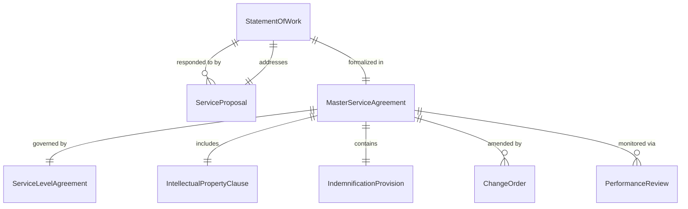
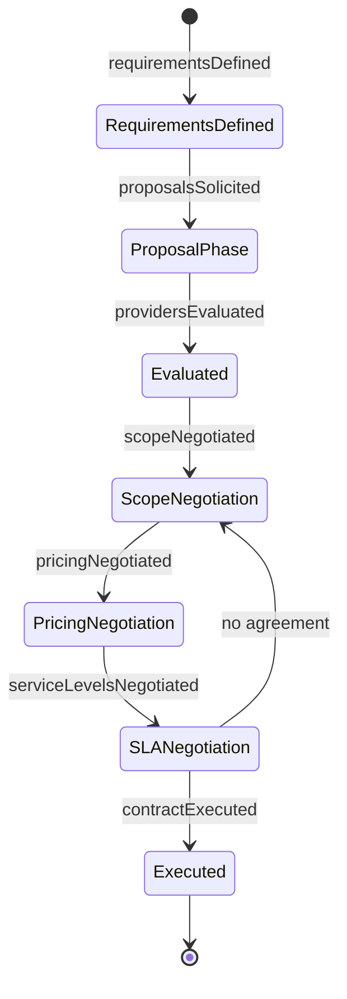
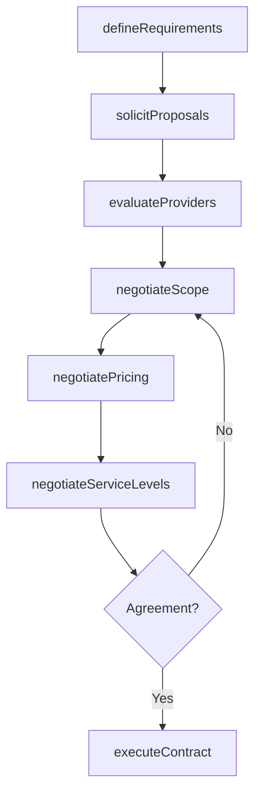
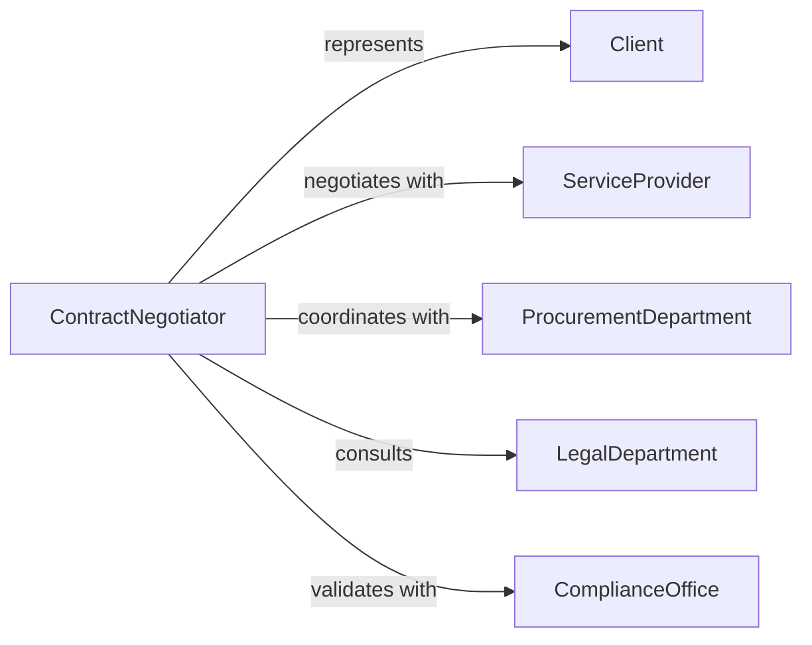

# Negotiate Contracts with Clients or Service Providers

> Business-as-Code definition for client and service provider contract negotiation. Models the process of defining service requirements, evaluating provider capabilities, negotiating scope, pricing, and service level agreements, and executing binding professional service contracts.

## Overview

Negotiating contracts with clients or service providers involves defining engagement scope and deliverables, soliciting proposals, comparing provider capabilities and pricing, negotiating service levels, intellectual property terms, and liability provisions, and executing contracts that govern the business relationship. This definition exposes actions for professional service procurement management, event triggers for contract milestones, and searches for provider performance and agreement records.

## Actors

| Actor | Description |
|-------|-------------|
| Client | Organization purchasing professional services or solutions |
| ServiceProvider | Firm or individual delivering contracted services |
| ProcurementDepartment | Internal team managing vendor selection and contract processes |
| LegalDepartment | Counsel reviewing contract language and risk exposure |
| ComplianceOffice | Unit ensuring contracts meet regulatory and policy requirements |

## Roles

| Role | Description |
|------|-------------|
| ContractNegotiator | Leads discussions on scope, pricing, and terms with counterparties |
| AccountManager | Maintains the client relationship and aligns service expectations |
| VendorAnalyst | Evaluates service provider qualifications and track record |
| LegalReviewer | Assesses contract language for risk and enforceability |

## Entities

| Entity | Description |
|--------|-------------|
| StatementOfWork | Detailed description of deliverables, timeline, and acceptance criteria |
| ServiceProposal | Provider response with approach, team, pricing, and references |
| ServiceLevelAgreement | Performance standards, uptime commitments, and penalty provisions |
| MasterServiceAgreement | Umbrella contract governing the overall client-provider relationship |
| ChangeOrder | Amendment modifying scope, timeline, or pricing of an active contract |
| IntellectualPropertyClause | Terms governing ownership of work product and proprietary information |
| IndemnificationProvision | Liability allocation between parties for damages or losses |
| PerformanceReview | Periodic assessment of provider service quality against contract terms |

## Actions

| Action | Description |
|--------|-------------|
| defineRequirements | Establish service scope, deliverables, and success criteria |
| solicitProposals | Request bids from qualified service providers |
| evaluateProviders | Compare proposals on capability, pricing, and references |
| negotiateScope | Define specific deliverables, milestones, and acceptance criteria |
| negotiatePricing | Discuss fee structures, rate cards, and payment schedules |
| negotiateServiceLevels | Establish performance metrics, response times, and penalties |
| executeContract | Finalize and sign the service agreement documentation |

## Events

| Event | Description |
|-------|-------------|
| requirementsDefined | Service scope and success criteria have been established |
| proposalsSolicited | Provider bid requests have been issued |
| providersEvaluated | Proposals have been compared and ranked |
| scopeNegotiated | Deliverables and acceptance criteria have been defined |
| pricingNegotiated | Fee structures and payment schedules have been discussed |
| serviceLevelsNegotiated | Performance metrics and penalties have been established |
| contractExecuted | The service agreement has been signed |

## Searches

| Search | Description |
|--------|-------------|
| findContracts | List service agreements by client, provider, or expiration date |
| getProposals | Retrieve provider bids by service type, pricing, or score |
| getServiceLevels | Search SLA records by metric, provider, or compliance status |
| getChangeOrders | Query contract amendments by agreement, date, or scope change |

## Entity Relationships



## State Diagram



## Workflow



## Actor Relationships



## Usage

### Calling Actions

```typescript
import { negotiateContractsClientsServiceProviders } from '@headlessly/negotiate-contracts-clients-service-providers'

const contracts = negotiateContractsClientsServiceProviders()

// Define requirements for a managed IT services engagement
const requirements = await contracts.defineRequirements({
  serviceType: 'managed-it-infrastructure',
  scope: ['server-management', 'network-monitoring', 'helpdesk-support'],
  duration: '36-months',
  locations: ['headquarters', 'regional-office-east', 'regional-office-west']
})

// Solicit and evaluate provider proposals
const rfp = await contracts.solicitProposals({
  requirementsId: requirements.id,
  providers: ['techops-global', 'managed-systems-inc', 'cloudbridge-services'],
  responseDeadline: '2026-04-30'
})

// Negotiate and execute the contract
await contracts.negotiateServiceLevels({
  proposalId: rfp.preferred.id,
  metrics: [
    { name: 'uptime', target: 99.95, penalty: '5-percent-credit-per-0.01-below' },
    { name: 'response-time', target: '15-minutes-critical', penalty: '2-percent-credit-per-incident' },
    { name: 'resolution-time', target: '4-hours-critical', penalty: '3-percent-credit-per-breach' }
  ]
})

await contracts.executeContract({
  proposalId: rfp.preferred.id,
  contractType: 'master-service-agreement',
  startDate: '2026-07-01',
  autoRenewal: true
})
```

### Event-Driven Automation

```typescript
// Monitor SLA compliance after contract execution
contracts.contractExecuted(async ({ contractId, serviceLevels }) => {
  await scheduleRecurring({
    action: 'evaluateProviders',
    contractId,
    metrics: serviceLevels.map(s => s.name),
    frequency: 'monthly'
  })
})

// Alert on contract expiration approaching
contracts.requirementsDefined(async ({ contractId, expirationDate }) => {
  await scheduleReminder({
    triggerDate: subtractDays(expirationDate, 120),
    to: 'contract-negotiator',
    message: `Contract ${contractId} expires in 120 days. Begin renewal negotiations.`
  })
})
```
